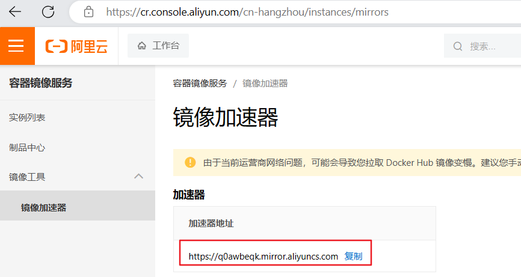

# 项目概述&环境搭建

[TOC]

## 1、项目简介

`共享充电宝`是基于`若依`微服务版本框架开发的一个共享系统，项目包含平台管理端与微信小程序端，是一个前后端分离的项目。共享充电宝分为后台系统和前台微信小程序。

**后台系统功能**:(用户登录、系统管理员列表、角色管理、权限规则管理、柜机管理、柜机分类、充电宝管理、...)

**前台微信小程序功能**: (首页、附近门店、门店信息、登录功能、扫码、Mqtt通信、我的订单、微信支付...)

其中覆盖了分布式文件系统、高速缓存、消息队列等多种业务场景和技术实现。

### 1.1、核心技术

- **SpringBoot**：简化新Spring应用的初始搭建以及开发过程；
- **SpringCloud**：基于Spring Boot实现的云原生应用开发工具，SpringCloud使用的技术：（Spring Cloud Gateway、Spring Cloud Alibaba Nacos、Spring Cloud Alibaba Sentinel、Spring Cloud Task和Spring Cloud Feign等）
- **SpringBoot+SpringCloudAlibaba(Nacos，Sentinel)+Cloud OpenFeign**
- MyBatis-Plus：持久层框架，也依赖mybatis
- Redis：内存做缓存  
- RabbitMQ：消息中间件；大型分布式项目是标配；分布式事务最终一致性
- Quartz: 分布式定时任务调用中心
- Drools：规则引擎，计算预估费用、取消费用等等
- MongoDB: 分布式文件存储的数据库
- Knife4J：接口文档工具
- MinIO（私有化对象存储集群）：分布式文件存储 类似于OSS（公有）
- 微信支付
- MySQL：关系型数据库
- Docker：容器化技术;  生产环境Redis（运维人员）
- EMQX：分布式 MQTT 消息服务器
- SpringAI：面向人工智能工程的应用框架
- DeepSeek：开源人工智能工具库，专注于提供高效易用的AI模型训练与推理能力

前端技术栈

- Vue 3： Vue.js 的最新版本
- Element Plus：一个基于 Vue.js 3.0 的组件库，它是 Element UI 的升级版本
- Vite：一种新型前端构建工具
- Node.js： JavaScript 运行环境
- uni-app：前端应用框架

### 1.2、技术架构图


### 1.3、业务流程图


## 2、若依框架

官网：https://doc.ruoyi.vip/

微服务版本文档：https://doc.ruoyi.vip/ruoyi-cloud/

### 2.1、介绍

**RuoYi-Cloud** 是一个 Java EE 分布式微服务架构平台，基于经典技术组合（Spring Boot、Spring Cloud & Alibaba、Vue、Element），内置模块如：部门管理、角色用户、菜单及按钮授权、数据权限、系统参数、日志管理、代码生成等。在线定时任务配置；支持集群，支持多数据源。

### 2.2、架构图


### 2.3、在线体验

- 若依官网：[http://ruoyi.vip(opens new window)](http://ruoyi.vip/)

- 演示地址：[http://cloud.ruoyi.vip(opens new window)](http://cloud.ruoyi.vip/)

- 代码下载：<https://gitee.com/y_project/RuoYi-Cloud>


## 3、准备环境

### 3.1、安装docker

环境安装：

> yum -y install gcc-c++

第一步：安装必要的一些系统工具

> yum install -y yum-utils device-mapper-persistent-data lvm2

第二步：添加软件源信息

> yum-config-manager --add-repo [http://mirrors.aliyun.com/docker-ce/linux/centos/docker-ce.repo](http://mirrors.aliyun.com/docker-ce/linux/centos/docker-ce.repo "http://mirrors.aliyun.com/docker-ce/linux/centos/docker-ce.repo")

第三步：更新并安装Docker-CE

> yum makecache fast
> yum -y install docker-ce

第四步：开启Docker服务

> service docker start
> systemctl enable docker

第五步：测试是否安装成功

> docker -v

第六步：配置镜像加速器

您可以通过修改daemon配置文件/etc/docker/daemon.json来使用加速器

> sudo mkdir -p /etc/docker

新建daemon.json文件内容如下：

```bash
{
	"registry-mirrors":["https://docker.mirrors.ustc.edu.cn","http://hubmirror.c.163.com"]
}
```

如果以上镜像不能使用了，可以使用阿里云的镜像！ [官方镜像加速 (aliyun.com)](https://help.aliyun.com/document_detail/60750.html?spm=a2c4g.60743.0.i1)





```
{
	"registry-mirrors":["https://q0awbeqk.mirror.aliyuncs.com"]
}
```

> sudo systemctl daemon-reload
> sudo systemctl daemon-reload
> sudo systemctl restart docker

### 3.2、安装mysql

**已安装的忽略**

第一步：拉取镜像

> docker pull mysql:8.0.29

第二步：启动

> docker run --name share_mysql --restart=always -v mysql-data:/var/lib/mysql -p 3306:3306 -e MYSQL_ROOT_PASSWORD=root -d mysql:8.0.29

第三步：测试mysql

进入容器：

> docker exec -it share_mysql  /bin/bash

登录mysql：

> mysql -u root -p
>
> 输入密码：root


如果顺利进入，安装成功

> #修改默认密码校验方式
> ALTER USER 'root'@'%' IDENTIFIED WITH mysql_native_password BY 'root';

### 3.3、安装redis

已安装或能访问忽略

第一步：拉取镜像

> docker pull redis:7.0.10

第二步：启动

> docker run --name=share_redis -d -p 6379:6379  --restart=always redis:7.0.10

### 3.4、安装nacos

已安装或能访问忽略

第一步：拉取镜像

> docker pull nacos/nacos-server:v2.1.1

第二步：启动

```shell
docker run -d \
-e MODE=standalone \
-p 8848:8848 \
-p 9848:9848 \
-p 9849:9849 \
--name share_nacos2.1.1 \
--restart=always \
nacos/nacos-server:v2.1.1
```

### 3.5、安装minio

#### 3.5.1 Minio介绍

官网：https://www.minio.org.cn/

MinIO是一个开源的分布式对象存储服务器，支持S3协议并且可以在多节点上实现数据的高可用和容错。它采用Go语言开发，拥有轻量级、高性能、

易部署等特点，并且可以自由选择底层存储介质。


MinIO的主要特点包括：

1、高性能：MinIO基于GO语言编写，具有高速、轻量级、高并发等性能特点，还支持多线程和缓存等机制进行优化，可以快速地处理大规模数据。

2、可扩展性：MinIO采用分布式存储模式，支持水平扩展，通过增加节点数量来扩展存储容量和性能，支持自动数据迁移和负载均衡。

3、安全性：MinIO提供了多种安全策略，如访问控制列表（ACL）、服务端加密（SSE）、传输层安全性（TLS）等，可以保障数据安全和隐私。

4、兼容性：MinIO兼容AWS S3 API，还支持其他云服务提供商的API，比如GCP、Azure等，可以通过简单的配置实现互操作性。

5、简单易用：MinIO的部署和管理非常简单，只需要运行一个二进制包即可启动服务，同时提供了Web界面和命令行工具等方便的管理工具。


**S3协议**是Amazon Web Services (AWS) 提供的对象存储服务（Simple Storage Service）的API协议。它是一种 RESTful风格的Web服务接口，使

用HTTP/HTTPS协议进行通信，支持多种编程语言和操作系统，并实现了数据的可靠存储、高扩展性以及良好的可用性。

已安装或能访问忽略

#### 3.5.2 Minio安装

第一步：拉取镜像

> docker pull minio/minio

第二步：启动

```shell
docker run \
-p 9000:9000 \
-p 9001:9001 \
--name=share_minio \
-d --restart=always \
-e "MINIO_ROOT_USER=admin" \
-e "MINIO_ROOT_PASSWORD=admin123456" \
-v share_minio-data:/data \
-v share_minio-config:/root/.minio \
minio/minio server /data --console-address ":9001"
```

浏览器访问：[http://IP:9001/minio/login，登录使用自定义账户密码admin/admin123456登录](http://IP:9001/minio/login，登录使用自定义账户密码admin/admin123456登录 "http://IP:9001/minio/login，登录使用自定义账户密码admin/admin123456登录")

**注意**：文件上传时，需要调整一下linux 服务器的时间与windows 时间一致！

> 第一步：安装ntp服务
> yum -y install ntp
> 第二步：开启开机启动服务
> systemctl enable ntpd
> 第三步：启动服务
> systemctl start ntpd
> 第四步：更改时区
> timedatectl set-timezone Asia/Shanghai
> 第五步：启用ntp同步
> timedatectl set-ntp yes
> 第六步：同步时间
> ntpq -p


### 3.6、安装rabbitmq

第一步：拉取镜像

> docker pull rabbitmq:3.12.0-management

第二步：启动

> docker run -d --name=share_rabbitmq -p 5672:5672 -p 15672:15672 rabbitmq:3.12.0-management

 

第三步：安装延迟队列插件 

1. 首先下载rabbitmq_delayed_message_exchange-3.12.0.ez文件上传到RabbitMQ所在服务器，下载地址：https://www.rabbitmq.com/community-plugins.html         

   **注意：也可以使用课件资料/rabbitmq插件目录中下载好的**

2. 切换到插件所在目录，执行` docker cp rabbitmq_delayed_message_exchange-3.12.0.ez share_rabbitmq:/plugins `命令，将刚插件拷贝到容器内plugins目录下

3. 执行` docker exec -it share_rabbitmq /bin/bash `命令进入到容器内部

4. 执行` cd plugins `进入plugins目录,然后执行` ls -l|grep delay  `命令查看插件是否copy成功

5. 在容器内plugins目录下，执行` rabbitmq-plugins enable rabbitmq_delayed_message_exchange  `命令启用插件

6. exit命令退出RabbitMQ容器内部，然后执行` docker restart share_rabbitmq`命令重启RabbitMQ容器


### 3.7、安装MongoDB

**第一步 拉取镜像** 

```shell
docker pull mongo:7.0.0
```

**第二步 创建和启动容器**

需要在宿主机建立文件夹

> rm -rf /opt/mongo
>
> mkdir -p /opt/mongo/data/db

```shell
docker run -d --restart=always -p 27017:27017 --name mongo -v /opt/mongo/data/db:/data/db mongo:7.0.0
```

**第三步 进入容器**

```shell
docker exec -it mongo mongosh
docker exec -it mongo-yapi mongo -- 现有的容器
```


### 3.8、环境测试

使用mysql/redis客户端工具远程连接mysql/redis测试

nacos控制台访问测试:  ` http://虚拟机IP:8848/nacos       `   账号密码：nacos/nacos

rabbitmq控制台访问测试：`http://虚拟机IP:15672 ` 账号密码：guest/guest

minio控制台访问测试：`http://虚拟机IP:9001`  账号密码：admin/admin123456


**注意：如果访问失败**

1、检查容器是否创建启动成功，可能是端口号占用导致，需要先关闭占用端口号的进程或修改当前容器的端口号

2、检查防火墙是否关闭，如果未关闭，可以执行`systemctl  stop firewalld.service `, `systemctl disable firewalld.service` 关闭

3、配置虚拟机允许IPv4地址跳转

```shell
# 修改配置文件：
vim /usr/lib/sysctl.d/00-system.conf
# 添加
net.ipv4.ip_forward=1

# 保存退出 重启网络
systemctl restart network
# 重启docker
systemctl restart docker
```


## 4、搭建项目环境

### 4.1、服务端

#### 4.1.1、下载若依源码

下载”RuoYi-Cloud 微服务版“

https://ruoyi.vip/


当前RuoYi-Cloud 微服务版本：3.6.3

查看项目版本如图：


项目版本jdk为：1.8，spring-boot为：2.7.18，不是我们预期的版本，因此我们给改项目做了升级，升级后的项目模板在：资料/项目模板/share-parent.zip

升级后的项目版本如图：


#### 4.1.2、导入项目

##### 1、解压课件资料/项目模板下的`share-parent.zip`到工作空间

##### 2、修改maven配置为自己安装的


##### 3、导入项目源码到idea，如图：


##### 5、项目模块介绍

```
com.share     
├── share-gateway         // 网关模块 [8080]
├── share-auth            // 认证中心 [9200]
├── share-api             // 接口模块
│       └── share-api-system                        // 系统接口
├── share-common          // 通用模块
│       └── share-common-core                         // 核心模块
│       └── share-common-datascope                    // 权限范围
│       └── share-common-datasource                   // 多数据源
│       └── share-common-log                          // 日志记录
│       └── share-common-redis                        // 缓存服务
│       └── share-common-security                     // 安全模块
├── share-modules         // 业务模块
│       └── share-system                              // 系统模块 [9201]
│       └── share-gen                                 // 代码生成 [9202]
│       └── share-job                                 // 定时任务 [9203]
│       └── share-file                                // 文件服务 [9300]
├── share-ui              // 前端框架 [80]
├── share-visual          // 图形化管理模块
│       └── share-monitor                             // 监控中心 [9100]
├──pom.xml                // 公共依赖
```

#### 4.1.3、导入数据库表

导入数据库脚本：资料/sql/share-system.sql【系统管理相关数据库表】

导入数据库脚本：资料/sql/share.sql

#### 4.1.4、启动项目

##### 1、导入nacos配置文件

启动nacos，访问nacos控制台：http://虚拟机IP:8848/nacos/

在nacos控制台：配置管理 ->  配置列表 导入配置文件

配置文件资源：资料/nacos配置/DEFAULT_GROUP.zip


导入成功后，如图：


##### 2、修改nacos配置

说明：

​    涉及数据源的地方都要修改，mysql、redis、minio等等，地址需要修改为自己虚拟机的地址

**例如：** share-system-dev.yml   

​		使用了redis和mysql，需要修改连接地址

**参考上面 检查并修改其他配置文件中的连接地址**

##### 3、运行项目模块

修改各个模块nacos配置中心、注册中心地址、sentinel地址

启动没有先后顺序

shareGatewayApplication （网关模块 必须）

shareAuthApplication （认证模块 必须）

shareSystemApplication （系统模块 必须）
...【其他模块可选】

**注意：**定时任务模块不要启动，未导入表，未使用


### 4.2、前端

#### 4.2.1、前端项目部署

```shell
# node版本 v18.16.1
node -v

#安装yarn  
# Yarn是由Facebook、Google、Exponent 和 Tilde 联合推出发布的一款取代npm的包管理工具
#安装yarn出现问题，可以忽略校验
npm config set strict-ssl false
npm install -g yarn

# 进入项目目录
cd share-ui

# 安装依赖
yarn --registry=https://registry.npmmirror.com

# 启动服务
yarn dev

# 构建测试环境 yarn build:stage
# 构建生产环境 yarn build:prod
```


## 5、若依源码分析

参考`系统管理-> 角色管理` 

### 5.1、 前端请求

**返回的分页数据：**

```json
{
    "total": 2,
    "rows": [
        {
            "id": null,
            "createBy": null,
            "createTime": "2024-02-29 04:42:28",
            "updateBy": null,
            "updateTime": null,
            "remark": "超级管理员",
            "delFlag": "0",
            "roleId": 1,
            "roleName": "超级管理员",
            "roleKey": "admin",
            "roleSort": 1,
            "dataScope": "1",
            "menuCheckStrictly": true,
            "deptCheckStrictly": true,
            "status": "0",
            "flag": false,
            "menuIds": null,
            "deptIds": null,
            "permissions": null,
            "admin": true
        },
        {
            "id": null,
            "createBy": null,
            "createTime": "2024-02-29 04:42:28",
            "updateBy": null,
            "updateTime": null,
            "remark": "普通角色",
            "delFlag": "0",
            "roleId": 2,
            "roleName": "普通角色",
            "roleKey": "common",
            "roleSort": 2,
            "dataScope": "2",
            "menuCheckStrictly": true,
            "deptCheckStrictly": true,
            "status": "0",
            "flag": false,
            "menuIds": null,
            "deptIds": null,
            "permissions": null,
            "admin": false
        }
    ],
    "code": 200,
    "msg": "查询成功"
}
```


### 5.2、后端分析

`share-modules下的share-system模块`处理系统管理相关请求，包括角色的CRUD

#### 1、SysRoleController

```java
@RestController
@RequestMapping("/role")
public class SysRoleController extends BaseController //BaseController提供了一些通用方法
{
    @Autowired
    private ISysRoleService roleService;

    @Autowired
    private ISysUserService userService;

    @Autowired
    private ISysDeptService deptService;
	
    @RequiresPermissions("system:role:list")
    @GetMapping("/list") //查询角色的分页数据
    public TableDataInfo list(SysRole role)//role用来pojo入参获取查询参数
    {
        startPage(); //调用BaseController中的分页方法
        List<SysRole> list = roleService.selectRoleList(role); //执行分页查询
        return getDataTable(list);//调用BaseController中的方法封装分页数据
    }
    //.....省略
}
```

#### 2、BaseController

```java
public class BaseController
{
    protected final Logger logger = LoggerFactory.getLogger(this.getClass());

    /**
     * 将前台传递过来的日期格式的字符串，自动转化为Date类型
     */
    @InitBinder
    public void initBinder(WebDataBinder binder)
    {
        // Date 类型转换
        binder.registerCustomEditor(Date.class, new PropertyEditorSupport()
                                    {
                                        @Override
                                        public void setAsText(String text)
                                        {
                                            setValue(DateUtils.parseDate(text));
                                        }
                                    });
    }

    /**
     * 设置请求分页数据
     */
    protected void startPage()
    {
        PageUtils.startPage();
    }

    /**
     * 清理分页的线程变量
     */
    protected void clearPage()
    {
        PageUtils.clearPage();
    }

    /**
     * 响应请求分页数据
     */
    @SuppressWarnings({ "rawtypes", "unchecked" })
    protected TableDataInfo getDataTable(List<?> list)
    {
        TableDataInfo rspData = new TableDataInfo();
        rspData.setCode(HttpStatus.SUCCESS);
        rspData.setRows(list);
        rspData.setMsg("查询成功");
        rspData.setTotal(new PageInfo(list).getTotal());
        return rspData;
    }

    /**
     * 返回成功
     */
    public AjaxResult success()
    {
        return AjaxResult.success();
    }

    /**
     * 返回成功消息
     */
    public AjaxResult success(String message)
    {
        return AjaxResult.success(message);
    }

    /**
     * 返回成功消息
     */
    public AjaxResult success(Object data)
    {
        return AjaxResult.success(data);
    }

    /**
     * 返回失败消息
     */
    public AjaxResult error()
    {
        return AjaxResult.error();
    }

    /**
     * 返回失败消息
     */
    public AjaxResult error(String message)
    {
        return AjaxResult.error(message);
    }

    /**
     * 返回警告消息
     */
    public AjaxResult warn(String message)
    {
        return AjaxResult.warn(message);
    }

    /**
     * 响应返回结果
     *
     * @param rows 影响行数
     * @return 操作结果
     */
    protected AjaxResult toAjax(int rows)
    {
        return rows > 0 ? AjaxResult.success() : AjaxResult.error();
    }

    /**
     * 响应返回结果
     *
     * @param result 结果
     * @return 操作结果
     */
    protected AjaxResult toAjax(boolean result)
    {
        return result ? success() : error();
    }
}
```

**PageUtils**

```java
public class PageUtils extends PageHelper
{
    /**
     * 设置请求分页数据
     */
    public static void startPage()
    {
        PageDomain pageDomain = TableSupport.buildPageRequest();
        Integer pageNum = pageDomain.getPageNum();
        Integer pageSize = pageDomain.getPageSize();
        String orderBy = SqlUtil.escapeOrderBySql(pageDomain.getOrderBy());
        Boolean reasonable = pageDomain.getReasonable();
        PageHelper.startPage(pageNum, pageSize, orderBy).setReasonable(reasonable);
    }

    /**
     * 清理分页的线程变量
     */
    public static void clearPage()
    {
        PageHelper.clearPage();
    }
}
```

#### 3、AjaxResult

```java
public class AjaxResult extends HashMap<String, Object>
{
    private static final long serialVersionUID = 1L;

    /** 状态码 */
    public static final String CODE_TAG = "code";

    /** 返回内容 */
    public static final String MSG_TAG = "msg";

    /** 数据对象 */
    public static final String DATA_TAG = "data";

    /**
     * 初始化一个新创建的 AjaxResult 对象，使其表示一个空消息。
     */
    public AjaxResult()
    {
    }

    /**
     * 初始化一个新创建的 AjaxResult 对象
     * 
     * @param code 状态码
     * @param msg 返回内容
     */
    public AjaxResult(int code, String msg)
    {
        super.put(CODE_TAG, code);
        super.put(MSG_TAG, msg);
    }

    /**
     * 初始化一个新创建的 AjaxResult 对象
     * 
     * @param code 状态码
     * @param msg 返回内容
     * @param data 数据对象
     */
    public AjaxResult(int code, String msg, Object data)
    {
        super.put(CODE_TAG, code);
        super.put(MSG_TAG, msg);
        if (StringUtils.isNotNull(data))
        {
            super.put(DATA_TAG, data);
        }
    }

    /**
     * 返回成功消息
     * 
     * @return 成功消息
     */
    public static AjaxResult success()
    {
        return AjaxResult.success("操作成功");
    }

    /**
     * 返回成功数据
     * 
     * @return 成功消息
     */
    public static AjaxResult success(Object data)
    {
        return AjaxResult.success("操作成功", data);
    }

    /**
     * 返回成功消息
     * 
     * @param msg 返回内容
     * @return 成功消息
     */
    public static AjaxResult success(String msg)
    {
        return AjaxResult.success(msg, null);
    }

    /**
     * 返回成功消息
     * 
     * @param msg 返回内容
     * @param data 数据对象
     * @return 成功消息
     */
    public static AjaxResult success(String msg, Object data)
    {
        return new AjaxResult(HttpStatus.SUCCESS, msg, data);
    }

    /**
     * 返回警告消息
     *
     * @param msg 返回内容
     * @return 警告消息
     */
    public static AjaxResult warn(String msg)
    {
        return AjaxResult.warn(msg, null);
    }

    /**
     * 返回警告消息
     *
     * @param msg 返回内容
     * @param data 数据对象
     * @return 警告消息
     */
    public static AjaxResult warn(String msg, Object data)
    {
        return new AjaxResult(HttpStatus.WARN, msg, data);
    }

    /**
     * 返回错误消息
     * 
     * @return 错误消息
     */
    public static AjaxResult error()
    {
        return AjaxResult.error("操作失败");
    }

    /**
     * 返回错误消息
     * 
     * @param msg 返回内容
     * @return 错误消息
     */
    public static AjaxResult error(String msg)
    {
        return AjaxResult.error(msg, null);
    }

    /**
     * 返回错误消息
     * 
     * @param msg 返回内容
     * @param data 数据对象
     * @return 错误消息
     */
    public static AjaxResult error(String msg, Object data)
    {
        return new AjaxResult(HttpStatus.ERROR, msg, data);
    }

    /**
     * 返回错误消息
     * 
     * @param code 状态码
     * @param msg 返回内容
     * @return 错误消息
     */
    public static AjaxResult error(int code, String msg)
    {
        return new AjaxResult(code, msg, null);
    }

    /**
     * 是否为成功消息
     *
     * @return 结果
     */
    public boolean isSuccess()
    {
        return Objects.equals(HttpStatus.SUCCESS, this.get(CODE_TAG));
    }

    /**
     * 是否为警告消息
     *
     * @return 结果
     */
    public boolean isWarn()
    {
        return Objects.equals(HttpStatus.WARN, this.get(CODE_TAG));
    }

    /**
     * 是否为错误消息
     *
     * @return 结果
     */
    public boolean isError()
    {
        return Objects.equals(HttpStatus.ERROR, this.get(CODE_TAG));
    }

    /**
     * 方便链式调用
     *
     * @param key
     * @param value
     * @return
     */
    @Override
    public AjaxResult put(String key, Object value)
    {
        super.put(key, value);
        return this;
    }
}
```


#### 4、SysRoleServiceImpl

```java
@Service
public class SysRoleServiceImpl implements ISysRoleService{

    @Autowired
    private SysRoleMapper roleMapper;
    /**
     * 根据条件分页查询角色数据
     *
     * @param role 角色信息
     * @return 角色数据集合信息
     */
    @Override
    @DataScope(deptAlias = "d")
    public List<SysRole> selectRoleList(SysRole role)
    {
        return roleMapper.selectRoleList(role);
    }

}
```

#### 5、SysRoleMapper

```java
public interface SysRoleMapper
{
    /**
     * 根据条件分页查询角色数据
     *
     * @param role 角色信息
     * @return 角色数据集合信息
     */
    public List<SysRole> selectRoleList(SysRole role);
    //..........省略
}
```

#### 6、SysRoleMapper.xml

省略


