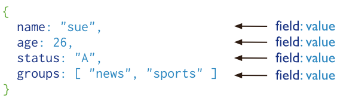

# 设备管理
[TOC]

## 1、搭建设备管理模块

参考share-system模块搭建

### 1.1、新建share-device模块

在share-modules模块下新建子模块share-device

### 1.2、pom.xml

```xml
<?xml version="1.0" encoding="UTF-8"?>
<project xmlns:xsi="http://www.w3.org/2001/XMLSchema-instance"
         xmlns="http://maven.apache.org/POM/4.0.0"
         xsi:schemaLocation="http://maven.apache.org/POM/4.0.0 http://maven.apache.org/xsd/maven-4.0.0.xsd">
    <parent>
        <groupId>com.share</groupId>
        <artifactId>share-modules</artifactId>
        <version>3.6.3</version>
    </parent>
    <modelVersion>4.0.0</modelVersion>

    <artifactId>share-device</artifactId>

    <description>
        share-device系统模块
    </description>

    <dependencies>
       <!-- SpringCloud Alibaba Nacos -->
        <dependency>
            <groupId>com.alibaba.cloud</groupId>
            <artifactId>spring-cloud-starter-alibaba-nacos-discovery</artifactId>
        </dependency>

        <!-- SpringCloud Alibaba Nacos Config -->
        <dependency>
            <groupId>com.alibaba.cloud</groupId>
            <artifactId>spring-cloud-starter-alibaba-nacos-config</artifactId>
        </dependency>

       <!-- SpringCloud Alibaba Sentinel -->
        <dependency>
            <groupId>com.alibaba.cloud</groupId>
            <artifactId>spring-cloud-starter-alibaba-sentinel</artifactId>
        </dependency>

       <!-- SpringBoot Actuator -->
        <dependency>
            <groupId>org.springframework.boot</groupId>
            <artifactId>spring-boot-starter-actuator</artifactId>
        </dependency>

        <!-- Mysql Connector -->
        <dependency>
            <groupId>com.mysql</groupId>
            <artifactId>mysql-connector-j</artifactId>
        </dependency>

        <!-- RuoYi Common DataSource -->
<!--        <dependency>-->
<!--            <groupId>com.share</groupId>-->
<!--            <artifactId>share-common-datasource</artifactId>-->
<!--        </dependency>-->

        <!-- RuoYi Common DataScope -->
        <dependency>
            <groupId>com.share</groupId>
            <artifactId>share-common-datascope</artifactId>
        </dependency>

        <!-- RuoYi Common Log -->
        <dependency>
            <groupId>com.share</groupId>
            <artifactId>share-common-log</artifactId>
        </dependency>
    </dependencies>

    <build>
        <finalName>${project.artifactId}</finalName>
        <plugins>
            <plugin>
                <groupId>org.springframework.boot</groupId>
                <artifactId>spring-boot-maven-plugin</artifactId>
                <executions>
                    <execution>
                        <goals>
                            <goal>repackage</goal>
                        </goals>
                    </execution>
                </executions>
            </plugin>
            <plugin>
                <groupId>org.apache.maven.plugins</groupId>
                <artifactId>maven-compiler-plugin</artifactId>
                <configuration>
                    <source>17</source>
                    <target>17</target>
                </configuration>
            </plugin>
        </plugins>
    </build>

</project>
```

### 1.3、banner.txt

在resources目录下新建banner.txt

```text
Spring Boot Version: ${spring-boot.version}
Spring Application Name: ${spring.application.name}
                            _                           _                    
                           (_)                         | |                   
 _ __  _   _   ___   _   _  _  ______  ___  _   _  ___ | |_   ___  _ __ ___  
| '__|| | | | / _ \ | | | || ||______|/ __|| | | |/ __|| __| / _ \| '_ ` _ \ 
| |   | |_| || (_) || |_| || |        \__ \| |_| |\__ \| |_ |  __/| | | | | |
|_|    \__,_| \___/  \__, ||_|        |___/ \__, ||___/ \__| \___||_| |_| |_|
                      __/ |                  __/ |                           
                     |___/                  |___/                            
```

### 1.4、bootstrap.yml

在resources目录下新建bootstrap.yml

```yaml
# Tomcat
server:
  port: 9205

# Spring
spring:
  application:
    # 应用名称
    name: share-device
  profiles:
    # 环境配置
    active: dev
  main:
    allow-bean-definition-overriding: true #当遇到同样名字的时候，是否允许覆盖注册
  cloud:
    nacos:
      discovery:
        # 服务注册地址
        server-addr: 127.0.0.1:8848
      config:
        # 配置中心地址
        server-addr: 127.0.0.1:8848
        # 配置文件格式
        file-extension: yml
        # 共享配置
        shared-configs:
          - application-${spring.profiles.active}.${spring.cloud.nacos.config.file-extension}
```

### 1.5、share-device-dev.yml

在nacos上添加商品服务配置文件

```yaml
mybatis-plus:
  mapper-locations: classpath*:mapper/**/*Mapper.xml
  type-aliases-package: com.share.**.domain
  configuration:
    log-impl: org.apache.ibatis.logging.stdout.StdOutImpl # 查看日志
  global-config:
    db-config:
      logic-delete-field: del_flag # 全局逻辑删除的实体字段名
      logic-delete-value: 2 # 逻辑已删除值(默认为 1)
      logic-not-delete-value: 0 # 逻辑未删除值(默认为 0)
# spring配置
spring:
  data:
    redis:
      host: localhost
      port: 6379
      password:
  datasource:
    type: com.zaxxer.hikari.HikariDataSource
    driver-class-name: com.mysql.cj.jdbc.Driver
    url: jdbc:mysql://localhost:3306/share-device?characterEncoding=utf-8&useSSL=false
    username: root
    password: root
    hikari:
      connection-test-query: SELECT 1
      connection-timeout: 60000
      idle-timeout: 500000
      max-lifetime: 540000
      maximum-pool-size: 10
      minimum-idle: 5
      pool-name: GuliHikariPool
```

### 1.6、logback.xml

在resources目录下新建logback.xml

```xml
<?xml version="1.0" encoding="UTF-8"?>
<configuration scan="true" scanPeriod="60 seconds" debug="false">
    <!-- 日志存放路径 -->
   <property name="log.path" value="logs/share-device" />
   <!-- 日志输出格式 -->
   <property name="log.pattern" value="%d{HH:mm:ss.SSS} [%thread] %-5level %logger{20} - [%method,%line] - %msg%n" />

    <!-- 控制台输出 -->
   <appender name="console" class="ch.qos.logback.core.ConsoleAppender">
      <encoder>
         <pattern>${log.pattern}</pattern>
      </encoder>
   </appender>

    <!-- 系统日志输出 -->
   <appender name="file_info" class="ch.qos.logback.core.rolling.RollingFileAppender">
       <file>${log.path}/info.log</file>
        <!-- 循环政策：基于时间创建日志文件 -->
      <rollingPolicy class="ch.qos.logback.core.rolling.TimeBasedRollingPolicy">
            <!-- 日志文件名格式 -->
         <fileNamePattern>${log.path}/info.%d{yyyy-MM-dd}.log</fileNamePattern>
         <!-- 日志最大的历史 60天 -->
         <maxHistory>60</maxHistory>
      </rollingPolicy>
      <encoder>
         <pattern>${log.pattern}</pattern>
      </encoder>
      <filter class="ch.qos.logback.classic.filter.LevelFilter">
            <!-- 过滤的级别 -->
            <level>INFO</level>
            <!-- 匹配时的操作：接收（记录） -->
            <onMatch>ACCEPT</onMatch>
            <!-- 不匹配时的操作：拒绝（不记录） -->
            <onMismatch>DENY</onMismatch>
        </filter>
   </appender>

    <appender name="file_error" class="ch.qos.logback.core.rolling.RollingFileAppender">
       <file>${log.path}/error.log</file>
        <!-- 循环政策：基于时间创建日志文件 -->
        <rollingPolicy class="ch.qos.logback.core.rolling.TimeBasedRollingPolicy">
            <!-- 日志文件名格式 -->
            <fileNamePattern>${log.path}/error.%d{yyyy-MM-dd}.log</fileNamePattern>
         <!-- 日志最大的历史 60天 -->
         <maxHistory>60</maxHistory>
        </rollingPolicy>
        <encoder>
            <pattern>${log.pattern}</pattern>
        </encoder>
        <filter class="ch.qos.logback.classic.filter.LevelFilter">
            <!-- 过滤的级别 -->
            <level>ERROR</level>
         <!-- 匹配时的操作：接收（记录） -->
            <onMatch>ACCEPT</onMatch>
         <!-- 不匹配时的操作：拒绝（不记录） -->
            <onMismatch>DENY</onMismatch>
        </filter>
    </appender>

    <!-- 系统模块日志级别控制  -->
   <logger name="com.share" level="info" />
   <!-- Spring日志级别控制  -->
   <logger name="org.springframework" level="warn" />

   <root level="info">
      <appender-ref ref="console" />
   </root>

   <!--系统操作日志-->
    <root level="info">
        <appender-ref ref="file_info" />
        <appender-ref ref="file_error" />
    </root>
</configuration>
```

### 1.7、ShareDeviceApplication

添加启动类

```java
package com.share.device;

/**
 * 设备模块
 *
 * @author share
 */
@EnableCustomConfig
@EnableRyFeignClients
@SpringBootApplication
public class ShareDeviceApplication
{
    public static void main(String[] args)
    {
        SpringApplication.run(ShareDeviceApplication.class, args);
        System.out.println("(♥◠‿◠)ﾉﾞ  设备模块启动成功   ლ(´ڡ`ლ)ﾞ  \n" +
                " .-------.       ____     __        \n" +
                " |  _ _   \\      \\   \\   /  /    \n" +
                " | ( ' )  |       \\  _. /  '       \n" +
                " |(_ o _) /        _( )_ .'         \n" +
                " | (_,_).' __  ___(_ o _)'          \n" +
                " |  |\\ \\  |  ||   |(_,_)'         \n" +
                " |  | \\ `'   /|   `-'  /           \n" +
                " |  |  \\    /  \\      /           \n" +
                " ''-'   `'-'    `-..-'              ");
    }

    @Bean
    public RestTemplate restTemplate() {
        return new RestTemplate();
    }
}
```

## 2、柜机类型

共享充电宝柜机类型可分为：八口柜机、十二口柜机等，根据容纳充电宝的个数来区分

### 2.1、分页列表

#### 2.1.1、CabinetType

说明：

1、柜机类型属性可以使用get/set方法，也可以使用@Data标签

2、默认带上swg标签，方便后续生成api文档

```java
package com.share.device.domain;

@Data
@Schema(description = "柜机类型")
public class CabinetType extends BaseEntity
{
    private static final long serialVersionUID = 1L;

    /** 名称 */
    @Schema(description = "名称")
    private String name;

    /** 总插槽数量 */
    @Schema(description = "总插槽数量")
    private Integer totalSlots;

    /** 描述 */
    @Schema(description = "描述")
    private String description;

    /** 状态（0正常 1停用） */
    @Schema(description = "状态")
    private String status;

}
```

#### 2.1.2、CabinetTypeController

```java
package com.share.device.controller;

@Tag(name = "柜机类型接口管理")
@RestController
@RequestMapping("/cabinetType")
public class CabinetTypeController extends BaseController
{
    @Autowired
    private ICabinetTypeService cabinetTypeService;

    /**
     * 查询柜机类型列表
     */
    @Operation(summary = "查询柜机类型列表")
    @GetMapping("/list")
    public TableDataInfo list(CabinetType cabinetType)
    {
        startPage();
        List<CabinetType> list = cabinetTypeService.selectCabinetTypeList(cabinetType);
        return getDataTable(list);
    }
    
}
```

说明：

分页参数封装到了BaseController类，请注意查看

#### 2.1.3、ICabinetTypeService

```java
package com.share.device.service;

public interface ICabinetTypeService extends IService<CabinetType>
{

    /**
     * 查询柜机类型列表
     *
     * @param cabinetType 柜机类型
     * @return 柜机类型集合
     */
    public List<CabinetType> selectCabinetTypeList(CabinetType cabinetType);

}
```

#### 2.1.4、CabinetTypeServiceImpl

```java
package com.share.device.service.impl;

@Service
public class CabinetTypeServiceImpl extends ServiceImpl<CabinetTypeMapper, CabinetType> implements ICabinetTypeService
{
    @Autowired
    private CabinetTypeMapper cabinetTypeMapper;

    /**
     * 查询柜机类型列表
     *
     * @param cabinetType 柜机类型
     * @return 柜机类型
     */
    @Override
    public List<CabinetType> selectCabinetTypeList(CabinetType cabinetType)
    {
        return cabinetTypeMapper.selectCabinetTypeList(cabinetType);
    }

}
```

#### 2.1.5、CabinetTypeMapper

```java
package com.share.device.mapper;

public interface CabinetTypeMapper extends BaseMapper<CabinetType>
{

    /**
     * 查询柜机类型列表
     *
     * @param cabinetType 柜机类型
     * @return 柜机类型集合
     */
    public List<CabinetType> selectCabinetTypeList(CabinetType cabinetType);

}
```

#### 2.1.6、CabinetTypeMapper.xml

resources/mapper/device目录

```xml
<?xml version="1.0" encoding="UTF-8" ?>
<!DOCTYPE mapper
PUBLIC "-//mybatis.org//DTD Mapper 3.0//EN"
"http://mybatis.org/dtd/mybatis-3-mapper.dtd">
<mapper namespace="com.share.device.mapper.CabinetTypeMapper">

    <resultMap type="CabinetType" id="CabinetTypeResult" autoMapping="true">
    </resultMap>

    <sql id="selectCabinetTypeVo">
        select id, name, total_slots, description, status, del_flag, create_by, create_time, update_by, update_time, remark from cabinet_type
    </sql>

    <select id="selectCabinetTypeList" parameterType="CabinetType" resultMap="CabinetTypeResult">
        <include refid="selectCabinetTypeVo"/>
        <where>
            <if test="name != null  and name != ''"> and name like concat('%', #{name}, '%')</if>
            <if test="totalSlots != null "> and total_slots = #{totalSlots}</if>
            <if test="description != null  and description != ''"> and description = #{description}</if>
            <if test="status != null  and status != ''"> and status = #{status}</if>
        and del_flag = 0
        </where>
    </select>

</mapper>

```

#### 2.1.7、测试接口

启动项目

访问在线swg：http://localhost:9205/doc.html

### 2.2、获取详细信息

#### 2.2.1、CabinetTypeController

```java
@Operation(summary = "获取柜机类型详细信息")
@GetMapping(value = "/{id}")
public AjaxResult getInfo(@PathVariable("id") Long id)
{
    return success(cabinetTypeService.getById(id));
}
```

#### 2.2.2、测试接口

启动项目

访问在线swg：http://localhost:9205/doc.html

### 2.3、新增

#### 2.3.1、CabinetTypeController

```java
@Operation(summary = "新增柜机类型")
@PostMapping
public AjaxResult add(@RequestBody CabinetType cabinetType)
{
    return toAjax(cabinetTypeService.save(cabinetType));
}
```

#### 2.3.2、测试接口

启动项目

访问在线swg：http://localhost:9205/doc.html

### 2.4、修改

#### 2.4.1、CabinetTypeController

```java
@Operation(summary = "修改柜机类型")
@PutMapping
public AjaxResult edit(@RequestBody CabinetType cabinetType)
{
    return toAjax(cabinetTypeService.updateById(cabinetType));
}
```

#### 2.4.2、测试接口

启动项目

访问在线swg：http://localhost:9205/doc.html

### 2.5、删除

#### 2.5.1、CabinetTypeController

```java
@Operation(summary = "删除柜机类型")
@DeleteMapping("/{ids}")
public AjaxResult remove(@PathVariable Long[] ids)
{
    return toAjax(cabinetTypeService.removeBatchByIds(Arrays.asList(ids)));
}
```

#### 2.5.2、测试接口

启动项目

访问在线swg：http://localhost:9205/doc.html

### 2.6、获取全部柜机类型

#### 2.6.1、CabinetTypeController

```java
@Operation(summary = "查询全部柜机类型列表")
@GetMapping("/getCabinetTypeList")
public AjaxResult getCabinetTypeList()
{
    return success(cabinetTypeService.list());
}
```

#### 2.6.2、测试接口

启动项目

访问在线swg：http://localhost:9205/doc.html


### 2.7、数据校验

新增与修改品牌数据校验。

spring-boot-starter-validation是Spring Boot提供的一个starter，它为应用程序提供了Bean Validation API的支持。Bean Validation是Java EE的一部分，用于验证JavaBean的属性是否符合规范。使用Spring Boot和spring-boot-starter-validation，您可以轻松地使用注解来验证请求参数、对象等是否符合要求。

下面我们介绍一下spring-boot-starter-validation的使用方法。

#### 2.7.1、加入依赖

在使用spring-boot-starter-validation时，需要添加相关的依赖。

share-common-core模块已引入

```xml
<dependency>
    <groupId>org.springframework.boot</groupId>
    <artifactId>spring-boot-starter-validation</artifactId>
</dependency>
```

#### 2.7.2、基本注解

```
空检查
@Null         验证对象是否为null
@NotNull      验证对象是否不为null, 无法查检长度为0的字符串
@NotBlank     检查约束字符串是不是Null还有被Trim的长度是否大于0,只对字符串,且会去掉前后空格.
@NotEmpty     检查约束元素是否为NULL或者是EMPTY.

Booelan检查
@AssertTrue       验证 Boolean 对象是否为 true
@AssertFalse   验证 Boolean 对象是否为 false

长度检查
@Size(min=, max=)     验证对象（Array,Collection,Map,String）长度是否在给定的范围之内
@Length(min=, max=)       验证注解的元素值长度在min和max区间内

日期检查
@Past     验证 Date 和 Calendar 对象是否在当前时间之前
@Future       验证 Date 和 Calendar 对象是否在当前时间之后
@Pattern   验证 String 对象是否符合正则表达式的规则

数值检查，建议使用在Stirng,Integer类型，不建议使用在int类型上，因为表单值为“”时无法转换为int，但可以转换为Stirng为"",Integer为null
@Min         验证 Number 和 String 对象是否大等于指定的值
@Max         验证 Number 和 String 对象是否小等于指定的值
@DecimalMax       被标注的值必须不大于约束中指定的最大值. 这个约束的参数是一个通过BigDecimal定义的最大值的字符串表示.小数存在精度
@DecimalMin       被标注的值必须不小于约束中指定的最小值. 这个约束的参数是一个通过BigDecimal定义的最小值的字符串表示.小数存在精度
@Digits          验证 Number 和 String 的构成是否合法
@Digits(integer=,fraction=)       验证字符串是否是符合指定格式的数字，interger指定整数精度，fraction指定小数精度。

@Range(min=, max=) 验证注解的元素值在最小值和最大值之间
@Range(min=10000,max=50000,message="range.bean.wage")

@Valid 写在方法参数前，递归的对该对象进行校验, 如果关联对象是个集合或者数组,那么对其中的元素进行递归校验,如果是一个map,则对其中的值部分进行校验.(是否进行递归验证)
@CreditCardNumber信用卡验证
@Email  验证是否是邮件地址，如果为null,不进行验证，算通过验证。
@ScriptAssert(lang= ,script=, alias=)
@URL(protocol=,host=, port=,regexp=, flags=)

```

#### 2.7.3、实体类添加校验注解

```java
@Data
@Schema(description = "柜机类型")
public class CabinetType extends BaseEntity
{
    private static final long serialVersionUID = 1L;

    /** 名称 */
    @Schema(description = "名称")
    @NotBlank(message = "名称名称不能为空")
    private String name;

    /** 总插槽数量 */
    @Schema(description = "总插槽数量")
    @NotNull(message = "总插槽数量不能为空")
    private Integer totalSlots;

    /** 描述 */
    @Schema(description = "描述")
    private String description;

    /** 状态（0正常 1停用） */
    @Schema(description = "状态")
    private String status;

}
```

#### 2.7.4、接口方法使用@Validated注解

```java
@Operation(summary = "新增柜机类型")
@PostMapping
public AjaxResult add(@RequestBody @Validated CabinetType cabinetType)
{
    return toAjax(cabinetTypeService.save(cabinetType));
}

@Operation(summary = "修改柜机类型")
@PutMapping
public AjaxResult edit(@RequestBody @Validated CabinetType cabinetType)
{
    return toAjax(cabinetTypeService.updateById(cabinetType));
}
```

#### 2.7.5、校验失败的异常捕获

share-common-security模块全局异常处理器GlobalExceptionHandler类，捕获参数校验异常

```java
/**
 * 自定义验证异常
 */
@ExceptionHandler(MethodArgumentNotValidException.class)
public Object handleMethodArgumentNotValidException(MethodArgumentNotValidException e)
{
    log.error(e.getMessage(), e);
    String message = e.getBindingResult().getFieldError().getDefaultMessage();
    return AjaxResult.error(message);
}
```

已添加就忽略

#### 2.7.6、测试接口

启动项目

访问在线swg：http://localhost:9205/doc.html


## 3、柜机管理

添加柜机会根据柜机类型，初始化对应的插槽数据

### 3.1、实体

#### 3.1.1、Cabinet

```java
package com.share.device.domain;

@Data
@Schema(description = "充电宝柜机")
public class Cabinet extends BaseEntity
{
    private static final long serialVersionUID = 1L;

    /** 机柜编号 */
    @Schema(description = "机柜编号")
    private String cabinetNo;

    /** 名称 */
    @Schema(description = "名称")
    private String name;

    /** 类别id */
    @Schema(description = "类别id")
    private Long cabinetTypeId;

    /** 总插槽数量 */
    @Schema(description = "总插槽数量")
    private Integer totalSlots;

    /** 空闲插槽数量 */
    @Schema(description = "空闲插槽数量")
    private Integer freeSlots;

    /** 已使用插槽数量 */
    @Schema(description = "已使用插槽数量")
    private Integer usedSlots;

    /** 可用充电宝数量 */
    @Schema(description = "可用充电宝数量")
    private Integer availableNum;

    /** 描述 */
    @Schema(description = "描述")
    private String description;

    /** 当前位置id */
    @Schema(description = "当前位置id")
    private Long locationId;

    /** 状态（0：未投入 1：使用中 -1：故障） */
    @Schema(description = "状态")
    private String status;

    @Schema(description = "分类名称")
    @TableField(exist = false)
    private String cabinetTypeName;
}
```

#### 3.1.2、CabinetSlot

```java
package com.share.device.domain;

@Data
@Schema(description = "柜机插槽")
public class CabinetSlot extends BaseEntity
{
    private static final long serialVersionUID = 1L;

    /** 柜机id */
    @Schema(description = "柜机id")
    private Long cabinetId;

    /** 插槽编号 */
    @Schema(description = "插槽编号")
    private String slotNo;

    /** 充电宝id */
    @Schema(description = "充电宝id")
    @TableField(updateStrategy = FieldStrategy.IGNORED)//指定null时不更新该字段
    private Long powerBankId;

    /** 状态（1占用 0空闲 2锁定） */
    @Schema(description = "状态")
    private String status;

}
```

### 3.2、分页列表

#### 3.2.1、CabinetController

```java
package com.share.device.controller;

@Tag(name = "充电宝柜机接口管理")
@RestController
@RequestMapping("/cabinet")
public class CabinetController extends BaseController
{
    @Autowired
    private ICabinetService cabinetService;

    /**
     * 查询充电宝柜机列表
     */
    @Operation(summary = "查询充电宝柜机列表")
    @GetMapping("/list")
    public TableDataInfo list(Cabinet cabinet)
    {
        startPage();
        List<Cabinet> list = cabinetService.selectCabinetList(cabinet);
        return getDataTable(list);
    }
    
}
```

#### 3.2.2、ICabinetService

```java
package com.share.device.service;

public interface ICabinetService extends IService<Cabinet>
{

    public List<Cabinet> selectCabinetList(Cabinet cabinet);
    
}
```

#### 3.2.3、CabinetServiceImpl

```java
package com.share.device.service.impl;

@Service
public class CabinetServiceImpl extends ServiceImpl<CabinetMapper, Cabinet> implements ICabinetService
{
    @Autowired
    private CabinetMapper cabinetMapper;

    @Override
    public List<Cabinet> selectCabinetList(Cabinet cabinet)
    {
        return cabinetMapper.selectCabinetList(cabinet);
    }
}
```

#### 3.2.4、CabinetMapper

```java
package com.share.device.mapper;

public interface CabinetMapper extends BaseMapper<Cabinet>
{

    /**
     * 查询充电宝柜机列表
     *
     * @param cabinet 充电宝柜机
     * @return 充电宝柜机集合
     */
    public List<Cabinet> selectCabinetList(Cabinet cabinet);

}
```

#### 3.2.5、CabinetMapper.xml

```xml
<?xml version="1.0" encoding="UTF-8" ?>
<!DOCTYPE mapper
PUBLIC "-//mybatis.org//DTD Mapper 3.0//EN"
"http://mybatis.org/dtd/mybatis-3-mapper.dtd">
<mapper namespace="com.share.device.mapper.CabinetMapper">

    <resultMap type="Cabinet" id="CabinetResult" autoMapping="true">
    </resultMap>

    <sql id="selectCabinetVo">
        select c.id, c.cabinet_no, c.name, c.cabinet_type_id, c.total_slots, c.free_slots, c.used_slots, c.available_num, c.description, c.location_id, c.status, c.del_flag, c.create_by, c.create_time, c.update_by, c.update_time, c.remark,
            ct.name as cabinet_type_name
        from cabinet c
        left join cabinet_type ct on c.cabinet_type_id = ct.id
    </sql>

    <select id="selectCabinetList" parameterType="Cabinet" resultMap="CabinetResult">
        <include refid="selectCabinetVo"/>
        <where>
            <if test="cabinetNo != null  and cabinetNo != ''"> and c.cabinet_no = #{cabinetNo}</if>
            <if test="name != null  and name != ''"> and c.name like concat('%', #{name}, '%')</if>
            <if test="cabinetTypeId != null "> and c.cabinet_type_id = #{cabinetTypeId}</if>
            <if test="status != null  and status != ''"> and c.status = #{status}</if>
        and c.del_flag = 0
        and ct.del_flag = 0
        </where>
    </select>

</mapper>
```

### 3.3、详情、新增、修改、删除

#### 3.3.1、CabinetController

```java
@Operation(summary = "获取充电宝柜机详细信息")
@GetMapping(value = "/{id}")
public AjaxResult getInfo(@PathVariable("id") Long id)
{
    return success(cabinetService.getById(id));
}

@Operation(summary = "新增充电宝柜机")
@PostMapping
public AjaxResult add(@RequestBody Cabinet cabinet)
{
    return toAjax(cabinetService.saveCabinet(cabinet));
}

@Operation(summary = "修改充电宝柜机")
@PutMapping
public AjaxResult edit(@RequestBody Cabinet cabinet)
{
    return toAjax(cabinetService.updateCabinet(cabinet));
}

@Operation(summary = "删除充电宝柜机")
@DeleteMapping("/{ids}")
public AjaxResult remove(@PathVariable Long[] ids)
{
    return toAjax(cabinetService.removeBatchByIds(Arrays.asList(ids)));
}
```

#### 3.3.2、ICabinetService

```java
int saveCabinet(Cabinet cabinet);

int updateCabinet(Cabinet cabinet);

int removeCabinet(List<Long> idList);
```

#### 3.2.3、CabinetServiceImpl

```java
@Transactional(rollbackFor = Exception.class)
@Override
public int saveCabinet(Cabinet cabinet) {
    long count = this.count(new LambdaQueryWrapper<Cabinet>().eq(Cabinet::getCabinetNo, cabinet.getCabinetNo()));
    if (count > 0) {
        throw new ServiceException("该柜机编号已存在");
    }
    // 根据柜机类型id查询柜机类型
    CabinetType cabinetType = cabinetTypeMapper.selectById(cabinet.getCabinetTypeId());

    // 设置总插槽数量和可用插槽数量
    cabinet.setTotalSlots(cabinetType.getTotalSlots());
    cabinet.setFreeSlots(cabinetType.getTotalSlots());
    cabinet.setUsedSlots(0);
    cabinet.setAvailableNum(0);
    cabinet.setCreateTime(new Date());
    cabinet.setCreateBy(SecurityUtils.getUsername());
    this.save(cabinet);

    int size = cabinetType.getTotalSlots();
    for(int i=0; i<size; i++) {
        CabinetSlot cabinetSlot = new CabinetSlot();
        cabinetSlot.setCabinetId(cabinet.getId());
        cabinetSlot.setSlotNo(i+1+"");
        cabinetSlot.setCreateTime(new Date());
        cabinet.setCreateBy(SecurityUtils.getUsername());
        cabinetSlotMapper.insert(cabinetSlot);
    }
    return 1;
}

@Transactional(rollbackFor = Exception.class)
@Override
public int updateCabinet(Cabinet cabinet) {
    // 获取旧的数据
    Cabinet oldCabinet = this.getById(cabinet.getId());
    if (null != oldCabinet && !"0".equals(oldCabinet.getStatus())) {
        throw new ServiceException("该柜机已投放，无法修改");
    }
    //判断柜机编号是否改变
    if (!oldCabinet.getCabinetNo().equals(cabinet.getCabinetNo())) {
        long count = this.count(new LambdaQueryWrapper<Cabinet>().eq(Cabinet::getCabinetNo, cabinet.getCabinetNo()));
        if (count > 0) {
            throw new ServiceException("该柜机编号已存在");
        }
    }

    // 判断是否修改了柜机类型
    if(oldCabinet.getCabinetTypeId().longValue() != cabinet.getCabinetTypeId()) {
        // 根据柜机类型id查询柜机类型
        CabinetType cabinetType = cabinetTypeMapper.selectById(cabinet.getCabinetTypeId());

        // 设置总插槽数量和可用插槽数量
        cabinet.setTotalSlots(cabinetType.getTotalSlots());
        cabinet.setTotalSlots(cabinetType.getTotalSlots());
        cabinet.setFreeSlots(cabinetType.getTotalSlots());
        cabinet.setUsedSlots(0);
        cabinet.setAvailableNum(0);
        cabinet.setUpdateTime(new Date());
        cabinet.setUpdateBy(SecurityUtils.getUsername());
        this.updateById(cabinet);

        // 删除所有插槽
        cabinetSlotMapper.delete(new LambdaQueryWrapper<CabinetSlot>().eq(CabinetSlot::getCabinetId, cabinet.getId()));
        int size = cabinetType.getTotalSlots();
        for(int i=0; i<size; i++) {
            CabinetSlot cabinetSlot = new CabinetSlot();
            cabinetSlot.setCabinetId(cabinet.getId());
            cabinetSlot.setSlotNo(i+1+"");
            cabinetSlot.setCreateTime(new Date());
            cabinet.setCreateBy(SecurityUtils.getUsername());
            cabinetSlotMapper.insert(cabinetSlot);
        }
    } else {
        cabinet.setUpdateTime(new Date());
        cabinet.setUpdateBy(SecurityUtils.getUsername());
        this.updateById(cabinet);
    }
    return 1;
}

@Transactional(rollbackFor = Exception.class)
@Override
public int removeCabinet(List<Long> idList) {
    this.removeBatchByIds(idList);
    cabinetSlotMapper.delete(new LambdaQueryWrapper<CabinetSlot>().in(CabinetSlot::getCabinetId, idList));
    return 1;
}
```

### 3.4、搜索未使用柜机

#### 3.4.1、CabinetController

```java
@Operation(summary = "搜索未使用柜机")
@GetMapping(value = "/searchNoUseList/{keyword}")
public AjaxResult searchNoUseList(@PathVariable String keyword)
{
    return success(cabinetService.searchNoUseList(keyword));
}
```

#### 3.4.2、ICabinetService

```java
List<Cabinet> searchNoUseList(String keyword);
```

#### 3.4.3、CabinetServiceImpl

```java
@Override
public List<Cabinet> searchNoUseList(String keyword) {
    return cabinetMapper.selectList(new LambdaQueryWrapper<Cabinet>()
                    .like(Cabinet::getCabinetNo, keyword)
            .eq(Cabinet::getStatus, "0")
    );
}
```


## 4、充电宝管理

对充电宝基本属性的增删改查

### 4.1、增删改查

#### 4.1.1、PowerBank

```java
package com.share.device.domain;

@Data
@Schema(description = "充电宝")
public class PowerBank extends BaseEntity
{
    private static final long serialVersionUID = 1L;

    /** 充电宝编号 */
    @Schema(description = "充电宝编号")
    private String powerBankNo;

    /** 电量 */
    @Schema(description = "电量")
    private BigDecimal electricity;

    /** 描述 */
    @Schema(description = "描述")
    private String description;

    /** 状态（0:未投放 1：可用 2：已租用 3：充电中 4：故障） */
    @Schema(description = "状态")
    private String status;

}
```

#### 4.1.2、PowerBankController

```java
package com.share.device.controller;

@Tag(name = "充电宝接口管理")
@RestController
@RequestMapping("/powerBank")
public class PowerBankController extends BaseController
{
    @Autowired
    private IPowerBankService powerBankService;

    @Operation(summary = "查询充电宝列表")
    @GetMapping("/list")
    public TableDataInfo list(PowerBank powerBank)
    {
        startPage();
        List<PowerBank> list = powerBankService.selectPowerBankList(powerBank);
        return getDataTable(list);
    }


    @Operation(summary = "获取充电宝详细信息")
    @GetMapping(value = "/{id}")
    public AjaxResult getInfo(@PathVariable("id") Long id)
    {
        return success(powerBankService.getById(id));
    }

    @Operation(summary = "新增充电宝")
    @PostMapping
    public AjaxResult add(@RequestBody PowerBank powerBank)
    {
        powerBank.setCreateBy(SecurityUtils.getUsername());
        powerBank.setCreateTime(new Date());
        return toAjax(powerBankService.savePowerBank(powerBank));
    }

    @Operation(summary = "修改充电宝")
    @PutMapping
    public AjaxResult edit(@RequestBody PowerBank powerBank)
    {
        powerBank.setUpdateBy(SecurityUtils.getUsername());
        powerBank.setUpdateTime(new Date());
        return toAjax(powerBankService.updatePowerBank(powerBank));
    }

    @Operation(summary = "删除充电宝")
   @DeleteMapping("/{ids}")
    public AjaxResult remove(@PathVariable Long[] ids)
    {
        return toAjax(powerBankService.removeBatchByIds(Arrays.asList(ids)));
    }
}
```

#### 4.1.3、IPowerBankService

```java
package com.share.device.service;

public interface IPowerBankService extends IService<PowerBank>
{

    List<PowerBank> selectPowerBankList(PowerBank powerBank);

    PowerBank getByPowerBankNo(String powerBankNo);

    int savePowerBank(PowerBank powerBank);

    int updatePowerBank(PowerBank powerBank);
}
```

#### 4.1.4、IPowerBankService

```java
package com.share.device.service.impl;

@Service
public class PowerBankServiceImpl extends ServiceImpl<PowerBankMapper, PowerBank> implements IPowerBankService
{
    @Autowired
    private PowerBankMapper powerBankMapper;

    @Override
    public List<PowerBank> selectPowerBankList(PowerBank powerBank)
    {
        return powerBankMapper.selectPowerBankList(powerBank);
    }

    @Override
    public PowerBank getByPowerBankNo(String powerBankNo) {
        return powerBankMapper.selectOne(new LambdaQueryWrapper<PowerBank>().eq(PowerBank::getPowerBankNo, powerBankNo));
    }

    @Override
    public int savePowerBank(PowerBank powerBank) {
        long count = this.count(new LambdaQueryWrapper<PowerBank>().eq(PowerBank::getPowerBankNo, powerBank.getPowerBankNo()));
        if (count > 0) {
            throw new ServiceException("该充电宝编号已存在");
        }
        powerBankMapper.insert(powerBank);
        return 1;
    }

    @Override
    public int updatePowerBank(PowerBank powerBank) {
        // 获取旧的数据
        PowerBank oldPowerBank = this.getById(powerBank.getId());
        if (null != oldPowerBank && !"0".equals(oldPowerBank.getStatus())) {
            throw new ServiceException("该充电宝已投放，无法修改");
        }
        //判断柜机编号是否改变
        if (!oldPowerBank.getPowerBankNo().equals(powerBank.getPowerBankNo())) {
            long count = this.count(new LambdaQueryWrapper<PowerBank>().eq(PowerBank::getPowerBankNo, powerBank.getPowerBankNo()));
            if (count > 0) {
                throw new ServiceException("该充电宝编号已存在");
            }
        }
        powerBankMapper.updateById(powerBank);
        return 1;
    }
}
```

#### 4.1.5、PowerBankMapper

```java
package com.share.device.mapper;

/**
 * 充电宝Mapper接口
 *
 * @author atguigu
 * @date 2024-10-22
 */
public interface PowerBankMapper extends BaseMapper<PowerBank>
{

    /**
     * 查询充电宝列表
     *
     * @param powerBank 充电宝
     * @return 充电宝集合
     */
    public List<PowerBank> selectPowerBankList(PowerBank powerBank);

}
```

#### 4.1.6、PowerBankMapper.xml

resources/mapper/device目录

```xml
<?xml version="1.0" encoding="UTF-8" ?>
<!DOCTYPE mapper
PUBLIC "-//mybatis.org//DTD Mapper 3.0//EN"
"http://mybatis.org/dtd/mybatis-3-mapper.dtd">
<mapper namespace="com.share.device.mapper.PowerBankMapper">

    <resultMap type="PowerBank" id="PowerBankResult" autoMapping="true">
    </resultMap>

    <sql id="selectPowerBankVo">
        select id, power_bank_no, electricity, description, status, del_flag, create_by, create_time, update_by, update_time, remark from power_bank
    </sql>

    <select id="selectPowerBankList" parameterType="PowerBank" resultMap="PowerBankResult">
        <include refid="selectPowerBankVo"/>
        <where>
            <if test="powerBankNo != null  and powerBankNo != ''"> and power_bank_no = #{powerBankNo}</if>
            <if test="electricity != null "> and electricity = #{electricity}</if>
            <if test="description != null  and description != ''"> and description = #{description}</if>
            <if test="status != null  and status != ''"> and status = #{status}</if>
        and del_flag = 0
        </where>
    </select>

</mapper>
```


## 5、地区管理

新增站点时，会根据地区三级联动选择地址，根据上级code动态获取下级数据列表

### 5.1、根据上级code获取下级数据列表

#### 5.1.1、Region

```java
package com.share.device.domain;

@Data
@Schema(description = "地区信息")
public class Region extends BaseEntity {
    private static final long serialVersionUID = 1L;

    /** 地区编码 */
    @Schema(description = "地区编码")
    private String code;

    /** 上级地区code */
    @Schema(description = "上级地区code")
    private String parentCode;

    /** 地区名称 */
    @Schema(description = "地区名称")
    private String name;

    /** 地区级别 */
    @Schema(description = "地区级别")
    private Long level;

    /** 是否有子节点 */
    @TableField(exist = false)
    private Boolean hasChildren;
}
```

#### 5.1.2、RegionController

```java
package com.share.device.controller;

@Tag(name = "地区信息接口管理")
@RestController
@RequestMapping("/region")
public class RegionController extends BaseController
{
    @Autowired
    private IRegionService regionService;

    @Operation(summary = "根据上级code获取下级数据列表")
    @GetMapping(value = "/treeSelect/{parentCode}")
    public AjaxResult treeSelect(@PathVariable String parentCode) {
        return success(regionService.treeSelect(parentCode));
    }

}
```

#### 5.1.3、IRegionService

```java
package com.share.device.service;

public interface IRegionService extends IService<Region> {

    List<Region> treeSelect(String parentCode);

}
```

#### 5.1.4、RegionServiceImpl

```java
package com.share.device.service.impl;

@Service
public class RegionServiceImpl extends ServiceImpl<RegionMapper, Region> implements IRegionService
{
    @Autowired
    private RegionMapper regionMapper;

    @Override
    public List<Region> treeSelect(String parentCode) {
        List<Region> regionList = regionMapper.selectList(new LambdaQueryWrapper<Region>().eq(Region::getParentCode, parentCode));
        if (!CollectionUtils.isEmpty(regionList)) {
            regionList.forEach(item -> {
                long count = regionMapper.selectCount(new LambdaQueryWrapper<Region>().eq(Region::getParentCode, item.getCode()));
                if (count > 0) {
                    item.setHasChildren(true);
                } else {
                    item.setHasChildren(false);
                }
            });
        }
        return regionList;
    }

}
```

#### 5.1.5、RegionMapper

```java
package com.share.device.mapper;

public interface RegionMapper extends BaseMapper<Region> {

}
```


## 6、站点管理

站点为共享充电宝的投放地点，也可以叫做门店

### 6.1、分页列表

#### 6.1.1、Station

```java
package com.share.device.domain;

@Data
@Schema(description = "站点")
public class Station extends BaseEntity
{
    private static final long serialVersionUID = 1L;

    /** 站点名称 */
    @Schema(description = "站点名称")
    private String name;

    /** 站点图片地址 */
    @Schema(description = "站点图片地址")
    private String imageUrl;

    /** 营业时间 */
    @Schema(description = "营业时间")
    private String businessHours;

    /** 经度 */
    @Schema(description = "经度")
    private BigDecimal longitude;

    /** 纬度 */
    @Schema(description = "纬度")
    private BigDecimal latitude;

    /** 省code */
    @Schema(description = "省code")
    private String provinceCode;

    /** 市code */
    @Schema(description = "市code")
    private String cityCode;

    /** 区code */
    @Schema(description = "区code")
    private String districtCode;

    /** 详细地址 */
    @Schema(description = "详细地址")
    private String address;

    /** 完整地址 */
    @Schema(description = "完整地址")
    private String fullAddress;

    /** 站点负责人名称 */
    @Schema(description = "站点负责人名称")
    private String headName;

    /** 站点负责人电话 */
    @Schema(description = "站点负责人电话")
    private String headPhone;

    /** 柜机id */
    @Schema(description = "柜机id")
    private Long cabinetId;

    /** 费用规则id */
    @Schema(description = "费用规则id")
    private Long feeRuleId;

    /** 状态（1正常 0停用） */
    @Schema(description = "状态")
    private String status;

    @Schema(description = "柜机编号")
    @TableField(exist = false)
    private String cabinetNo;

    @Schema(description = "费用规则")
    @TableField(exist = false)
    private String feeRuleName;
}
```

cabinetNo与feeRuleName列表需要显示

#### 6.1.2、StationController

```java
package com.share.device.controller;

@Tag(name = "站点接口管理")
@RestController
@RequestMapping("/station")
public class StationController extends BaseController
{
    @Autowired
    private IStationService stationService;

    /**
     * 查询站点列表
     */
    @Operation(summary = "查询站点列表")
    @GetMapping("/list")
    public TableDataInfo list(Station station)
    {
        startPage();
        List<Station> list = stationService.selectStationList(station);
        return getDataTable(list);
    }
}
```

#### 6.1.3、IStationService

```java
package com.share.device.service;

public interface IStationService extends IService<Station>
{

    public List<Station> selectStationList(Station station);
}
```

#### 6.1.4、StationServiceImpl

```java
package com.share.device.service.impl;

@Service
public class StationServiceImpl extends ServiceImpl<StationMapper, Station> implements IStationService
{
    @Autowired
    private StationMapper stationMapper;

    @Override
    public List<Station> selectStationList(Station station)
    {
        List<Station> list = stationMapper.selectStationList(station);
        List<Long> cabinetIdList = list.stream().map(Station::getCabinetId).collect(Collectors.toList());
        Map<Long,String> cabinetIdToCabinetNoMap = new HashMap<>();
        if(!CollectionUtils.isEmpty(cabinetIdList)) {
            List<Cabinet> cabinetList = cabinetService.list(new LambdaQueryWrapper<Cabinet>().in(Cabinet::getId, cabinetIdList));
            cabinetIdToCabinetNoMap = cabinetList.stream().collect(Collectors.toMap(Cabinet::getId, Cabinet::getCabinetNo));
        }
        for (Station item : list) {
            item.setCabinetNo(cabinetIdToCabinetNoMap.get(item.getCabinetId()));
        }
        return list;
    }
    
}
```

#### 6.1.5、StationMapper

```java
package com.share.device.mapper;

public interface StationMapper extends BaseMapper<Station>
{
    public List<Station> selectStationList(Station station);

}
```

#### 6.1.6、StationMapper.xml

```xml
<?xml version="1.0" encoding="UTF-8" ?>
<!DOCTYPE mapper
        PUBLIC "-//mybatis.org//DTD Mapper 3.0//EN"
        "http://mybatis.org/dtd/mybatis-3-mapper.dtd">
<mapper namespace="com.share.device.mapper.StationMapper">

    <resultMap type="Station" id="StationResult" autoMapping="true">
    </resultMap>

    <sql id="selectStationVo">
        select id, name, image_url, business_hours, longitude, latitude, province_code, city_code, district_code,address, full_address, head_name, head_phone, cabinet_id, fee_rule_id, status, create_time, create_by, update_time, update_by, del_flag, remark from station
    </sql>

    <select id="selectStationList" parameterType="Station" resultMap="StationResult">
        <include refid="selectStationVo"/>
        <where>
            <if test="name != null  and name != ''"> and name like concat('%', #{name}, '%')</if>
            <if test="provinceCode != null  and provinceCode != ''"> and provinceCode = #{province_code}</if>
            <if test="cityCode != null  and cityCode != ''"> and cityCode = #{city_code}</if>
            <if test="districtCode != null  and districtCode != ''"> and districtCode = #{district_code}</if>
            <if test="address != null  and address != ''"> and address = #{address}</if>
            <if test="headName != null  and headName != ''"> and head_name like concat('%', #{headName}, '%')</if>
            <if test="headPhone != null  and headPhone != ''"> and head_phone = #{headPhone}</if>
            and del_flag = 0
        </where>
    </select>

</mapper>
```


### 6.2、封装获取地区名称接口

新增站点时，会根据地区三级联动选择地址，填充完整地址信息

#### 6.2.1、IRegionService

```java
String getNameByCode(String code);
```

#### 6.2.2、RegionServiceImpl

```java
@Override
public String getNameByCode(String code) {
    if (StringUtils.isEmpty(code)) {
        return "";
    }
    Region region = regionMapper.selectOne(new LambdaQueryWrapper<Region>().eq(Region::getCode,code).select(Region::getName));
    if(null != region) {
        return region.getName();
    }
    return "";
}
```


### 6.3、新增、修改

#### 6.3.1、StationController

```java
@Operation(summary = "新增站点")
@PostMapping
public AjaxResult add(@RequestBody Station station)
{
    return toAjax(stationService.saveStation(station));
}

@Operation(summary = "修改站点")
@PutMapping
public AjaxResult edit(@RequestBody Station station)
{
    return toAjax(stationService.updateStation(station));
}
```

#### 6.3.2、IStationService

```java
int saveStation(Station station);

int updateStation(Station station);
```

#### 6.3.3、StationServiceImpl

```java
@Autowired
private IRegionService regionService;

@Transactional(rollbackFor = Exception.class)
@Override
public int saveStation(Station station) {
    String provinceName = regionService.getNameByCode(station.getProvinceCode());
    String cityName = regionService.getNameByCode(station.getCityCode());
    String districtName = regionService.getNameByCode(station.getDistrictCode());
    station.setFullAddress(provinceName + cityName + districtName + station.getAddress());
    this.save(station);

    return 1;
}

@Transactional(rollbackFor = Exception.class)
@Override
public int updateStation(Station station) {
    String provinceName = regionService.getNameByCode(station.getProvinceCode());
    String cityName = regionService.getNameByCode(station.getCityCode());
    String districtName = regionService.getNameByCode(station.getDistrictCode());
    station.setFullAddress(provinceName + cityName + districtName + station.getAddress());
    this.updateById(station);

    return 1;
}
```


### 6.4、优化新增、修改

后续微信小程序会搜索附近的站点（门店），系统会根据当前用户经纬度查询半径5公里范围内的站点，MongoDB对经纬度范围查询效率很高，因此我们要把关键信息同步到MongoDB里面，方便后续查询

#### 6.4.1、什么是MongoDB

MongoDB 是在2007年由DoubleClick公司的几位核心成员开发出的一款分布式文档数据库，由C++语言编写。

目的是为了解决数据大量增长的时候系统的可扩展性和敏捷性。MongoDB要比传统的关系型数据库简单很多。

在MongoDB中数据主要的组织结构就是`数据库、集合和文档`，文档存储在集合当中，集合存储在数据库中。

MongoDB中每一条数据记录就是一个文档，`数据结构由键值(key=>value)对组成`。

文档类似于 JSON 对象，它的数据结构被叫做`BSON`（Binary JSON）。



#### 6.4.2、share-device-dev.yml

添加配置

```yaml
spring:
  data:
    mongodb:
      host: 39.98.123.211
      port: 27017
      database: share #指定操作的数据库
```

#### 6.4.3、pom.xml

```xml
<dependency>
    <groupId>org.springframework.boot</groupId>
    <artifactId>spring-boot-starter-data-mongodb</artifactId>
</dependency>
```

#### 6.4.4、StationLocation

```java
package com.share.device.domain;

@Data
@Schema(description = "站点位置")
public class StationLocation
{

    @Schema(description = "id")
    @Id
    private String id;

    @Schema(description = "柜机id")
    private Long stationId;

    @Schema(description = "经纬度")
    private GeoJsonPoint location;

    @Schema(description = "创建时间")
    private Date createTime;
}
```

#### 6.4.5、StationLocationRepository

```java
package com.share.device.repository;

import com.share.device.domain.StationLocation;
import org.springframework.data.mongodb.repository.MongoRepository;
import org.springframework.stereotype.Repository;

@Repository
public interface StationLocationRepository extends MongoRepository<StationLocation, String> {

    StationLocation getByStationId(Long stationId);
}
```

#### 6.4.6、StationServiceImpl

```java
@Autowired
private StationLocationRepository stationLocationRepository;

@Transactional(rollbackFor = Exception.class)
@Override
public int saveStation(Station station) {
    String provinceName = regionService.getNameByCode(station.getProvinceCode());
    String cityName = regionService.getNameByCode(station.getCityCode());
    String districtName = regionService.getNameByCode(station.getDistrictCode());
    station.setFullAddress(provinceName + cityName + districtName + station.getAddress());
    this.save(station);

    //同步站点位置信息到MongoDB
    StationLocation stationLocation = new StationLocation();
    stationLocation.setId(ObjectId.get().toString());
    stationLocation.setStationId(station.getId());
    stationLocation.setLocation(new GeoJsonPoint(station.getLongitude().doubleValue(), station.getLatitude().doubleValue()));
    stationLocation.setCreateTime(new Date());
    stationLocationRepository.save(stationLocation);
    return 1;
}

@Transactional(rollbackFor = Exception.class)
@Override
public int updateStation(Station station) {
    String provinceName = regionService.getNameByCode(station.getProvinceCode());
    String cityName = regionService.getNameByCode(station.getCityCode());
    String districtName = regionService.getNameByCode(station.getDistrictCode());
    station.setFullAddress(provinceName + cityName + districtName + station.getAddress());
    this.updateById(station);

    //同步站点位置信息到MongoDB
    StationLocation stationLocation = stationLocationRepository.getByStationId(station.getId());
    stationLocation.setLocation(new GeoJsonPoint(station.getLongitude().doubleValue(), station.getLatitude().doubleValue()));
    stationLocationRepository.save(stationLocation);
    return 1;
}
```


### 6.5、详情、删除

#### 6.5.1、StationController

```java
 @Operation(summary = "获取站点详细信息")
@GetMapping(value = "/{id}")
public AjaxResult getInfo(@PathVariable("id") Long id)
{
    return success(stationService.getById(id));
}

@Operation(summary = "删除站点")
@DeleteMapping("/{ids}")
public AjaxResult remove(@PathVariable Long[] ids)
{
    return toAjax(stationService.removeBatchByIds(Arrays.asList(ids)));
}
```

#### 6.5.2、StationServiceImpl

```java
@Transactional(rollbackFor = Exception.class)
@Override
public boolean removeByIds(Collection<?> list) {
    for (Object id : list) {
        stationLocationRepository.deleteByStationId(Long.parseLong(id.toString()));
    }
    return super.removeByIds(list);
}
```

#### 6.5.3、StationLocationRepository

```java
void deleteByStationId(Long stationId);
```


### 6.6、站点设置关联数据

#### 6.6.1、StationController

```java
@Operation(summary = "站点设置关联数据")
@PostMapping("/setData")
public AjaxResult setData(@RequestBody Station station)
{
    return toAjax(stationService.setData(station));
}
```

#### 6.6.2、IStationService

```java
int setData(Station station);
```

#### 6.6.3、StationServiceImpl

```java
@Transactional(rollbackFor = Exception.class)
@Override
public int setData(Station station) {
    this.updateById(station);

    //更正柜机使用状态
    Cabinet cabinet = cabinetService.getById(station.getCabinetId());
    cabinet.setStatus("1");
    cabinetService.updateById(cabinet);
    return 1;
}
```


## 7、柜机全部详情信息

### 7.1、CabinetController

```java
@Operation(summary = "获取充电宝柜机全部详细信息")
@GetMapping(value = "/getAllInfo/{id}")
public AjaxResult getAllInfo(@PathVariable("id") Long id)
{
    return success(cabinetService.getAllInfo(id));
}
```

### 7.2、ICabinetService

```java
Map<String, Object> getAllInfo(Long id);
```

### 7.3、CabinetServiceImpl

```java
@Override
public Map<String, Object> getAllInfo(Long id) {
    // 查询柜机信息
    Cabinet cabinet = this.getById(id);

    // 查询插槽信息
    List<CabinetSlot> cabinetSlotList = cabinetSlotMapper.selectList(new LambdaQueryWrapper<CabinetSlot>().eq(CabinetSlot::getCabinetId, cabinet.getId()));
    // 获取可用充电宝id列表
    List<Long> powerBankIdList = cabinetSlotList.stream().filter(item -> null != item.getPowerBankId()).map(CabinetSlot::getPowerBankId).collect(Collectors.toList());
    if(!CollectionUtils.isEmpty(powerBankIdList)) {
        List<PowerBank> powerBankList = powerBankService.listByIds(powerBankIdList);
        Map<Long,PowerBank> powerBankIdToPowerBankMap = powerBankList.stream().collect(Collectors.toMap(PowerBank::getId, PowerBank -> PowerBank));
        cabinetSlotList.forEach(item -> item.setPowerBank(powerBankIdToPowerBankMap.get(item.getPowerBankId())));
    }

    Map<String, Object> result = Map.of("cabinet", cabinet, "cabinetSlotList", cabinetSlotList);
    return result;
}
```

CabinetSlot类添加实体

```
@Schema(description = "充电宝")
@TableField(exist = false)
private PowerBank powerBank;
```