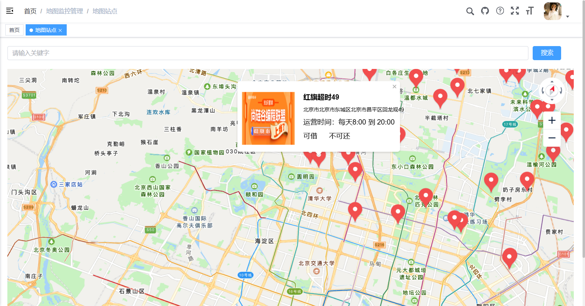

# 监控与规则管理
[TOC]

## 1、获取附近站点信息

在地图上显示中心点附近的站点信息，根据地图中心点，获取周围几公里的站点信息，MongoDB对应经纬度的查询具体很好的支持，因此我们可以把经纬度信息及关键信息保存到MongoDB中。



### 1.1、保存站点信息到MongoDB

#### 1.1.1、share-device-dev.yml

```yaml
spring:
  data:
    mongodb:
      host: 127.0.0.1
      port: 27017
      database: share #指定操作的数据库
```

#### 1.1.2、pom.xml

已引入就忽略

```xml
<dependency>
    <groupId>org.springframework.boot</groupId>
    <artifactId>spring-boot-starter-data-mongodb</artifactId>
</dependency>
```

#### 1.1.3、StationLocation

```java
package com.share.device.domain;

@Data
@Schema(description = "站点位置")
public class StationLocation
{

    @Schema(description = "id")
    @Id
    private String id;

    @Schema(description = "柜机id")
    private Long stationId;

    @Schema(description = "经纬度")
    private GeoJsonPoint location;

    @Schema(description = "创建时间")
    private Date createTime;
}
```

#### 1.1.4、StationLocationRepository

```
package com.share.device.repository;

@Repository
public interface StationLocationRepository extends MongoRepository<StationLocation, String> {

    StationLocation getByStationId(Long stationId);
}
```

#### 1.1.5、StationServiceImpl

同步添加与修改方法

```java
@Transactional(rollbackFor = Exception.class)
@Override
public int saveStation(Station station) {
    String provinceName = regionService.getNameByCode(station.getProvinceCode());
    String cityName = regionService.getNameByCode(station.getCityCode());
    String districtName = regionService.getNameByCode(station.getDistrictCode());
    station.setFullAddress(provinceName + cityName + districtName + station.getAddress());
    this.save(station);

    //同步站点位置信息到MongoDB
    StationLocation stationLocation = new StationLocation();
    stationLocation.setId(ObjectId.get().toString());
    stationLocation.setStationId(station.getId());
    stationLocation.setLocation(new GeoJsonPoint(station.getLongitude().doubleValue(), station.getLatitude().doubleValue()));
    stationLocation.setCreateTime(new Date());
    stationLocationRepository.save(stationLocation);
    return 1;
}

@Transactional(rollbackFor = Exception.class)
@Override
public int updateStation(Station station) {
    String provinceName = regionService.getNameByCode(station.getProvinceCode());
    String cityName = regionService.getNameByCode(station.getCityCode());
    String districtName = regionService.getNameByCode(station.getDistrictCode());
    station.setFullAddress(provinceName + cityName + districtName + station.getAddress());
    this.updateById(station);

    //同步站点位置信息到MongoDB
    StationLocation stationLocation = stationLocationRepository.getByStationId(station.getId());
    stationLocation.setLocation(new GeoJsonPoint(station.getLongitude().doubleValue(), station.getLatitude().doubleValue()));
    stationLocationRepository.save(stationLocation);
    return 1;
}
```

### 1.2、StationVo

封装页面显示的属性

```java
package com.share.device.domain;

@Data
@Schema(description = "站点")
public class StationVo
{

    @Schema(description = "站点ID")
    private Long id;

    /** 站点名称 */
    @Schema(description = "站点名称")
    private String name;

    /** 站点图片地址 */
    @Schema(description = "站点图片地址")
    private String imageUrl;

    /** 营业时间 */
    @Schema(description = "营业时间")
    private String businessHours;

    /** 经度 */
    @Schema(description = "经度")
    private BigDecimal longitude;

    /** 纬度 */
    @Schema(description = "纬度")
    private BigDecimal latitude;

    /** 完整地址 */
    @Schema(description = "完整地址")
    private String fullAddress;

    /** 状态（1是 0否） */
    @Schema(description = "是否可用")
    private String isUsable;

    /** 状态（1是 0否） */
    @Schema(description = "是否可还")
    private String isReturn;

    /** 距离 */
    @Schema(description = "距离")
    private Double distance;

    @Schema(description = "费用规则")
    private String feeRule;

}
```

### 1.3、DeviceController

```java
package com.share.device.controller;

@Tag(name = "设备接口管理")
@RestController
@RequestMapping("/device")
public class DeviceController extends BaseController
{

    @Autowired
    private IDeviceService deviceService;

    @Operation(summary = "获取附近站点信息列表")
    @GetMapping("/nearbyStationList/{latitude}/{longitude}")
    public AjaxResult nearbyStation(@PathVariable String latitude, @PathVariable String longitude)
    {
        return success(deviceService.nearbyStation(latitude, longitude, DeviceConstants.SEARCH_PC_RADIUS));
    }


}
```

### 1.4、IDeviceService

```java
package com.share.device.service;

public interface IDeviceService
{

    List<StationVo> nearbyStation(String latitude, String longitude, Integer radius);

}
```

### 1.5、DeviceServiceImpl

```java
package com.share.device.service.impl;

@Slf4j
@Service
@SuppressWarnings({"unchecked", "rawtypes"})
public class DeviceServiceImpl implements IDeviceService {

    @Autowired
    private IStationService stationService;

    @Autowired
    private ICabinetService cabinetService;

    @Autowired
    private MongoTemplate mongoTemplate;

    @Override
    public List<StationVo> nearbyStation(String latitude, String longitude, Integer radius) {
        //坐标，确定中心点
        // GeoJsonPoint(double x, double y) x 表示经度，y 表示纬度。
        GeoJsonPoint geoJsonPoint = new GeoJsonPoint(Double.parseDouble(longitude), Double.parseDouble(latitude));
        //画圈的半径,50km范围
        Distance d = new Distance(radius, Metrics.KILOMETERS);
        //画了一个圆圈
        Circle circle = new Circle(geoJsonPoint, d);
        //条件排除自己
        Query query = Query.query(Criteria.where("location").withinSphere(circle));
        List<StationLocation> stationLocationList = this.mongoTemplate.find(query, StationLocation.class);
        if (CollectionUtils.isEmpty(stationLocationList)) return null;

        //组装数据
        List<Long> stationIdList =stationLocationList.stream().map(StationLocation::getStationId).collect(Collectors.toList());
        //获取站点列表
        List<Station> stationList = stationService.list(new LambdaQueryWrapper<Station>().in(Station::getId, stationIdList).isNotNull(Station::getCabinetId));

        //获取柜机id列表
        List<Long> cabinetIdList = stationList.stream().map(Station::getCabinetId).collect(Collectors.toList());
        //获取柜机id与柜机信息Map
        Map<Long, Cabinet> cabinetIdToCabinetMap = cabinetService.listByIds(cabinetIdList).stream().collect(Collectors.toMap(Cabinet::getId, Cabinet -> Cabinet));

        List<StationVo> stationVoList = new ArrayList<>();
        stationList.forEach(item -> {
            StationVo stationVo = new StationVo();
            BeanUtils.copyProperties(item, stationVo);

            // 获取柜机信息
            Cabinet cabinet = cabinetIdToCabinetMap.get(item.getCabinetId());
            //可用充电宝数量大于0，可借用
            if(cabinet.getAvailableNum() > 0) {
                stationVo.setIsUsable("1");
            } else {
                stationVo.setIsUsable("0");
            }
            // 获取空闲插槽数量大于0，可归还
            if (cabinet.getFreeSlots() > 0) {
                stationVo.setIsReturn("1");
            } else {
                stationVo.setIsReturn("0");
            }

            stationVoList.add(stationVo);
        });
        return stationVoList;
    }

}
```

### 1.6、更新测试数据

将数据库数据更新到MongoDB

#### 1.6.1、StationController

```java
@Operation(summary = "更新初始化数据")
@GetMapping("/updateData")
public AjaxResult updateData()
{
    stationService.updateData();
    return success();
}
```

#### 1.6.2、IStationService

```
void updateData();
```

#### 1.6.3、StationServiceImpl

```java
@Override
public void updateData() {
    List<Station> stationList = this.list();
    for (Station station : stationList) {
        StationLocation stationLocation = stationLocationRepository.getByStationId(station.getId());
        if(stationLocation == null) {
            stationLocation = new StationLocation();
            stationLocation.setId(ObjectId.get().toString());
            stationLocation.setStationId(station.getId());
            stationLocation.setLocation(new GeoJsonPoint(station.getLongitude().doubleValue(), station.getLatitude().doubleValue()));
            stationLocation.setCreateTime(new Date());
            stationLocationRepository.save(stationLocation);
        }
    }
}
```


## 2、腾讯地图接口

站点信息会在腾讯地图上面显示，因此要开通腾讯位置服务；

监控页面根据关键字搜索，定位到地图的相关位置，需实现根据关键字获取经纬度信息；

### 2.1、开通腾讯位置服务

腾讯位置服务端API文档：https://lbs.qq.com/service/webService/webServiceGuide/webServiceOverview

#### 2.1.1、开通地图服务

开通地图服务，首先你要访问腾讯位置服务的官网（https://lbs.qq.com/），然后注册新用户并且登陆。


#### 2.1.2、创建应用

控制台 =》 应用管理 =》 我的应用 =》 创建应用

名字可以随便定义，类型选择“出行”，然后就能拿到地图应用的密钥了。这个密钥你保存好，后面我们要用到。


#### 2.1.3、配置应用

创建好应用之后，编辑应用，在弹窗中，把WebService设置成“域名白名单”，然后在弹窗底部还要填写你自己的小程序APPID才行。


#### 2.1.4、账号额度

腾讯位置服务给开发者提供了免费的调用额度，只要你每天调用位置服务各种API次数不超过限额，那么就是免费的，对于开发者来说是足够用了。如果我们的项目上线了，这点配额肯定不够用，那就需要出钱购买了。


### 2.2、封装接口

接口文档：https://lbs.qq.com/service/webService/webServiceGuide/address/Geocoder

#### 2.2.1、share-device-dev.yml

```yaml
tencent:
  map:
    key: PYOBZ-Y6ZRZ-HMZXP-ZTMES-****-****
```

#### 2.2.2、MapController

```java
package com.share.device.controller;

@Tag(name = "地图接口管理")
@RestController
@RequestMapping("/map")
public class MapController extends BaseController
{
    @Autowired
    private IMapService mapService;

    @Operation(summary = "根据经纬度计算详细地址")
    @GetMapping("/calculateLatLng/{keyword}")
    public AjaxResult calculateLatLng(@PathVariable String keyword)
    {
        return success(mapService.calculateLatLng(keyword));
    }

}
```

#### 2.2.3、IMapService

```java
package com.share.device.service;

public interface IMapService {

    JSONObject calculateLatLng(String keyword);

}
```

#### 2.2.4、MapServiceImpl

```java
package com.share.device.service.impl;

@Slf4j
@Service
@SuppressWarnings({"unchecked", "rawtypes"})
public class MapServiceImpl implements IMapService {

    @Autowired
    private RestTemplate restTemplate;

    @Value("${tencent.map.key}")
    private String key;

    @Override
    public JSONObject calculateLatLng(String keyword) {
        String url = "https://apis.map.qq.com/ws/geocoder/v1/?address={address}&key={key}";

        Map<String, String> map = new HashMap<>();
        map.put("address", keyword);
        map.put("key", key);

        JSONObject response = restTemplate.getForObject(url, JSONObject.class, map);
        if (response.getIntValue("status") != 0) {
            throw new ServiceException("地图解析异常");
        }

        //返回第一条最佳线路
        JSONObject result = response.getJSONObject("result");
        System.out.println(result.toJSONString());
        return result.getJSONObject("location");
    }

}
```

#### 2.2.5、ShareDeviceApplication

启动类配置RestTemplate

```java
@Bean
public RestTemplate restTemplate() {
    return new RestTemplate();
}
```


## 3、规则管理

先实现规则的增删改查，规则引擎后续讲解

### 3.1、搭建规则微服务模块

#### 3.1.1、新建share-rule模块

在share-modules模块下新建子模块share-rule

#### 3.1.2、pom.xml

```xml
<?xml version="1.0" encoding="UTF-8"?>
<project xmlns:xsi="http://www.w3.org/2001/XMLSchema-instance"
         xmlns="http://maven.apache.org/POM/4.0.0"
         xsi:schemaLocation="http://maven.apache.org/POM/4.0.0 http://maven.apache.org/xsd/maven-4.0.0.xsd">
    <parent>
        <groupId>com.share</groupId>
        <artifactId>share-modules</artifactId>
        <version>3.6.3</version>
    </parent>
    <modelVersion>4.0.0</modelVersion>

    <artifactId>share-rule</artifactId>

    <description>
        share-rule系统模块
    </description>

    <dependencies>
    	<!-- SpringCloud Alibaba Nacos -->
        <dependency>
            <groupId>com.alibaba.cloud</groupId>
            <artifactId>spring-cloud-starter-alibaba-nacos-discovery</artifactId>
        </dependency>

        <!-- SpringCloud Alibaba Nacos Config -->
        <dependency>
            <groupId>com.alibaba.cloud</groupId>
            <artifactId>spring-cloud-starter-alibaba-nacos-config</artifactId>
        </dependency>

    	<!-- SpringCloud Alibaba Sentinel -->
        <dependency>
            <groupId>com.alibaba.cloud</groupId>
            <artifactId>spring-cloud-starter-alibaba-sentinel</artifactId>
        </dependency>

    	<!-- SpringBoot Actuator -->
        <dependency>
            <groupId>org.springframework.boot</groupId>
            <artifactId>spring-boot-starter-actuator</artifactId>
        </dependency>

        <!-- Mysql Connector -->
        <dependency>
            <groupId>com.mysql</groupId>
            <artifactId>mysql-connector-j</artifactId>
        </dependency>

        <!-- RuoYi Common DataSource -->
<!--        <dependency>-->
<!--            <groupId>com.share</groupId>-->
<!--            <artifactId>share-common-datasource</artifactId>-->
<!--        </dependency>-->

        <!-- RuoYi Common DataScope -->
        <dependency>
            <groupId>com.share</groupId>
            <artifactId>share-common-datascope</artifactId>
        </dependency>

        <!-- RuoYi Common Log -->
        <dependency>
            <groupId>com.share</groupId>
            <artifactId>share-common-log</artifactId>
        </dependency>

    </dependencies>

    <build>
        <finalName>${project.artifactId}</finalName>
        <plugins>
            <plugin>
                <groupId>org.springframework.boot</groupId>
                <artifactId>spring-boot-maven-plugin</artifactId>
                <executions>
                    <execution>
                        <goals>
                            <goal>repackage</goal>
                        </goals>
                    </execution>
                </executions>
            </plugin>
            <plugin>
                <groupId>org.apache.maven.plugins</groupId>
                <artifactId>maven-compiler-plugin</artifactId>
                <configuration>
                    <source>17</source>
                    <target>17</target>
                </configuration>
            </plugin>
        </plugins>
    </build>

</project>
```

#### 3.1.3、banner.txt

在resources目录下新建banner.txt

```text
Spring Boot Version: ${spring-boot.version}
Spring Application Name: ${spring.application.name}
                            _                           _                    
                           (_)                         | |                   
 _ __  _   _   ___   _   _  _  ______  ___  _   _  ___ | |_   ___  _ __ ___  
| '__|| | | | / _ \ | | | || ||______|/ __|| | | |/ __|| __| / _ \| '_ ` _ \ 
| |   | |_| || (_) || |_| || |        \__ \| |_| |\__ \| |_ |  __/| | | | | |
|_|    \__,_| \___/  \__, ||_|        |___/ \__, ||___/ \__| \___||_| |_| |_|
                      __/ |                  __/ |                           
                     |___/                  |___/                            
```

#### 3.1.4、bootstrap.yml

在resources目录下新建bootstrap.yml

```yaml
# Tomcat
server:
  port: 9208

# Spring
spring:
  application:
    # 应用名称
    name: share-rule
  profiles:
    # 环境配置
    active: dev
  main:
    allow-bean-definition-overriding: true #当遇到同样名字的时候，是否允许覆盖注册
  cloud:
    nacos:
      discovery:
        # 服务注册地址
        server-addr: 127.0.0.1:8848
      config:
        # 配置中心地址
        server-addr: 127.0.0.1:8848
        # 配置文件格式
        file-extension: yml
        # 共享配置
        shared-configs:
          - application-${spring.profiles.active}.${spring.cloud.nacos.config.file-extension}
```

#### 3.1.5、share-rule-dev.yml

在nacos上添加商品服务配置文件

```yaml
mybatis-plus:
  mapper-locations: classpath*:mapper/**/*Mapper.xml
  type-aliases-package: com.share.**.domain
  configuration:
    log-impl: org.apache.ibatis.logging.stdout.StdOutImpl # 查看日志
  global-config:
    db-config:
      logic-delete-field: del_flag # 全局逻辑删除的实体字段名
      logic-delete-value: 2 # 逻辑已删除值(默认为 1)
      logic-not-delete-value: 0 # 逻辑未删除值(默认为 0)
# spring配置
spring:
  data:
    redis:
      host: localhost
      port: 6379
      password:
  datasource:
    type: com.zaxxer.hikari.HikariDataSource
    driver-class-name: com.mysql.cj.jdbc.Driver
    url: jdbc:mysql://localhost:3306/share-rule?characterEncoding=utf-8&useSSL=false
    username: root
    password: root
    hikari:
      connection-test-query: SELECT 1
      connection-timeout: 60000
      idle-timeout: 500000
      max-lifetime: 540000
      maximum-pool-size: 10
      minimum-idle: 5
      pool-name: GuliHikariPool
```

#### 3.1.6、logback.xml

在resources目录下新建logback.xml

```xml
<?xml version="1.0" encoding="UTF-8"?>
<configuration scan="true" scanPeriod="60 seconds" debug="false">
    <!-- 日志存放路径 -->
   <property name="log.path" value="logs/share-rule" />
   <!-- 日志输出格式 -->
   <property name="log.pattern" value="%d{HH:mm:ss.SSS} [%thread] %-5level %logger{20} - [%method,%line] - %msg%n" />

    <!-- 控制台输出 -->
   <appender name="console" class="ch.qos.logback.core.ConsoleAppender">
      <encoder>
         <pattern>${log.pattern}</pattern>
      </encoder>
   </appender>

    <!-- 系统日志输出 -->
   <appender name="file_info" class="ch.qos.logback.core.rolling.RollingFileAppender">
       <file>${log.path}/info.log</file>
        <!-- 循环政策：基于时间创建日志文件 -->
      <rollingPolicy class="ch.qos.logback.core.rolling.TimeBasedRollingPolicy">
            <!-- 日志文件名格式 -->
         <fileNamePattern>${log.path}/info.%d{yyyy-MM-dd}.log</fileNamePattern>
         <!-- 日志最大的历史 60天 -->
         <maxHistory>60</maxHistory>
      </rollingPolicy>
      <encoder>
         <pattern>${log.pattern}</pattern>
      </encoder>
      <filter class="ch.qos.logback.classic.filter.LevelFilter">
            <!-- 过滤的级别 -->
            <level>INFO</level>
            <!-- 匹配时的操作：接收（记录） -->
            <onMatch>ACCEPT</onMatch>
            <!-- 不匹配时的操作：拒绝（不记录） -->
            <onMismatch>DENY</onMismatch>
        </filter>
   </appender>

    <appender name="file_error" class="ch.qos.logback.core.rolling.RollingFileAppender">
       <file>${log.path}/error.log</file>
        <!-- 循环政策：基于时间创建日志文件 -->
        <rollingPolicy class="ch.qos.logback.core.rolling.TimeBasedRollingPolicy">
            <!-- 日志文件名格式 -->
            <fileNamePattern>${log.path}/error.%d{yyyy-MM-dd}.log</fileNamePattern>
         <!-- 日志最大的历史 60天 -->
         <maxHistory>60</maxHistory>
        </rollingPolicy>
        <encoder>
            <pattern>${log.pattern}</pattern>
        </encoder>
        <filter class="ch.qos.logback.classic.filter.LevelFilter">
            <!-- 过滤的级别 -->
            <level>ERROR</level>
         <!-- 匹配时的操作：接收（记录） -->
            <onMatch>ACCEPT</onMatch>
         <!-- 不匹配时的操作：拒绝（不记录） -->
            <onMismatch>DENY</onMismatch>
        </filter>
    </appender>

    <!-- 系统模块日志级别控制  -->
   <logger name="com.share" level="info" />
   <!-- Spring日志级别控制  -->
   <logger name="org.springframework" level="warn" />

   <root level="info">
      <appender-ref ref="console" />
   </root>

   <!--系统操作日志-->
    <root level="info">
        <appender-ref ref="file_info" />
        <appender-ref ref="file_error" />
    </root>
</configuration>
```

#### 3.1.7、ShareRuleApplication

添加启动类

```java
package com.share.device;

/**
 * 规则模块
 *
 * @author share
 */
@EnableCustomConfig
@EnableRyFeignClients
@SpringBootApplication
public class SpzxRuleApplication
{
    public static void main(String[] args)
    {
        SpringApplication.run(SpzxRuleApplication.class, args);
        System.out.println("(♥◠‿◠)ﾉﾞ  规则模块启动成功   ლ(´ڡ`ლ)ﾞ  \n" +
                " .-------.       ____     __        \n" +
                " |  _ _   \\      \\   \\   /  /    \n" +
                " | ( ' )  |       \\  _. /  '       \n" +
                " |(_ o _) /        _( )_ .'         \n" +
                " | (_,_).' __  ___(_ o _)'          \n" +
                " |  |\\ \\  |  ||   |(_,_)'         \n" +
                " |  | \\ `'   /|   `-'  /           \n" +
                " |  |  \\    /  \\      /           \n" +
                " ''-'   `'-'    `-..-'              ");
    }

}
```

### 3.2、增删改查接口

#### 3.2.1、FeeRule

```java
package com.share.rules.domain;

@Data
@Schema(description = "费用规则")
public class FeeRule extends BaseEntity
{
    private static final long serialVersionUID = 1L;

    /** 规则名称 */
    @Schema(description = "规则名称")
    private String name;

    /** 规则代码 */
    @Schema(description = "规则代码")
    private String rule;

    /** 规则描述 */
    @Schema(description = "规则描述")
    private String description;

    /** 状态代码，1有效，2关闭 */
    @Schema(description = "状态代码，1有效，2关闭")
    private String status;

}
```

#### 3.2.2、FeeRuleController

```java
package com.share.rules.controller;

@Tag(name = "费用规则接口管理")
@RestController
@RequestMapping("/feeRule")
public class FeeRuleController extends BaseController
{
    @Autowired
    private IFeeRuleService feeRuleService;

    /**
     * 查询费用规则列表
     */
    @Operation(summary = "查询费用规则列表")
    @GetMapping("/list")
    public TableDataInfo list(FeeRule feeRule)
    {
        startPage();
        List<FeeRule> list = feeRuleService.selectFeeRuleList(feeRule);
        return getDataTable(list);
    }

    /**
     * 获取费用规则详细信息
     */
    @Operation(summary = "获取费用规则详细信息")
    @GetMapping(value = "/{id}")
    public AjaxResult getInfo(@PathVariable("id") Long id)
    {
        return success(feeRuleService.getById(id));
    }

    /**
     * 新增费用规则
     */
    @Operation(summary = "新增费用规则")
    @PostMapping
    public AjaxResult add(@RequestBody FeeRule feeRule)
    {
        return toAjax(feeRuleService.save(feeRule));
    }

    /**
     * 修改费用规则
     */
    @Operation(summary = "修改费用规则")
    @PutMapping
    public AjaxResult edit(@RequestBody FeeRule feeRule)
    {
        //return toAjax(feeRuleService.updateById(feeRule));
        System.out.println(JSON.toJSONString(feeRule));
        return toAjax(1);
    }

    /**
     * 删除费用规则
     */
    @Operation(summary = "删除费用规则")
    @DeleteMapping("/{ids}")
    public AjaxResult remove(@PathVariable Long[] ids)
    {
        return toAjax(feeRuleService.removeBatchByIds(Arrays.asList(ids)));
    }

    @Operation(summary = "获取全部费用规则")
    @GetMapping("/getALLFeeRuleList")
    public AjaxResult getALLFeeRuleList()
    {
        return success(feeRuleService.getALLFeeRuleList());
    }

}
```

#### 3.2.3、IFeeRuleService

```java
package com.share.rules.service;

public interface IFeeRuleService extends IService<FeeRule> {

   
    public List<FeeRule> selectFeeRuleList(FeeRule feeRule);

    List<FeeRule> getALLFeeRuleList();

}
```

#### 3.2.4、FeeRuleServiceImpl

```java
package com.share.rules.service.impl;

@Slf4j
@Service
public class FeeRuleServiceImpl extends ServiceImpl<FeeRuleMapper, FeeRule> implements IFeeRuleService
{
    @Autowired
    private FeeRuleMapper feeRuleMapper;

    
    @Override
    public List<FeeRule> selectFeeRuleList(FeeRule feeRule)
    {
        return feeRuleMapper.selectFeeRuleList(feeRule);
    }

    @Override
    public List<FeeRule> getALLFeeRuleList() {
        return feeRuleMapper.selectList(new LambdaQueryWrapper<FeeRule>().eq(FeeRule::getStatus, "1"));
    }

}
```

#### 3.2.5、FeeRuleMapper

```java
package com.share.rules.mapper;


public interface FeeRuleMapper extends BaseMapper<FeeRule> {

    public List<FeeRule> selectFeeRuleList(FeeRule feeRule);

}
```

#### 3.2.6、FeeRuleMapper.xml

```xml
<?xml version="1.0" encoding="UTF-8" ?>
<!DOCTYPE mapper
        PUBLIC "-//mybatis.org//DTD Mapper 3.0//EN"
        "http://mybatis.org/dtd/mybatis-3-mapper.dtd">
<mapper namespace="com.share.rules.mapper.FeeRuleMapper">

    <resultMap type="FeeRule" id="FeeRuleResult" autoMapping="true">
    </resultMap>

    <sql id="selectFeeRuleVo">
        select id, name, rule, description, status, create_time, create_by, update_time, update_by, del_flag, remark from fee_rule
    </sql>

    <select id="selectFeeRuleList" parameterType="FeeRule" resultMap="FeeRuleResult">
        <include refid="selectFeeRuleVo"/>
        <where>
            <if test="name != null  and name != ''"> and name like concat('%', #{name}, '%')</if>
            <if test="status != null  and status != ''"> and status = #{status}</if>
            and del_flag = 0
        </where>
    </select>

</mapper>
```