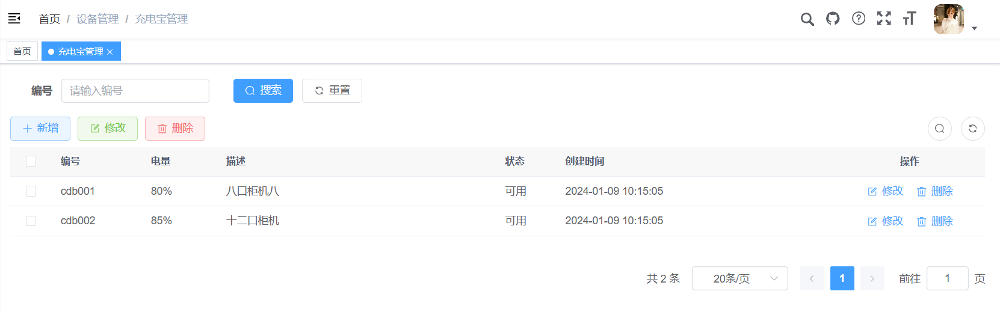

# 柜机类型与充电宝管理
[TOC]

## 1、柜机类型

### 1.1、前期准备

1、启动nacos

2、启动微服务模块：

```tex
share-gateway、share-auth、share-system、share-device
```

3、配置商品微服务模块网关：

在nacos配置中心：share-gateway-dev.yml文件添加设备服务的路由配置信息

```yaml
        # 设备服务
        - id: share-device
          uri: lb://share-device
          predicates:
            - Path=/device/**
          filters:
            - StripPrefix=1
        # 规则服务
        - id: share-rule
          uri: lb://share-rule
          predicates:
            - Path=/rule/**
          filters:
            - StripPrefix=1
```

4、进入share-ui目录启动前端项目：

```shell
yarn dev
```

5、登录前端项目

http://localhost/login?redirect=/index

### 1.2、添加动态菜单

设备管理 =》 柜机类型

设备管理


柜机类型


### 1.3、静态页面制作

对比如下页面结构，使用Element Plus制作出对应的页面，数据可以暂时使用假数据。

Element-Plus组件地址：https://element-plus.gitee.io/zh-CN/component/button.html

页面效果如下：


该页面可以将其分为4部分：

1、搜索表单：柜机类型名称

​	Form 表单组件：https://element-plus.gitee.io/zh-CN/component/form.html

2、功能按钮栏：新增、修改与删除

​	Layout 布局组件：https://element-plus.gitee.io/zh-CN/component/layout.html

​	Button 按钮组件：https://element-plus.gitee.io/zh-CN/component/button.html

3、数据展示表格

​	Table 表格组件：https://element-plus.gitee.io/zh-CN/component/table.html

4、分页条组件

​	Pagination 分页组件：https://element-plus.gitee.io/zh-CN/component/pagination.html

创建views/device/cabinetType/index.vue文件：

```vue
<template>
  <div class="app-container">

    <!-- 搜索表单 -->
    <el-form ref="queryRef" :inline="true" label-width="68px">
      <el-form-item label="名称" prop="name">
        <el-input
            placeholder="请输入名称"
            clearable
        />
      </el-form-item>
      <el-form-item>
        <el-button type="primary" icon="Search">搜索</el-button>
        <el-button icon="Refresh">重置</el-button>
      </el-form-item>
    </el-form>

    <!-- 功能按钮栏 -->
    <el-row :gutter="10" class="mb8">
      <el-col :span="1.5">
        <el-button
            type="primary"
            plain
            icon="Plus"
        >新增</el-button>
      </el-col>
      <el-col :span="1.5">
        <el-button
            type="success"
            plain
            icon="Edit"
        >修改</el-button>
      </el-col>
      <el-col :span="1.5">
        <el-button
            type="danger"
            plain
            icon="Delete"
        >删除</el-button>
      </el-col>
    </el-row>

    <!-- 数据展示表格 -->
    <el-table :data="cabinetTypeList">
      <el-table-column type="selection" width="55" align="center" />
      <el-table-column label="名称" prop="name" width="150"/>
      <el-table-column label="总插槽数量" prop="totalSlots" width="110"/>
      <el-table-column label="描述" prop="description" />
      <el-table-column label="状态" prop="status" width="100">
        <template #default="scope">
          {{ scope.row.status == '1' ? '正常' : '停用' }}
        </template>
      </el-table-column>
      <el-table-column prop="createTime" label="创建时间" />
      <el-table-column label="操作" align="center" class-name="small-padding fixed-width">
        <template #default="scope">
          <el-button link type="primary" icon="Edit">修改</el-button>
          <el-button link type="primary" icon="Delete">删除</el-button>
        </template>
      </el-table-column>
    </el-table>

    <!-- 分页条组件 -->
    <pagination
        v-show="total > 0"
        :total="total"
    />

  </div>
</template>

<script setup name="CabinetType">

//定义分页列表数据模型
const cabinetTypeList = ref([
  {
    "id": 1,
    "name": "八口柜机",
    "totalSlots": 8,
    "description": "八口柜机八",
    "status": "1",
    "createTime": "2024-01-09 10:15:05"
  },
  {
    "id": 1,
    "name": "十二口柜机",
    "totalSlots": 12,
    "description": "十二口柜机",
    "status": "1",
    "createTime": "2024-01-09 10:15:05"
  }
]);
//定义列表总记录数模型
const total = ref(2);
</script>
```

### 1.4、分页列表

接下来我们实现分页列表数据动态渲染

#### 1.4.1、定义api接口

在api目录下创建一个device/cabinetType.js文件，定义分页列表的接口

```js
import request from '@/utils/request'

// 查询柜机类型列表
export function listCabinetType(query) {
  return request({
    url: '/device/cabinetType/list',
    method: 'get',
    params: query
  })
}
```

#### 1.4.2、页面数据渲染

更改views/device/cabinetType/index.vue文件
列表Loading 加载组件：https://element-plus.gitee.io/zh-CN/component/loading.html

v-loading="loading"

```vue
<template>
  <div class="app-container">

    <!-- 搜索表单 -->
    <el-form ref="queryRef" :inline="true" label-width="68px">
      <el-form-item label="名称" prop="name">
        <el-input
            placeholder="请输入名称"
            clearable
        />
      </el-form-item>
      <el-form-item>
        <el-button type="primary" icon="Search">搜索</el-button>
        <el-button icon="Refresh">重置</el-button>
      </el-form-item>
    </el-form>

    <!-- 功能按钮栏 -->
    <el-row :gutter="10" class="mb8">
      <el-col :span="1.5">
        <el-button
            type="primary"
            plain
            icon="Plus"
        >新增</el-button>
      </el-col>
      <el-col :span="1.5">
        <el-button
            type="success"
            plain
            icon="Edit"
        >修改</el-button>
      </el-col>
      <el-col :span="1.5">
        <el-button
            type="danger"
            plain
            icon="Delete"
        >删除</el-button>
      </el-col>
    </el-row>

    <!-- 数据展示表格 -->
    <el-table v-loading="loading" :data="cabinetTypeList">
      <el-table-column type="selection" width="55" align="center" />
      <el-table-column label="名称" prop="name" width="150"/>
      <el-table-column label="总插槽数量" prop="totalSlots" width="110"/>
      <el-table-column label="描述" prop="description" />
      <el-table-column label="状态" prop="status" width="100">
        <template #default="scope">
          {{ scope.row.status == '1' ? '正常' : '停用' }}
        </template>
      </el-table-column>
      <el-table-column prop="createTime" label="创建时间" />
      <el-table-column label="操作" align="center" class-name="small-padding fixed-width">
        <template #default="scope">
          <el-button link type="primary" icon="Edit">修改</el-button>
          <el-button link type="primary" icon="Delete">删除</el-button>
        </template>
      </el-table-column>
    </el-table>

    <!-- 分页条组件 -->
    <pagination
        v-show="total>0"
        :total="total"
        v-model:page="queryParams.pageNum"
        v-model:limit="queryParams.pageSize"
        @pagination="getList"
    />

  </div>
</template>

<script setup name="CabinetType">
//引入api接口
import { listCabinetType } from "@/api/device/cabinetType";

//定义分页列表数据模型
const cabinetTypeList = ref([]);
//定义列表总记录数模型
const total = ref(0);
//加载数据时显示的动效控制模型
const loading = ref(true);

//Vue 3 中的两种响应式数据绑定方式：reactive 和 ref
//ref定义：基本数据类型，适用于简单的响应式数据
//reactive定义：对象（或数组）数据类型，则适用于复杂对象或数组的响应式数据
const data = reactive({
  //定义搜索模型
  queryParams: {
    pageNum: 1,
    pageSize: 10
  }
});
//toRefs 是一个Vue3中提供的API，可将一个响应式对象转换为普通对象，其中属性变成了对原始对象属性的引用
const { queryParams } = toRefs(data);

/** 查询柜机类型列表 */
function getList() {
  loading.value = true;
  listCabinetType(queryParams.value).then(response => {
    cabinetTypeList.value = response.rows;
    total.value = response.total;
    loading.value = false;
  });
}

//执行查询柜机类型列表
getList()
</script>
```

### 1.5、搜索和重置

#### 1.5.1、定义搜索数据模型

补充搜索模型字段：柜机类型名称

```js
const data = reactive({
  //定义搜索模型
  queryParams: {
    ...
    name: null
  }
});
```

#### 1.5.2、绑定页面模型

完善搜索页面

```vue
<el-form ref="queryRef" :inline="true" label-width="68px">
    <el-form-item label="名称" prop="name">
        <el-input
                  v-model="queryParams.name"
                  placeholder="请输入名称"
                  clearable
                  />
    </el-form-item>
    <el-form-item>
        <el-button type="primary" icon="Search" @click="handleQuery">搜索</el-button>
        <el-button icon="Refresh" @click="resetQuery">重置</el-button>
    </el-form-item>
</el-form>
```

#### 1.5.3、定义js方法

```js
/** 搜索按钮操作 */
function handleQuery() {
  getList();
}

/** 重置按钮操作 */
function resetQuery() {
  queryParams.value.pageNum = 1
  queryParams.value.pageSize = 10
  queryParams.value.name = null
  handleQuery();
}
```

#### 1.5.4、完整代码

```vue
<template>
  <div class="app-container">

    <!-- 搜索表单 -->
    <el-form ref="queryRef" :inline="true" label-width="68px">
      <el-form-item label="名称" prop="name">
        <el-input
            v-model="queryParams.name"
            placeholder="请输入名称"
            clearable
        />
      </el-form-item>
      <el-form-item>
        <el-button type="primary" icon="Search" @click="handleQuery">搜索</el-button>
        <el-button icon="Refresh" @click="resetQuery">重置</el-button>
      </el-form-item>
    </el-form>

    <!-- 功能按钮栏 -->
    <el-row :gutter="10" class="mb8">
      <el-col :span="1.5">
        <el-button
            type="primary"
            plain
            icon="Plus"
        >新增</el-button>
      </el-col>
      <el-col :span="1.5">
        <el-button
            type="success"
            plain
            icon="Edit"
        >修改</el-button>
      </el-col>
      <el-col :span="1.5">
        <el-button
            type="danger"
            plain
            icon="Delete"
        >删除</el-button>
      </el-col>
    </el-row>

    <!-- 数据展示表格 -->
    <el-table v-loading="loading" :data="cabinetTypeList">
      <el-table-column type="selection" width="55" align="center" />
      <el-table-column label="名称" prop="name" width="150"/>
      <el-table-column label="总插槽数量" prop="totalSlots" width="110"/>
      <el-table-column label="描述" prop="description" />
      <el-table-column label="状态" prop="status" width="100">
        <template #default="scope">
          {{ scope.row.status == '1' ? '正常' : '停用' }}
        </template>
      </el-table-column>
      <el-table-column prop="createTime" label="创建时间" />
      <el-table-column label="操作" align="center" class-name="small-padding fixed-width">
        <template #default="scope">
          <el-button link type="primary" icon="Edit">修改</el-button>
          <el-button link type="primary" icon="Delete">删除</el-button>
        </template>
      </el-table-column>
    </el-table>

    <!-- 分页条组件 -->
    <pagination
        v-show="total>0"
        :total="total"
        v-model:page="queryParams.pageNum"
        v-model:limit="queryParams.pageSize"
        @pagination="getList"
    />

  </div>
</template>

<script setup name="CabinetType">
//引入api接口
import { listCabinetType } from "@/api/device/cabinetType";

//定义分页列表数据模型
const cabinetTypeList = ref([]);
//定义列表总记录数模型
const total = ref(0);
//加载数据时显示的动效控制模型
const loading = ref(true);

//Vue 3 中的两种响应式数据绑定方式：reactive 和 ref
//ref定义：基本数据类型，适用于简单的响应式数据
//reactive定义：对象（或数组）数据类型，则适用于复杂对象或数组的响应式数据
const data = reactive({
  //定义搜索模型
  queryParams: {
    pageNum: 1,
    pageSize: 10,
    name: null
  }
});
//toRefs 是一个Vue3中提供的API，可将一个响应式对象转换为普通对象，其中属性变成了对原始对象属性的引用
const { queryParams } = toRefs(data);

/** 查询柜机类型列表 */
function getList() {
  loading.value = true;
  listCabinetType(queryParams.value).then(response => {
    cabinetTypeList.value = response.rows;
    total.value = response.total;
    loading.value = false;
  });
}

/** 搜索按钮操作 */
function handleQuery() {
  getList();
}

/** 重置按钮操作 */
function resetQuery() {
  queryParams.value.pageNum = 1
  queryParams.value.pageSize = 10
  queryParams.value.name = null
  handleQuery();
}

//执行查询柜机类型列表
getList()
</script>
```

### 1.6、新增

#### 1.6.1、定义新增弹出层页面

1、对话框代码

```vue
<el-dialog :title="title" v-model="open" width="600px" append-to-body>
  <el-form ref="cabinetTypeRef" :model="form" :rules="rules" label-width="120px">
    <el-form-item label="名称" prop="name">
      <el-input v-model="form.name" placeholder="请输入名称" />
    </el-form-item>
    <el-form-item label="总插槽数量" prop="totalSlots">
      <el-select
          v-model="form.totalSlots"
          class="m-2"
          placeholder="请选择总插槽数量"
          style="width: 100%"
      >
        <el-option
            v-for="item in 20"
            :key="item"
            :label="item"
            :value="item"
        />
      </el-select>
    </el-form-item>
    <el-form-item label="描述" prop="description">
      <el-input v-model="form.description" type="textarea" placeholder="请输入内容" />
    </el-form-item>
  </el-form>
  <template #footer>
    <div class="dialog-footer">
      <el-button type="primary" @click="submitForm">确 定</el-button>
      <el-button @click="cancel">取 消</el-button>
    </div>
  </template>
</el-dialog>
```

2、数据模型

```js
const open = ref(false);
const title = ref("");

const data = reactive({
 ...

  form: {}
});
//toRefs 是一个Vue3中提供的API，可将一个响应式对象转换为普通对象，其中属性变成了对原始对象属性的引用
const { ..., form } = toRefs(data);
```

3、js方法

```js
// 表单重置
function reset() {
  form.value = {
    id: null,
    name: null,
    totalSlots: null,
    description: null,
    status: null,
    remark: null
  };
}

// 新增按钮操作 
function handleAdd() {
  reset();
  open.value = true;
  title.value = "添加柜机类型";
}
```

4、新增按钮添加绑定事件

```vue
<el-button
    type="primary"
    @click="handleAdd"
    plain
    icon="Plus"
>新增</el-button>
```

#### 1.6.2、定义新增api接口

在device/cabinetType.js文件，定义新增接口

```js
export function addCabinetType(data) {
  return request({
    url: '/device/cabinetType',
    method: 'post',
    data: data
  })
}
```

vue页面引入接口方法

```js
import { listCabinetType,addCabinetType } from "@/api/device/cabinetType";
```

#### 1.6.3、提交与取消

Message 消息提示组件：https://element-plus.gitee.io/zh-CN/component/message.html

```js
// 取消按钮
function cancel() {
  open.value = false;
  reset();
}

// 提交按钮
function submitForm() {
  addCabinetType(form.value).then(response => {
    ElMessage.success("新增成功")
    open.value = false;
    getList();
  });
}
```

#### 1.6.4、完整代码

```vue
<template>
  <div class="app-container">

    <!-- 搜索表单 -->
    <el-form ref="queryRef" :inline="true" label-width="68px">
      <el-form-item label="名称" prop="name">
        <el-input
            v-model="queryParams.name"
            placeholder="请输入名称"
            clearable
        />
      </el-form-item>
      <el-form-item>
        <el-button type="primary" icon="Search" @click="handleQuery">搜索</el-button>
        <el-button icon="Refresh" @click="resetQuery">重置</el-button>
      </el-form-item>
    </el-form>

    <!-- 功能按钮栏 -->
    <el-row :gutter="10" class="mb8">
      <el-col :span="1.5">
        <el-button
            type="primary"
            @click="handleAdd"
            plain
            icon="Plus"
        >新增</el-button>
      </el-col>
      <el-col :span="1.5">
        <el-button
            type="success"
            plain
            icon="Edit"
        >修改</el-button>
      </el-col>
      <el-col :span="1.5">
        <el-button
            type="danger"
            plain
            icon="Delete"
        >删除</el-button>
      </el-col>
    </el-row>

    <!-- 数据展示表格 -->
    <el-table v-loading="loading" :data="cabinetTypeList">
      <el-table-column type="selection" width="55" align="center" />
      <el-table-column label="名称" prop="name" width="150"/>
      <el-table-column label="总插槽数量" prop="totalSlots" width="110"/>
      <el-table-column label="描述" prop="description" />
      <el-table-column label="状态" prop="status" width="100">
        <template #default="scope">
          {{ scope.row.status == '1' ? '正常' : '停用' }}
        </template>
      </el-table-column>
      <el-table-column prop="createTime" label="创建时间" />
      <el-table-column label="操作" align="center" class-name="small-padding fixed-width">
        <template #default="scope">
          <el-button link type="primary" icon="Edit">修改</el-button>
          <el-button link type="primary" icon="Delete">删除</el-button>
        </template>
      </el-table-column>
    </el-table>

    <!-- 分页条组件 -->
    <pagination
        v-show="total>0"
        :total="total"
        v-model:page="queryParams.pageNum"
        v-model:limit="queryParams.pageSize"
        @pagination="getList"
    />

    <el-dialog :title="title" v-model="open" width="600px" append-to-body>
      <el-form ref="cabinetTypeRef" :model="form" :rules="rules" label-width="120px">
        <el-form-item label="名称" prop="name">
          <el-input v-model="form.name" placeholder="请输入名称" />
        </el-form-item>
        <el-form-item label="总插槽数量" prop="totalSlots">
          <el-select
              v-model="form.totalSlots"
              class="m-2"
              placeholder="请选择总插槽数量"
              style="width: 100%"
          >
            <el-option
                v-for="item in 20"
                :key="item"
                :label="item"
                :value="item"
            />
          </el-select>
        </el-form-item>
        <el-form-item label="描述" prop="description">
          <el-input v-model="form.description" type="textarea" placeholder="请输入内容" />
        </el-form-item>
      </el-form>
      <template #footer>
        <div class="dialog-footer">
          <el-button type="primary" @click="submitForm">确 定</el-button>
          <el-button @click="cancel">取 消</el-button>
        </div>
      </template>
    </el-dialog>
  </div>
</template>

<script setup name="CabinetType">
//引入api接口
import { listCabinetType,addCabinetType } from "@/api/device/cabinetType";
//引入ElMessage组件
import {ElMessage} from "element-plus";

//定义分页列表数据模型
const cabinetTypeList = ref([]);
//定义列表总记录数模型
const total = ref(0);
//加载数据时显示的动效控制模型
const loading = ref(true);
const open = ref(false);
const title = ref("");

//Vue 3 中的两种响应式数据绑定方式：reactive 和 ref
//ref定义：基本数据类型，适用于简单的响应式数据
//reactive定义：对象（或数组）数据类型，则适用于复杂对象或数组的响应式数据
const data = reactive({
  //定义搜索模型
  queryParams: {
    pageNum: 1,
    pageSize: 10,
    name: null
  },

  form: {}
});
//toRefs 是一个Vue3中提供的API，可将一个响应式对象转换为普通对象，其中属性变成了对原始对象属性的引用
const { queryParams, form } = toRefs(data);

/** 查询柜机类型列表 */
function getList() {
  loading.value = true;
  listCabinetType(queryParams.value).then(response => {
    cabinetTypeList.value = response.rows;
    total.value = response.total;
    loading.value = false;
  });
}

/** 搜索按钮操作 */
function handleQuery() {
  getList();
}

/** 重置按钮操作 */
function resetQuery() {
  queryParams.value.pageNum = 1
  queryParams.value.pageSize = 10
  queryParams.value.name = null
  handleQuery();
}

// 表单重置
function reset() {
  form.value = {
    id: null,
    name: null,
    totalSlots: null,
    description: null,
    status: null,
    remark: null
  };
}

// 新增按钮操作
function handleAdd() {
  reset();
  open.value = true;
  title.value = "添加柜机类型";
}

// 取消按钮
function cancel() {
  open.value = false;
  reset();
}

// 提交按钮
function submitForm() {
  addCabinetType(form.value).then(response => {
    ElMessage.success("新增成功")
    open.value = false;
    getList();
  });
}

//执行查询柜机类型列表
getList()
</script>
```

### 1.7、修改

修改与新增使用的相同的弹出层

#### 1.7.1、定义api接口

定义接口

```js
// 查询柜机类型详细
export function getCabinetType(id) {
  return request({
    url: '/device/cabinetType/' + id,
    method: 'get'
  })
}

// 修改柜机类型
export function updateCabinetType(data) {
  return request({
    url: '/device/cabinetType',
    method: 'put',
    data: data
  })
}
```

#### 1.7.2、js处理方法

提交数据，根据form对象是否有id值判断新增还是修改

```js
import { ..., getCabinetType, updateCabinetType } from "@/api/device/cabinetType";

// 修改按钮操作
function handleUpdate(row) {
  reset();
  const _id = row.id
  getCabinetType(_id).then(response => {
    form.value = response.data;
    open.value = true;
    title.value = "修改柜机类型";
  });
}

// 提交按钮
function submitForm() {
  if (form.value.id != null) {
    updateCabinetType(form.value).then(response => {
      ElMessage.success("修改成功");
      open.value = false;
      getList();
    });
  } else {
    addCabinetType(form.value).then(response => {
      ElMessage.success("新增成功")
      open.value = false;
      getList();
    });
  }
}
```

#### 1.7.3、完整代码

```vue
<template>
  <div class="app-container">

    <!-- 搜索表单 -->
    <el-form ref="queryRef" :inline="true" label-width="68px">
      <el-form-item label="名称" prop="name">
        <el-input
            v-model="queryParams.name"
            placeholder="请输入名称"
            clearable
        />
      </el-form-item>
      <el-form-item>
        <el-button type="primary" icon="Search" @click="handleQuery">搜索</el-button>
        <el-button icon="Refresh" @click="resetQuery">重置</el-button>
      </el-form-item>
    </el-form>

    <!-- 功能按钮栏 -->
    <el-row :gutter="10" class="mb8">
      <el-col :span="1.5">
        <el-button
            type="primary"
            @click="handleAdd"
            plain
            icon="Plus"
        >新增</el-button>
      </el-col>
      <el-col :span="1.5">
        <el-button
            type="success"
            plain
            icon="Edit"
        >修改</el-button>
      </el-col>
      <el-col :span="1.5">
        <el-button
            type="danger"
            plain
            icon="Delete"
        >删除</el-button>
      </el-col>
    </el-row>

    <!-- 数据展示表格 -->
    <el-table v-loading="loading" :data="cabinetTypeList">
      <el-table-column type="selection" width="55" align="center" />
      <el-table-column label="名称" prop="name" width="150"/>
      <el-table-column label="总插槽数量" prop="totalSlots" width="110"/>
      <el-table-column label="描述" prop="description" />
      <el-table-column label="状态" prop="status" width="100">
        <template #default="scope">
          {{ scope.row.status == '1' ? '正常' : '停用' }}
        </template>
      </el-table-column>
      <el-table-column prop="createTime" label="创建时间" />
      <el-table-column label="操作" align="center" class-name="small-padding fixed-width">
        <template #default="scope">
          <el-button link type="primary" icon="Edit" @click="handleUpdate(scope.row)">修改</el-button>
          <el-button link type="primary" icon="Delete">删除</el-button>
        </template>
      </el-table-column>
    </el-table>

    <!-- 分页条组件 -->
    <pagination
        v-show="total>0"
        :total="total"
        v-model:page="queryParams.pageNum"
        v-model:limit="queryParams.pageSize"
        @pagination="getList"
    />

    <el-dialog :title="title" v-model="open" width="600px" append-to-body>
      <el-form ref="cabinetTypeRef" :model="form" :rules="rules" label-width="120px">
        <el-form-item label="名称" prop="name">
          <el-input v-model="form.name" placeholder="请输入名称" />
        </el-form-item>
        <el-form-item label="总插槽数量" prop="totalSlots">
          <el-select
              v-model="form.totalSlots"
              class="m-2"
              placeholder="请选择总插槽数量"
              style="width: 100%"
          >
            <el-option
                v-for="item in 20"
                :key="item"
                :label="item"
                :value="item"
            />
          </el-select>
        </el-form-item>
        <el-form-item label="描述" prop="description">
          <el-input v-model="form.description" type="textarea" placeholder="请输入内容" />
        </el-form-item>
      </el-form>
      <template #footer>
        <div class="dialog-footer">
          <el-button type="primary" @click="submitForm">确 定</el-button>
          <el-button @click="cancel">取 消</el-button>
        </div>
      </template>
    </el-dialog>
  </div>
</template>

<script setup name="CabinetType">
//引入api接口
import { listCabinetType,addCabinetType, getCabinetType, updateCabinetType } from "@/api/device/cabinetType";
//引入ElMessage组件
import {ElMessage} from "element-plus";

//定义分页列表数据模型
const cabinetTypeList = ref([]);
//定义列表总记录数模型
const total = ref(0);
//加载数据时显示的动效控制模型
const loading = ref(true);
const open = ref(false);
const title = ref("");

//Vue 3 中的两种响应式数据绑定方式：reactive 和 ref
//ref定义：基本数据类型，适用于简单的响应式数据
//reactive定义：对象（或数组）数据类型，则适用于复杂对象或数组的响应式数据
const data = reactive({
  //定义搜索模型
  queryParams: {
    pageNum: 1,
    pageSize: 10,
    name: null
  },

  form: {}
});
//toRefs 是一个Vue3中提供的API，可将一个响应式对象转换为普通对象，其中属性变成了对原始对象属性的引用
const { queryParams, form } = toRefs(data);

/** 查询柜机类型列表 */
function getList() {
  loading.value = true;
  listCabinetType(queryParams.value).then(response => {
    cabinetTypeList.value = response.rows;
    total.value = response.total;
    loading.value = false;
  });
}

/** 搜索按钮操作 */
function handleQuery() {
  getList();
}

/** 重置按钮操作 */
function resetQuery() {
  queryParams.value.pageNum = 1
  queryParams.value.pageSize = 10
  queryParams.value.name = null
  handleQuery();
}

// 表单重置
function reset() {
  form.value = {
    id: null,
    name: null,
    totalSlots: null,
    description: null,
    status: null,
    remark: null
  };
}

// 新增按钮操作
function handleAdd() {
  reset();
  open.value = true;
  title.value = "添加柜机类型";
}

// 取消按钮
function cancel() {
  open.value = false;
  reset();
}

// 修改按钮操作
function handleUpdate(row) {
  reset();
  const _id = row.id
  getCabinetType(_id).then(response => {
    form.value = response.data;
    open.value = true;
    title.value = "修改柜机类型";
  });
}

// 提交按钮
function submitForm() {
  if (form.value.id != null) {
    updateCabinetType(form.value).then(response => {
      ElMessage.success("修改成功");
      open.value = false;
      getList();
    });
  } else {
    addCabinetType(form.value).then(response => {
      ElMessage.success("新增成功")
      open.value = false;
      getList();
    });
  }
}

//执行查询柜机类型列表
getList()
</script>
```

### 1.8、删除

#### 1.8.1、定义api接口

定义删除接口

```js
// 删除柜机类型
export function delCabinetType(id) {
  return request({
    url: '/device/cabinetType/' + id,
    method: 'delete'
  })
}
```

#### 1.8.2、js处理方法

```js
import { ...,delCabinetType } from "@/api/device/cabinetType";
import {..., ElMessageBox} from "element-plus";

// 删除按钮操作
function handleDelete(row) {
  const _ids = row.id ;
  ElMessageBox.confirm('是否确认删除柜机类型编号为"' + _ids + '"的数据项？', "系统提示", {
    confirmButtonText: '确定',
    cancelButtonText: '取消',
    type: "warning",
  }).then(function() {
    return delCabinetType(_ids);
  }).then(() => {
    getList();
    ElMessage.success("删除成功");
  }).catch(() => {});
}
```

#### 1.8.3、批量删除

定义批量操作数据模型

```js
//定义批量操作id列表模型
const ids = ref([]);
//定义单选控制模型
const single = ref(true);
//定义多选控制模型
const multiple = ref(true);
```

页面事件及方法处理

```js
//el-table组件添加选择处理方法
@selection-change="handleSelectionChange"

// 多选框选中数据
function handleSelectionChange(selection) {
  ids.value = selection.map(item => item.id);
  single.value = selection.length != 1;
  multiple.value = !selection.length;
}
```

删除方法适配

```js
// 删除按钮操作
function handleDelete(row) {
  const _ids = row.id || ids.value;
  ElMessageBox.confirm('是否确认删除柜机类型编号为"' + _ids + '"的数据项？', "系统提示", {
    confirmButtonText: '确定',
    cancelButtonText: '取消',
    type: "warning",
  }).then(function() {
    return delCabinetType(_ids);
  }).then(() => {
    getList();
    ElMessage.success("删除成功");
  }).catch(() => {});
}
```

批量删除按钮

```vue
<el-button
          type="danger"
          plain
          icon="Delete"
          :disabled="multiple"
          @click="handleDelete"
        >删除</el-button>
```

#### 1.8.4、完整代码

```vue
<template>
  <div class="app-container">

    <!-- 搜索表单 -->
    <el-form ref="queryRef" :inline="true" label-width="68px">
      <el-form-item label="名称" prop="name">
        <el-input
            v-model="queryParams.name"
            placeholder="请输入名称"
            clearable
        />
      </el-form-item>
      <el-form-item>
        <el-button type="primary" icon="Search" @click="handleQuery">搜索</el-button>
        <el-button icon="Refresh" @click="resetQuery">重置</el-button>
      </el-form-item>
    </el-form>

    <!-- 功能按钮栏 -->
    <el-row :gutter="10" class="mb8">
      <el-col :span="1.5">
        <el-button
            type="primary"
            @click="handleAdd"
            plain
            icon="Plus"
        >新增</el-button>
      </el-col>
      <el-col :span="1.5">
        <el-button
            type="success"
            plain
            icon="Edit"
        >修改</el-button>
      </el-col>
      <el-col :span="1.5">
        <el-button
            type="danger"
            @click="handleDelete"
            plain
            icon="Delete"
        >删除</el-button>
      </el-col>
    </el-row>

    <!-- 数据展示表格 -->
    <el-table v-loading="loading" :data="cabinetTypeList" @selection-change="handleSelectionChange">
      <el-table-column type="selection" width="55" align="center" />
      <el-table-column label="名称" prop="name" width="150"/>
      <el-table-column label="总插槽数量" prop="totalSlots" width="110"/>
      <el-table-column label="描述" prop="description" />
      <el-table-column label="状态" prop="status" width="100">
        <template #default="scope">
          {{ scope.row.status == '1' ? '正常' : '停用' }}
        </template>
      </el-table-column>
      <el-table-column prop="createTime" label="创建时间" />
      <el-table-column label="操作" align="center" class-name="small-padding fixed-width">
        <template #default="scope">
          <el-button link type="primary" icon="Edit" @click="handleUpdate(scope.row)">修改</el-button>
          <el-button link type="primary" icon="Delete">删除</el-button>
        </template>
      </el-table-column>
    </el-table>

    <!-- 分页条组件 -->
    <pagination
        v-show="total>0"
        :total="total"
        v-model:page="queryParams.pageNum"
        v-model:limit="queryParams.pageSize"
        @pagination="getList"
    />

    <el-dialog :title="title" v-model="open" width="600px" append-to-body>
      <el-form ref="cabinetTypeRef" :model="form" :rules="rules" label-width="120px">
        <el-form-item label="名称" prop="name">
          <el-input v-model="form.name" placeholder="请输入名称" />
        </el-form-item>
        <el-form-item label="总插槽数量" prop="totalSlots">
          <el-select
              v-model="form.totalSlots"
              class="m-2"
              placeholder="请选择总插槽数量"
              style="width: 100%"
          >
            <el-option
                v-for="item in 20"
                :key="item"
                :label="item"
                :value="item"
            />
          </el-select>
        </el-form-item>
        <el-form-item label="描述" prop="description">
          <el-input v-model="form.description" type="textarea" placeholder="请输入内容" />
        </el-form-item>
      </el-form>
      <template #footer>
        <div class="dialog-footer">
          <el-button type="primary" @click="submitForm">确 定</el-button>
          <el-button @click="cancel">取 消</el-button>
        </div>
      </template>
    </el-dialog>
  </div>
</template>

<script setup name="CabinetType">
//引入api接口
import { listCabinetType,addCabinetType, getCabinetType, updateCabinetType,delCabinetType } from "@/api/device/cabinetType";
//引入ElMessage组件
import {ElMessage, ElMessageBox} from "element-plus";

//定义分页列表数据模型
const cabinetTypeList = ref([]);
//定义列表总记录数模型
const total = ref(0);
//加载数据时显示的动效控制模型
const loading = ref(true);
const open = ref(false);
const title = ref("");
//定义批量操作id列表模型
const ids = ref([]);
//定义单选控制模型
const single = ref(true);
//定义多选控制模型
const multiple = ref(true);

//Vue 3 中的两种响应式数据绑定方式：reactive 和 ref
//ref定义：基本数据类型，适用于简单的响应式数据
//reactive定义：对象（或数组）数据类型，则适用于复杂对象或数组的响应式数据
const data = reactive({
  //定义搜索模型
  queryParams: {
    pageNum: 1,
    pageSize: 10,
    name: null
  },

  form: {}
});
//toRefs 是一个Vue3中提供的API，可将一个响应式对象转换为普通对象，其中属性变成了对原始对象属性的引用
const { queryParams, form } = toRefs(data);

/** 查询柜机类型列表 */
function getList() {
  loading.value = true;
  listCabinetType(queryParams.value).then(response => {
    cabinetTypeList.value = response.rows;
    total.value = response.total;
    loading.value = false;
  });
}

/** 搜索按钮操作 */
function handleQuery() {
  getList();
}

/** 重置按钮操作 */
function resetQuery() {
  queryParams.value.pageNum = 1
  queryParams.value.pageSize = 10
  queryParams.value.name = null
  handleQuery();
}

// 表单重置
function reset() {
  form.value = {
    id: null,
    name: null,
    totalSlots: null,
    description: null,
    status: null,
    remark: null
  };
}

// 新增按钮操作
function handleAdd() {
  reset();
  open.value = true;
  title.value = "添加柜机类型";
}

// 取消按钮
function cancel() {
  open.value = false;
  reset();
}

// 修改按钮操作
function handleUpdate(row) {
  reset();
  const _id = row.id
  getCabinetType(_id).then(response => {
    form.value = response.data;
    open.value = true;
    title.value = "修改柜机类型";
  });
}

// 提交按钮
function submitForm() {
  if (form.value.id != null) {
    updateCabinetType(form.value).then(response => {
      ElMessage.success("修改成功");
      open.value = false;
      getList();
    });
  } else {
    addCabinetType(form.value).then(response => {
      ElMessage.success("新增成功")
      open.value = false;
      getList();
    });
  }
}

// 多选框选中数据
function handleSelectionChange(selection) {
  ids.value = selection.map(item => item.id);
  single.value = selection.length != 1;
  multiple.value = !selection.length;
}

// 删除按钮操作
function handleDelete(row) {
  const _ids = row.id || ids.value;
  ElMessageBox.confirm('是否确认删除柜机类型编号为"' + _ids + '"的数据项？', "系统提示", {
    confirmButtonText: '确定',
    cancelButtonText: '取消',
    type: "warning",
  }).then(function() {
    return delCabinetType(_ids);
  }).then(() => {
    getList();
    ElMessage.success("删除成功");
  }).catch(() => {});
}

//执行查询柜机类型列表
getList()
</script>
```


#### 1.9.1、按钮

选中单条记录，可以修改

```vue
<el-button
  type="success"
  plain
  icon="Edit"
  :disabled="single"
  @click="handleUpdate"
>修改</el-button>
```

#### 1.9.2、js方法适配

原：const _id = row.id  改为：const _id = row.id || ids.value

```js
// 修改按钮操作
function handleUpdate(row) {
  reset();
  const _id = row.id || ids.value
  getCabinetType(_id).then(response => {
    form.value = response.data;
    open.value = true;
    title.value = "修改柜机类型";
  });
}
```

### 1.10、代码优化

#### 1.10.1、Message 消息提示优化

src/plugins/modal.js文件已做封装

1、原提示：

```js
ElMessage.success("修改成功");
```

可改为：

```js
const { proxy } = getCurrentInstance();
proxy.$modal.msgSuccess("新增成功");
```

1、原消息确认：

```js
// 删除按钮操作
function handleDelete(row) {
  const _ids = row.id || ids.value;
  ElMessageBox.confirm('是否确认删除柜机类型编号为"' + _ids + '"的数据项？', "系统提示", {
    confirmButtonText: '确定',
    cancelButtonText: '取消',
    type: "warning",
  }).then(function() {
    return delCabinetType(_ids);
  }).then(() => {
    getList();
    ElMessage.success("删除成功");
  }).catch(() => {});
}
```

可改为：

```js
// 删除按钮操作
function handleDelete(row) {
  const _ids = row.id || ids.value;
  proxy.$modal.confirm('是否确认删除柜机类型编号为"' + _ids + '"的数据项？').then(function() {
    return delCabinetType(_ids);
  }).then(() => {
    getList();
    proxy.$modal.msgSuccess("删除成功");
  }).catch(() => {});
}
```

#### 1.10.2、表单重置

1、原重置按钮操作：

```js
/** 重置按钮操作 */
function resetQuery() {
  // queryParams.value.pageNum = 1
  // queryParams.value.pageSize = 10
  // queryParams.value.name = null
  handleQuery();
}
```

可改为：

```js
/** 重置按钮操作 */
function resetQuery() {
  proxy.resetForm("queryRef");
  handleQuery();
}
```

2、原重置方法：

```js
// 表单重置
function reset() {
  form.value = {
    id: null,
    name: null,
    totalSlots: null,
    description: null,
    status: null,
    remark: null
  };
}
```

可改为：

```js
// 表单重置
function reset() {
  form.value = {
    id: null,
    name: null,
    totalSlots: null,
    description: null,
    status: null,
    remark: null
  };
  proxy.resetForm("cabinetTypeRef");
}
```

#### 1.10.3、表单校验


1、定义校验模型

```js
const data = reactive({
  ...
  rules: {
    name: [
      { required: true, message: "名称不能为空", trigger: "blur" }
    ],
    totalSlots: [
      { required: true, message: "总插槽数量不能为空", trigger: "blur" }
    ],
  }
});
const { ..., rules } = toRefs(data);
```

2、校验模型绑定

关键代码：

​	:rules="rules"   

​	prop="name"

```vue
<el-form ref="cabinetTypeRef" :model="form" :rules="rules" label-width="120px">
        <el-form-item label="名称" prop="name">
          <el-input v-model="form.name" placeholder="请输入名称" />
        </el-form-item>
        ...
      </el-form>
```

3、提交校验

```js
// 提交按钮
function submitForm() {
  proxy.$refs["cabinetTypeRef"].validate(valid => {
    if (valid) {
      if (form.value.id != null) {
        updateCabinetType(form.value).then(response => {
          proxy.$modal.msgSuccess("修改成功");
          open.value = false;
          getList();
        });
      } else {
        addCabinetType(form.value).then(response => {
          proxy.$modal.msgSuccess("新增成功");
          open.value = false;
          getList();
        });
      }
    }
  });
}
```

#### 1.10.4、隐藏搜索与刷新


1、隐藏搜索控制模型

```js
//定义隐藏搜索控制模型
const showSearch = ref(true);
```

2、页面控制

```vue
<!-- 搜索表单 -->
<el-form :model="queryParams" ref="queryRef" :inline="true" v-show="showSearch" label-width="68px">
    ...
</el-form> 

<!-- 功能按钮栏 -->
<right-toolbar v-model:showSearch="showSearch" @queryTable="getList"></right-toolbar>
```

### 1.11、最终完整代码

```vue
<template>
  <div class="app-container">

    <!-- 搜索表单 -->
    <el-form ref="queryRef" :inline="true" label-width="68px"  v-show="showSearch">
      <el-form-item label="名称" prop="name">
        <el-input
            v-model="queryParams.name"
            placeholder="请输入名称"
            clearable
        />
      </el-form-item>
      <el-form-item>
        <el-button type="primary" icon="Search" @click="handleQuery">搜索</el-button>
        <el-button icon="Refresh" @click="resetQuery">重置</el-button>
      </el-form-item>
    </el-form>

    <!-- 功能按钮栏 -->
    <el-row :gutter="10" class="mb8">
      <el-col :span="1.5">
        <el-button
            type="primary"
            @click="handleAdd"
            plain
            icon="Plus"
        >新增</el-button>
      </el-col>
      <el-col :span="1.5">
        <el-button
            type="success"
            plain
            icon="Edit"
        >修改</el-button>
      </el-col>
      <el-col :span="1.5">
        <el-button
            type="danger"
            @click="handleDelete"
            plain
            icon="Delete"
        >删除</el-button>
      </el-col>
      <right-toolbar v-model:showSearch="showSearch" @queryTable="getList"></right-toolbar>
    </el-row>

    <!-- 数据展示表格 -->
    <el-table v-loading="loading" :data="cabinetTypeList" @selection-change="handleSelectionChange">
      <el-table-column type="selection" width="55" align="center" />
      <el-table-column label="名称" prop="name" width="150"/>
      <el-table-column label="总插槽数量" prop="totalSlots" width="110"/>
      <el-table-column label="描述" prop="description" />
      <el-table-column label="状态" prop="status" width="100">
        <template #default="scope">
          {{ scope.row.status == '1' ? '正常' : '停用' }}
        </template>
      </el-table-column>
      <el-table-column prop="createTime" label="创建时间" />
      <el-table-column label="操作" align="center" class-name="small-padding fixed-width">
        <template #default="scope">
          <el-button link type="primary" icon="Edit" @click="handleUpdate(scope.row)">修改</el-button>
          <el-button link type="primary" icon="Delete">删除</el-button>
        </template>
      </el-table-column>
    </el-table>

    <!-- 分页条组件 -->
    <pagination
        v-show="total>0"
        :total="total"
        v-model:page="queryParams.pageNum"
        v-model:limit="queryParams.pageSize"
        @pagination="getList"
    />

    <el-dialog :title="title" v-model="open" width="600px" append-to-body>
      <el-form ref="cabinetTypeRef" :model="form" :rules="rules" label-width="120px">
        <el-form-item label="名称" prop="name">
          <el-input v-model="form.name" placeholder="请输入名称" />
        </el-form-item>
        <el-form-item label="总插槽数量" prop="totalSlots">
          <el-select
              v-model="form.totalSlots"
              class="m-2"
              placeholder="请选择总插槽数量"
              style="width: 100%"
          >
            <el-option
                v-for="item in 20"
                :key="item"
                :label="item"
                :value="item"
            />
          </el-select>
        </el-form-item>
        <el-form-item label="描述" prop="description">
          <el-input v-model="form.description" type="textarea" placeholder="请输入内容" />
        </el-form-item>
      </el-form>
      <template #footer>
        <div class="dialog-footer">
          <el-button type="primary" @click="submitForm">确 定</el-button>
          <el-button @click="cancel">取 消</el-button>
        </div>
      </template>
    </el-dialog>
  </div>
</template>

<script setup name="CabinetType">
//引入api接口
import { listCabinetType,addCabinetType, getCabinetType, updateCabinetType,delCabinetType } from "@/api/device/cabinetType";
//引入ElMessage组件
import {ElMessage, ElMessageBox} from "element-plus";
const { proxy } = getCurrentInstance();

//定义分页列表数据模型
const cabinetTypeList = ref([]);
//定义列表总记录数模型
const total = ref(0);
//加载数据时显示的动效控制模型
const loading = ref(true);
const open = ref(false);
const title = ref("");
//定义批量操作id列表模型
const ids = ref([]);
//定义单选控制模型
const single = ref(true);
//定义多选控制模型
const multiple = ref(true);
//定义隐藏搜索控制模型
const showSearch = ref(true);

//Vue 3 中的两种响应式数据绑定方式：reactive 和 ref
//ref定义：基本数据类型，适用于简单的响应式数据
//reactive定义：对象（或数组）数据类型，则适用于复杂对象或数组的响应式数据
const data = reactive({
  //定义搜索模型
  queryParams: {
    pageNum: 1,
    pageSize: 10,
    name: null
  },

  form: {},

  rules: {
    name: [
      { required: true, message: "名称不能为空", trigger: "blur" }
    ],
    totalSlots: [
      { required: true, message: "总插槽数量不能为空", trigger: "blur" }
    ],
  }
});
//toRefs 是一个Vue3中提供的API，可将一个响应式对象转换为普通对象，其中属性变成了对原始对象属性的引用
const { queryParams, form, rules } = toRefs(data);

/** 查询柜机类型列表 */
function getList() {
  loading.value = true;
  listCabinetType(queryParams.value).then(response => {
    cabinetTypeList.value = response.rows;
    total.value = response.total;
    loading.value = false;
  });
}

/** 搜索按钮操作 */
function handleQuery() {
  getList();
}

/** 重置按钮操作 */
function resetQuery() {
  proxy.resetForm("queryRef");
  handleQuery();
}

// 表单重置
function reset() {
  form.value = {
    id: null,
    name: null,
    totalSlots: null,
    description: null,
    status: null,
    remark: null
  };
  proxy.resetForm("cabinetTypeRef");
}

// 新增按钮操作
function handleAdd() {
  reset();
  open.value = true;
  title.value = "添加柜机类型";
}

// 取消按钮
function cancel() {
  open.value = false;
  reset();
}

// 修改按钮操作
function handleUpdate(row) {
  reset();
  const _id = row.id || ids.value
  getCabinetType(_id).then(response => {
    form.value = response.data;
    open.value = true;
    title.value = "修改柜机类型";
  });
}

// 提交按钮
function submitForm() {
  proxy.$refs["cabinetTypeRef"].validate(valid => {
    if (valid) {
      if (form.value.id != null) {
        updateCabinetType(form.value).then(response => {
          proxy.$modal.msgSuccess("修改成功");
          open.value = false;
          getList();
        });
      } else {
        addCabinetType(form.value).then(response => {
          proxy.$modal.msgSuccess("新增成功");
          open.value = false;
          getList();
        });
      }
    }
  });
}

// 多选框选中数据
function handleSelectionChange(selection) {
  ids.value = selection.map(item => item.id);
  single.value = selection.length != 1;
  multiple.value = !selection.length;
}

// 删除按钮操作
function handleDelete(row) {
  const _ids = row.id || ids.value;
  proxy.$modal.confirm('是否确认删除柜机类型编号为"' + _ids + '"的数据项？').then(function() {
    return delCabinetType(_ids);
  }).then(() => {
    getList();
    proxy.$modal.msgSuccess("删除成功");
  }).catch(() => {});
}

//执行查询列表
getList()
</script>
```

## 2、充电宝管理

### 2.1、添加动态菜单

设备管理 =》 充电宝管理

充电宝管理


### 2.2、静态页面制作

页面效果：



代码实现如下：

创建views/device/cabinetType/index.vue文件：

```vue
<template>
  <div class="app-container">

    <!-- 搜索表单 -->
    <el-form ref="queryRef" :inline="true" label-width="68px">
      <el-form-item label="编号" prop="powerBankNo">
        <el-input
            placeholder="请输入编号"
            clearable
        />
      </el-form-item>
      <el-form-item>
        <el-button type="primary" icon="Search">搜索</el-button>
        <el-button icon="Refresh">重置</el-button>
      </el-form-item>
    </el-form>

    <!-- 功能按钮栏 -->
    <el-row :gutter="10" class="mb8">
      <el-col :span="1.5">
        <el-button
            type="primary"
            plain
            icon="Plus"
        >新增</el-button>
      </el-col>
      <el-col :span="1.5">
        <el-button
            type="success"
            plain
            icon="Edit"
        >修改</el-button>
      </el-col>
      <el-col :span="1.5">
        <el-button
            type="danger"
            plain
            icon="Delete"
        >删除</el-button>
      </el-col>
      <right-toolbar></right-toolbar>
    </el-row>

    <!-- 数据展示表格 -->
    <el-table :data="powerBankList">
      <el-table-column type="selection" width="55" align="center" />
      <el-table-column label="编号" prop="powerBankNo" width="120"/>
      <el-table-column label="电量" prop="electricity" width="100">
        <template #default="scope">
          {{ scope.row.electricity }}%
        </template>
      </el-table-column>
      <el-table-column label="描述" prop="description" />
      <el-table-column label="状态" prop="status" width="80">
        <template #default="scope">
          {{ scope.row.status == '0' ? '未投放' : scope.row.status == '1' ? '可用' : scope.row.status == '2' ? '已租用' : scope.row.status == '3' ? '充电中' : "故障" }}
        </template>
      </el-table-column>
      <el-table-column prop="createTime" label="创建时间" />
      <el-table-column label="操作" align="center" width="200" class-name="small-padding fixed-width">
        <template #default="scope">
          <el-button link type="primary" icon="Edit">修改</el-button>
          <el-button link type="primary" icon="Delete">删除</el-button>
        </template>
      </el-table-column>
    </el-table>

    <!-- 分页条组件 -->
    <pagination
        v-show="total > 0"
        :total="total"
    />

  </div>
</template>

<script setup name="PowerBank">

//定义分页列表数据模型
const powerBankList = ref([
  {
    "id": 1,
    "powerBankNo": "cdb001",
    "electricity": "80",
    "description": "八口柜机八",
    "status": "1",
    "createTime": "2024-01-09 10:15:05"
  },
  {
    "id": 1,
    "powerBankNo": "cdb002",
    "electricity": "85",
    "description": "十二口柜机",
    "status": "1",
    "createTime": "2024-01-09 10:15:05"
  }
]);
//定义列表总记录数模型
const total = ref(2);
</script>
```

### 2.3、分页列表

#### 2.3.1、定义api接口

在api目录下创建一个device/powerBank.js文件，定义分页列表的接口

```js
import request from '@/utils/request'

// 查询充电宝列表
export function listPowerBank(query) {
  return request({
    url: '/device/powerBank/list',
    method: 'get',
    params: query
  })
}
```

#### 2.3.2、vue页面实现

```vue
<template>
  <div class="app-container">

    <!-- 搜索表单 -->
    <el-form :model="queryParams" ref="queryRef" :inline="true" v-show="showSearch" label-width="68px">
      <el-form-item label="编号" prop="powerBankNo">
        <el-input
            v-model="queryParams.powerBankNo"
            placeholder="请输入充电宝编号"
            clearable
            @keyup.enter="handleQuery"
        />
      </el-form-item>
      <el-form-item>
        <el-button type="primary" icon="Search" @click="handleQuery">搜索</el-button>
        <el-button icon="Refresh" @click="resetQuery">重置</el-button>
      </el-form-item>
    </el-form>

    <!-- 功能按钮栏 -->
    <el-row :gutter="10" class="mb8">
      <el-col :span="1.5">
        <el-button
            type="primary"
            plain
            icon="Plus"
        >新增</el-button>
      </el-col>
      <el-col :span="1.5">
        <el-button
            type="success"
            plain
            icon="Edit"
        >修改</el-button>
      </el-col>
      <el-col :span="1.5">
        <el-button
            type="danger"
            plain
            icon="Delete"
        >删除</el-button>
      </el-col>
      <right-toolbar v-model:showSearch="showSearch" @queryTable="getList"></right-toolbar>
    </el-row>

    <!-- 数据展示表格 -->
    <el-table v-loading="loading" :data="powerBankList">
      <el-table-column type="selection" width="55" align="center" />
      <el-table-column label="编号" prop="powerBankNo" width="120"/>
      <el-table-column label="电量" prop="electricity" width="100">
        <template #default="scope">
          {{ scope.row.electricity }}%
        </template>
      </el-table-column>
      <el-table-column label="描述" prop="description" />
      <el-table-column label="状态" prop="status" width="80">
        <template #default="scope">
          {{ scope.row.status == '0' ? '未投放' : scope.row.status == '1' ? '可用' : scope.row.status == '2' ? '已租用' : scope.row.status == '3' ? '充电中' : "故障" }}
        </template>
      </el-table-column>
      <el-table-column prop="createTime" label="创建时间" />
      <el-table-column label="操作" align="center" width="200" class-name="small-padding fixed-width">
        <template #default="scope">
          <el-button link type="primary" icon="Edit">修改</el-button>
          <el-button link type="primary" icon="Delete">删除</el-button>
        </template>
      </el-table-column>
    </el-table>

    <!-- 分页条组件 -->
    <pagination
        v-show="total>0"
        :total="total"
        v-model:page="queryParams.pageNum"
        v-model:limit="queryParams.pageSize"
        @pagination="getList"
    />

  </div>
</template>

<script setup name="PowerBank">
import { listPowerBank } from "@/api/device/powerBank";
const { proxy } = getCurrentInstance();

//定义分页列表数据模型
const powerBankList = ref([]);
//定义列表总记录数模型
const total = ref(0);
//加载数据时显示的动效控制模型
const loading = ref(true);
//定义隐藏搜索控制模型
const showSearch = ref(true);

const data = reactive({
  //定义搜索模型
  queryParams: {
    pageNum: 1,
    pageSize: 10,
    powerBankNo: null
  }
});
const { queryParams } = toRefs(data);

/** 查询列表 */
function getList() {
  loading.value = true;
  listPowerBank(queryParams.value).then(response => {
    powerBankList.value = response.rows;
    total.value = response.total;
    loading.value = false;
  });
}

/** 搜索按钮操作 */
function handleQuery() {
  getList();
}

/** 重置按钮操作 */
function resetQuery() {
  proxy.resetForm("queryRef");
  handleQuery();
}

getList()
</script>
```

### 2.4、新增

#### 2.4.1、定义api接口

定义新增接口

```js
// 新增充电宝
export function addPowerBank(data) {
  return request({
    url: '/device/powerBank',
    method: 'post',
    data: data
  })
}
```

#### 2.4.2、vue页面实现

```vue
<template>
  <div class="app-container">

    <!-- 搜索表单 -->
    ...

    <!-- 功能按钮栏 -->
    <el-row :gutter="10" class="mb8">
      <el-col :span="1.5">
        <el-button
            type="primary"
            plain
            icon="Plus"
            @click="handleAdd"
        >新增</el-button>
      </el-col>
      ...
    </el-row>

    <!-- 数据展示表格 -->
    ...

    <!-- 添加或修改对话框 -->
    <el-dialog :title="title" v-model="open" width="500px" append-to-body>
      <el-form ref="powerBankRef" :model="form" :rules="rules" label-width="80px">
        <el-form-item label="编号" prop="powerBankNo">
          <el-input v-model="form.powerBankNo" placeholder="请输入充电宝编号" />
        </el-form-item>
        <el-form-item label="描述" prop="description">
          <el-input v-model="form.description" type="textarea" placeholder="请输入内容" />
        </el-form-item>
      </el-form>
      <template #footer>
        <div class="dialog-footer">
          <el-button type="primary" @click="submitForm">确 定</el-button>
          <el-button @click="cancel">取 消</el-button>
        </div>
      </template>
    </el-dialog>

  </div>
</template>

<script setup name="PowerBank">
import { listPowerBank,addPowerBank } from "@/api/device/powerBank";
const { proxy } = getCurrentInstance();

...
//新增与修改弹出层标题模型
const title = ref("");
//新增与修改弹出层控制模型
const open = ref(false);

const data = reactive({
  form: {},
  queryParams: {
    pageNum: 1,
    pageSize: 10,
    name: null
  },
  rules: {
    powerBankNo: [
      { required: true, message: "充电宝编号不能为空", trigger: "blur" }
    ]
  }
});

const { queryParams, form, rules } = toRefs(data);

...

// 表单重置
function reset() {
  form.value = {
    id: null,
    name: null
  };
  proxy.resetForm("productUnitRef");
}

// 取消按钮
function cancel() {
  open.value = false;
  reset();
}

/** 新增按钮操作 */
function handleAdd() {
  reset();
  open.value = true;
  title.value = "添加充电宝";
}

// 提交按钮
function submitForm() {
  proxy.$refs["powerBankRef"].validate(valid => {
    if (valid) {
      addPowerBank(form.value).then(response => {
        proxy.$modal.msgSuccess("新增成功");
        open.value = false;
        getList();
      });
    }
  });
}

...
</script>
```

### 2.5、修改

#### 2.5.1、定义api接口

定义接口

```js
// 查询充电宝详细
export function getPowerBank(id) {
  return request({
    url: '/device/powerBank/' + id,
    method: 'get'
  })
}

// 修改充电宝
export function updatePowerBank(data) {
  return request({
    url: '/device/powerBank',
    method: 'put',
    data: data
  })
}
```

#### 2.5.2、vue页面实现

#### vue页面实现

```vue
<template>
  <div class="app-container">

    <!-- 搜索表单 -->
    ...

    <!-- 功能按钮栏 -->
    <el-row :gutter="10" class="mb8">
	  ...
      <el-col :span="1.5">
        <el-button
            type="success"
            plain
            icon="Edit"
            :disabled="single"
            @click="handleUpdate"
        >修改</el-button>
      </el-col>
      ...
    </el-row>

    <!-- 数据展示表格 -->
    <el-table v-loading="loading" :data="powerBankList" @selection-change="handleSelectionChange">
      ...
      <el-table-column label="操作" align="center" width="200" class-name="small-padding fixed-width">
        <template #default="scope">
          <el-button link type="primary" icon="Edit" @click="handleUpdate(scope.row)">修改</el-button>
          ...
        </template>
      </el-table-column>
    </el-table>

    <!-- 分页条组件 -->
    ...

    <!-- 添加或修改对话框 -->
    ...

  </div>
</template>

<script setup name="PowerBank">
//引入api接口
import { listPowerBank,addPowerBank, getPowerBank, updatePowerBank } from "@/api/device/powerBank";
const { proxy } = getCurrentInstance();

...
//定义批量操作id列表模型
const ids = ref([]);
//定义单选控制模型
const single = ref(true);

...

// 修改按钮操作
function handleUpdate(row) {
  reset();
  const _id = row.id || ids.value
  getPowerBank(_id).then(response => {
    form.value = response.data;
    open.value = true;
    title.value = "修改商品单位";
  });
}

// 提交按钮
function submitForm() {
  proxy.$refs["powerBankRef"].validate(valid => {
    if (valid) {
      if (form.value.id != null) {
        updatePowerBank(form.value).then(response => {
          proxy.$modal.msgSuccess("修改成功");
          open.value = false;
          getList();
        });
      } else {
        addPowerBank(form.value).then(response => {
          proxy.$modal.msgSuccess("新增成功");
          open.value = false;
          getList();
        });
      }
    }
  });
}

// 多选框选中数据
function handleSelectionChange(selection) {
  ids.value = selection.map(item => item.id);
  single.value = selection.length != 1;
}

getList()
</script>
```

### 2.6、删除

#### 2.6.1、定义接口

```js
// 删除充电宝
export function delPowerBank(id) {
  return request({
    url: '/device/powerBank/' + id,
    method: 'delete'
  })
}
```

#### 2.6.2、完整vue页面实现

```vue
<template>
  <div class="app-container">

    <!-- 搜索表单 -->
    <el-form :model="queryParams" ref="queryRef" :inline="true" v-show="showSearch" label-width="68px">
      <el-form-item label="编号" prop="powerBankNo">
        <el-input
            v-model="queryParams.powerBankNo"
            placeholder="请输入充电宝编号"
            clearable
            @keyup.enter="handleQuery"
        />
      </el-form-item>
      <el-form-item>
        <el-button type="primary" icon="Search" @click="handleQuery">搜索</el-button>
        <el-button icon="Refresh" @click="resetQuery">重置</el-button>
      </el-form-item>
    </el-form>

    <!-- 功能按钮栏 -->
    <el-row :gutter="10" class="mb8">
      <el-col :span="1.5">
        <el-button
            type="primary"
            @click="handleAdd"
            plain
            icon="Plus"
        >新增</el-button>
      </el-col>
      <el-col :span="1.5">
        <el-button
            type="success"
            plain
            icon="Edit"
            :disabled="single"
            @click="handleUpdate"
        >修改</el-button>
      </el-col>
      <el-col :span="1.5">
        <el-button
            type="danger"
            plain
            icon="Delete"
            :disabled="multiple"
            @click="handleDelete"
        >删除</el-button>
      </el-col>
      <right-toolbar v-model:showSearch="showSearch" @queryTable="getList"></right-toolbar>
    </el-row>

    <!-- 数据展示表格 -->
    <el-table v-loading="loading" :data="powerBankList" @selection-change="handleSelectionChange">
      <el-table-column type="selection" width="55" align="center" />
      <el-table-column label="编号" prop="powerBankNo" width="120"/>
      <el-table-column label="电量" prop="electricity" width="100">
        <template #default="scope">
          {{ scope.row.electricity }}%
        </template>
      </el-table-column>
      <el-table-column label="描述" prop="description" />
      <el-table-column label="状态" prop="status" width="80">
        <template #default="scope">
          {{ scope.row.status == '0' ? '未投放' : scope.row.status == '1' ? '可用' : scope.row.status == '2' ? '已租用' : scope.row.status == '3' ? '充电中' : "故障" }}
        </template>
      </el-table-column>
      <el-table-column prop="createTime" label="创建时间" />
      <el-table-column label="操作" align="center" width="200" class-name="small-padding fixed-width">
        <template #default="scope">
          <el-button link type="primary" icon="Edit" @click="handleUpdate(scope.row)">修改</el-button>
          <el-button link type="primary" icon="Delete" @click="handleDelete(scope.row)">删除</el-button>
        </template>
      </el-table-column>
    </el-table>

    <!-- 分页条组件 -->
    <pagination
        v-show="total>0"
        :total="total"
        v-model:page="queryParams.pageNum"
        v-model:limit="queryParams.pageSize"
        @pagination="getList"
    />

    <!-- 添加或修改充电宝对话框 -->
    <el-dialog :title="title" v-model="open" width="500px" append-to-body>
      <el-form ref="powerBankRef" :model="form" :rules="rules" label-width="80px">
        <el-form-item label="编号" prop="powerBankNo">
          <el-input v-model="form.powerBankNo" placeholder="请输入充电宝编号" />
        </el-form-item>
        <el-form-item label="描述" prop="description">
          <el-input v-model="form.description" type="textarea" placeholder="请输入内容" />
        </el-form-item>
      </el-form>
      <template #footer>
        <div class="dialog-footer">
          <el-button type="primary" @click="submitForm">确 定</el-button>
          <el-button @click="cancel">取 消</el-button>
        </div>
      </template>
    </el-dialog>

  </div>
</template>

<script setup name="PowerBank">
import { listPowerBank, getPowerBank, delPowerBank, addPowerBank, updatePowerBank } from "@/api/device/powerBank";

const { proxy } = getCurrentInstance();

//定义分页列表数据模型
const powerBankList = ref([]);
//定义列表总记录数模型
const total = ref(0);
//加载数据时显示的动效控制模型
const loading = ref(true);
//定义隐藏搜索控制模型
const showSearch = ref(true);
//新增与修改弹出层标题模型
const title = ref("");
//新增与修改弹出层控制模型
const open = ref(false);
//定义批量操作id列表模型
const ids = ref([]);
//定义单选控制模型
const single = ref(true);
//定义多选控制模型
const multiple = ref(true);

const data = reactive({
  //定义搜索模型
  queryParams: {
    pageNum: 1,
    pageSize: 10,
    powerBankNo: null
  },
  form: {},
  rules: {
    powerBankNo: [
      { required: true, message: "充电宝编号不能为空", trigger: "blur" }
    ]
  }
});
const { queryParams,form, rules } = toRefs(data);

/** 查询列表 */
function getList() {
  loading.value = true;
  listPowerBank(queryParams.value).then(response => {
    powerBankList.value = response.rows;
    total.value = response.total;
    loading.value = false;
  });
}

/** 搜索按钮操作 */
function handleQuery() {
  getList();
}

/** 重置按钮操作 */
function resetQuery() {
  proxy.resetForm("queryRef");
  handleQuery();
}

// 表单重置
function reset() {
  form.value = {
    id: null,
    name: null
  };
  proxy.resetForm("powerBankRef");
}

// 取消按钮
function cancel() {
  open.value = false;
  reset();
}

/** 新增按钮操作 */
function handleAdd() {
  reset();
  open.value = true;
  title.value = "添加充电宝";
}

// 修改按钮操作
function handleUpdate(row) {
  reset();
  const _id = row.id || ids.value
  getPowerBank(_id).then(response => {
    form.value = response.data;
    open.value = true;
    title.value = "修改充电宝";
  });
}

// 提交按钮
function submitForm() {
  proxy.$refs["powerBankRef"].validate(valid => {
    if (valid) {
      if (form.value.id != null) {
        updatePowerBank(form.value).then(response => {
          proxy.$modal.msgSuccess("修改成功");
          open.value = false;
          getList();
        });
      } else {
        addPowerBank(form.value).then(response => {
          proxy.$modal.msgSuccess("新增成功");
          open.value = false;
          getList();
        });
      }
    }
  });
}

// 多选框选中数据
function handleSelectionChange(selection) {
  debugger
  ids.value = selection.map(item => item.id);
  single.value = selection.length != 1;
  multiple.value = !selection.length;
}

// 删除按钮操作
function handleDelete(row) {
  const _ids = row.id || ids.value;
  proxy.$modal.confirm('是否确认删除充电宝编号为"' + _ids + '"的数据项？').then(function() {
    return delPowerBank(_ids);
  }).then(() => {
    getList();
    proxy.$modal.msgSuccess("删除成功");
  }).catch(() => {});
}

getList()
</script>
```