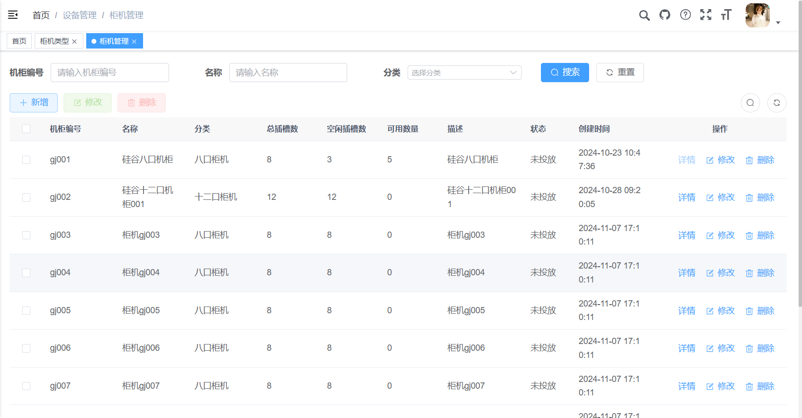
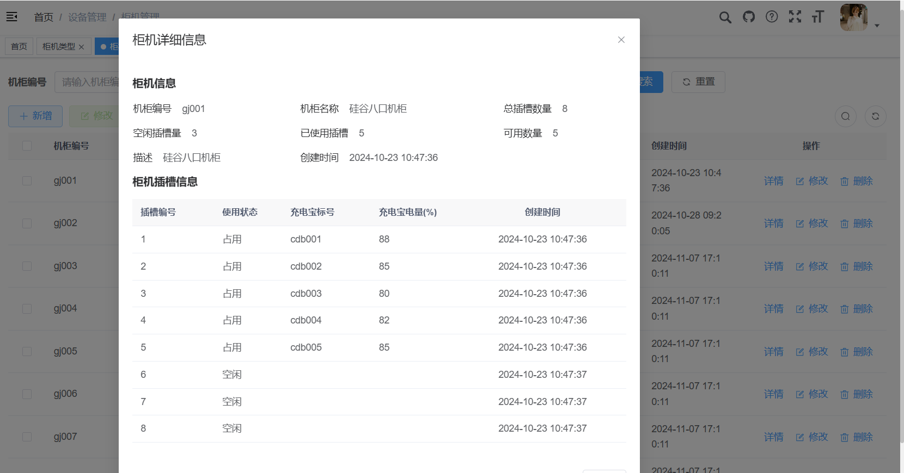
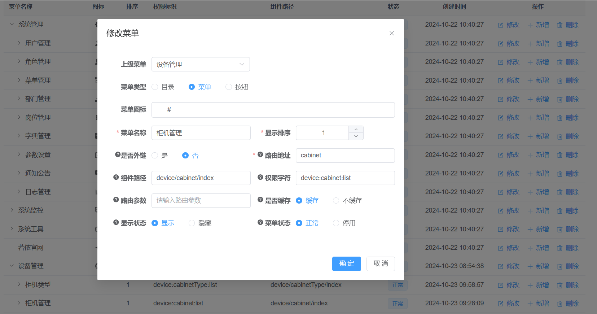
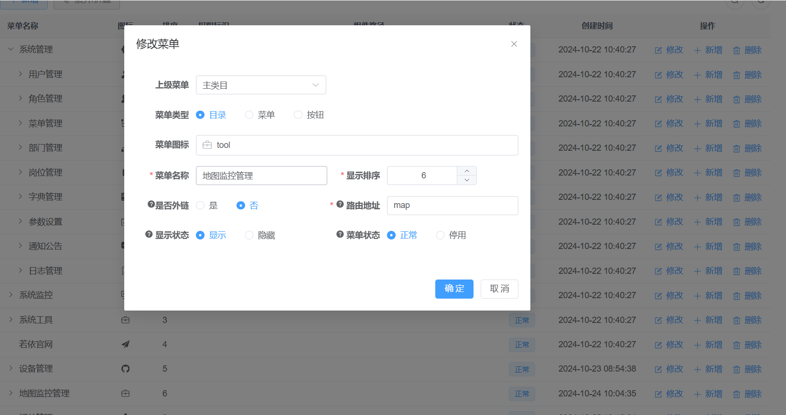
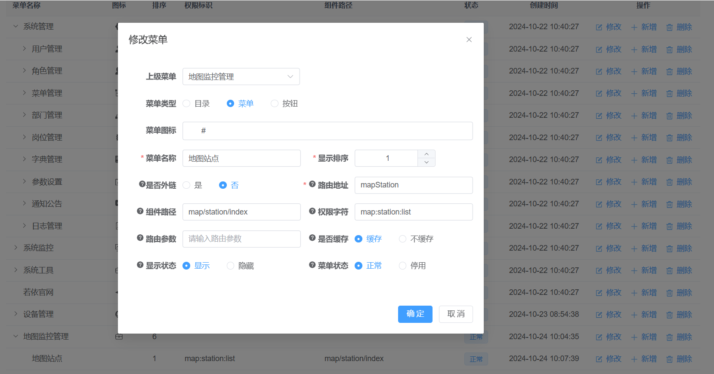

# 柜机管理、站点管理与监控管理
[TOC]

## 1、柜机管理

列表



详情



### 1.1、添加动态菜单

设备管理 =》 柜机管理

柜机管理



### 1.2、定义api接口

1、在api目录下创建一个device/cabinet.js文件，定义接口

```js
import request from '@/utils/request'

// 查询充电宝柜机列表
export function listCabinet(query) {
  return request({
    url: '/device/cabinet/list',
    method: 'get',
    params: query
  })
}

// 查询充电宝柜机详细
export function getCabinet(id) {
  return request({
    url: '/device/cabinet/' + id,
    method: 'get'
  })
}

// 新增充电宝柜机
export function addCabinet(data) {
  return request({
    url: '/device/cabinet',
    method: 'post',
    data: data
  })
}

// 修改充电宝柜机
export function updateCabinet(data) {
  return request({
    url: '/device/cabinet',
    method: 'put',
    data: data
  })
}

// 删除充电宝柜机
export function delCabinet(id) {
  return request({
    url: '/device/cabinet/' + id,
    method: 'delete'
  })
}

// 获取充电宝柜机全部详细信息
export function getAllInfo(id) {
  return request({
    url: '/device/cabinet/getAllInfo/' + id,
    method: 'get'
  })
}
```

2、在device/cabinetType.js文件添加接口

添加柜机时要选择柜机类型，获取全部柜机类型列表

```js
export function getCabinetTypeList() {
  return request({
    url: '/device/cabinetType/getCabinetTypeList',
    method: 'get'
  })
}
```

### 1.3、vue页面实现

创建views/device/cabinet/index.vue文件：

```vue
<template>
  <div class="app-container">
    <el-form :model="queryParams" ref="queryRef" :inline="true" v-show="showSearch" label-width="68px">
      <el-form-item label="机柜编号" prop="cabinetNo">
        <el-input
          v-model="queryParams.cabinetNo"
          placeholder="请输入机柜编号"
          clearable
          @keyup.enter="handleQuery"
        />
      </el-form-item>
      <el-form-item label="名称" prop="name">
        <el-input
          v-model="queryParams.name"
          placeholder="请输入名称"
          clearable
          @keyup.enter="handleQuery"
        />
      </el-form-item>
      <el-form-item label="分类" prop="cabinetTypeId">
        <el-select
            v-model="queryParams.cabinetTypeId"
            class="m-2"
            placeholder="选择分类"
            size="small"
            style="width: 100%"
        >
          <el-option
              v-for="item in cabinetTypeList"
              :key="item.id"
              :label="item.name"
              :value="item.id"
          />
        </el-select>
      </el-form-item>
      <el-form-item>
        <el-button type="primary" icon="Search" @click="handleQuery">搜索</el-button>
        <el-button icon="Refresh" @click="resetQuery">重置</el-button>
      </el-form-item>
    </el-form>

    <el-row :gutter="10" class="mb8">
      <el-col :span="1.5">
        <el-button
          type="primary"
          plain
          icon="Plus"
          @click="handleAdd"
        >新增</el-button>
      </el-col>
      <el-col :span="1.5">
        <el-button
          type="success"
          plain
          icon="Edit"
          :disabled="single"
          @click="handleUpdate"
        >修改</el-button>
      </el-col>
      <el-col :span="1.5">
        <el-button
          type="danger"
          plain
          icon="Delete"
          :disabled="multiple"
          @click="handleDelete"
        >删除</el-button>
      </el-col>
      <right-toolbar v-model:showSearch="showSearch" @queryTable="getList"></right-toolbar>
    </el-row>

    <el-table v-loading="loading" :data="cabinetList" @selection-change="handleSelectionChange">
      <el-table-column type="selection" width="55" align="center" />
      <el-table-column label="机柜编号" prop="cabinetNo" width="120"/>
      <el-table-column label="名称" prop="name" width="120"/>
      <el-table-column label="分类" prop="cabinetTypeName" width="120"/>
      <el-table-column label="总插槽数" prop="totalSlots" width="100"/>
      <el-table-column label="空闲插槽数" prop="freeSlots" width="100"/>
      <el-table-column label="可用数量" prop="availableNum" width="100"/>
      <el-table-column label="描述" prop="description" />
      <el-table-column label="状态" prop="status" width="80">
        <template #default="scope">
          {{ scope.row.status == '0' ? '未投放' : scope.row.status == '1' ? '使用中' : '故障' }}
        </template>
      </el-table-column>
      <el-table-column prop="createTime" label="创建时间" />
      <el-table-column label="操作" align="center" class-name="small-padding fixed-width" width="220">
        <template #default="scope">
          <el-button link type="primary" icon="Info" @click="handleInfo(scope.row.id)">详情</el-button>
          <el-button link type="primary" v-if="scope.row.status == '0'" icon="Edit" @click="handleUpdate(scope.row)">修改</el-button>
          <el-button link type="primary" v-if="scope.row.status == '0'" icon="Delete" @click="handleDelete(scope.row)">删除</el-button>
        </template>
      </el-table-column>
    </el-table>

    <pagination
      v-show="total>0"
      :total="total"
      v-model:page="queryParams.pageNum"
      v-model:limit="queryParams.pageSize"
      @pagination="getList"
    />

    <!-- 添加或修改充电宝柜机对话框 -->
    <el-dialog :title="title" v-model="open" width="600px" append-to-body>
      <el-form ref="cabinetRef" :model="form" :rules="rules" label-width="120px">
        <el-form-item label="名称" prop="name">
          <el-input v-model="form.name" placeholder="请输入名称" />
        </el-form-item>
        <el-form-item label="编号" prop="cabinetNo">
          <el-input v-model="form.cabinetNo" placeholder="请输入柜机编号" />
        </el-form-item>
        <el-form-item label="分类" prop="cabinetTypeId">
          <el-select
              v-model="form.cabinetTypeId"
              class="m-2"
              placeholder="分类"
          >
            <el-option
                v-for="item in cabinetTypeList"
                :key="item.id"
                :label="item.name"
                :value="item.id"
            />
          </el-select>
        </el-form-item>
        <el-form-item label="描述" prop="description">
          <el-input v-model="form.description" type="textarea" placeholder="请输入内容" />
        </el-form-item>
      </el-form>
      <template #footer>
        <div class="dialog-footer">
          <el-button type="primary" @click="submitForm">确 定</el-button>
          <el-button @click="cancel">取 消</el-button>
        </div>
      </template>
    </el-dialog>

    <!-- 添加或修改充电宝柜机对话框 -->
    <el-dialog title="柜机详细信息" v-model="openInfo" width="50%" append-to-body>
      <el-descriptions title="柜机信息">
        <el-descriptions-item label="机柜编号">{{ cabinet.cabinetNo }}</el-descriptions-item>
        <el-descriptions-item label="机柜名称">{{ cabinet.name }}</el-descriptions-item>
        <el-descriptions-item label="总插槽数量">{{ cabinet.totalSlots }}</el-descriptions-item>
        <el-descriptions-item label="空闲插槽量">{{ cabinet.freeSlots }}</el-descriptions-item>
        <el-descriptions-item label="已使用插槽">{{ cabinet.usedSlots }}</el-descriptions-item>
        <el-descriptions-item label="可用数量">{{ cabinet.availableNum }}</el-descriptions-item>
        <el-descriptions-item label="描述">{{ cabinet.description }}</el-descriptions-item>
        <el-descriptions-item label="创建时间">{{ cabinet.createTime }}</el-descriptions-item>
      </el-descriptions>
      <el-descriptions title="柜机插槽信息"></el-descriptions>
      <el-table :data="cabinetSlotList" style="width: 100%;">
        <el-table-column label="插槽编号" prop="slotNo" width="120"/>
        <el-table-column label="使用状态" prop="status" width="100">
          <template #default="scope">
            {{ scope.row.status == '1' ? '占用' : '空闲' }}
          </template>
        </el-table-column>
        <el-table-column label="充电宝标号" prop="powerBank.powerBankNo" width="130"/>
        <el-table-column label="充电宝电量(%)" prop="powerBank.electricity" width="130"/>
        <el-table-column label="创建时间" align="center" prop="createTime">
          <template #default="scope">
            <span>{{ parseTime(scope.row.createTime) }}</span>
          </template>
        </el-table-column>
      </el-table>

      <template #footer>
        <div class="dialog-footer">
          <el-button @click="cancelInfo">取 消</el-button>
        </div>
      </template>
    </el-dialog>
  </div>
</template>

<script setup name="Cabinet">
import { listCabinet, getCabinet, delCabinet, addCabinet, updateCabinet, getAllInfo } from "@/api/device/cabinet";
import { getCabinetTypeList } from "@/api/device/cabinetType";

const { proxy } = getCurrentInstance();

const cabinetList = ref([]);
const open = ref(false);
const loading = ref(true);
const showSearch = ref(true);
const ids = ref([]);
const single = ref(true);
const multiple = ref(true);
const total = ref(0);
const title = ref("");

const data = reactive({
  form: {},
  queryParams: {
    pageNum: 1,
    pageSize: 10,
    cabinetNo: null,
    name: null,
    cabinetTypeId: null,
    totalSlots: null,
    availableSlots: null,
    description: null,
    locationId: null,
    status: null,
  },
  rules: {
    cabinetTypeId: [
      { required: true, message: "分类必须选择", trigger: "blur" }
    ],
    name: [
      { required: true, message: "名称不能为空", trigger: "blur" }
    ],
    cabinetNo: [
      { required: true, message: "柜机编号不能为空", trigger: "blur" }
    ],
  }
});

const { queryParams, form, rules } = toRefs(data);

/** 查询充电宝柜机列表 */
function getList() {
  loading.value = true;
  listCabinet(queryParams.value).then(response => {
    cabinetList.value = response.rows;
    total.value = response.total;
    loading.value = false;
  });
}

//分类
const cabinetTypeList = ref([])
function getCabinetTypeAllList() {
  getCabinetTypeList().then(response => {
    cabinetTypeList.value = response.data
  })
}
getCabinetTypeAllList();

// 取消按钮
function cancel() {
  open.value = false;
  reset();
}

// 表单重置
function reset() {
  form.value = {
    id: null,
    cabinetNo: null,
    name: null,
    cabinetTypeId: null,
    totalSlots: null,
    availableSlots: null,
    description: null,
    locationId: null,
    status: null,
    delFlag: null,
    createBy: null,
    createTime: null,
    updateBy: null,
    updateTime: null,
    remark: null
  };
  proxy.resetForm("cabinetRef");
}

/** 搜索按钮操作 */
function handleQuery() {
  queryParams.value.pageNum = 1;
  getList();
}

/** 重置按钮操作 */
function resetQuery() {
  proxy.resetForm("queryRef");
  handleQuery();
}

// 多选框选中数据
function handleSelectionChange(selection) {
  ids.value = selection.map(item => item.id);
  single.value = selection.length != 1;
  multiple.value = !selection.length;
}

/** 新增按钮操作 */
function handleAdd() {
  reset();
  open.value = true;
  title.value = "添加充电宝柜机";
}

/** 修改按钮操作 */
function handleUpdate(row) {
  reset();
  const _id = row.id || ids.value
  getCabinet(_id).then(response => {
    form.value = response.data;
    open.value = true;
    title.value = "修改充电宝柜机";
  });
}

/** 提交按钮 */
function submitForm() {
  proxy.$refs["cabinetRef"].validate(valid => {
    if (valid) {
      if (form.value.id != null) {
        updateCabinet(form.value).then(response => {
          proxy.$modal.msgSuccess("修改成功");
          open.value = false;
          getList();
        });
      } else {
        addCabinet(form.value).then(response => {
          proxy.$modal.msgSuccess("新增成功");
          open.value = false;
          getList();
        });
      }
    }
  });
}

const cabinet = ref({});
const cabinetSlotList = ref([]);
const openInfo = ref(false);
function handleInfo(id) {
  getAllInfo(id).then(response => {
    cabinet.value = response.data.cabinet;
    cabinetSlotList.value = response.data.cabinetSlotList;
    openInfo.value = true;
  });
}

function cancelInfo() {
  openInfo.value = false;
}

/** 删除按钮操作 */
function handleDelete(row) {
  const _ids = row.id || ids.value;
  proxy.$modal.confirm('是否确认删除充电宝柜机编号为"' + _ids + '"的数据项？').then(function() {
    return delCabinet(_ids);
  }).then(() => {
    getList();
    proxy.$modal.msgSuccess("删除成功");
  }).catch(() => {});
}

getList();
</script>
```

## 2、站点管理

### 2.1、添加动态菜单

设备管理 =》 站点管理

站点管理


### 2.2、定义api接口

1、在api目录下创建一个device/station.js文件，定义接口

```js
import request from '@/utils/request'

// 查询站点列表
export function listStation(query) {
  return request({
    url: '/device/station/list',
    method: 'get',
    params: query
  })
}

// 查询站点详细
export function getStation(id) {
  return request({
    url: '/device/station/' + id,
    method: 'get'
  })
}

// 新增站点
export function addStation(data) {
  return request({
    url: '/device/station',
    method: 'post',
    data: data
  })
}

// 修改站点
export function updateStation(data) {
  return request({
    url: '/device/station',
    method: 'put',
    data: data
  })
}

// 删除站点
export function delStation(id) {
  return request({
    url: '/device/station/' + id,
    method: 'delete'
  })
}

// 新增站点
export function setData(data) {
  return request({
    url: '/device/station/setData',
    method: 'post',
    data: data
  })
}
```

2、在api目录下创建一个device/region.js文件，定义接口

添加站点信息，需要选择站点是省市区三级联动信息

```js
import request from '@/utils/request'

export function getTreeSelect(parentCode) {
  return request({
    url: '/device/region/treeSelect/' + parentCode,
    method: 'get'
  })
}
```

3、在api目录下device/cabinet.js文件，定义接口

设置站点与柜机关联时，根据关键字获取未绑定的柜机信息

```js
export function searchNoUseList(keyword) {
  return request({
    url: '/device/cabinet/searchNoUseList/' + keyword,
    method: 'get'
  })
}
```

4、在api目录下创建rule/feeRule.js文件，定义接口

设置站点与费用规则关联时，获取全部费用规则信息

```js
import request from '@/utils/request'

export function getALLFeeRuleList() {
  return request({
    url: '/rule/feeRule/getALLFeeRuleList',
    method: 'get'
  })
}
```

### 2.3、vue页面实现

该页面要使用地图选择站点经纬度，因此需引入腾讯地图服务js

在share-ui/index.html文件引入js

```html
<script src="https://map.qq.com/api/gljs?v=1.exp&key=OZ4BZ-CLGLZ-V4EX4-ZX6Q6-****--****"></script>
```

腾讯地图服务js基础入门：https://lbs.qq.com/webApi/javascriptGL/glGuide/glBasic

腾讯地图点标记：https://lbs.qq.com/webApi/javascriptGL/glGuide/glMarker

vue页面完整代码

创建views/device/station/index.vue文件：

```vue
<template>
  <div class="app-container">
    <el-form :model="queryParams" ref="queryRef" :inline="true" v-show="showSearch" label-width="68px">
      <el-form-item label="站点名称" prop="name">
        <el-input
            v-model="queryParams.name"
            placeholder="请输入站点名称"
            clearable
            @keyup.enter="handleQuery"
        />
      </el-form-item>
      <el-form-item label="地址" prop="address">
        <el-input
            v-model="queryParams.address"
            placeholder="请输入地址"
            clearable
            @keyup.enter="handleQuery"
        />
      </el-form-item>
      <el-form-item>
        <el-button type="primary" icon="Search" @click="handleQuery">搜索</el-button>
        <el-button icon="Refresh" @click="resetQuery">重置</el-button>
      </el-form-item>
    </el-form>

    <el-row :gutter="10" class="mb8">
      <el-col :span="1.5">
        <el-button
            type="primary"
            plain
            icon="Plus"
            @click="handleAdd"
        >新增</el-button>
      </el-col>
      <el-col :span="1.5">
        <el-button
            type="success"
            plain
            icon="Edit"
            :disabled="single"
            @click="handleUpdate"
        >修改</el-button>
      </el-col>
      <el-col :span="1.5">
        <el-button
            type="danger"
            plain
            icon="Delete"
            :disabled="multiple"
            @click="handleDelete"
        >删除</el-button>
      </el-col>
      <right-toolbar v-model:showSearch="showSearch" @queryTable="getList"></right-toolbar>
    </el-row>

    <el-table v-loading="loading" :data="stationList" @selection-change="handleSelectionChange">
      <el-table-column type="selection" width="55" align="center" />
      <el-table-column prop="imageUrl" label="站点图片" #default="scope" width="80">
        
      </el-table-column>
      <el-table-column label="站点名称" prop="name" width="130"/>
      <el-table-column label="营业时间" prop="businessHours" width="130"/>
      <el-table-column label="详细地址" prop="fullAddress" />
      <el-table-column label="负责人名称" prop="headName" width="90"/>
      <el-table-column label="负责人电话" prop="headPhone" width="130"/>
      <el-table-column label="关联柜机" prop="cabinetNo" />
      <el-table-column label="费用规则" prop="feeRuleName" />
      <el-table-column label="状态" prop="status" width="80">
        <template #default="scope">
          {{ scope.row.status == '1' ? '正常' : '停用' }}
        </template>
      </el-table-column>
      <el-table-column label="操作" align="center" class-name="small-padding fixed-width" width="230">
        <template #default="scope">
          <el-button link type="primary" @click="handleCabinetShow(scope.row)" >详情</el-button>
          <el-button link type="primary" @click="handleUpdate(scope.row)" >修改</el-button>
          <el-button link type="primary" @click="handleDelete(scope.row)" >删除</el-button>
          <el-button link type="primary" @click="handSet(scope.row)" >设置柜机</el-button>
        </template>
      </el-table-column>
    </el-table>

    <pagination
        v-show="total>0"
        :total="total"
        v-model:page="queryParams.pageNum"
        v-model:limit="queryParams.pageSize"
        @pagination="getList"
    />

    <!-- 添加或修改站点对话框 -->
    <el-dialog :title="title" v-model="open" width="50%" append-to-body>
      <el-form ref="stationRef" :model="form" :rules="rules" label-width="120px">
        <el-form-item label="站点名称" prop="name">
          <el-input v-model="form.name" placeholder="请输入站点名称" />
        </el-form-item>
        <el-form-item label="站点图片" prop="logo">
          <el-upload
              class="avatar-uploader"
              :action="imgUpload.url"
              :headers="imgUpload.headers"
              :show-file-list="false"
              :on-success="handleAvatarSuccess"
          >
            
            <el-icon v-else class="avatar-uploader-icon"><Plus /></el-icon>
          </el-upload>
        </el-form-item>
        <el-form-item label="营业时间" prop="businessHours">
          <el-input v-model="form.businessHours" placeholder="请输入营业时间" />
        </el-form-item>
        <el-form-item label="省市区" prop="categoryIdList">
          <el-cascader
              :props="regionProps"
              v-model="form.regionCodeList"
              style="width: 100%;"
          />
        </el-form-item>
        <el-form-item label="详细地址" prop="address">
          <el-input v-model="form.address" placeholder="请输入详细地址"/>
        </el-form-item>
        <el-form-item label="设置经纬度">
          <el-input v-model="latLngString" disabled placeholder="选择经纬度" style="width: 70%"/>
          <el-button type="primary" icon="Search" @click="handShowMap">选择经纬度</el-button>
        </el-form-item>
        <el-form-item label="站点负责人名称" prop="headName">
          <el-input v-model="form.headName" placeholder="请输入站点负责人名称" />
        </el-form-item>
        <el-form-item label="站点负责人电话" prop="headPhone">
          <el-input v-model="form.headPhone" placeholder="请输入站点负责人电话" />
        </el-form-item>
      </el-form>
      <template #footer>
        <div class="dialog-footer">
          <el-button type="primary" @click="submitForm">确 定</el-button>
          <el-button @click="cancel">取 消</el-button>
        </div>
      </template>
    </el-dialog>

    <el-dialog title="设置经纬度" v-model="openMap" width="50%" append-to-body>
      <div id="container"></div>
      <template #footer>
        <div class="dialog-footer">
          <el-button type="primary" @click="submitMap">确 定</el-button>
          <el-button @click="openMap = false">取 消</el-button>
        </div>
      </template>
    </el-dialog>

    <el-dialog title="设置柜机数据" v-model="openSet" width="40%" append-to-body>
      <el-form ref="stationRef" :model="form" :rules="rules" label-width="120px">
        <el-form-item label="柜机" prop="cabinetId">
          <el-autocomplete
              v-model="cabinetValue"
              :fetch-suggestions="querySearch"
              :trigger-on-focus="false"
              clearable
              class="inline-input w-50"
              style="width: 100%;"
              placeholder="请输入柜机编号"
              @select="handleSelect"
          />
        </el-form-item>
        <el-form-item label="费用规则" prop="feeRuleId">
          <el-select
              v-model="form.feeRuleId"
              class="m-2"
              placeholder="请选择费用规则"
              style="width: 100%;"
          >
            <el-option
                v-for="item in feeRuleList"
                :key="item.id"
                :label="item.name"
                :value="item.id"
            />
          </el-select>
        </el-form-item>
      </el-form>
      <template #footer>
        <div class="dialog-footer">
          <el-button type="primary" @click="submitSet">确 定</el-button>
          <el-button @click="openSet = false">取 消</el-button>
        </div>
      </template>
    </el-dialog>

    <el-dialog title="柜机详细信息" v-model="openCabinet" width="70%" append-to-body>
      <el-descriptions title="站点信息">
        <el-descriptions-item label="站点图片"></el-descriptions-item>
        <el-descriptions-item label="站点名称">{{ form.name }}</el-descriptions-item>
        <el-descriptions-item label="营业时间">{{ form.businessHours }}</el-descriptions-item>
        <el-descriptions-item label="详细地址">{{ form.fullAddress }}</el-descriptions-item>
        <el-descriptions-item label="站点负责人">{{ form.headName }}</el-descriptions-item>
        <el-descriptions-item label="负责人电话">{{ form.headPhone }}</el-descriptions-item>
        <el-descriptions-item label="创建时间">{{ form.createTime }}</el-descriptions-item>
      </el-descriptions>
      <el-descriptions title="柜机信息">
        <el-descriptions-item label="机柜编号">{{ cabinet.cabinetNo }}</el-descriptions-item>
        <el-descriptions-item label="机柜名称">{{ cabinet.name }}</el-descriptions-item>
        <el-descriptions-item label="总插槽数量">{{ cabinet.totalSlots }}</el-descriptions-item>
        <el-descriptions-item label="空闲插槽量">{{ cabinet.freeSlots }}</el-descriptions-item>
        <el-descriptions-item label="已使用插槽">{{ cabinet.usedSlots }}</el-descriptions-item>
        <el-descriptions-item label="可用数量">{{ cabinet.availableNum }}</el-descriptions-item>
        <el-descriptions-item label="描述">{{ cabinet.description }}</el-descriptions-item>
        <el-descriptions-item label="创建时间">{{ cabinet.createTime }}</el-descriptions-item>
      </el-descriptions>
      <el-descriptions title="柜机插槽信息"></el-descriptions>
      <el-table :data="cabinetSlotList" style="width: 100%;">
        <el-table-column label="插槽编号" prop="slotNo" width="120"/>
        <el-table-column label="使用状态" prop="status" width="100">
          <template #default="scope">
            {{ scope.row.status == '1' ? '占用' : '空闲' }}
          </template>
        </el-table-column>
        <el-table-column label="充电宝标号" prop="powerBank.powerBankNo" width="130"/>
        <el-table-column label="充电宝电量(%)" prop="powerBank.electricity" width="130"/>
        <el-table-column label="创建时间" align="center" prop="createTime">
          <template #default="scope">
            <span>{{ parseTime(scope.row.createTime) }}</span>
          </template>
        </el-table-column>
      </el-table>

      <template #footer>
        <div class="dialog-footer">
          <el-button @click="cancelCabinet">取 消</el-button>
        </div>
      </template>
    </el-dialog>
  </div>
</template>

<script setup name="Station">
import { listStation, getStation, delStation, addStation, updateStation, setData } from "@/api/device/station";
import { searchNoUseList } from "@/api/device/cabinet";
import { getTreeSelect } from "@/api/device/region";
import { getALLFeeRuleList } from "@/api/rule/feeRule";
import { getToken } from "@/utils/auth.js";
const { proxy } = getCurrentInstance();

const stationList = ref([]);
const open = ref(false);
const loading = ref(true);
const showSearch = ref(true);
const ids = ref([]);
const single = ref(true);
const multiple = ref(true);
const total = ref(0);
const title = ref("");

const data = reactive({
  form: {},
  queryParams: {
    pageNum: 1,
    pageSize: 10,
    name: null,
    imageUrl: null,
    businessHours: null,
    provinceCode: null,
    cityCode: null,
    districtCode: null,
    longitude: null,
    latitude: null,
    address: null,
    headName: null,
    headPhone: null,
    cabinetId: null,
    feeRuleId: null,
    status: null,
  },
  rules: {
    name: [
      { required: true, message: "站点名称不能为空", trigger: "blur" }
    ],
    longitude: [
      { required: true, message: "经度不能为空", trigger: "blur" }
    ],
    latitude: [
      { required: true, message: "纬度不能为空", trigger: "blur" }
    ],
    createTime: [
      { required: true, message: "创建时间不能为空", trigger: "blur" }
    ],
    cabinetId: [
      { required: true, message: "柜机编号必须输入", trigger: "blur" }
    ],
    feeRuleId: [
      { required: true, message: "费用规则必须选择", trigger: "blur" }
    ],
  },
  imgUpload: {
    // 设置上传的请求头部
    headers: {
      Authorization: "Bearer " + getToken()
    },
    // 图片上传的方法地址:
    url: import.meta.env.VITE_APP_BASE_API + "/file/upload"
  },
});

const { queryParams, form, rules, imgUpload } = toRefs(data);

/** 查询站点列表 */
function getList() {
  loading.value = true;
  listStation(queryParams.value).then(response => {
    stationList.value = response.rows;
    total.value = response.total;
    loading.value = false;
  });
}

// 取消按钮
function cancel() {
  open.value = false;
  reset();
}

// 表单重置
function reset() {
  form.value = {
    id: null,
    name: null,
    imageUrl: null,
    businessHours: null,
    provinceCode: null,
    cityCode: null,
    districtCode: null,
    longitude: null,
    latitude: null,
    address: null,
    headName: null,
    headPhone: null,
    cabinetId: null,
    feeRuleId: null,
    status: null,
    regionCodeList: []
  };
  proxy.resetForm("stationRef");
}

/** 搜索按钮操作 */
function handleQuery() {
  queryParams.value.pageNum = 1;
  getList();
}

/** 重置按钮操作 */
function resetQuery() {
  proxy.resetForm("queryRef");
  handleQuery();
}

// 多选框选中数据
function handleSelectionChange(selection) {
  ids.value = selection.map(item => item.id);
  single.value = selection.length != 1;
  multiple.value = !selection.length;
}

/** 新增按钮操作 */
function handleAdd() {
  reset();
  open.value = true;
  title.value = "添加站点";
}

/** 修改按钮操作 */
function handleUpdate(row) {
  reset();
  const _id = row.id || ids.value
  getStation(_id).then(response => {
    form.value = response.data;
    form.value.regionCodeList = [form.value.provinceCode, form.value.cityCode, form.value.districtCode];
    open.value = true;
    title.value = "修改站点";

    latLngString.value = form.value.latitude + "," + form.value.longitude;
  });
}

/** 提交按钮 */
function submitForm() {
  proxy.$refs["stationRef"].validate(valid => {
    if (valid) {
      form.value.provinceCode = form.value.regionCodeList[0];
      form.value.cityCode = form.value.regionCodeList[1];
      form.value.districtCode = form.value.regionCodeList[2];

      if (form.value.id != null) {
        updateStation(form.value).then(response => {
          proxy.$modal.msgSuccess("修改成功");
          open.value = false;
          getList();
        });
      } else {
        addStation(form.value).then(response => {
          proxy.$modal.msgSuccess("新增成功");
          open.value = false;
          getList();
        });
      }
    }
  });
}

/** 删除按钮操作 */
function handleDelete(row) {
  const _ids = row.id || ids.value;
  proxy.$modal.confirm('是否确认删除站点编号为"' + _ids + '"的数据项？').then(function() {
    return delStation(_ids);
  }).then(() => {
    getList();
    proxy.$modal.msgSuccess("删除成功");
  }).catch(() => {});
}

/** 导出按钮操作 */
function handleExport() {
  proxy.download('device/station/export', {
    ...queryParams.value
  }, `station_${new Date().getTime()}.xlsx`)
}

getList();

//上传
function handleAvatarSuccess (response, uploadFile) {
  console.log(response)
  console.log(uploadFile)
  form.value.logo = response.data.url
}

//三级分类
const props = {
  lazy: true,
  value: 'code',
  label: 'name',
  leaf: 'leaf',
  async lazyLoad(node, resolve) {
    const { level } = node
    if (typeof node.value == 'undefined') node.value = 0
    const { code, data, message } = await getTreeSelect(
        node.value
    )
    //hasChildren判断是否有子节点
    data.forEach(function(item) {
      item.leaf = !item.hasChildren
    })
    resolve(data)
  },
}
const regionProps = ref(props)


const openMap = ref(false);
const isFirst = ref(true);
const latLng = ref({});
const latLngString = ref();
watch(openMap, (newVal) => {
  if (newVal && isFirst.value) {
    nextTick(initMap); // 确保DOM更新完成后初始化地图
  }
});
function handShowMap() {
  openMap.value = true
}
function initMap() {
  isFirst.value = false;
  var center = new TMap.LatLng(39.984104, 116.307503);
  //初始化地图
  var map = new TMap.Map(document.getElementById('container'), {
    rotation: 20,//设置地图旋转角度
    pitch:30, //设置俯仰角度（0~45）
    zoom:12,//设置地图缩放级别
    center: center//设置地图中心点坐标
  });

  //初始化marker图层
  var markerLayer = new TMap.MultiMarker({
    id: 'marker-layer',
    map: map
  });

  //监听点击事件添加marker
  map.on("click", (evt) => {
    markerLayer.setGeometries([])
    markerLayer.add({
      position: evt.latLng
    });
    latLng.value = evt.latLng;
    latLngString.value = latLng.value.lat + "," + latLng.value.lng;
    // calculateAddress(evt.latLng.lat, evt.latLng.lng).then(response => {
    //   mapAddress.value = response.data;
    // });
    console.log("您点击的的坐标是："+ evt.latLng);
  });
}

function submitMap() {
  openMap.value = false
  form.value.latitude = latLng.value.lat;
  form.value.longitude = latLng.value.lng;
}

const openSet = ref(false);
const cabinetValue = ref('');
function handSet(row) {
  openSet.value = true
  form.value.id = row.id
  form.value.cabinetId = row.cabinetId
  form.value.feeRuleId = row.feeRuleId
  cabinetValue.value = row.cabinetNo
}
function querySearch(keyword, cb) {
  searchNoUseList(keyword).then(response => {
    const list = response.data
    const array = list.map(item=>{
      return {
        value: item.cabinetNo,
        id: item.id
      }
    })
    debugger
    cb(array)
  });
}
function handleSelect(item) {
  console.log(item)
  form.value.cabinetId = item.id
}

const feeRuleList = ref([]);
function getFeeRuleList() {
  getALLFeeRuleList().then(response => {
    feeRuleList.value = response.data
  })
}
getFeeRuleList()

function submitSet() {
  setData(form.value).then(response => {
    proxy.$modal.msgSuccess("关联设置成功");
    openSet.value = false;
    getList();
  })
}

import { getAllInfo } from "@/api/device/cabinet";
const openCabinet = ref(false);
const cabinet = ref({});
const cabinetSlotList = ref([]);
function handleCabinetShow(row) {
  form.value = row;
  getAllInfo(row.id).then(response => {
    cabinet.value = response.data.cabinet;
    cabinetSlotList.value = response.data.cabinetSlotList;
    openCabinet.value = true;
  });
}

function cancelCabinet() {
  openCabinet.value = false;
}
</script>
<style scoped>
.avatar-uploader .avatar {
  width: 178px;
  height: 178px;
  display: block;
}
</style>

<style>
.avatar-uploader .el-upload {
  border: 1px dashed var(--el-border-color);
  border-radius: 6px;
  cursor: pointer;
  position: relative;
  overflow: hidden;
  transition: var(--el-transition-duration-fast);
}

.avatar-uploader .el-upload:hover {
  border-color: var(--el-color-primary);
}

.el-icon.avatar-uploader-icon {
  font-size: 28px;
  color: #8c939d;
  width: 178px;
  height: 178px;
  text-align: center;
}
</style>
```

## 3、监控管理

### 3.1、添加动态菜单

地图监控管理 =》 地图站点

地图监控管理 



地图站点


### 3.2、定义api接口

1、在device/station.js文件，定义接口

```js
export function nearbyStation(latitude, longitude) {
  return request({
    url: '/device/device/nearbyStationList/'+latitude+'/'+longitude,
    method: 'get'
  })
}
```

2、在api目录下创建一个device/map.js文件，定义接口

```js
import request from '@/utils/request'

export function calculateLatLng(keyword) {
  return request({
    url: '/device/map/calculateLatLng/'+keyword,
    method: 'get'
  })
}
```

### 3.3、vue页面实现

创建views/map/station/index.vue文件：

```vue
<template>
  <div class="app-container">
    <div style="padding: 0 0 20px 0;">
      <el-input v-model="keyword" placeholder="请输入关键字" style="width: 92%;margin-right: 10px;"/>
      <el-button type="primary" @click="search()" style="width: 5%;">搜索</el-button>
    </div>
    <div id="container"></div>

  </div>
</template>

<script setup name="Station">
import { calculateLatLng } from "@/api/device/map";
import { nearbyStation } from "@/api/device/station";
const { proxy } = getCurrentInstance();

let map;
let markerLayer;
const keyword = ref("");

function search() {
  if(keyword.value == '') return;
  calculateLatLng(keyword.value).then(response => {
    let data = response.data;
    let position = new TMap.LatLng(data.lat, data.lng)
    map.setCenter(position);

    //渲染地图数据
    initMapData(position);
  });

}

let infoWindowList = Array(100);
function initMap() {
  let center = new TMap.LatLng(39.984104, 116.307503);
  //初始化地图
  map = new TMap.Map(document.getElementById('container'), {
    rotation: 20,//设置地图旋转角度
    pitch:30, //设置俯仰角度（0~45）
    zoom:12,//设置地图缩放级别
    center: center//设置地图中心点坐标
  });

  //初始化marker图层
  markerLayer = new TMap.MultiMarker({
    id: 'marker-layer',
    map: map
  });

  initMapData(center);

  //监听地图中心点变化
  map.addListener('center_changed', function() {
    console.log("latlng:" + map.getCenter());
  });
}

function initMapData(center) {
  markerLayer.setGeometries([])
  nearbyStation(center.lat, center.lng).then(response => {
    let latLngList = response.data;
    for (let i = 0; i < latLngList.length; i++) {
      let station = latLngList[i];
      let position = new TMap.LatLng(station.latitude, station.longitude)

      // 参考示例 https://lbs.qq.com/webDemoCenter/glAPI/glServiceLib/search
      let geometries = markerLayer.getGeometries();
      geometries.push({
        id: String(i), // 点标注数据数组
        position: position
      });
      markerLayer.updateGeometries(geometries); // 绘制地点标注

      let isUsable = "不可借";
      if(station.isUsable == '1') {
        isUsable = "可借";
      }
      let isReturn = "不可还";
      if(station.isReturn == '1') {
        isReturn = "可还";
      }
      //创建InfoWindow实例，并进行初始化
      var infoWindow = new TMap.InfoWindow({
        map: map,
        position: position,
        offset: { x: 0, y: -32 },
        //设置infoWindow，content支持直接传入html代码，以实现各类内容格式需求
        content: "<div class=\"info-container\">\n" +
            "  <div class=\"image-container\">\n" +
            "    \n" +
            "  </div>\n" +
            "  <div class=\"text-container\">\n" +
            "   <p style='font-weight: bold;'>"+station.name+"</p>\n" +
            "   <p style='font-size: 12px;'>"+station.fullAddress+"</p>\n" +
            "   <p>运营时间："+station.businessHours+"</p>\n" +
            "   <p>"+isUsable+"&nbsp;&nbsp;&nbsp;&nbsp;&nbsp;&nbsp;"+isReturn+"</p>\n" +
            "  </div>\n" +
            "</div>"
      });
      infoWindowList[i] = infoWindow;
      infoWindow.close();//初始关闭信息窗关闭
      //监听标注点击事件
      markerLayer.on("click", function (evt) {
        //关闭全部信息窗
        infoWindowList.forEach(item => item.close());
        // 打开点击的信息窗
        infoWindowList[Number(evt.geometry.id)].open();
      })
    }
  });
}

onMounted(() => {
  initMap();
})
</script>
<style scoped>
.avatar-uploader .avatar {
  width: 178px;
  height: 178px;
  display: block;
}
</style>

<style>
.avatar-uploader .el-upload {
  border: 1px dashed var(--el-border-color);
  border-radius: 6px;
  cursor: pointer;
  position: relative;
  overflow: hidden;
  transition: var(--el-transition-duration-fast);
}

.avatar-uploader .el-upload:hover {
  border-color: var(--el-color-primary);
}

.el-icon.avatar-uploader-icon {
  font-size: 28px;
  color: #8c939d;
  width: 178px;
  height: 178px;
  text-align: center;
}
</style>
<style>

.info-container {
  display: flex;
  align-items: flex-start; /* 垂直居中对齐 */
  gap: 20px; /* 图片和文字之间的间距 */
}

.image-container {
  flex: 1; /* 图片区域占一半的空间 */
}

.image-container img {
  width: 120px; /* 图片自适应容器大小 */
  height: 120px; /* 保持图片的宽高比 */
}

.text-container {
  flex: 2; /* 文字区域占三分之二的空间 */
  width: 210px;
  margin-top: -10px;
}
.text-container p{
  text-align: left;
  margin: 10px 0;
}
</style>
```