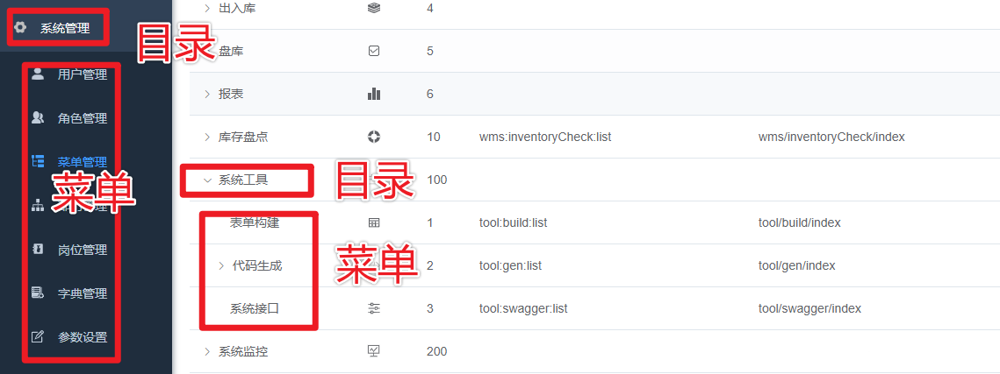
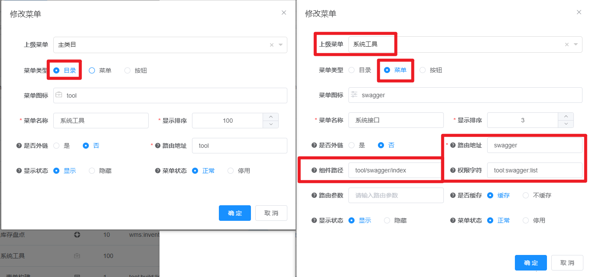
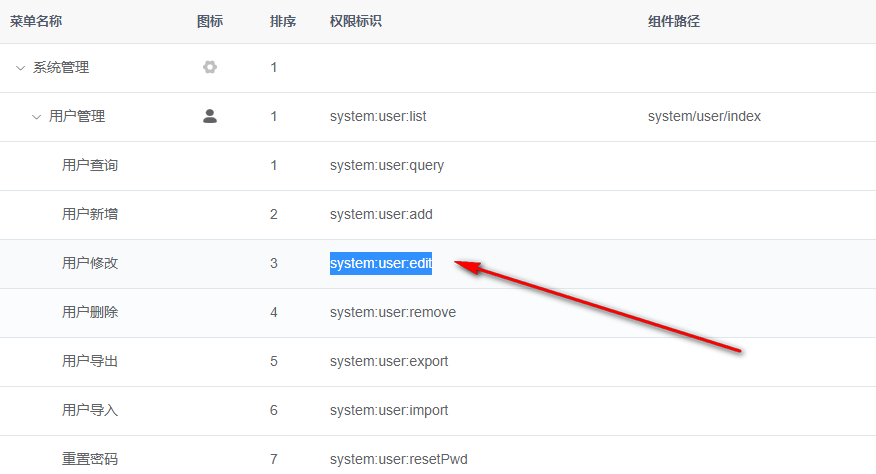
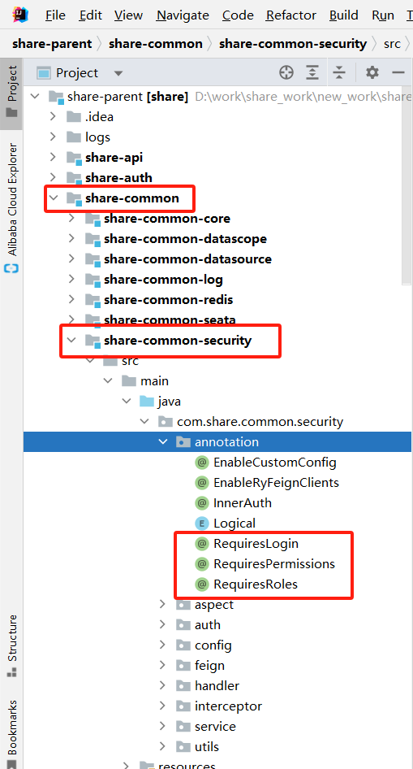
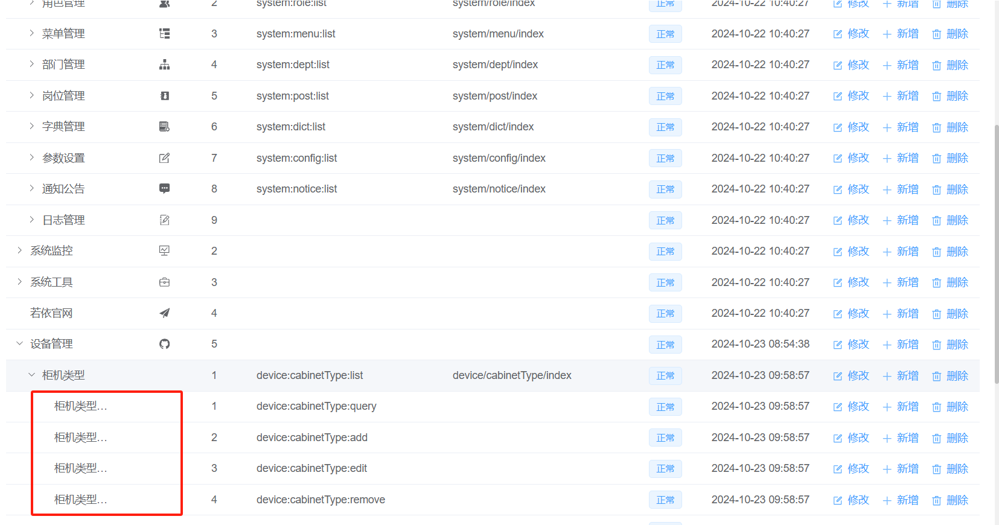
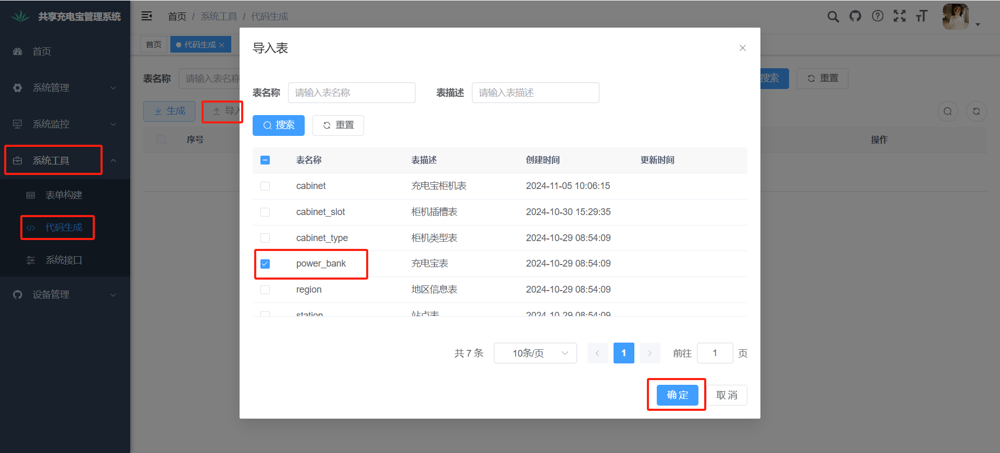
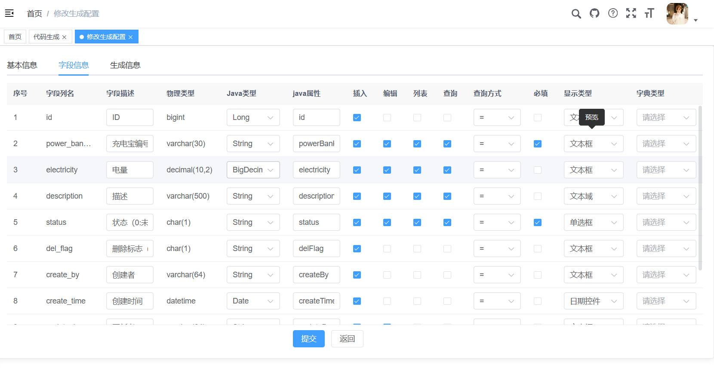
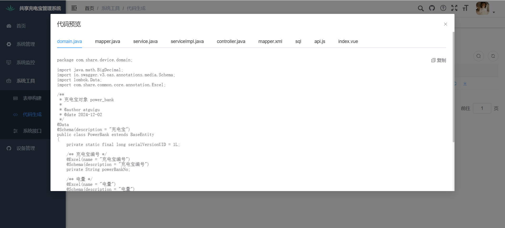

# 权限管理、日志、代码生成
[TOC]

## 1、若依-权限控制

### 1.1、介绍

 `权限控制`主要目的是保护系统的安全性和完整性,防止未经授权的用户获取敏感信息、执行非法操作或对系统进行恶意操作 。

常见的权限控制框架有SpringSecurity和Shiro。

若依的权限管理是通过`RBAC`（Role-based Access Control 基于角色的访问控制）模型自己设计的。

RBAC模型将权限控制分为角色管理和权限管理两个部分。在若依中，角色是指对系统的一类用户或操作者的定义，而权限是指对系统中某个资源或操作的访问控制。通过为每个角色分配相应的权限，可以实现对系统的全面管理和控制。

具体来说，若依的权限管理包括以下几个方面：

1. `菜单管理`：通过对系统菜单进行管理，可以控制用户在系统中能够访问的页面和功能。
2. `按钮权限`：在系统中，某些操作需要特定的权限才能进行，例如删除、修改等操作。通过对按钮权限的控制，可以限制用户对系统的访问和操作。
3. `数据权限`：在某些情况下，需要根据用户的角色或部门来限制其对数据的访问。通过数据权限的设置，可以实现对数据的细粒度控制。
4. `API接口权限`：在若依中，API也可以通过权限的方式进行控制。通过对API的权限进行管理，可以限制用户对API的访问和使用。

### 1.2、数据库表结构设计

在数据库表结构方面，若依采用了RBAC模型的设计。其中，主要包括以下表：

- `sys_menu`：存储系统菜单信息，包括菜单ID、菜单名称、访问路径、菜单类型等字段。
- `sys_role`：存储系统角色信息，包括角色ID、角色名称、角色标识、角色描述等字段。
- `sys_user`：存储系统用户信息，包括用户ID、用户名、密码、昵称、邮箱、电话等字段。
- `sys_role_menu`：存储角色和菜单之间的关联关系，包括角色ID和菜单ID两个字段。
- `sys_user_role`：存储用户和角色之间的关联关系，包括用户ID和角色ID两个字段。

通过这些表的设计，可以实现对系统中菜单、角色和用户的管理。同时，通过角色和菜单之间的关联关系，可以实现对菜单访问权限的控制。通过用户和角色之间的关联关系，可以实现对用户访问权限的控制。

### 1.3、菜单管理

**目录、菜单和按钮的区别**

在若依（RuoYi）中，菜单和目录是两个不同的概念，它们之间的区别如下：

**1.目录（Directory）：**

目录是用来组织和分类菜单的容器。目录本身没有功能，它只是一个容器，可以包含若干个菜单。目录通常是一个抽象的概念，用于将一组相关的菜单组织在一起。

在若依中，目录是以“系统管理”、“运营管理”等大模块的方式组织菜单的，用于区分不同的功能模块。目录通常以左侧的菜单树的形式展现，用户可以通过点击不同的目录来展开或收缩对应的菜单列表。

**2.菜单（Menu）：**

菜单是具有一定功能的操作项，通常是一组具有相同功能的页面或功能点的集合。每个菜单通常对应一个页面或者一个功能模块。

在若依中，菜单通常是以左侧的树形菜单的形式展现，用户可以通过点击不同的菜单来跳转到对应的页面或功能模块。每个菜单都有一个唯一的标识符，通常以URL的形式表示。

**3.按钮（Button）：**

按钮是指菜单中的操作按钮，用于触发一些具体的操作。在若依中，按钮通常是与表格或表单等组件配合使用的，用于进行数据的增删改查等操作。按钮通常会与权限控制结合起来，只有拥有相应权限的用户才能看到并使用该按钮。

总的来说，目录、菜单、按钮是若依系统中的三种不同的概念。目录是为了方便管理菜单和模块，菜单是系统的核心功能模块，按钮是菜单中的具体操作按钮。在实际应用中，它们通常会结合起来，形成一个完整的用户界面和操作流程。






### 1.4、菜单权限

在若依中，实现不同用户看到不同的菜单可以通过以下步骤实现：

1. 在数据库中维护菜单的权限信息，可以为每个菜单设置一个权限标识。
2. 在用户登录系统时，将该用户所拥有的菜单权限信息从数据库中获取出来。
3. 根据用户的菜单权限信息动态生成菜单，使用户只能看到其拥有权限的菜单。

用户登录之后会请求后端的SysMenuController#getRouters接口获取登录用户可访问的菜单数据：

```sql
select distinct m.menu_id, m.parent_id, m.menu_name, m.path, m.component, m.`query`, m.visible, m.status, ifnull(m.perms,'') as perms, m.is_frame, m.is_cache, m.menu_type, m.icon, m.order_num, m.create_time
from sys_menu m
    left join sys_role_menu rm on m.menu_id = rm.menu_id
    left join sys_user_role ur on rm.role_id = ur.role_id
    left join sys_role ro on ur.role_id = ro.role_id
    left join sys_user u on ur.user_id = u.user_id
where u.user_id = #{userId} and m.menu_type in ('M', 'C') and m.status = 0  AND ro.status = 0
order by m.parent_id, m.order_num
```

菜单类型（M目录 C菜单 F按钮）；菜单状态（0显示 1隐藏）

### 1.5、api接口权限

**配置方法**

每一个按钮基本上都会对应着一个后端的接口，前端会根据权限标志显示或者隐藏按钮，但是如果用户不点击按钮，直接通过http请求工具请求后端咋办？所以接口权限也是要有的，该权限和按钮上权限完全一致。

若依系统实现了这部分功能，实现模块：spzx-common-security，比如，用户管理页面中的修改用户按钮对应的后端接口长这个样子。

```java
@RequiresPermissions("system:user:edit")
@PutMapping
public AjaxResult edit(@Validated @RequestBody SysUser user) {
    ...
    return toAjax();
}
```

和其对应的前端按钮权限标志一样



前端控制

v-hasPermi="['system:user:edit']"

```vue
<el-button link type="primary" icon="Edit" @click="handleUpdate(scope.row)" v-hasPermi="['system:user:edit']"></el-button>
```

#### 1.5.1、后台权限注解



##### @RequiresLogin

`@RequiresLogin`注解用于配置接口要求用户必须登录才可访问，它没有参数

示例1: 以下代码表示必须拥有`admin`角色才可访问

```java
@RequiresLogin("admin")
public AjaxResult getInfo(...)
{
    return AjaxResult.success(...);
}
```


`@RequiresPermissions`注解用于配置接口要求用户拥有某（些）权限才可访问，它拥有两个参数

| 参数    | 类型     | 描述                                  |
| ------- | -------- | ------------------------------------- |
| value   | String[] | 权限列表                              |
| logical | Logical  | 权限之间的判断关系，默认为Logical.AND |

示例1: 以下代码表示必须拥有`system:user:add`权限才可访问

```java
@RequiresPermissions("system:user:add")
public AjaxResult save(...) 
{
    return AjaxResult.success(...);
}
```

示例2: 以下代码表示必须拥有`system:user:add`和`system:user:edit`权限才可访问

```java
@RequiresPermissions({"system:user:add", "system:user:edit"})
public AjaxResult save(...)
{
    return AjaxResult.success(...);
}
```

示例3: 以下代码表示需要拥有`system:user:add`或`system:user:edit`权限才可访问

```java
@RequiresPermissions(value = {"system:user:add", "system:user:edit"}, logical = Logical.OR)
public AjaxResult save(...)
{
    return AjaxResult.success(...);
}
```


##### @RequiresRoles

`@RequiresRoles`注解用于配置接口要求用户拥有某（些）角色才可访问，它拥有两个参数

| 参数    | 类型     | 描述                                  |
| ------- | -------- | ------------------------------------- |
| value   | String[] | 角色列表                              |
| logical | Logical  | 角色之间的判断关系，默认为Logical.AND |

示例1: 以下代码表示必须拥有`admin`角色才可访问

```java
@RequiresRoles("admin")
public AjaxResult save(...)
{
    return AjaxResult.success(...);
}
```

示例2: 以下代码表示必须拥有`admin`和`common`角色才可访问

```java
@RequiresRoles({"admin", "common"})
public AjaxResult save(...)
{
    return AjaxResult.success(...);
}
```

示例3: 以下代码表示需要拥有`admin`或`common`角色才可访问

```java
@RequiresRoles(value = {"admin", "common"}, logical = Logical.OR)
public AjaxResult save(...)
{
    return AjaxResult.success(...);
}
```


### 1.6、完善系统权限功能

我们以柜机类型管理为例，其他模块类似，自行完善

#### 1.6.1、添加按钮权限数据

在菜单管理添加柜机类型管理对应的增删改查权限数据。



#### 1.6.2、Controller类权限控制

```java
@Tag(name = "柜机类型接口管理")
@RestController
@RequestMapping("/cabinetType")
public class CabinetTypeController extends BaseController
{
    @Autowired
    private ICabinetTypeService cabinetTypeService;

    /**
     * 查询柜机类型列表
     */
    @Operation(summary = "查询柜机类型列表")
    @RequiresPermissions("device:cabinetType:list")
    @GetMapping("/list")
    public TableDataInfo list(CabinetType cabinetType)
    {
        startPage();
        List<CabinetType> list = cabinetTypeService.selectCabinetTypeList(cabinetType);
        return getDataTable(list);
    }

    /**
     * 获取柜机类型详细信息
     */
    @Operation(summary = "获取柜机类型详细信息")
    @RequiresPermissions("device:cabinetType:query")
    @GetMapping(value = "/{id}")
    public AjaxResult getInfo(@PathVariable("id") Long id)
    {
        return success(cabinetTypeService.getById(id));
    }

    /**
     * 新增柜机类型
     */
    @Operation(summary = "新增柜机类型")
    @RequiresPermissions("device:cabinetType:add")
    @PostMapping
    public AjaxResult add(@RequestBody @Validated CabinetType cabinetType)
    {
        return toAjax(cabinetTypeService.save(cabinetType));
    }

    /**
     * 修改柜机类型
     */
    @Operation(summary = "修改柜机类型")
    @RequiresPermissions("device:cabinetType:edit")
    @PutMapping
    public AjaxResult edit(@RequestBody @Validated CabinetType cabinetType)
    {
        return toAjax(cabinetTypeService.updateById(cabinetType));
    }

    /**
     * 删除柜机类型
     */
    @Operation(summary = "删除柜机类型")
    @RequiresPermissions("device:cabinetType:remove")
	@DeleteMapping("/{ids}")
    public AjaxResult remove(@PathVariable Long[] ids)
    {
        return toAjax(cabinetTypeService.removeBatchByIds(Arrays.asList(ids)));
    }
}
```

#### 1.6.3、vue页面按钮控制

```vue
<template>
  <div class="app-container">

    <!-- 搜索表单 -->
    ...

    <!-- 功能按钮栏 -->
    <el-row :gutter="10" class="mb8">
      <el-col :span="1.5">
        <el-button
            type="primary"
            plain
            icon="Plus"
            @click="handleAdd"
            v-hasPermi="['device:cabinetType:add']"
        >新增</el-button>
      </el-col>
      <el-col :span="1.5">
        <el-button
            type="success"
            plain
            icon="Edit"
            :disabled="single"
            @click="handleUpdate"
            v-hasPermi="['device:cabinetType:edit']"
        >修改</el-button>
      </el-col>
      <el-col :span="1.5">
        <el-button
            type="danger"
            plain
            icon="Delete"
            :disabled="multiple"
            @click="handleDelete"
            v-hasPermi="['device:cabinetType:remove']"
        >删除</el-button>
      </el-col>
      <right-toolbar v-model:showSearch="showSearch" @queryTable="getList"></right-toolbar>
    </el-row>

    <!-- 数据展示表格 -->
    <el-table  v-loading="loading" :data="brandList" @selection-change="handleSelectionChange">
      ...
      <el-table-column label="操作" align="center" class-name="small-padding fixed-width">
        <template #default="scope">
          <el-button link type="primary" icon="Edit" @click="handleUpdate(scope.row)" v-hasPermi="['device:cabinetType:edit']">修改</el-button>
          <el-button link type="primary" icon="Delete" @click="handleDelete(scope.row)" v-hasPermi="['device:cabinetType:remove']">删除</el-button>
        </template>
      </el-table-column>
    </el-table>

    ...
    
  </div>
</template>
```

## 2、若依-系统日志

实现模块：spzx-common-log

在实际开发中，对于某些关键业务，我们通常需要记录该操作的内容，一个操作调一次记录方法，每次还得去收集参数等等，会造成大量代码重复。 我们希望代码中只有业务相关的操作，在项目中使用注解来完成此项功能。

在需要被记录日志的`controller`方法上添加`@Log`注解，使用方法如下：

```java
@Log(title = "用户管理", businessType = BusinessType.INSERT)
public AjaxResult addSave(...)
{
    return success(...);
}
```

### 2.1、注解参数说明

| 参数               | 类型         | 默认值 | 描述                                                         |
| ------------------ | ------------ | ------ | ------------------------------------------------------------ |
| title              | String       | 空     | 操作模块                                                     |
| businessType       | BusinessType | OTHER  | 操作功能（`OTHER`其他、`INSERT`新增、`UPDATE`修改、`DELETE`删除、`GRANT`授权、`EXPORT`导出、`IMPORT`导入、`FORCE`强退、`GENCODE`生成代码、`CLEAN`清空数据） |
| operatorType       | OperatorType | MANAGE | 操作人类别（`OTHER`其他、`MANAGE`后台用户、`MOBILE`手机端用户） |
| isSaveRequestData  | boolean      | true   | 是否保存请求的参数                                           |
| isSaveResponseData | boolean      | true   | 是否保存响应的参数                                           |
| excludeParamNames  | String[]     | {}     | 排除指定的请求参数                                           |

### 2.2、自定义操作功能

1、在`BusinessType`中新增业务操作类型如:

```java
/**
 * 测试
 */
TEST,
```

2、在`sys_dict_data`字典数据表中初始化操作业务类型

```java
insert into sys_dict_data values(25, 10, '测试',     '10', 'sys_oper_type',       '',   'primary', 'N', '0', 'admin', '2018-03-16 11-33-00', 'ry', '2018-03-16 11-33-00', '测试操作');
```

3、在`Controller`中使用注解

```java
@Log(title = "测试标题", businessType = BusinessType.TEST)
public AjaxResult test(...)
{
    return success(...);
}
```

操作日志记录逻辑实现代码[LogAspect.java]
登录系统（系统管理-操作日志）可以查询操作日志列表和详细信息。


### 2.3、完善系统日志

我们以品牌管理为例，其他模块类似，自行完善

```java
@Operation(summary = "新增柜机类型")
@RequiresPermissions("device:cabinetType:add")
@Log(title = "柜机类型", businessType = BusinessType.INSERT)
@PostMapping
public AjaxResult add(@RequestBody @Validated CabinetType cabinetType)
{
    return toAjax(cabinetTypeService.save(cabinetType));
}

@Operation(summary = "修改柜机类型")
@RequiresPermissions("device:cabinetType:edit")
@Log(title = "柜机类型", businessType = BusinessType.UPDATE)
@PutMapping
public AjaxResult edit(@RequestBody @Validated CabinetType cabinetType)
{
    return toAjax(cabinetTypeService.updateById(cabinetType));
}

@Operation(summary = "删除柜机类型")
@RequiresPermissions("device:cabinetType:remove")
@Log(title = "柜机类型", businessType = BusinessType.DELETE)
@DeleteMapping("/{ids}")
public AjaxResult remove(@PathVariable Long[] ids)
{
    return toAjax(cabinetTypeService.removeBatchByIds(Arrays.asList(ids)));
}
```

## 3、若依-代码生成

大部分项目里其实有很多代码都是重复的，几乎每个基础模块的代码都有增删改查的功能，而这些功能都是大同小异， 如果这些功能都要自己去写，将会大大浪费我们的精力降低效率。所以这种重复性的代码可以使用代码生成。

`实现模块：share-gen`

### 3.1、介绍

若依（Ruoyi）项目的代码生成模块`(share-gen)`中，使用了Apache Velocity作为模板引擎，根据来模板`(share-gen模块模板文件在resources/vm下面，我们可以根据需要自行调整模板。)`来生成具体的代码。

Velocity根据模板文件中的`占位符和变量替换规则`，将元数据信息嵌入到生成的代码中，生成具体的代码文件。通过导入表结构和生成代码两个后端接口，实现了快速导入数据库表结构和生成代码的功能。导入表结构会从`information_schema`数据库的`tables和columns`表中查询表和列的信息，并插入到ruoyi数据库的`gen_table`和`gen_table_column`表中。生成代码时，会根据查询到的表和列信息，初始化Velocity模板引擎，并准备上下文信息，包括变量值信息。然后，读取模板文件，渲染模板，并将渲染后的内容添加到压缩流中生成zip压缩文件，供前端下载使用。ruoyi-vue代码生成器大大提高了开发效率，使得开发人员能够快速生成符合规范的代码文件。


### 3.2、代码生成器的使用

通过以下步骤，若依可以根据数据库表的设计信息自动生成相应的代码文件，极大地提高了开发效率。开发人员可以根据生成的代码文件进行进一步的开发和定制。

以下是若依实现代码自动生成的一般流程：

#### 3.2.1、修改配置文件

登录nacos：http://localhost:8848/nacos

**在spzx-gen-dev.yml 修改以下两个配置：**

##### 1、数据库连接配置

我们需要对哪个数据库表生成代码，那么就连接哪个数据库，当前我们以"商品库"为例

```yaml
datasource:
  type: com.zaxxer.hikari.HikariDataSource
  driver-class-name: com.mysql.jdbc.Driver
  url: jdbc:mysql://localhost:3306/share-device?characterEncoding=utf-8&useSSL=false
  username: root
  password: root
```

##### 2、代码生成器配置

```yaml
# 代码生成
gen:
  # 作者
  author: atguigu
  # 默认生成包路径 system 需改成自己的模块名称 如 system monitor tool
  packageName: com.share.device
  # 自动去除表前缀，默认是false
  autoRemovePre: false
  # 表前缀（生成类名不会包含表前缀，多个用逗号分隔）
  tablePrefix: 
```

#### 3.2.2、引入数据库表

代码生成依赖gen_table和gen_table_column这两张表，share-device库中创建这两张表

```sql
-- ----------------------------
-- 代码生成业务表
-- ----------------------------
drop table if exists gen_table;
create table gen_table (
  table_id          bigint(20)      not null auto_increment    comment '编号',
  table_name        varchar(200)    default ''                 comment '表名称',
  table_comment     varchar(500)    default ''                 comment '表描述',
  sub_table_name    varchar(64)     default null               comment '关联子表的表名',
  sub_table_fk_name varchar(64)     default null               comment '子表关联的外键名',
  class_name        varchar(100)    default ''                 comment '实体类名称',
  tpl_category      varchar(200)    default 'crud'             comment '使用的模板（crud单表操作 tree树表操作）',
  tpl_web_type      varchar(30)     default ''                 comment '前端模板类型（element-ui模版 element-plus模版）',
  package_name      varchar(100)                               comment '生成包路径',
  module_name       varchar(30)                                comment '生成模块名',
  business_name     varchar(30)                                comment '生成业务名',
  function_name     varchar(50)                                comment '生成功能名',
  function_author   varchar(50)                                comment '生成功能作者',
  gen_type          char(1)         default '0'                comment '生成代码方式（0zip压缩包 1自定义路径）',
  gen_path          varchar(200)    default '/'                comment '生成路径（不填默认项目路径）',
  options           varchar(1000)                              comment '其它生成选项',
  create_by         varchar(64)     default ''                 comment '创建者',
  create_time      datetime                                   comment '创建时间',
  update_by         varchar(64)     default ''                 comment '更新者',
  update_time       datetime                                   comment '更新时间',
  remark            varchar(500)    default null               comment '备注',
  primary key (table_id)
) engine=innodb auto_increment=1 comment = '代码生成业务表';


-- ----------------------------
-- 代码生成业务表字段
-- ----------------------------
drop table if exists gen_table_column;
create table gen_table_column (
  column_id         bigint(20)      not null auto_increment    comment '编号',
  table_id          bigint(20)                                 comment '归属表编号',
  column_name       varchar(200)                               comment '列名称',
  column_comment    varchar(500)                               comment '列描述',
  column_type       varchar(100)                               comment '列类型',
  java_type         varchar(500)                               comment 'JAVA类型',
  java_field        varchar(200)                               comment 'JAVA字段名',
  is_pk             char(1)                                    comment '是否主键（1是）',
  is_increment      char(1)                                    comment '是否自增（1是）',
  is_required       char(1)                                    comment '是否必填（1是）',
  is_insert         char(1)                                    comment '是否为插入字段（1是）',
  is_edit           char(1)                                    comment '是否编辑字段（1是）',
  is_list           char(1)                                    comment '是否列表字段（1是）',
  is_query          char(1)                                    comment '是否查询字段（1是）',
  query_type        varchar(200)    default 'EQ'               comment '查询方式（等于、不等于、大于、小于、范围）',
  html_type         varchar(200)                               comment '显示类型（文本框、文本域、下拉框、复选框、单选框、日期控件）',
  dict_type         varchar(200)    default ''                 comment '字典类型',
  sort              int                                        comment '排序',
  create_by         varchar(64)     default ''                 comment '创建者',
  create_time      datetime                                   comment '创建时间',
  update_by         varchar(64)     default ''                 comment '更新者',
  update_time       datetime                                   comment '更新时间',
  primary key (column_id)
) engine=innodb auto_increment=1 comment = '代码生成业务表字段';
```

#### 3.2.3、启动share-gen模块

启动share-gen模块

#### 3.2.4、代码生成

进入系统工具-代码生成页面，点击导入按钮，找到prower_bank表并导入，如下图所示



若依根据配置和模板，通过解析数据库表的元数据信息，自动生成对应的Java类、Mapper接口、Service类、Controller类等代码文件。

**点击编辑按钮之后，跳转修改生成配置页面**



**点击预览按钮，可以查看生成的代码，点击“生成代码”，可以下载生成文件**



此处生成的代码我们只作为测试，不使用。


## 4、会员管理

接下来通过代码生成，实现会员管理：列表与详情，详情包含会员的收货地址信息

### 4.1、搭建会员管理模块

#### 4.1.1、新建share-user模块

在share-modules模块下新建子模块share-user

#### 4.1.2、pom.xml

```xml
<?xml version="1.0" encoding="UTF-8"?>
<project xmlns:xsi="http://www.w3.org/2001/XMLSchema-instance"
         xmlns="http://maven.apache.org/POM/4.0.0"
         xsi:schemaLocation="http://maven.apache.org/POM/4.0.0 http://maven.apache.org/xsd/maven-4.0.0.xsd">
    <parent>
        <groupId>com.share</groupId>
        <artifactId>share-modules</artifactId>
        <version>3.6.3</version>
    </parent>
    <modelVersion>4.0.0</modelVersion>

    <artifactId>share-user</artifactId>

    <description>
        share-user会员模块
    </description>

    <dependencies>
    	<!-- SpringCloud Alibaba Nacos -->
        <dependency>
            <groupId>com.alibaba.cloud</groupId>
            <artifactId>spring-cloud-starter-alibaba-nacos-discovery</artifactId>
        </dependency>

        <!-- SpringCloud Alibaba Nacos Config -->
        <dependency>
            <groupId>com.alibaba.cloud</groupId>
            <artifactId>spring-cloud-starter-alibaba-nacos-config</artifactId>
        </dependency>

    	<!-- SpringCloud Alibaba Sentinel -->
        <dependency>
            <groupId>com.alibaba.cloud</groupId>
            <artifactId>spring-cloud-starter-alibaba-sentinel</artifactId>
        </dependency>

    	<!-- SpringBoot Actuator -->
        <dependency>
            <groupId>org.springframework.boot</groupId>
            <artifactId>spring-boot-starter-actuator</artifactId>
        </dependency>

        <!-- Mysql Connector -->
        <dependency>
            <groupId>com.mysql</groupId>
            <artifactId>mysql-connector-j</artifactId>
        </dependency>

        <!-- RuoYi Common DataSource -->
<!--        <dependency>-->
<!--            <groupId>com.share</groupId>-->
<!--            <artifactId>share-common-datasource</artifactId>-->
<!--        </dependency>-->

        <!-- RuoYi Common DataScope -->
        <dependency>
            <groupId>com.share</groupId>
            <artifactId>share-common-datascope</artifactId>
        </dependency>

        <!-- RuoYi Common Log -->
        <dependency>
            <groupId>com.share</groupId>
            <artifactId>share-common-log</artifactId>
        </dependency>

    </dependencies>

    <build>
        <finalName>${project.artifactId}</finalName>
        <plugins>
            <plugin>
                <groupId>org.springframework.boot</groupId>
                <artifactId>spring-boot-maven-plugin</artifactId>
                <executions>
                    <execution>
                        <goals>
                            <goal>repackage</goal>
                        </goals>
                    </execution>
                </executions>
            </plugin>
            <plugin>
                <groupId>org.apache.maven.plugins</groupId>
                <artifactId>maven-compiler-plugin</artifactId>
                <configuration>
                    <source>17</source>
                    <target>17</target>
                </configuration>
            </plugin>
        </plugins>
    </build>

</project>
```

#### 4.1.3、banner.txt

在resources目录下新建banner.txt

```text
Spring Boot Version: ${spring-boot.version}
Spring Application Name: ${spring.application.name}
                            _                           _                    
                           (_)                         | |                   
 _ __  _   _   ___   _   _  _  ______  ___  _   _  ___ | |_   ___  _ __ ___  
| '__|| | | | / _ \ | | | || ||______|/ __|| | | |/ __|| __| / _ \| '_ ` _ \ 
| |   | |_| || (_) || |_| || |        \__ \| |_| |\__ \| |_ |  __/| | | | | |
|_|    \__,_| \___/  \__, ||_|        |___/ \__, ||___/ \__| \___||_| |_| |_|
                      __/ |                  __/ |                           
                     |___/                  |___/                            
```

#### 4.1.4、bootstrap.yml

在resources目录下新建bootstrap.yml

```yaml
# Tomcat
server:
  port: 9209

# Spring
spring:
  application:
    # 应用名称
    name: share-user
  profiles:
    # 环境配置
    active: dev
  main:
    allow-bean-definition-overriding: true #当遇到同样名字的时候，是否允许覆盖注册
  cloud:
    nacos:
      discovery:
        # 服务注册地址
        server-addr: 127.0.0.1:8848
      config:
        # 配置中心地址
        server-addr: 127.0.0.1:8848
        # 配置文件格式
        file-extension: yml
        # 共享配置
        shared-configs:
          - application-${spring.profiles.active}.${spring.cloud.nacos.config.file-extension}
```

#### 4.1.5、share-user-dev.yml

在nacos上添加商品服务配置文件

```yaml
mybatis-plus:
  mapper-locations: classpath*:mapper/**/*Mapper.xml
  type-aliases-package: com.share.**.domain
  configuration:
    log-impl: org.apache.ibatis.logging.stdout.StdOutImpl # 查看日志
  global-config:
    db-config:
      logic-delete-field: del_flag # 全局逻辑删除的实体字段名
      logic-delete-value: 2 # 逻辑已删除值(默认为 1)
      logic-not-delete-value: 0 # 逻辑未删除值(默认为 0)
# spring配置
spring:
  data:
    redis:
      host: localhost
      port: 6379
      password:
  datasource:
    type: com.zaxxer.hikari.HikariDataSource
    driver-class-name: com.mysql.cj.jdbc.Driver
    url: jdbc:mysql://localhost:3306/share-user?characterEncoding=utf-8&useSSL=false
    username: root
    password: root
    hikari:
      connection-test-query: SELECT 1
      connection-timeout: 60000
      idle-timeout: 500000
      max-lifetime: 540000
      maximum-pool-size: 10
      minimum-idle: 5
      pool-name: GuliHikariPool
```

#### 4.1.6、logback.xml

在resources目录下新建logback.xml

```xml
<?xml version="1.0" encoding="UTF-8"?>
<configuration scan="true" scanPeriod="60 seconds" debug="false">
    <!-- 日志存放路径 -->
   <property name="log.path" value="logs/share-user" />
   <!-- 日志输出格式 -->
   <property name="log.pattern" value="%d{HH:mm:ss.SSS} [%thread] %-5level %logger{20} - [%method,%line] - %msg%n" />

    <!-- 控制台输出 -->
   <appender name="console" class="ch.qos.logback.core.ConsoleAppender">
      <encoder>
         <pattern>${log.pattern}</pattern>
      </encoder>
   </appender>

    <!-- 系统日志输出 -->
   <appender name="file_info" class="ch.qos.logback.core.rolling.RollingFileAppender">
       <file>${log.path}/info.log</file>
        <!-- 循环政策：基于时间创建日志文件 -->
      <rollingPolicy class="ch.qos.logback.core.rolling.TimeBasedRollingPolicy">
            <!-- 日志文件名格式 -->
         <fileNamePattern>${log.path}/info.%d{yyyy-MM-dd}.log</fileNamePattern>
         <!-- 日志最大的历史 60天 -->
         <maxHistory>60</maxHistory>
      </rollingPolicy>
      <encoder>
         <pattern>${log.pattern}</pattern>
      </encoder>
      <filter class="ch.qos.logback.classic.filter.LevelFilter">
            <!-- 过滤的级别 -->
            <level>INFO</level>
            <!-- 匹配时的操作：接收（记录） -->
            <onMatch>ACCEPT</onMatch>
            <!-- 不匹配时的操作：拒绝（不记录） -->
            <onMismatch>DENY</onMismatch>
        </filter>
   </appender>

    <appender name="file_error" class="ch.qos.logback.core.rolling.RollingFileAppender">
       <file>${log.path}/error.log</file>
        <!-- 循环政策：基于时间创建日志文件 -->
        <rollingPolicy class="ch.qos.logback.core.rolling.TimeBasedRollingPolicy">
            <!-- 日志文件名格式 -->
            <fileNamePattern>${log.path}/error.%d{yyyy-MM-dd}.log</fileNamePattern>
         <!-- 日志最大的历史 60天 -->
         <maxHistory>60</maxHistory>
        </rollingPolicy>
        <encoder>
            <pattern>${log.pattern}</pattern>
        </encoder>
        <filter class="ch.qos.logback.classic.filter.LevelFilter">
            <!-- 过滤的级别 -->
            <level>ERROR</level>
         <!-- 匹配时的操作：接收（记录） -->
            <onMatch>ACCEPT</onMatch>
         <!-- 不匹配时的操作：拒绝（不记录） -->
            <onMismatch>DENY</onMismatch>
        </filter>
    </appender>

    <!-- 系统模块日志级别控制  -->
   <logger name="com.share" level="info" />
   <!-- Spring日志级别控制  -->
   <logger name="org.springframework" level="warn" />

   <root level="info">
      <appender-ref ref="console" />
   </root>

   <!--系统操作日志-->
    <root level="info">
        <appender-ref ref="file_info" />
        <appender-ref ref="file_error" />
    </root>
</configuration>
```

#### 4.1.7、ShareUserApplication

添加启动类

```java
package com.share.user;

@EnableCustomConfig
@EnableRyFeignClients
@SpringBootApplication
public class ShareUserApplication
{
    public static void main(String[] args)
    {
        SpringApplication.run(ShareUserApplication.class, args);
        System.out.println("(♥◠‿◠)ﾉﾞ  会员模块启动成功   ლ(´ڡ`ლ)ﾞ  \n" +
                " .-------.       ____     __        \n" +
                " |  _ _   \\      \\   \\   /  /    \n" +
                " | ( ' )  |       \\  _. /  '       \n" +
                " |(_ o _) /        _( )_ .'         \n" +
                " | (_,_).' __  ___(_ o _)'          \n" +
                " |  |\\ \\  |  ||   |(_,_)'         \n" +
                " |  | \\ `'   /|   `-'  /           \n" +
                " |  |  \\    /  \\      /           \n" +
                " ''-'   `'-'    `-..-'              ");
    }
}
```

#### 4.1.8、share-gateway-dev.yml

配置网关

```yaml
# 会员服务
- id: share-user
  uri: lb://share-user
  predicates:
    - Path=/user/**
  filters:
    - StripPrefix=1
```

### 4.2、代码生成

#### 4.2.1、引入数据库表

将gen_table和gen_table_column这两张表加入share-user库，存在就忽略

#### 4.2.2、更改配置

修改share-gen-dev.yml配置文件

1、更改数据库连接

```yaml
datasource:
  type: com.zaxxer.hikari.HikariDataSource
  driver-class-name: com.mysql.jdbc.Driver
  url: jdbc:mysql://localhost:3306/share-user?characterEncoding=utf-8&useSSL=false
  username: root
  password: root
```

2、代码生成器配置

```yaml
# 代码生成
gen:
  # 作者
  author: atguigu
  # 默认生成包路径 system 需改成自己的模块名称 如 system monitor tool
  packageName: com.share.user
  # 自动去除表前缀，默认是false
  autoRemovePre: false
  # 表前缀（生成类名不会包含表前缀，多个用逗号分隔）
  tablePrefix: 
```

#### 4.2.3、生成代码

重启：share-gen模块


下载解压


文件说明：

​	main文件夹：服务器端java代码

​	vue文件夹：前端vue页面实现

​	userInfoMenu.sql：会员模块的菜单数据

### 4.3、使用生成代码

#### 4.3.1、服务端

将生成代码main文件夹放入share-user模块


#### 4.3.2、前端

将生成代码vue文件夹放入share-ui模块


#### 4.3.3、添加动态菜单

会员管理 =》 会员列表

##### 1、创建主目录-会员管理


##### 2、会员列表

先查询上一步新添加的`会员管理`的id

拷贝代码生成的userInfoMenu.sql文件中的sql，修改`会员列表`的上级id为上一步查询到的`会员管理id`

```sql
-- 菜单 SQL
insert into sys_menu (menu_name, parent_id, order_num, path, component, is_frame, is_cache, menu_type, visible, status, perms, icon, create_by, create_time, update_by, update_time, remark)
values('用户', '2013', '1', 'userInfo', 'user/userInfo/index', 1, 0, 'C', '0', '0', 'device:userInfo:list', '#', 'admin', sysdate(), '', null, '用户菜单');

-- 按钮父菜单ID
SELECT @parentId := LAST_INSERT_ID();

-- 按钮 SQL
insert into sys_menu (menu_name, parent_id, order_num, path, component, is_frame, is_cache, menu_type, visible, status, perms, icon, create_by, create_time, update_by, update_time, remark)
values('用户查询', @parentId, '1',  '#', '', 1, 0, 'F', '0', '0', 'device:userInfo:query',        '#', 'admin', sysdate(), '', null, '');

insert into sys_menu (menu_name, parent_id, order_num, path, component, is_frame, is_cache, menu_type, visible, status, perms, icon, create_by, create_time, update_by, update_time, remark)
values('用户新增', @parentId, '2',  '#', '', 1, 0, 'F', '0', '0', 'device:userInfo:add',          '#', 'admin', sysdate(), '', null, '');

insert into sys_menu (menu_name, parent_id, order_num, path, component, is_frame, is_cache, menu_type, visible, status, perms, icon, create_by, create_time, update_by, update_time, remark)
values('用户修改', @parentId, '3',  '#', '', 1, 0, 'F', '0', '0', 'device:userInfo:edit',         '#', 'admin', sysdate(), '', null, '');

insert into sys_menu (menu_name, parent_id, order_num, path, component, is_frame, is_cache, menu_type, visible, status, perms, icon, create_by, create_time, update_by, update_time, remark)
values('用户删除', @parentId, '4',  '#', '', 1, 0, 'F', '0', '0', 'device:userInfo:remove',       '#', 'admin', sysdate(), '', null, '');

insert into sys_menu (menu_name, parent_id, order_num, path, component, is_frame, is_cache, menu_type, visible, status, perms, icon, create_by, create_time, update_by, update_time, remark)
values('用户导出', @parentId, '5',  '#', '', 1, 0, 'F', '0', '0', 'device:userInfo:export',       '#', 'admin', sysdate(), '', null, '');

```

在`share-system`库中执行以上sql。

##### 3、上面导入成功后菜单结构如图


#### 4.3.4、测试

一个完整的会员列表增删改查都好使了

实际效果

 

 #### 4.3.5、代码优化

```vue
<template>
  <div class="app-container">
    <el-form :model="queryParams" ref="queryRef" :inline="true" v-show="showSearch" label-width="68px">
      <el-form-item label="创建时间" style="width: 308px">
        <el-date-picker
            v-model="dateRange"
            value-format="YYYY-MM-DD"
            type="daterange"
            range-separator="-"
            start-placeholder="开始日期"
            end-placeholder="结束日期"
        ></el-date-picker>
      </el-form-item>
      <el-form-item>
        <el-button type="primary" icon="Search" @click="handleQuery">搜索</el-button>
        <el-button icon="Refresh" @click="resetQuery">重置</el-button>
      </el-form-item>
    </el-form>

    <el-row :gutter="10" class="mb8">
      <el-col :span="1.5">
        <el-button
            type="warning"
            plain
            icon="Download"
            @click="handleExport"
            v-hasPermi="['user:userInfo:export']"
        >导出</el-button>
      </el-col>
      <right-toolbar v-model:showSearch="showSearch" @queryTable="getList"></right-toolbar>
    </el-row>

    <el-table v-loading="loading" :data="userInfoList" @selection-change="handleSelectionChange">
      <el-table-column label="微信openId" prop="wxOpenId" />
      <el-table-column label="会员昵称" prop="nickname" width="120"/>
      <el-table-column prop="lastLoginTime" label="最后一次登录时间" width="180"/>
      <el-table-column prop="status" label="状态" #default="scope" width="100">
        {{ scope.row.status == 1 ? '正常' : '停用' }}
      </el-table-column>
      <el-table-column prop="depositStatus" label="认证状态" #default="scope" width="100">
        {{ scope.row.depositStatus == 0 ? '未认证' : scope.row.depositStatus == 1 ? '免押金' : '已交押金' }}
      </el-table-column>
      <el-table-column label="注册时间" prop="createTime" width="180"/>
      <el-table-column label="操作" align="center" class-name="small-padding fixed-width" width="100">
        <template #default="scope">
          <el-button link type="primary" @click="handleShow(scope.row.id)" v-hasPermi="['user:userInfo:query']">详情</el-button>
        </template>
      </el-table-column>
    </el-table>

    <pagination
        v-show="total>0"
        :total="total"
        v-model:page="queryParams.pageNum"
        v-model:limit="queryParams.pageSize"
        @pagination="getList"
    />

    <!-- 添加或修改用户对话框 -->
    <el-dialog :title="title" v-model="open" width="70%" append-to-body>
      <el-form ref="userInfoRef" :model="form" label-width="140px">
        <el-divider />
        <span style="margin-bottom: 5px;">基本信息</span>
        <el-row>
          <el-col :span="12">
            <el-form-item label="头像">
              
            </el-form-item>
          </el-col>
          <el-col :span="12">
            <el-form-item label="昵称">
              {{ form.nickname }}
            </el-form-item>
          </el-col>
        </el-row>
        <el-row>
          <el-col :span="12">
            <el-form-item label="微信标识">
              {{ form.wxOpenId }}
            </el-form-item>
          </el-col>
          <el-col :span="12">
            <el-form-item label="性别">
              {{ form.sex == 1 ? '女' : '男' }}
            </el-form-item>
          </el-col>
        </el-row>
        <el-row>
          <el-col :span="12">
            <el-form-item label="最后一次登录ip">
              {{ form.lastLoginIp }}
            </el-form-item>
          </el-col>
          <el-col :span="12">
            <el-form-item label="最后一次登录时间">
              {{ form.lastLoginTime }}
            </el-form-item>
          </el-col>
        </el-row>
        <el-row>
          <el-col :span="12">
            <el-form-item label="状态">
              {{ form.status == 1 ? '正常' : '停用' }}
            </el-form-item>
          </el-col>
          <el-col :span="12">
            <el-form-item label="创建时间">
              {{ form.createTime }}
            </el-form-item>
          </el-col>
        </el-row>
        <el-row>
          <el-col :span="12">
            <el-form-item label="认证状态">
              {{ form.depositStatus == 0 ? '未认证' : form.depositStatus == 1 ? '免押金' : '已交押金' }}
            </el-form-item>
          </el-col>
          <el-col :span="12">

          </el-col>
        </el-row>

      </el-form>
      <template #footer>
        <div class="dialog-footer">
          <el-button @click="cancel">取 消</el-button>
        </div>
      </template>
    </el-dialog>
  </div>
</template>

<script setup name="UserInfo">
import { listUserInfo, getUserInfo } from "@/api/user/userInfo";

const { proxy } = getCurrentInstance();

const userInfoList = ref([]);
const open = ref(false);
const loading = ref(true);
const showSearch = ref(true);
const total = ref(0);
const title = ref("");
const dateRange = ref([]);

const data = reactive({
  form: {},
  queryParams: {
    pageNum: 1,
    pageSize: 10,
  },
});

const { queryParams, form } = toRefs(data);

/** 查询用户列表 */
function getList() {
  loading.value = true;
  listUserInfo(proxy.addDateRange(queryParams.value, dateRange.value)).then(response => {
    userInfoList.value = response.rows;
    total.value = response.total;
    loading.value = false;
  });
}

// 取消按钮
function cancel() {
  open.value = false;
  reset();
}

/** 搜索按钮操作 */
function handleQuery() {
  queryParams.value.pageNum = 1;
  getList();
}

/** 重置按钮操作 */
function resetQuery() {
  dateRange.value = [];
  proxy.resetForm("queryRef");
  handleQuery();
}

/** 修改按钮操作 */
function handleShow(id) {
  getUserInfo(id).then(response => {
    form.value = response.data;
    open.value = true;
    title.value = "详情";
  });
}

/** 导出按钮操作 */
function handleExport() {
  proxy.download('user/userInfo/export', {
    ...queryParams.value
  }, `userInfo_${new Date().getTime()}.xlsx`)
}

getList();
</script>
```

根据日期搜索，服务器端添加搜索条件

```xml
<if test="params.beginTime != null and params.beginTime != ''"><!-- 开始时间检索 -->
    AND date_format(create_time,'%y%m%d') &gt;= date_format(#{params.beginTime},'%y%m%d')
</if>
<if test="params.endTime != null and params.endTime != ''"><!-- 结束时间检索 -->
    AND date_format(create_time,'%y%m%d') &lt;= date_format(#{params.endTime},'%y%m%d')
</if>
```

## 

