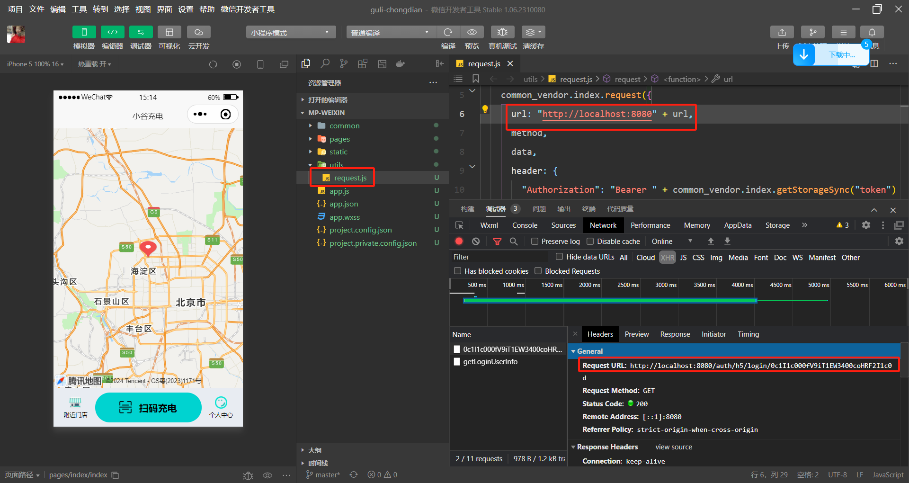

# 微信授权登录

[TOC]

## 1、用户登录

用户端是微信小程序，打开小程序，进入小程序的第一步就需要微信授权登录

将微信小程序/mp-weixin导入微信开发者工具



说明：加入AppId对应的开发者平台

### 1.1、微信授权登录

官方文档：https://developers.weixin.qq.com/miniprogram/dev/framework/open-ability/login.html

小程序可以通过微信官方提供的登录能力方便地获取微信提供的用户身份标识，快速建立小程序内的用户体系。

#### 1.1.1、登录流程时序


说明：

1. 调用 [wx.login()](https://developers.weixin.qq.com/miniprogram/dev/api/open-api/login/wx.login.html) 获取 **临时登录凭证code** ，并回传到开发者服务器。
2. 调用 [auth.code2Session](https://developers.weixin.qq.com/miniprogram/dev/OpenApiDoc/user-login/code2Session.html) 接口，换取 **用户唯一标识 OpenID** 、 用户在微信开放平台账号下的**唯一标识UnionID**（若当前小程序已绑定到微信开放平台账号） 和 **会话密钥 session_key**。

之后开发者服务器可以根据用户标识来生成自定义登录态，用于后续业务逻辑中前后端交互时识别用户身份。

#### 1.1.2、小程序端

官方文档：https://developers.weixin.qq.com/miniprogram/dev/api/open-api/login/wx.login.html

wx.login(Object object)调用接口获取登录凭证（code）。通过凭证进而换取用户登录态信息，包括用户在当前小程序的唯一标识（openid）

详情见官方文档

#### 1.1.3、服务器端

官方文档：https://developers.weixin.qq.com/miniprogram/dev/OpenApiDoc/user-login/code2Session.html

登录凭证校验。通过 wx.login 接口获得临时登录凭证 code 后传到开发者服务器调用此接口完成登录流程。

详情见官方文档

#### 1.1.4、微信Java开发工具包

文档：https://gitee.com/binary/weixin-java-tools

微信`Java`开发工具包，支持包括微信支付、开放平台、公众号、企业微信/企业号、小程序等微信功能模块的后端开发。

微信小程序：`weixin-java-miniapp`

```xml
<dependency>
    <groupId>com.github.binarywang</groupId>
    <artifactId>weixin-java-miniapp</artifactId>
    <version>4.5.5.B</version>
</dependency>
```


### 1.2、远程接口开发

操作模块：`share-user`

#### 1.2.1、pom.xml

```xml
<dependency>
    <groupId>com.github.binarywang</groupId>
    <artifactId>weixin-java-miniapp</artifactId>
</dependency>
```

#### 1.2.2、share-user-dev.yml

```yaml
wx:
  miniapp:
    appId: wxcc651fcbab275e33
    secret: 5f353399a2eae7ff6ceda383e924c5f6
```

#### 1.2.3、WxMaProperties

```java
package com.share.user.config;

@Data
@Component
@ConfigurationProperties(prefix = "wx.miniapp")
public class WxMaProperties {

    private String appId;
    private String secret;
}
```

#### 1.2.4、WxMaConfig

配置WxMaService，通过WxMaService可以快速获取微信OpenId

```java
package com.share.user.config;

@Component
public class WxMaConfig {

    @Autowired
    private WxMaProperties wxMaProperties;

    @Bean
    public WxMaService wxMaService() {
        WxMaDefaultConfigImpl config = new WxMaDefaultConfigImpl();
        config.setAppid(wxMaProperties.getAppId());
        config.setSecret(wxMaProperties.getSecret());

        WxMaService service = new WxMaServiceImpl();
        service.setWxMaConfig(config);
        return service;
    }
}
```

#### 1.2.5、UserInfoApiController

```java
package com.share.user.api;

@RestController
@RequestMapping("/userInfo")
public class UserInfoApiController extends BaseController {

    @Autowired
    private IUserInfoService userInfoService;


    @Operation(summary = "小程序授权登录")
    @InnerAuth
    @GetMapping("/wxLogin/{code}")
    public R<UserInfo> wxLogin(@PathVariable String code) {
        return R.ok(userInfoService.wxLogin(code));
    }

    @Operation(summary = "更新用户登录信息")
    @InnerAuth
    @PutMapping("/updateUserLogin")
    public R<Boolean> updateUserLogin(@RequestBody UpdateUserLogin updateUserLogin)
    {
        return R.ok(userInfoService.updateUserLogin(updateUserLogin));
    }

}
```

#### 1.2.6、UpdateUserLogin

操作模块：`share-api-user`，该对象远程调用使用

```java
package com.share.user.api.domain;

@Data
public class UpdateUserLogin
{

    private Long userId;

    /** 最后一次登录ip */
    private String lastLoginIp;

    /** 最后一次登录时间 */
    @JsonFormat(pattern = "yyyy-MM-dd")
    private Date lastLoginTime;


}
```

#### 1.2.7、IUserInfoService

```java
UserInfo wxLogin(String code);

 Boolean updateUserLogin(UpdateUserLogin updateUserLogin);
```

#### 1.2.8、UserInfoServiceImpl

```java
@Autowired
private WxMaService wxMaService;

@Autowired
private UserLoginLogMapper userLoginLogMapper;

@Transactional(rollbackFor = {Exception.class})
@Override
public UserInfo wxLogin(String code) {
    String openId = null;
    try {
        //获取openId
        WxMaJscode2SessionResult sessionInfo = wxMaService.getUserService().getSessionInfo(code);
        openId = sessionInfo.getOpenid();
        log.info("【小程序授权】openId={}", openId);
    } catch (Exception e) {
        e.printStackTrace();
        throw new ServiceException("微信登录失败");
    }

    UserInfo userInfo = this.getOne(new LambdaQueryWrapper<UserInfo>().eq(UserInfo::getWxOpenId, openId));
    if (null == userInfo) {
        userInfo = new UserInfo();
        userInfo.setNickname(String.valueOf(System.currentTimeMillis()));
        userInfo.setAvatarUrl("https://oss.aliyuncs.com/aliyun_id_photo_bucket/default_handsome.jpg");
        userInfo.setWxOpenId(openId);
        this.save(userInfo);
    }
    return userInfo;
}

@Override
public Boolean updateUserLogin(UpdateUserLogin updateUserLogin) {
    UserInfo userInfo = new UserInfo();
    userInfo.setId(updateUserLogin.getUserId());
    userInfo.setLastLoginIp(updateUserLogin.getLastLoginIp());
    userInfo.setLastLoginTime(updateUserLogin.getLastLoginTime());
    userInfoMapper.updateById(userInfo);

    //登录日志
    UserLoginLog userLoginLog = new UserLoginLog();
    userLoginLog.setUserId(userInfo.getId());
    userLoginLog.setMsg("小程序登录");
    userLoginLog.setIpaddr(updateUserLogin.getLastLoginIp());
    userLoginLogMapper.insert(userLoginLog);
    return true;
}
```

说明：自动生成UserLoginLog与UserLoginLogMapper对象


### 1.3、openFeign接口定义

操作模块：share-api-user

#### 1.3.1、RemoteUserInfoService

```java
@GetMapping("/userInfo/wxLogin/{code}")
    public R<UserInfo> wxLogin(@PathVariable("code") String code);

    @PutMapping("/userInfo/updateUserLogin")
    public R<Boolean> updateUserLogin(@RequestBody UpdateUserLogin updateUserLogin);

```

#### 1.3.2、RemoteUserInfoFallbackFactory

```java
@Override
public R<UserInfo> wxLogin(String code, String source) {
    return R.fail("微信登录失败:" + throwable.getMessage());
}

@Override
public R<Boolean> updateUserLogin(UpdateUserLogin updateUserLogin, String source) {
    return R.fail("更新用户登录失败:" + throwable.getMessage());
}
```


### 1.4、开发登录业务接口

操作模块：`share-auth`

#### 1.4.1、pom.xml

```xml
<dependency>
    <groupId>com.share</groupId>
    <artifactId>share-api-user</artifactId>
    <version>3.6.3</version>
</dependency>
```

#### 1.4.2、H5TokenController

```java
package com.share.auth.controller;

@RestController
public class H5TokenController
{

    @Autowired
    private H5LoginService h5LoginService;

    @Autowired
    private TokenService tokenService;

    @GetMapping("/h5/login/{code}")
    public R<?> login(@PathVariable String code)
    {
        // 用户登录
        LoginUser userInfo = h5LoginService.login(code);
        // 获取登录token
        return R.ok(tokenService.createToken(userInfo));
    }

}
```

#### 1.4.3、H5LoginService

```java
package com.share.auth.service;

@Component
public class H5LoginService
{
    @Autowired
    private RemoteUserInfoService remoteUserInfoService;

    @Autowired
    private SysRecordLogService recordLogService;

    /**
     * 登录
     */
    public LoginUser login(String code)
    {
        // 用户名或密码为空 错误
        if (StringUtils.isAnyBlank(code))
        {
            //recordLogService.recordLogininfor(username, Constants.LOGIN_FAIL, "用户/密码必须填写");
            throw new ServiceException("微信code必须填写");
        }
        // 查询用户信息
        R<UserInfo> userResult = remoteUserInfoService.wxLogin(code);

        if (StringUtils.isNull(userResult) || StringUtils.isNull(userResult.getData()))
        {
            throw new ServiceException("微信授权登录失败");
        }

        if (R.FAIL == userResult.getCode())
        {
            throw new ServiceException(userResult.getMsg());
        }

        UserInfo userInfo = userResult.getData();
        LoginUser loginUser = new LoginUser();
        loginUser.setUserid(userInfo.getId());
        loginUser.setUsername(userInfo.getWxOpenId());
        loginUser.setStatus(userInfo.getStatus()+"");
        if ("0".equals(userInfo.getStatus()))
        {
            recordLogService.recordLogininfor(userInfo.getWxOpenId(), Constants.LOGIN_FAIL, "用户已停用，请联系管理员");
            throw new ServiceException("对不起，您的账号：" + userInfo.getWxOpenId() + " 已停用");
        }
        recordLogService.recordLogininfor(userInfo.getWxOpenId(), Constants.LOGIN_SUCCESS, "登录成功");

        //更新登录信息
        UpdateUserLogin updateUserLogin = new UpdateUserLogin();
        updateUserLogin.setUserId(userInfo.getId());
        updateUserLogin.setLastLoginIp(IpUtils.getIpAddr());
        updateUserLogin.setLastLoginTime(new Date());
        remoteUserInfoService.updateUserLogin(updateUserLogin, SecurityConstants.INNER);
        return loginUser;
    }
}
```

#### 1.4.4、share-gateway-dev.yml

排除登录认证

```yaml
  # 不校验白名单
  ignore:
    whites:
      ...
      - /auth/h5/**
```


### 1.5、根据token获取用户基本信息

#### 1.5.1、UserVo

操作模块：`share-api-user`

```java
package com.share.user.api.domain;
@Data
@Schema(description = "用户类")
public class UserVo {

	@Schema(description = "昵称")
	private String nickname;

	@Schema(description = "头像")
	private String avatar;

	@Schema(description = "微信open id")
	private String wxOpenId;

	@Schema(description = "押金状态（0：未验证 1：免押金 2：已交押金）")
	private String depositStatus;
}
```

#### 1.5.2、UserInfoController

操作模块：`share-user`

```java
@Operation(summary = "获取当前登录用户信息")
@RequiresLogin
@GetMapping("/getLoginUserInfo")
public AjaxResult getLoginUserInfo(HttpServletRequest request) {
    Long userId = SecurityContextHolder.getUserId();
    UserInfo userInfo = userInfoService.getById(userId);
    UserVo userInfoVo = new UserVo();
    BeanUtils.copyProperties(userInfo, userInfoVo);
    return success(userInfoVo);
}
```