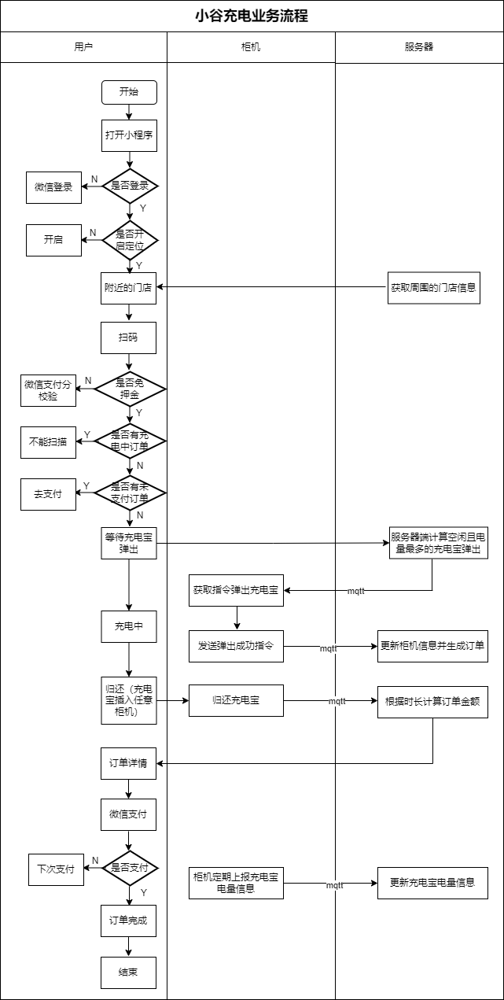

# MQTT消息服务

[TOC]

## 1、MQTT协议

### 1.1、HTTP协议

#### 1.1.1、HTTP协议概述

HTTP是一种应用层协议，使用TCP作为传输层协议，默认端口是80，基于请求和响应的方式，即客户端发起请求，服务器响应请求并返回数据（HTML，JSON）。在HTTP/1.1中，使用了长连接技术，允许一个连接复用多个请求和响应，减少了TCP三次握手的消耗。

#### 1.1.2、HTTP的基本结构

**请求行：**包含请求方法（GET, POST等）、请求URL、协议版本。

**请求头：**包括各种元数据，如Connection、Host、Content-Type等。

**空行：**标识头部与载荷的分界线

**请求体：**通常在POST请求中出现，包含请求的具体数据。 

#### 1.1.3、HTTP的局限性

**无状态性：**HTTP是无状态协议，每次请求都是独立的，不会记录上一次请求的任何信息，如果需要记录用户状态，需要额外机制如：
**Cookies：**浏览器在发送请求时，可以携带上次访问时服务器存储的Cookies（小型文本数据），服务器通过这些Cookies来识别用户的身份或维持会话状态。
**高开销：**每次请求都需要建立TCP连接，导致网络开销较大，尤其在频繁请求的场景下。
**实时性差：**HTTP通常是客户端主动发起请求，服务器无法主动推送数据。


### 1.2、MQTT协议概述

#### 1.2.1、MQTT的基本概念

MQTT是一个基于客户端-服务器的消息发布/订阅传输协议。使用TCP协议进行传输，端口为1883（非加密）和8883（加密），客户端通过发布（Publish）消息到某个主题（Topic），而其他订阅（Subscribe）该主题的客户端会接收到消息。协议是轻量、简单、开放和易于实现的，这些特点使它适用范围非常广泛。在很多情况下，包括受限的环境中，如：机器与机器（M2M）通信和物联网（IoT）。其在，通过卫星链路通信传感器、偶尔拨号的医疗设备、智能家居、及一些小型化设备中已广泛使用。

#### 1.2.2、MQTT的基本结构

**主题（Topic）：**消息的标签，决定了消息的去向。订阅者根据主题来接收消息。
**QoS（Quality of Service）级别：**决定消息传输的可靠性。MQTT支持三个级别的QoS：
	QoS 0：最多一次发送，不保证消息送达。
	QoS 1：至少一次发送，确保消息至少送达一次。
	QoS 2：只有一次发送，确保消息只送达一次。
**保留标志：**用于确保客户端在订阅时能接收到最后一条消息。


## 2、EMQX

根据业务流程图可以看出，系统与柜机交互是通过MQTT协议进行，如图所示



文档地址：https://docs.emqx.com/zh/emqx/v5.0/


### 2.1、产品概览

[EMQX](https://www.emqx.io/) 是一款大规模可弹性伸缩的云原生分布式物联网 [MQTT](https://mqtt.org/) 消息服务器。

作为全球最具扩展性的 MQTT 消息服务器，EMQX 提供了高效可靠海量物联网设备连接，能够高性能实时移动与处理消息和事件流数据，帮助您快速构建关键业务的物联网平台与应用。

### 2.2、产品优势

- **开放源码**：基于 Apache 2.0 许可证完全开源，自 2013 年起 200+ 开源版本迭代。
- **MQTT 5.0**：100% 支持 MQTT 5.0 和 3.x 协议标准，更好的伸缩性、安全性和可靠性。
- **海量连接**：单节点支持 500 万 MQTT 设备连接，集群可扩展至 1 亿并发 MQTT 连接。
- **高性能**：单节点支持每秒实时接收、移动、处理与分发数百万条的 MQTT 消息。
- **低时延**：基于 Erlang/OTP 软实时的运行时系统设计，消息分发与投递时延低于 1 毫秒。
- **高可用**：采用 Masterless 的大规模分布式集群架构，实现系统高可用和水平扩展。

### 2.3、Docker 安装EMQX

1、挂载数据目录到容器外部，新建如下2个目录

```shell
/opt/emqx/data
/opt/emqx/log
```

2、给目录分配权限

```shell
cd /opt/emqx
chmod 777 log
chmod 777 data
```

3、启动容器并挂载目录

```shell
docker run -d --name emqx \
-p 1883:1883 -p 8083:8083 \
-p 8084:8084 -p 8883:8883 \
-p 18083:18083 \
-v /opt/emqx/data:/opt/emqx/data \
-v /opt/emqx/log:/opt/emqx/log \
emqx/emqx:5.7.0
```


## 3、系统消息处理

系统既要监听柜机的Topic信息，用户扫码后还要给柜机发送Topic消息，只有把消息都封装好了，后续业务才能正确通信，系统要监听消息与发送消息，首先系统需要连接上mqtt服务器

操作模块：`share-device`

### 3.1、连接测试

官方文档：https://docs.emqx.com/zh/emqx/latest/connect-emqx/java.html

#### 3.1.1、pom.xml

```xml
<dependency>
    <groupId>org.eclipse.paho</groupId>
    <artifactId>org.eclipse.paho.client.mqttv3</artifactId>
</dependency>
```

#### 3.1.2、MqttTest

测试类

```java
package com.share.device.emqx;

import org.eclipse.paho.client.mqttv3.*;
import org.eclipse.paho.client.mqttv3.persist.MemoryPersistence;

public class MqttTest {
    public static void main(String[] args) {
        String subTopic = "testtopic/#";
        String pubTopic = "testtopic/1";
        String content = "Hello World";
        int qos = 2;
        String broker = "tcp://127.0.0.1:1883";
        String clientId = "emqx_test";
        MemoryPersistence persistence = new MemoryPersistence();

        try {
            MqttClient client = new MqttClient(broker, clientId, persistence);

            // MQTT 连接选项
            MqttConnectOptions connOpts = new MqttConnectOptions();
            connOpts.setUserName("emqx_test");
            connOpts.setPassword("emqx_test_password".toCharArray());
            // 保留会话
            connOpts.setCleanSession(true);

            // 设置回调
            client.setCallback(new MqttCallback() {

                @Override
                public void connectionLost(Throwable cause) {
                    // 连接丢失后，一般在这里面进行重连
                    System.out.println("连接断开，可以做重连");
                }

                @Override
                public void messageArrived(String topic, MqttMessage message) throws Exception {
                    // subscribe后得到的消息会执行到这里面
                    System.out.println("接收消息主题:" + topic);
                    System.out.println("接收消息Qos:" + message.getQos());
                    System.out.println("接收消息内容:" + new String(message.getPayload()));
                }

                @Override
                public void deliveryComplete(IMqttDeliveryToken token) {
                    System.out.println("deliveryComplete---------" + token.isComplete());
                }
            });

            // 建立连接
            System.out.println("Connecting to broker: " + broker);
            client.connect(connOpts);

            System.out.println("Connected");
            System.out.println("Publishing message: " + content);

            // 订阅
            client.subscribe(subTopic);

            // 消息发布所需参数
            MqttMessage message = new MqttMessage(content.getBytes());
            message.setQos(qos);
            client.publish(pubTopic, message);
            System.out.println("Message published");

            client.disconnect();
            System.out.println("Disconnected");
            client.close();
            System.exit(0);
        } catch (MqttException me) {
            System.out.println("reason " + me.getReasonCode());
            System.out.println("msg " + me.getMessage());
            System.out.println("loc " + me.getLocalizedMessage());
            System.out.println("cause " + me.getCause());
            System.out.println("excep " + me);
            me.printStackTrace();
        }
    }
}
```

### 3.2、封装mqtt

系统要连接上mqtt服务器，因此系统也是一个特殊的客户端，只有连接上mqtt服务器，系统才能发布与订阅消息

#### 3.2.1、share-device-dev.yml

```yaml
emqx:
  client:
    clientId: xt001
    username: xt001
    password: 111111
    serverURI: tcp://127.0.0.1:1883
    keepAliveInterval: 10
    connectionTimeout: 30
```

#### 3.2.2、EmqxProperties

```java
package com.share.device.emqx.config;

import lombok.Data;
import org.springframework.boot.context.properties.ConfigurationProperties;
import org.springframework.stereotype.Component;

@Data
@Component
@ConfigurationProperties(prefix = "emqx.client")
public class EmqxProperties {

    private String clientId;
    private String username;
    private String password;
    private String serverURI;
    private int keepAliveInterval;
    private int connectionTimeout;
}
```

**排除系统客户端**

EmqxServiceImpl排除系统客户端认证

```java
@Autowired
private EmqxProperties emqxProperties;

public AuthVo auth(AuthDto authDto) {
    //排除系统客户端
    if (authDto.getClientid().equals(emqxProperties.getClientId())) {
        return AuthVo.builder()
            .result(ALLOW)
            .build();
    }
    ...
}
```

#### 3.2.3、EmqxConstants

系统使用到的Topic信息

```java
package com.share.device.emqx.constant;

/**
 * Emqx常量信息
 *
 */
public class EmqxConstants {


    /** 充电宝插入，柜机发布Topic消息， 服务器监听消息 */
    public final static String TOPIC_POWERBANK_CONNECTED = "/sys/powerBank/connected";

    /** 用户扫码，服务器发布Topic消息 柜机监听消息  */
    public final static String TOPIC_SCAN_SUBMIT = "/sys/scan/submit/%s";

    /** 充电宝弹出，柜机发布Topic消息，服务器监听消息  */
    public final static String TOPIC_POWERBANK_UNLOCK = "/sys/powerBank/unlock";

    /** 柜机属性上报，服务器监听消息  */
    public final static String TOPIC_PROPERTY_POST = "/sys/property/post";
}
```

#### 3.2.4、EmqxClientWrapper

封装mqtt连接、订阅与发布接口

```java
package com.share.device.emqx;

import com.share.device.emqx.callback.OnMessageCallback;
import com.share.device.emqx.config.EmqxProperties;
import com.share.device.emqx.constant.EmqxConstants;
import jakarta.annotation.PostConstruct;
import lombok.extern.slf4j.Slf4j;
import org.eclipse.paho.client.mqttv3.*;
import org.eclipse.paho.client.mqttv3.persist.MemoryPersistence;
import org.springframework.beans.factory.annotation.Autowired;
import org.springframework.stereotype.Component;

@Slf4j
@Component
public class EmqxClientWrapper {

    @Autowired
    private EmqxProperties emqxProperties;

    private MqttClient client;

    @Autowired
    private OnMessageCallback onMessageCallback;

    @PostConstruct
    private void init() {
        MqttClientPersistence mqttClientPersistence = new MemoryPersistence();
        try {
            //新建客户端 参数：MQTT服务的地址，客户端名称，持久化
            client = new MqttClient(emqxProperties.getServerURI(), emqxProperties.getClientId(), mqttClientPersistence);

            // 设置回调
            client.setCallback(onMessageCallback);

            // 建立连接
            connect();


        } catch (MqttException e) {
            log.info("MqttClient创建失败");
            throw new RuntimeException(e);
        }
    }

    public Boolean connect() {
        // 设置连接的配置
        try {
            client.connect(mqttConnectOptions());
            log.info("连接成功");

            // 订阅
            String[] topics = {EmqxConstants.TOPIC_POWERBANK_CONNECTED, EmqxConstants.TOPIC_POWERBANK_UNLOCK, EmqxConstants.TOPIC_PROPERTY_POST};
            client.subscribe(topics);
            return true;
        } catch (MqttException e) {
            log.info("连接失败");
            e.printStackTrace();
        }
        return false;
    }

    /*创建MQTT配置类*/
    private MqttConnectOptions mqttConnectOptions() {
        MqttConnectOptions options = new MqttConnectOptions();
        options.setUserName(emqxProperties.getUsername());
        options.setPassword(emqxProperties.getPassword().toCharArray());
        options.setAutomaticReconnect(true);//是否自动重新连接
        options.setCleanSession(true);//是否清除之前的连接信息
        options.setConnectionTimeout(emqxProperties.getConnectionTimeout());//连接超时时间
        options.setKeepAliveInterval(emqxProperties.getKeepAliveInterval());//心跳
        return options;
    }

    /**
     * 发布消息
     * @param topic
     * @param data
     */
    public void publish(String topic, String data) {
        try {
            MqttMessage message = new MqttMessage(data.getBytes());
            message.setQos(2);
            client.publish(topic, message);
        } catch (MqttException e) {
            log.info("消息发布失败");
            e.printStackTrace();
        }
    }

}
```

#### 3.2.5、OnMessageCallback

**回调消息处理类** 

```java
package com.share.device.emqx.callback;

import lombok.extern.slf4j.Slf4j;
import org.eclipse.paho.client.mqttv3.IMqttDeliveryToken;
import org.eclipse.paho.client.mqttv3.MqttCallback;
import org.eclipse.paho.client.mqttv3.MqttMessage;
import org.springframework.stereotype.Component;

@Slf4j
@Component
public class OnMessageCallback implements MqttCallback {


    @Override
    public void connectionLost(Throwable cause) {
        // 连接丢失后，一般在这里面进行重连
        System.out.println("连接断开，可以做重连");
    }

    @Override
    public void messageArrived(String topic, MqttMessage message) {
        // subscribe后得到的消息会执行到这里面
        System.out.println("接收消息主题:" + topic);
        System.out.println("接收消息Qos:" + message.getQos());
        System.out.println("接收消息内容:" + new String(message.getPayload()));

    }

    @Override
    public void deliveryComplete(IMqttDeliveryToken token) {
        System.out.println("deliveryComplete---------" + token.isComplete());
    }
}
```

说明：上面已经封装好了mqtt发布与订阅的基本框架，解下来处理消息，消息处理使用策略模式，根据Topic类型建立对应的处理Handler

#### 3.2.6、MassageHandler

定义策略接口

```java
package com.share.device.emqx.handler;

public interface MassageHandler {

    /**
     * 策略接口
     * @param message
     */
    void handleMessage(JSONObject message);
}

```

#### 3.2.7、具体Handler处理

##### GuiguEmqx

自定义注解

```java
package com.share.device.emqx.annotation;

import java.lang.annotation.*;

// 自定义注解
@Target({ElementType.TYPE})
@Retention(RetentionPolicy.RUNTIME)
@Documented
public @interface GuiguEmqx {

    String topic();

}
```

##### PowerBankConnectedHandler

充电宝插入处理类

```java
package com.share.device.emqx.handler.impl;

@Slf4j
@Component
@GuiguEmqx(topic = EmqxConstants.TOPIC_POWERBANK_CONNECTED)
public class PowerBankConnectedHandler implements MassageHandler {

    @Override
    public void handleMessage(JSONObject message) {
        log.info("handleMessage: {}", message.toJSONString());
    }
}
```

##### PowerBankUnlockHandler

充电宝弹出处理类

```java
package com.share.device.emqx.handler.impl;

@Slf4j
@Component
@GuiguEmqx(topic = EmqxConstants.TOPIC_POWERBANK_UNLOCK)
public class PowerBankUnlockHandler implements MassageHandler {


    @Override
    public void handleMessage(JSONObject message) {
        log.info("handleMessage: {}", message.toJSONString());
    }
}
```

##### PropertyPostHandler

充电宝属性上报处理类，上报电量等信息

```java
package com.share.device.emqx.handler.impl;


@Slf4j
@Component
@GuiguEmqx(topic = EmqxConstants.TOPIC_PROPERTY_POST)
public class PropertyPostHandler implements MassageHandler {

    @Override
    public void handleMessage(JSONObject message) {
        log.info("handleMessage: {}", message.toJSONString());
    }
}
```

#### 3.2.8、创建Handler工厂类

##### MessageHandlerFactory

```java
package com.share.device.emqx.factory;

public interface MessageHandlerFactory {

    MassageHandler getMassageHandler(String topic);
}
```

#### 3.2.9、Handler工厂初始化

##### MessageHandlerFactoryImpl

```java
package com.share.device.emqx.factory.impl;


@Service
public class MessageHandlerFactoryImpl implements MessageHandlerFactory, ApplicationContextAware {


    private Map<String, MassageHandler> handlerMap = new HashMap<>();

    /**
     * 初始化bean对象
     *
     * @param ioc
     */
    @Override
    public void setApplicationContext(ApplicationContext ioc) {
        // 获取对象
        Map<String, MassageHandler> beanMap = ioc.getBeansOfType(MassageHandler.class);
        for (MassageHandler massageHandler : beanMap.values()) {
            GuiguEmqx guiguEmqx = AnnotatedElementUtils.findAllMergedAnnotations(massageHandler.getClass(), GuiguEmqx.class).iterator().next();
            if (null != guiguEmqx) {
                String topic = guiguEmqx.topic();
                // 初始化到map
                handlerMap.put(topic, massageHandler);
            }
        }
    }

    @Override
    public MassageHandler getMassageHandler(String topic) {
        return handlerMap.get(topic);
    }
}
```

#### 3.2.10、OnMessageCallback

补充handler处理逻辑

```java
package com.share.device.emqx.callback;

@Slf4j
@Component
public class OnMessageCallback implements MqttCallback {

    @Autowired
    private MessageHandlerFactory messageHandlerFactory;

    @Override
    public void connectionLost(Throwable cause) {
        // 连接丢失后，一般在这里面进行重连
        System.out.println("连接断开，可以做重连");
    }

    @Override
    public void messageArrived(String topic, MqttMessage message) {
        // subscribe后得到的消息会执行到这里面
        System.out.println("接收消息主题:" + topic);
        System.out.println("接收消息Qos:" + message.getQos());
        System.out.println("接收消息内容:" + new String(message.getPayload()));
        try {
            // 根据主题选择不同的处理逻辑
            MassageHandler massageHandler = messageHandlerFactory.getMassageHandler(topic);
            if(null != massageHandler) {
                String content = new String(message.getPayload());
                massageHandler.handleMessage(JSONObject.parseObject(content));
            }
        } catch (Exception e) {
            e.printStackTrace();
            log.error("mqtt消息异常：{}", new String(message.getPayload()));
        }
    }

    @Override
    public void deliveryComplete(IMqttDeliveryToken token) {
        System.out.println("deliveryComplete---------" + token.isComplete());
    }
}
```

#### 3.2.11、测试

使用MQTTX客户端连接测试