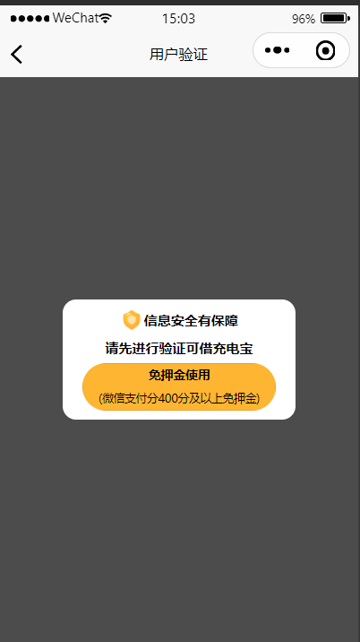
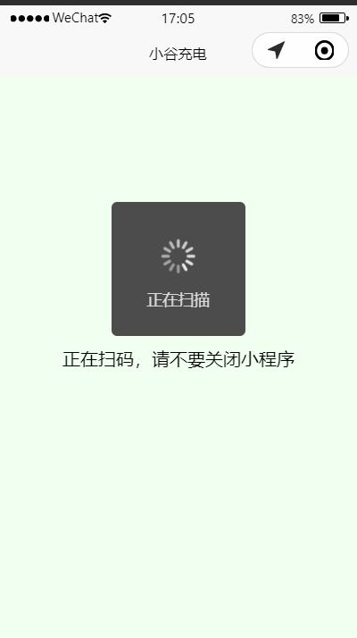
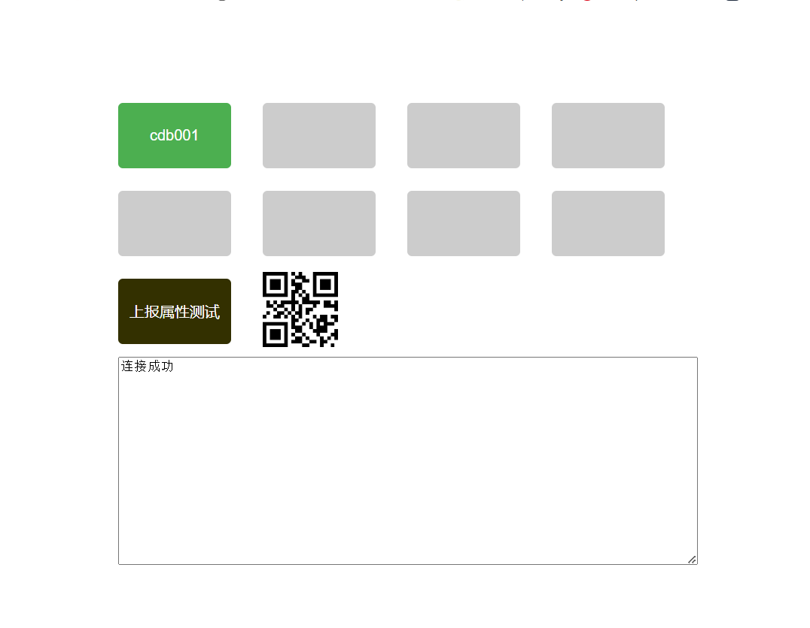
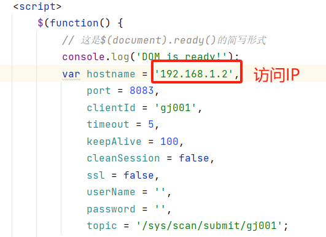

# 扫码

[TOC]

## 1、扫码需求

### 1.1、业务流程图


### 1.2、需求分析

#### 1.2.1、扫码前判断

1、是否免押金：根据微信支付分判断是否免押金

2、是否有充电中订单：如果有，则不能扫码，系统给出提示

3、是否有未支付订单，如果有，则调整到未支付页面，去支付

只有这三个条件都满足了，才可以正常扫码

#### 1.2.2、扫码

扫码主要是用户微信小程序获取柜机的唯一标识，微信小程序获取到柜机标识与服务器端通信，服务器端根据柜机标识获取空闲且电量最多的充电宝与对应卡槽，然后发送Mqtt消息给柜机，柜机收到消息，解析消息并弹出充电宝，弹出后发送弹出成功Mqtt消息给服务器端，服务器端生成订单信息。

#### 1.2.3、归还

用户使用完充电宝，直接插入任意匹配的柜机，柜机识别充电宝归还信息，发送Mqtt消息给服务器端，服务器端结束对应充电宝的订单，并计算费用，然后走微信支付流程

## 2、扫码接口

### 2.1、扫码前判断：是否免押金

微信支付分申请权限：

https://pay.weixin.qq.com/docs/merchant/products/weixin-pay-score/permission.html

申请微信支付分接口需要一定的资质，签订协议等，我们公司不具有该资质，因此申请不了，因此大家知道有这个流程即可，简单模拟

微信支付分API文档：

https://pay.weixin.qq.com/wiki/doc/apiv3/payscore.php?chapter=18_1&index=2

感兴趣的同学可以认真研读微信支付分相关接口文档

当前系统直接模拟，涉及user_info表，字段：deposit_status（0：未验证 1：免押金 2：已交押金），该字段默认为：0，当用户第一次扫码时，跳转到验证页面，如图



点击“免押金使用”，模拟接口默认返回免押金使用

#### 2.1.1、UserInfoApiController

```java
@Operation(summary = "是否免押金")
@RequiresLogin
@GetMapping("/isFreeDeposit")
public AjaxResult isFreeDeposit() {
    return success(userInfoService.isFreeDeposit());
}
```

#### 2.1.2、IUserInfoService

```
Boolean isFreeDeposit();
```

#### 2.1.3、UserInfoServiceI

```java
@Override
public Boolean isFreeDeposit() {
    //微信支付分
    //https://pay.weixin.qq.com/wiki/doc/apiv3/payscore.php?chapter=18_1&index=2
    // 默认免押金，模拟实现
    UserInfo userInfo = this.getById(SecurityContextHolder.getUserId());
    userInfo.setDepositStatus("1");
    this.updateById(userInfo);
    return true;
}
```


### 2.2、扫码前判断：未完成订单

未完成订单包含：是否有充电中订单与是否有未支付订单，合并为一个接口处理

#### 2.2.1、远程接口

##### OrderInfoApiController

提供两个接口，一个远程调用接口，一个对小程序开发接口


```java
package com.share.order.api;

@Tag(name = "订单接口管理")
@RestController
@RequestMapping("/orderInfo")
public class OrderInfoApiController extends BaseController
{
    @Autowired
    private IOrderInfoService orderInfoService;

    @Operation(summary = "获取未完成订单")
    @RequiresLogin
    @GetMapping("getNoFinishOrder")
    public AjaxResult getNoFinishOrder() {
        return success(orderInfoService.getNoFinishOrder(SecurityUtils.getUserId()));
    }

    @Operation(summary = "获取未完成订单")
    @InnerAuth
    @GetMapping("getNoFinishOrder/{userId}")
    public R<OrderInfo> getNoFinishOrder(@PathVariable Long userId) {
        return R.ok(orderInfoService.getNoFinishOrder(userId));
    }

}
```

##### IOrderInfoService

```
OrderInfo getNoFinishOrder(Long userId);
```

##### OrderInfoServiceImpl

```java
@Override
public OrderInfo getNoFinishOrder(Long userId) {
    // 查询用户是否有使用中与未支付订单
    return orderInfoMapper.selectOne(new LambdaQueryWrapper<OrderInfo>()
            .eq(OrderInfo::getUserId, userId)
            .in(OrderInfo::getStatus, Arrays.asList("0", "1"))// 订单状态：0:充电中 1：未支付 2：已支付
            .orderByDesc(OrderInfo::getId)
            .last("limit 1")
    );
}
```

#### 2.2.2、搭建订单服务远程接口模块

##### spzx-api-order

在share-api模块下新建子模块spzx-api-order

##### pom.xml

```xml
<?xml version="1.0" encoding="UTF-8"?>
<project xmlns:xsi="http://www.w3.org/2001/XMLSchema-instance"
         xmlns="http://maven.apache.org/POM/4.0.0"
         xsi:schemaLocation="http://maven.apache.org/POM/4.0.0 http://maven.apache.org/xsd/maven-4.0.0.xsd">
    <parent>
        <groupId>com.share</groupId>
        <artifactId>share-api</artifactId>
        <version>3.6.3</version>
    </parent>
    <modelVersion>4.0.0</modelVersion>

    <artifactId>share-api-order</artifactId>

    <description>
        share-api-order订单接口模块
    </description>

    <dependencies>

        <!-- RuoYi Common Core-->
        <dependency>
            <groupId>com.share</groupId>
            <artifactId>share-common-core</artifactId>
        </dependency>

    </dependencies>

</project>
```

##### pom.xml

`share-modules`模块引入api依赖

```xml
<dependency>
    <groupId>com.share</groupId>
    <artifactId>share-api-order</artifactId>
    <version>3.6.3</version>
</dependency>
```

##### 实体类

将订单模块下的实体类OrderInfo、OrderBill、UserInfoVo，提升到 share-api-order模块com.share.order.api.domain包下

#### 2.2.3、openFeign接口定义

##### RemoteOrderInfoService

```java
package com.share.order.api;

@FeignClient(contextId = "remoteOrderInfoService", value = ServiceNameConstants.ORDER_SERVICE, fallbackFactory = RemoteOrderInfoFallbackFactory.class)
public interface RemoteOrderInfoService {

    @GetMapping("/orderInfo/getNoFinishOrder/{userId}")
    public R<OrderInfo> getNoFinishOrder(@PathVariable("userId") Long userId);
}
```

##### ServiceNameConstants

```
public static final String ORDER_SERVICE = "share-order";
```

##### RemoteOrderInfoFallbackFactory

```java
package com.share.order.api.factory;

@Component
public class RemoteOrderInfoFallbackFactory implements FallbackFactory<RemoteOrderInfoService>
{
    private static final Logger log = LoggerFactory.getLogger(RemoteOrderInfoFallbackFactory.class);

    @Override
    public RemoteOrderInfoService create(Throwable throwable)
    {
        log.error("订单服务调用失败:{}", throwable.getMessage());
        return new RemoteOrderInfoService()
        {

            @Override
            public R<OrderInfo> getNoFinishOrder(Long userId, String source) {
                return R.fail("获取用户未完成订单失败:" + throwable.getMessage());
            }
        };
    }
}
```

##### 加载配置类

resources/META-INF/spring/org.springframework.boot.autoconfigure.AutoConfiguration.imports

```
com.share.order.api.factory.RemoteOrderInfoFallbackFactory
```


### 2.3、基础接口封装

这些接口后续都会使用上

#### 2.3.1、getBtCabinetNo

##### ICabinetService

```java
Cabinet getBtCabinetNo(String cabinetNo);
```

##### CabinetServiceImpl

```java
@Override
public Cabinet getBtCabinetNo(String cabinetNo) {
    return cabinetMapper.selectOne(new LambdaQueryWrapper<Cabinet>().eq(Cabinet::getCabinetNo, cabinetNo));
}
```

#### 2.3.2、getBtSlotNo

##### ICabinetSlotService

```java
package com.share.device.service;

public interface ICabinetSlotService extends IService<CabinetSlot>
{

    CabinetSlot getBtSlotNo(Long cabinetId, String slotNo);

}
```

##### CabinetSlotServiceImpl

```java
package com.share.device.service.impl;

@Service
public class CabinetSlotServiceImpl extends ServiceImpl<CabinetSlotMapper, CabinetSlot> implements ICabinetSlotService
{
    @Autowired
    private CabinetSlotMapper cabinetSlotMapper;

    @Override
    public CabinetSlot getBtSlotNo(Long cabinetId, String slotNo) {
        return cabinetSlotMapper.selectOne(new LambdaQueryWrapper<CabinetSlot>().eq(CabinetSlot::getCabinetId, cabinetId).eq(CabinetSlot::getSlotNo, slotNo));
    }

}
```

#### 2.3.3、getByPowerBankNo

##### IPowerBankService

```java
PowerBank getByPowerBankNo(String powerBankNo);
```

##### PowerBankServiceImpl

```java
@Override
public PowerBank getByPowerBankNo(String powerBankNo) {
    return powerBankMapper.selectOne(new LambdaQueryWrapper<PowerBank>().eq(PowerBank::getPowerBankNo, powerBankNo));
}
```


### 2.4、扫码业务接口

#### 2.4.1、DeviceApiController

```java
@Operation(summary = "扫码充电")
@RequiresLogin
@GetMapping("scanCharge/{cabinetNo}")
public AjaxResult scanCharge(@PathVariable String cabinetNo) {
    return success(deviceService.scanCharge(cabinetNo));
}
```

#### 2.4.2、IDeviceService

```java
ScanChargeVo scanCharge(String cabinetNo);
```

#### 2.4.3、ScanChargeVo

```java
package com.share.device.domain;

@Data
@Schema(description = "扫码充电返回对象")
public class ScanChargeVo
{

    /** 状态（1是 0否） */
    @Schema(description = "状态：1：成功 2：有未归还充电宝 3：有未支付订单")
    private String status;

    @Schema(description = "消息")
    private String message;

}
```
#### 2.4.4、DeviceServiceImpl

```java
@Autowired
private RemoteOrderInfoService remoteOrderInfoService;

@Autowired
private RemoteUserInfoService remoteUserInfoService;

@Autowired
private EmqxClientWrapper emqxClientWrapper;

@Autowired
private ICabinetSlotService cabinetSlotService;

@Autowired
private IPowerBankService powerBankService;

@Override
public ScanChargeVo scanCharge(String cabinetNo) {
    // 扫码充电返回对象
    ScanChargeVo scanChargeVo = new ScanChargeVo();

    //免押金判断
    R<UserInfo> userInfoResult =  remoteUserInfoService.getUserInfo(SecurityContextHolder.getUserId(), SecurityConstants.INNER);
    if (R.FAIL == userInfoResult.getCode()) {
        throw new ServiceException(userInfoResult.getMsg());
    }
    UserInfo userInfo = userInfoResult.getData();
    if (null == userInfo) {
        throw new ServiceException("获取用户信息失败");
    }
    if("0".equals(userInfo.getDepositStatus())) {
        throw new ServiceException("未申请免押金使用");
    }

    R<OrderInfo> orderInfoResult = remoteOrderInfoService.getNoFinishOrder(SecurityUtils.getUserId(), SecurityConstants.INNER);
    if (R.FAIL == orderInfoResult.getCode()) {
        throw new ServiceException(orderInfoResult.getMsg());
    }
    OrderInfo orderInfo = orderInfoResult.getData();
    if(null != orderInfo) {
        if("0".equals(orderInfo.getStatus())) {
            scanChargeVo.setStatus("2");
            scanChargeVo.setMessage("有未归还充电宝，请归还后使用");
            return scanChargeVo;
        }
        if("1".equals(orderInfo.getStatus())) {
            scanChargeVo.setStatus("3");
            scanChargeVo.setMessage("有未支付订单，去支付");
            return scanChargeVo;
        }
    }

    // 获取可用充电宝信息
    AvailableProwerBankVo availableProwerBankVo = this.checkAvailableProwerBank(cabinetNo);
    if(null == availableProwerBankVo) {
        throw new ServiceException("无可用充电宝");
    }
    if(!StringUtils.isEmpty(availableProwerBankVo.getErrMessage())) {
        throw new ServiceException(availableProwerBankVo.getErrMessage());
    }

    // 生成借取指令，弹出充电宝
    JSONObject object = new JSONObject();
    object.put("uId", SecurityContextHolder.getUserId());
    object.put("mNo", "mm"+ RandomUtil.randomString(8));
    object.put("cNo", cabinetNo);
    object.put("pNo", availableProwerBankVo.getPowerBankNo());
    object.put("sNo", availableProwerBankVo.getSlotNo());
    String topic = String.format(EmqxConstants.TOPIC_SCAN_SUBMIT, cabinetNo);
    emqxClientWrapper.publish(topic, object.toJSONString());

    scanChargeVo.setStatus("1");
    return scanChargeVo;
}

/**
 * 根据柜机编号获取一个可用最优的充电宝
 * @param cabinetNo
 * @return
 */
public AvailableProwerBankVo checkAvailableProwerBank(String cabinetNo) {
    AvailableProwerBankVo availableProwerBankVo = new AvailableProwerBankVo();

    Cabinet cabinet = cabinetService.getOne(new LambdaQueryWrapper<Cabinet>().eq(Cabinet::getCabinetNo, cabinetNo));
    if(cabinet.getAvailableNum() == 0) {
        availableProwerBankVo.setErrMessage("无可用充电宝");
        return availableProwerBankVo;
    }
    // 获取插槽列表
    List<CabinetSlot> cabinetSlotList = cabinetSlotService.list(new LambdaQueryWrapper<CabinetSlot>()
            .eq(CabinetSlot::getCabinetId, cabinet.getId())
            .eq(CabinetSlot::getStatus, "1") // 状态（1：占用 0：空闲 2：锁定）
    );
    // 获取插槽对应的充电宝id列表
    List<Long> powerBankIdList = cabinetSlotList.stream().filter(item -> null != item.getPowerBankId()).map(CabinetSlot::getPowerBankId).collect(Collectors.toList());
    //获取可用充电宝列表
    List<PowerBank> powerBankList = powerBankService.list(new LambdaQueryWrapper<PowerBank>().in(PowerBank::getId, powerBankIdList).eq(PowerBank::getStatus, "1"));
    if(CollectionUtils.isEmpty(powerBankList)) {
        availableProwerBankVo.setErrMessage("无可用充电宝");
        return availableProwerBankVo;
    }
    // 根据电量降序排列
    if(powerBankList.size() > 1) {
        Collections.sort(powerBankList, (o1, o2) -> o2.getElectricity().compareTo(o1.getElectricity()));
    }
    // 获取电量最多的充电宝
    PowerBank powerBank = powerBankList.get(0);
    // 获取电量最多的充电宝插槽信息
    CabinetSlot cabinetSlot = cabinetSlotList.stream().filter(item -> null != item.getPowerBankId() && item.getPowerBankId().equals(powerBank.getId())).collect(Collectors.toList()).get(0);
    //锁定柜机卡槽
    cabinetSlot.setStatus("2");
    cabinetSlotService.updateById(cabinetSlot);

    // 设置返回对象
    availableProwerBankVo.setPowerBankNo(powerBank.getPowerBankNo());
    availableProwerBankVo.setSlotNo(cabinetSlot.getSlotNo());
    return availableProwerBankVo;

}
```

说明：柜机锁定插槽涉及并发问题，后续处理，同时还涉及如果充电宝未弹出，需要解锁卡槽数据，后续采用延迟队列实现

### 2.5、测试

扫码成功后，系统会给柜机发送弹出充电宝的Mqtt指令

MQTTX监听Topic：/sys/scan/submit/gj001

接收消息：{"uId":1,"mNo":"mm2cqk8yp5","cNo":"gj001","pNo":"cdb001","sNo":"1"}

MQTTX发布Topic信息：/sys/powerBank/unlock

发送消息：{"uId":1,"mNo":"mm2cqk8yp5","cNo":"gj001","pNo":"cdb001","sNo":"1"}

由于系统还没有出来弹出指令，因此小程序端会一直轮询充电中的订单信息，如图



结合柜机模拟端测试：

资料/柜机模拟端/mqtt.html



更改mqtt连接IP，其他参数不用修改，保持默认：



该案例模拟数据

​	柜机编号：gj001

​	充电宝编号：cdb001

​	卡槽编号：1

说明：服务端端数据需要与模拟端数据对应，当前模拟端是特例数据，因此必须保持一致，才可以测试通过，为了演示效果，服务器端发送mqtt消息可以延迟几秒，这样配合小程序效果更好

​	

## 3、充电宝弹出业务处理

充电宝弹出，柜机会给系统发送Mqtt消息，系统接收消息，处理业务并生成订单

前面已经搭好Mqtt框架，直接在PowerBankUnlockHandler类处理弹出后的相关业务

### 3.1、PowerBankUnlockHandler

```java
package com.share.device.emqx.handler.impl;

import com.alibaba.fastjson2.JSONObject;
import com.share.common.core.utils.StringUtils;
import com.share.device.domain.Cabinet;
import com.share.device.domain.CabinetSlot;
import com.share.device.domain.PowerBank;
import com.share.device.domain.Station;
import com.share.device.emqx.annotation.GuiguEmqx;
import com.share.device.emqx.constant.EmqxConstants;
import com.share.device.emqx.handler.MassageHandler;
import com.share.device.service.ICabinetService;
import com.share.device.service.ICabinetSlotService;
import com.share.device.service.IPowerBankService;
import com.share.device.service.IStationService;
import lombok.extern.slf4j.Slf4j;
import org.springframework.beans.factory.annotation.Autowired;
import org.springframework.data.redis.core.RedisTemplate;
import org.springframework.stereotype.Component;
import org.springframework.transaction.annotation.Transactional;

import java.util.Date;
import java.util.concurrent.TimeUnit;

@Slf4j
@Component
@GuiguEmqx(topic = EmqxConstants.TOPIC_POWERBANK_UNLOCK)
public class PowerBankUnlockHandler implements MassageHandler {
    
    @Autowired
    private ICabinetService cabinetService;

    @Autowired
    private IPowerBankService powerBankService;

    @Autowired
    private ICabinetSlotService cabinetSlotService;

    @Autowired
    private IStationService stationService;

    @Autowired
    private RedisTemplate redisTemplate;

//    @Autowired
//    private RabbitService rabbitService;

    @Transactional(rollbackFor = Exception.class)
    @Override
    public void handleMessage(JSONObject message) {
        log.info("handleMessage: {}", message.toJSONString());
        //消息编号
        String messageNo = message.getString("mNo");
        //防止重复请求
        String key = "powerBank:unlock:" + messageNo;
        boolean isExist = redisTemplate.opsForValue().setIfAbsent(key, messageNo, 1, TimeUnit.HOURS);
        if (!isExist) {
            log.info("重复请求: {}", message.toJSONString());
            return;
        }

        //柜机编号
        String cabinetNo = message.getString("cNo");
        //充电宝编号
        String powerBankNo = message.getString("pNo");
        //插槽编号
        String slotNo = message.getString("sNo");
        //用户id
        Long userId = message.getLong("uId");
        if (StringUtils.isEmpty(cabinetNo)
                || StringUtils.isEmpty(powerBankNo)
                || StringUtils.isEmpty(slotNo)
                || null == userId) {
            log.info("参数为空: {}", message.toJSONString());
            return;
        }
        //获取柜机
        Cabinet cabinet = cabinetService.getBtCabinetNo(cabinetNo);
        // 获取充电宝
        PowerBank powerBank =powerBankService.getByPowerBankNo(powerBankNo);
        // 获取插槽
        CabinetSlot cabinetSlot = cabinetSlotService.getBtSlotNo(cabinet.getId(), slotNo);
        // 获取站点
        Station station = stationService.getByCabinetId(cabinet.getId());

        //更新充电宝状态
        // 状态（0:未投放 1：可用 2：已租用 3：充电中 4：故障）
        powerBank.setStatus("2");
        powerBankService.updateById(powerBank);

        //更新插槽状态
        // 状态（1：占用 0：空闲）
        cabinetSlot.setStatus("0");
        cabinetSlot.setPowerBankId(null);
        cabinetSlot.setUpdateTime(new Date());
        cabinetSlotService.updateById(cabinetSlot);

        //更新柜机信息
        int freeSlots = cabinet.getFreeSlots() + 1;
        cabinet.setFreeSlots(freeSlots);
        int usedSlots = cabinet.getUsedSlots() - 1;
        cabinet.setUsedSlots(usedSlots);
        //可以借用
        int availableNum = cabinet.getAvailableNum() - 1;
        cabinet.setAvailableNum(availableNum);
        cabinet.setUpdateTime(new Date());
        cabinetService.updateById(cabinet);

        //发送消息构建订单
        //TODO
    }
}
```

### 3.2、IStationService

```java
Station getByCabinetId(Long cabinetId);
```

### 3.3、StationServiceI

```java
@Override
public Station getByCabinetId(Long cabinetId) {
    return stationMapper.selectOne(new LambdaQueryWrapper<Station>().eq(Station::getCabinetId, cabinetId));
}
```

## 3、订单详情接口

有未支付订单会跳转到订单详情页

#### 3.1、OrderInfoApiController

```java
@Operation(summary = "获取订单详细信息")
@RequiresLogin
@GetMapping(value = "/getOrderInfo/{id}")
public AjaxResult getOrderInfo(@PathVariable("id") Long id)
{
    return success(orderInfoService.selectOrderInfoById(id));
}
```