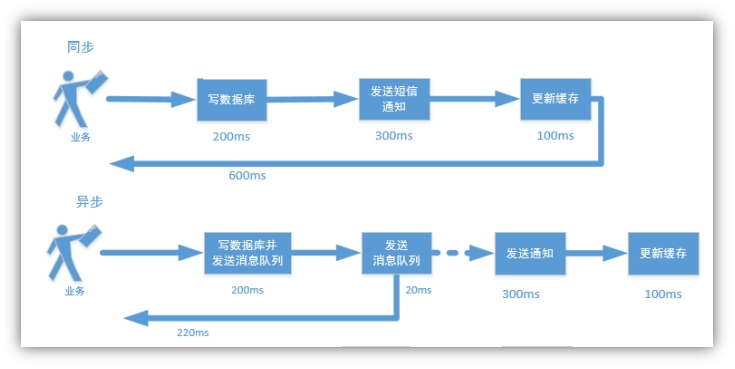
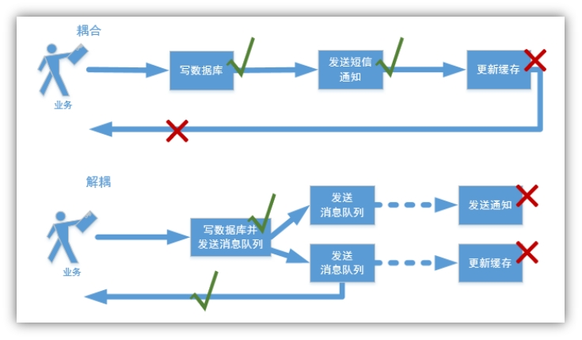
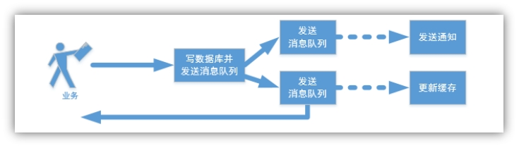
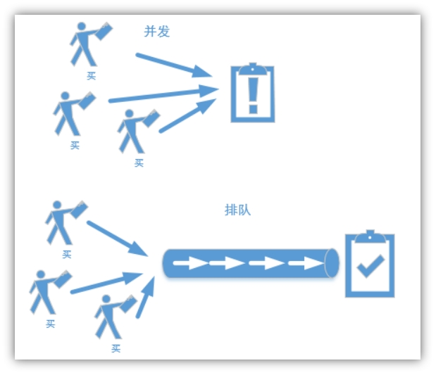
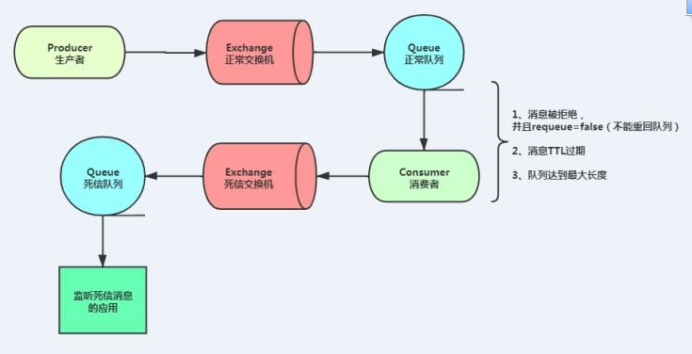

# RabbitMQ
[TOC]

## 1、消息队列解决什么问题

消息队列都解决了什么问题？

### 1.1、异步

 


### 1.2、解耦

​	

 

### 1.3、并行

 

 

### 1.4、排队

 


## 2、MQ整合

### 2.1、使用场景

以尚品甄选为例：如果用户登录成功，我们需要保存登录日志、登录成功给用户发送短信通知、下单成功需要清空购物车中选中的购物项等等可能都需要远程调用才能实现，如果使用MQ就可以实现异步解耦合。

### 2.2、访问RabbitMQ

第一天已安装

访问IP地址：http://ip:15672

- 用户名：guest
- 密码：guest


## 3、RabbitMQ模块搭建

### 3.1、搭建share-common-rabbit模块

由于消息队列是公共模块，我们把mq的相关代码（生产者）封装到该模块，其他service微服务模块都可能使用，因此我们把他封装到一个单独的模块，需要使用mq的模块直接引用该模块即可

#### 3.1.1、新建模块

在`share-common`模块下新建`share-common-rabbit`模块

#### 3.1.2、pom.xml

```xml
<?xml version="1.0" encoding="UTF-8"?>
<project xmlns:xsi="http://www.w3.org/2001/XMLSchema-instance"
         xmlns="http://maven.apache.org/POM/4.0.0"
         xsi:schemaLocation="http://maven.apache.org/POM/4.0.0 http://maven.apache.org/xsd/maven-4.0.0.xsd">
    <parent>
        <groupId>com.share</groupId>
        <artifactId>share-common</artifactId>
        <version>3.6.3</version>
    </parent>
    <modelVersion>4.0.0</modelVersion>

    <artifactId>share-common-rabbit</artifactId>

    <description>
        share-common-rabbit服务
    </description>

    <dependencies>
        <dependency>
            <groupId>org.springframework.boot</groupId>
            <artifactId>spring-boot-starter-web</artifactId>
        </dependency>

        <!--rabbitmq消息队列-->
        <dependency>
            <groupId>org.springframework.cloud</groupId>
            <artifactId>spring-cloud-starter-bus-amqp</artifactId>
        </dependency>

        <dependency>
            <groupId>com.alibaba.fastjson2</groupId>
            <artifactId>fastjson2</artifactId>
        </dependency>

        <dependency>
            <groupId>org.projectlombok</groupId>
            <artifactId>lombok</artifactId>
        </dependency>

        <!-- 缓存服务 -->
        <dependency>
            <groupId>com.share</groupId>
            <artifactId>share-common-redis</artifactId>
        </dependency>
    </dependencies>
</project>
```

#### 3.1.3、RabbitService

```java
package com.share.common.rabbit.service;


@Service
public class RabbitService {

    @Autowired
    private RabbitTemplate rabbitTemplate;

    /**
     * 发送消息
     *
     * @param exchange   交换机
     * @param routingKey 路由键
     * @param message    消息
     */
    public boolean sendMessage(String exchange, String routingKey, Object message) {
        rabbitTemplate.convertAndSend(exchange, routingKey, message);
        return true;
    }

}
```

#### 3.1.4、加载配置类

resources/META-INF/spring/org.springframework.boot.autoconfigure.AutoConfiguration.imports

```java
com.share.common.rabbit.service.RabbitService
```

#### 3.1.5、MqConst

提供常量类 MqConst

```java
package com.share.common.rabbit.constant;

public class MqConst {

    /**
     * 测试
     */
    public static final String EXCHANGE_TEST = "share.test";
    public static final String ROUTING_TEST = "share.test";
    public static final String ROUTING_CONFIRM = "share.confirm";
    //队列
    public static final String QUEUE_TEST  = "share.test";
    public static final String QUEUE_CONFIRM  = "share.confirm";


    /**
     * 订单
     */
    public static final String EXCHANGE_ORDER = "share.order";
    public static final String ROUTING_SUBMIT_ORDER = "share.submit.order";
    public static final String ROUTING_END_ORDER = "share.end.order";
    //队列
    public static final String QUEUE_SUBMIT_ORDER = "share.submit.order";
    public static final String QUEUE_END_ORDER = "share.end.order";

    /**
     * 支付
     */
    public static final String EXCHANGE_PAYMENT_PAY = "share.payment";
    public static final String ROUTING_PAYMENT_PAY = "share.payment.pay";
    public static final String QUEUE_PAYMENT_PAY = "share.payment.pay";


    /**
     * 解锁卡槽延迟消息
     */
    public static final String EXCHANGE_DEVICE = "share.device";
    public static final String ROUTING_UNLOCK_SLOT = "share.unlock.slot";
    public static final String QUEUE_UNLOCK_SLOT = "share.unlock.slot";
    public static final Integer CANCEL_UNLOCK_SLOT_DELAY_TIME = 1 * 5;

}
```

### 3.2、  RabbitMQ测试

我们在`share-order`模块测试mq消息

#### 3.2.1、配置RabbitMQ

在nacos配置中心，share-order-dev.yml文件添加配置

```yaml
spring:
  rabbitmq:
    host: 127.0.0.1
    port: 5672
    username: guest
    password: guest
```

说明：host改为实际的IP

#### 3.2.2、引入share-common-rabbit模块

在`share-order`模块pom.xml文件添加依赖

```xml
<dependency>
    <groupId>com.share</groupId>
    <artifactId>share-common-rabbit</artifactId>
    <version>3.6.3</version>
</dependency>
```

#### 3.2.3、MqController

 发送消息

```java
package com.share.order.controller;

@Tag(name = "Mq接口管理")
@RestController
@RequestMapping("/mq")
public class MqController extends BaseController
{
    @Autowired
    private RabbitService rabbitService;

    @Operation(summary = "发送消息")
    @GetMapping("/sendMessage")
    public AjaxResult sendMessage()
    {
        rabbitService.sendMessage(MqConst.EXCHANGE_TEST, MqConst.ROUTING_TEST, "hello");
        return success();
    }

}
```

#### 3.2.4、TestReceiver

监听消息

```java
package com.share.order.receiver;

@Slf4j
@Component
public class TestReceiver {
    /**
     * 监听消息
     * @param message
     */
    @SneakyThrows
    @RabbitListener(bindings = @QueueBinding(
            exchange = @Exchange(value = MqConst.EXCHANGE_TEST, durable = "true"),
            value = @Queue(value = MqConst.QUEUE_TEST, durable = "true"),
            key = MqConst.ROUTING_TEST
    ))
    public void test(String content, Message message) {
        //都可以
        log.info("接收消息：{}", content);
        log.info("接收消息：{}", new String(message.getBody()));
    }
}
```

#### 3.2.5、knife4j测试

发送消息

监听消息：查看idea打印结果


### 3.3、消息可靠性配置

#### 3.3.1、介绍

MQ消息的可靠性，一般需要三个方面一起保证：

1. 生产者不丢数据
2. MQ服务器不丢数据
3. 消费者不丢数据

保证消息不丢失有两种实现方式：

- 开启事务模式
- 消息息确认模式（生产者，消费者）

**说明：**开启事务会大幅降低消息发送及接收效率，使用的相对较少，因此我们生产环境一般都采取消息确认模式，以下我们只是讲解消息确认模式

#### 3.3.2、消息发送确认配置

消息发送确认可以保证生产者不丢数据

##### 1、封装发送端消息确认配置类

操作模块：`share-common-rabbit`

```java
package com.share.common.rabbit.config;

@Slf4j
@Component
public class RabbitInitConfigApplicationListener implements ApplicationListener<ApplicationReadyEvent> {

    @Autowired
    private RabbitTemplate rabbitTemplate;

    @Override
    public void onApplicationEvent(ApplicationReadyEvent event) {
        this.setupCallbacks();
    }

    private void setupCallbacks() {

        /**
         * 只确认消息是否正确到达 Exchange 中,成功与否都会回调
         *
         * @param correlation 相关数据  非消息本身业务数据
         * @param ack             应答结果
         * @param reason           如果发送消息到交换器失败，错误原因
         */
        this.rabbitTemplate.setConfirmCallback((correlationData, ack, reason) -> {
            if (ack) {
                //消息到交换器成功
                log.info("消息发送到Exchange成功：{}", correlationData);
            } else {
                //消息到交换器失败
                log.error("消息发送到Exchange失败：{}", reason);
            }
        });

        /**
         * 消息没有正确到达队列时触发回调，如果正确到达队列不执行
         */
        this.rabbitTemplate.setReturnsCallback(returned -> {
            log.error("Returned: " + returned.getMessage() + "\nreplyCode: " + returned.getReplyCode()
                    + "\nreplyText: " + returned.getReplyText() + "\nexchange/rk: "
                    + returned.getExchange() + "/" + returned.getRoutingKey());

        });
    }

}
```

##### 2、加载配置类

resources/META-INF/spring/org.springframework.boot.autoconfigure.AutoConfiguration.imports

```java
com.share.common.rabbit.config.RabbitInitConfigApplicationListener
```

##### 3、修改配置

在nacos配置中心，修改share-order-dev.yml配置

```yaml
spring:
  rabbitmq:
    host: 127.0.0.1
    port: 5672
    username: guest
    password: guest
    publisher-confirm-type: CORRELATED
    publisher-returns: true
    listener:
      simple:
        cknowledge-mode: manual #默认情况下消息消费者是自动确认消息的，如果要手动确认消息则需要修改确认模式为manual
        prefetch: 1 # 消费者每次从队列获取的消息数量。此属性当不设置时为：轮询分发，设置为1为：公平分发
```

##### 4、MqController

发送确认消息

```java
@Operation(summary = "发送确认消息")
@GetMapping("/sendConfirmMessage")
public AjaxResult sendConfirmMessage()
{
    rabbitService.sendMessage(MqConst.EXCHANGE_TEST, MqConst.ROUTING_CONFIRM, "hello, confirm");
    return success();
}
```

##### 5、TestReceiver

监听确认消息

```java
/**
 * 监听确认消息
 * @param message
 */
@SneakyThrows
@RabbitListener(bindings = @QueueBinding(
        exchange = @Exchange(value = MqConst.EXCHANGE_TEST, durable = "true"),
        value = @Queue(value = MqConst.QUEUE_CONFIRM, durable = "true"),
        key = MqConst.ROUTING_CONFIRM
))
public void confirm(String content, Message message, Channel channel) {
    log.info("接收确认消息：{}", content);

    // false 确认一个消息，true 批量确认
    channel.basicAck(message.getMessageProperties().getDeliveryTag(), false);
}
```

#### 3.3.3、消息发送失败，设置重发机制

实现思路：借助redis来实现重发机制

操作模块：`share-common-rabbit`

##### 1、GmallCorrelationData

自定义一个实体类来接收消息

```java
package com.share.common.rabbit.entity;

import lombok.Data;
import org.springframework.amqp.rabbit.connection.CorrelationData;

@Data
public class GuiguCorrelationData extends CorrelationData {

    //消息体
    private Object message;
    //交换机
    private String exchange;
    //路由键
    private String routingKey;
    //重试次数
    private int retryCount = 0;
    //是否延迟消息
    private boolean isDelay = false;
    //延迟时长
    private int delayTime = 10;
}
```

##### 2、RabbitService

修改发送方法

```java
@Autowired
private RedisTemplate redisTemplate;

/**
 *  发送消息
 * @param exchange 交换机
 * @param routingKey 路由键
 * @param message 消息
 */
public boolean sendMessage(String exchange, String routingKey, Object message) {
    //1.创建自定义相关消息对象-包含业务数据本身，交换器名称，路由键，队列类型，延迟时间,重试次数
    GuiguCorrelationData correlationData = new GuiguCorrelationData();
    String uuid = "mq:" + UUID.randomUUID().toString().replaceAll("-", "");
    correlationData.setId(uuid);
    correlationData.setMessage(message);
    correlationData.setExchange(exchange);
    correlationData.setRoutingKey(routingKey);
    //2.将相关消息封装到发送消息方法中

    rabbitTemplate.convertAndSend(exchange, routingKey, message, correlationData);

    //3.将相关消息存入Redis  Key：UUID  相关消息对象  10 分钟
    redisTemplate.opsForValue().set(uuid, JSON.toJSONString(correlationData), 10, TimeUnit.MINUTES);
    return true;
}
```

##### 3、RabbitInitConfigApplicationListener

修改RabbitInitConfigApplicationListener类

```java
package com.share.common.rabbit.config;


@Slf4j
@Component
public class RabbitInitConfigApplicationListener implements ApplicationListener<ApplicationReadyEvent> {

    @Autowired
    private RabbitTemplate rabbitTemplate;

    @Autowired
    private RedisTemplate redisTemplate;

    @Override
    public void onApplicationEvent(ApplicationReadyEvent event) {
        this.setupCallbacks();
    }

    private void setupCallbacks() {

        /**
         * 只确认消息是否正确到达 Exchange 中,成功与否都会回调
         *
         * @param correlation 相关数据  非消息本身业务数据
         * @param ack             应答结果
         * @param reason           如果发送消息到交换器失败，错误原因
         */
        this.rabbitTemplate.setConfirmCallback((correlationData, ack, reason) -> {
            if (ack) {
                //消息到交换器成功
                log.info("消息发送到Exchange成功：{}", correlationData);
            } else {
                //消息到交换器失败
                log.error("消息发送到Exchange失败：{}", reason);

                //执行消息重发
                this.retrySendMsg(correlationData);
            }
        });

        /**
         * 消息没有正确到达队列时触发回调，如果正确到达队列不执行
         */
        this.rabbitTemplate.setReturnsCallback(returned -> {
            log.error("Returned: " + returned.getMessage() + "\nreplyCode: " + returned.getReplyCode()
                    + "\nreplyText: " + returned.getReplyText() + "\nexchange/rk: "
                    + returned.getExchange() + "/" + returned.getRoutingKey());

            //当路由队列失败 也需要重发
            //1.构建相关数据对象
            String redisKey = returned.getMessage().getMessageProperties().getHeader("spring_returned_message_correlation");
            String correlationDataStr = (String) redisTemplate.opsForValue().get(redisKey);
            GuiguCorrelationData guiguCorrelationData = JSON.parseObject(correlationDataStr, GuiguCorrelationData.class);
            //2.调用消息重发方法
            this.retrySendMsg(guiguCorrelationData);
        });
    }

    /**
     * 消息重新发送
     *
     * @param correlationData
     */
    private void retrySendMsg(CorrelationData correlationData) {
        //获取相关数据
        GuiguCorrelationData gmallCorrelationData = (GuiguCorrelationData) correlationData;

        //获取redis中存放重试次数
        //先重发，在写会到redis中次数
        int retryCount = gmallCorrelationData.getRetryCount();
        if (retryCount >= 3) {
            //超过最大重试次数
            log.error("生产者超过最大重试次数，将失败的消息存入数据库用人工处理；给管理员发送邮件；给管理员发送短信；");
            return;
        }
        //重发消息
        rabbitTemplate.convertAndSend(gmallCorrelationData.getExchange(), gmallCorrelationData.getRoutingKey(), gmallCorrelationData.getMessage(), gmallCorrelationData);
        //重发次数+1
        retryCount += 1;
        gmallCorrelationData.setRetryCount(retryCount);
        redisTemplate.opsForValue().set(gmallCorrelationData.getId(), JSON.toJSONString(gmallCorrelationData), 10, TimeUnit.MINUTES);
        log.info("进行消息重发！");
    }

}
```


### 3.4、延迟消息

延迟消息有两种实现方案：

1，基于死信队列

2，集成延迟插件

#### 3.4.1、基于死信实现延迟消息

使用RabbitMQ来实现延迟消息必须先了解RabbitMQ的两个概念：消息的TTL和死信Exchange，通过这两者的组合来实现延迟队列

##### 1、消息的TTL（Time To Live）

消息的TTL就是消息的存活时间。RabbitMQ可以对队列和消息分别设置TTL。对队列设置就是队列没有消费者连着的保留时间，也可以对每一个单独的消息做单独的设置。超过了这个时间，我们认为这个消息就死了，称之为死信。

如何设置TTL：

我们创建一个队列queue.temp，在Arguments 中添加x-message-ttl 为5000 （单位是毫秒），那所在压在这个队列的消息在5秒后会消失。

##### 2、死信交换机  Dead Letter Exchanges

一个消息在满足如下条件下，会进死信路由，记住这里是路由而不是队列，一个路由可以对应很多队列。

（1） 一个消息被Consumer拒收了，并且reject方法的参数里requeue是false。也就是说不会被再次放在队列里，被其他消费者使用。

（2）**上面的消息的TTL到了，消息过期了。**

（3）队列的长度限制满了。排在前面的消息会被丢弃或者扔到死信路由上。

Dead Letter Exchange其实就是一种普通的exchange，和创建其他exchange没有两样。只是在某一个设置Dead Letter Exchange的队列中有消息过期了，会自动触发消息的转发，发送到Dead Letter Exchange中去。

 

我们现在可以测试一下延迟队列。

（1）创建死信队列 

（2）创建交换机 

（3）建立交换器与队列之间的绑定 

（4）创建队列

##### 3、代码实现

操作模块：`share-order`

###### DeadLetterMqConfig

```java
package com.share.order.config;

import org.springframework.amqp.core.Binding;
import org.springframework.amqp.core.BindingBuilder;
import org.springframework.amqp.core.DirectExchange;
import org.springframework.amqp.core.Queue;
import org.springframework.context.annotation.Bean;
import org.springframework.context.annotation.Configuration;

import java.util.HashMap;

@Configuration
public class DeadLetterMqConfig {
    // 声明一些变量

    public static final String exchange_dead = "exchange.dead";
    public static final String routing_dead_1 = "routing.dead.1";
    public static final String routing_dead_2 = "routing.dead.2";
    public static final String queue_dead_1 = "queue.dead.1";
    public static final String queue_dead_2 = "queue.dead.2";

    // 定义交换机
    @Bean
    public DirectExchange exchange() {
        return new DirectExchange(exchange_dead, true, false, null);
    }

    @Bean
    public Queue queue1() {
        // 设置如果队列一 出现问题，则通过参数转到exchange_dead，routing_dead_2 上！
        HashMap<String, Object> map = new HashMap<>();
        // 参数绑定 此处的key 固定值，不能随意写
        map.put("x-dead-letter-exchange", exchange_dead);
        map.put("x-dead-letter-routing-key", routing_dead_2);
        // 设置延迟时间
        map.put("x-message-ttl", 10 * 1000);
        // 队列名称，是否持久化，是否独享、排外的【true:只可以在本次连接中访问】，是否自动删除，队列的其他属性参数
        return new Queue(queue_dead_1, true, false, false, map);
    }

    @Bean
    public Binding binding() {
        // 将队列一 通过routing_dead_1 key 绑定到exchange_dead 交换机上
        return BindingBuilder.bind(queue1()).to(exchange()).with(routing_dead_1);
    }

    // 这个队列二就是一个普通队列
    @Bean
    public Queue queue2() {
        return new Queue(queue_dead_2, true, false, false, null);
    }

    // 设置队列二的绑定规则
    @Bean
    public Binding binding2() {
        // 将队列二通过routing_dead_2 key 绑定到exchange_dead交换机上！
        return BindingBuilder.bind(queue2()).to(exchange()).with(routing_dead_2);
    }
}
```

###### MqController

```java
/**
 * 消息发送延迟消息：基于死信实现
 */
@Operation(summary = "发送延迟消息：基于死信实现")
@GetMapping("/sendDeadLetterMsg")
public AjaxResult sendDeadLetterMsg() {
    rabbitService.sendMessage(DeadLetterMqConfig.exchange_dead, DeadLetterMqConfig.routing_dead_1, "我是延迟消息");
    return success();
}
```

###### TestReceiver

接收消息

```java
/**
 * 监听延迟消息
 * @param msg
 * @param message
 * @param channel
 */
@SneakyThrows
@RabbitListener(queues = {DeadLetterMqConfig.queue_dead_2})
public void getDeadLetterMsg(String msg, Message message, Channel channel) {
    log.info("死信消费者：{}", msg);
    channel.basicAck(message.getMessageProperties().getDeliveryTag(), false);
}
```

#### 3.4.2、基于延迟插件实现延迟消息

Rabbitmq实现了一个插件x-delay-message来实现延时队列

##### 1、插件安装

已安装

##### 2、代码实现

操作模块：`share-order`

###### DelayedMqConfig

```java
package com.share.order.config;

import org.springframework.amqp.core.Binding;
import org.springframework.amqp.core.BindingBuilder;
import org.springframework.amqp.core.CustomExchange;
import org.springframework.amqp.core.Queue;
import org.springframework.context.annotation.Bean;
import org.springframework.context.annotation.Configuration;

import java.util.HashMap;
import java.util.Map;

@Configuration
public class DelayedMqConfig {

    public static final String exchange_delay = "exchange.delay";
    public static final String routing_delay = "routing.delay";
    public static final String queue_delay_1 = "queue.delay.1";

    @Bean
    public Queue delayQeue1() {
        // 第一个参数是创建的queue的名字，第二个参数是是否支持持久化
        return new Queue(queue_delay_1, true);
    }

    @Bean
    public CustomExchange delayExchange() {
        Map<String, Object> args = new HashMap<String, Object>();
        args.put("x-delayed-type", "direct");
        return new CustomExchange(exchange_delay, "x-delayed-message", true, false, args);
    }

    @Bean
    public Binding delayBbinding1() {
        return BindingBuilder.bind(delayQeue1()).to(delayExchange()).with(routing_delay).noargs();
    }
}
```

###### MqController

```java
@Operation(summary = "发送延迟消息：基于延迟插件")
@GetMapping("/sendDelayMsg")
public AjaxResult sendDelayMsg() {
    //调用工具方法发送延迟消息
    int delayTime = 10;
    rabbitService.sendDealyMessage(DelayedMqConfig.exchange_delay, DelayedMqConfig.routing_delay, "我是延迟消息", delayTime);
    return success();
}
```

###### RabbitService

封装到工具类模块

操作模块：`share-common-rabbit`

```java
/**
 * 发送延迟消息方法
 * @param exchange 交换机
 * @param routingKey 路由键
 * @param message 消息数据
 * @param delayTime 延迟时间，单位为：秒
 */
public boolean sendDealyMessage(String exchange, String routingKey, Object message, int delayTime) {
    //1.创建自定义相关消息对象-包含业务数据本身，交换器名称，路由键，队列类型，延迟时间,重试次数
    GuiguCorrelationData correlationData = new GuiguCorrelationData();
    String uuid = "mq:" + UUID.randomUUID().toString().replaceAll("-", "");
    correlationData.setId(uuid);
    correlationData.setMessage(message);
    correlationData.setExchange(exchange);
    correlationData.setRoutingKey(routingKey);
    correlationData.setDelay(true);
    correlationData.setDelayTime(delayTime);

    //2.将相关消息封装到发送消息方法中
    rabbitTemplate.convertAndSend(exchange, routingKey, message,message1 -> {
        message1.getMessageProperties().setDelay(delayTime*1000);
        return message1;
    }, correlationData);

    //3.将相关消息存入Redis  Key：UUID  相关消息对象  10 分钟
    redisTemplate.opsForValue().set(uuid, JSON.toJSONString(correlationData), 10, TimeUnit.MINUTES);
    return true;

}
```
###### MQProducerAckConfig

`MQProducerAckConfig`队列确认增加延迟消息判断

操作模块：`share-common-rabbit`

```java
package com.share.common.rabbit.config;

@Slf4j
@Component
public class RabbitInitConfigApplicationListener implements ApplicationListener<ApplicationReadyEvent> {

    ...

    private void setupCallbacks() {

        /**
         * 只确认消息是否正确到达 Exchange 中,成功与否都会回调
         *
         * @param correlation 相关数据  非消息本身业务数据
         * @param ack             应答结果
         * @param reason           如果发送消息到交换器失败，错误原因
         */
        this.rabbitTemplate.setConfirmCallback((correlationData, ack, reason) -> {
            ...
        });

        /**
         * 消息没有正确到达队列时触发回调，如果正确到达队列不执行
         */
        this.rabbitTemplate.setReturnsCallback(returned -> {
            log.error("Returned: " + returned.getMessage() + "\nreplyCode: " + returned.getReplyCode()
                    + "\nreplyText: " + returned.getReplyText() + "\nexchange/rk: "
                    + returned.getExchange() + "/" + returned.getRoutingKey());

            ...
            //todo 方式一:如果不考虑延迟消息重发 直接返回
            if(guiguCorrelationData.isDelay()){
                return;
            }
            //2.调用消息重发方法
            this.retrySendMsg(guiguCorrelationData);
        });
    }

    /**
     * 消息重新发送
     *
     * @param correlationData
     */
    private void retrySendMsg(CorrelationData correlationData) {
        //获取相关数据
        GuiguCorrelationData gmallCorrelationData = (GuiguCorrelationData) correlationData;

        //获取redis中存放重试次数
        //先重发，在写会到redis中次数
        int retryCount = gmallCorrelationData.getRetryCount();
        if (retryCount >= 3) {
            //超过最大重试次数
            log.error("生产者超过最大重试次数，将失败的消息存入数据库用人工处理；给管理员发送邮件；给管理员发送短信；");
            return;
        }
        //重发次数+1
        retryCount += 1;
        gmallCorrelationData.setRetryCount(retryCount);
        redisTemplate.opsForValue().set(gmallCorrelationData.getId(), JSON.toJSONString(gmallCorrelationData), 10, TimeUnit.MINUTES);
        log.info("进行消息重发！");
        //重发消息
        //todo 方式二：如果是延迟消息，依然需要设置消息延迟时间
        if (gmallCorrelationData.isDelay()) {
            //延迟消息
            rabbitTemplate.convertAndSend(gmallCorrelationData.getExchange(), gmallCorrelationData.getRoutingKey(), gmallCorrelationData.getMessage(), message -> {
                message.getMessageProperties().setDelay(gmallCorrelationData.getDelayTime() * 1000);
                return message;
            }, gmallCorrelationData);
        } else {
            //普通消息
            rabbitTemplate.convertAndSend(gmallCorrelationData.getExchange(), gmallCorrelationData.getRoutingKey(), gmallCorrelationData.getMessage(), gmallCorrelationData);
        }
    }

}
```

##### 3、消费者端幂等性处理

消费结果会发送多次，也被消费多次！

如何保证消息幂等性？

1. 使用数据库方式
2. **使用redis setnx 命令解决（推荐）**

```java
/**
 * 监听延迟消息
 * @param msg
 * @param message
 * @param channel
 */
@SneakyThrows
@RabbitListener(queues = {DeadLetterMqConfig.queue_dead_2})
public void getDeadLetterMsg(String msg, Message message, Channel channel) {
    //接收消息，消费者端判断是否需要做幂等性处理
    //如果业务保证幂等性，基于redis setnx保证
    String key = "mq:" + msg;
    Boolean flag = redisTemplate.opsForValue().setIfAbsent(key, "", 200, TimeUnit.SECONDS);
    if (!flag) {
        //说明该业务数据以及被执行
        channel.basicAck(message.getMessageProperties().getDeliveryTag(), false);
        return;
    }

    // 执行业务
    //  TODO 

    channel.basicAck(message.getMessageProperties().getDeliveryTag(), false);
}
```


#### 3.4.3、基于延迟插件实现解锁卡槽

##### 1、需求说明

如果我们扫码柜机充电宝，服务器已经成功获取充电宝相关信息，发送Topic消息给柜机了，但是由于柜机原因不能弹出及时充电宝，因此我们要解锁卡槽对应的充电宝

操作模块：`share-device`

##### 2、pom.xml

```xml
<dependency>
    <groupId>com.share</groupId>
    <artifactId>share-common-rabbit</artifactId>
    <version>3.6.3</version>
</dependency>
```

##### 3、发送延迟消息

DeviceServiceImpl

```java
@Autowired
private RabbitService rabbitService;

public AvailableProwerBankVo checkAvailableProwerBank(String cabinetNo) {
    ...

    // 扫码后未弹出充电宝等情况，延迟解锁
    rabbitService.sendDealyMessage(MqConst.EXCHANGE_DEVICE, MqConst.ROUTING_UNLOCK_SLOT, JSONObject.toJSONString(cabinetSlot), MqConst.CANCEL_UNLOCK_SLOT_DELAY_TIME);
    return availableProwerBankVo;
}
```

##### 3、DeviceReceiver

```java
package com.share.device.receiver;

@Slf4j
@Component
public class DeviceReceiver {

    @Autowired
    private IDeviceService deviceService;

    @Autowired
    private RedisTemplate redisTemplate;

    @SneakyThrows
    @RabbitListener(bindings = @QueueBinding(
            exchange = @Exchange(value = MqConst.EXCHANGE_DEVICE, durable = "true"),
            value = @Queue(value = MqConst.QUEUE_UNLOCK_SLOT, durable = "true"),
            key = MqConst.ROUTING_UNLOCK_SLOT
    ))
    public void unlockSlot(String content, Message message, Channel channel) {
        log.info("[设备服务]解锁充电宝卡槽消息：{}", content);
        CabinetSlot cabinetSlot = JSONObject.parseObject(content, CabinetSlot.class);
        //防止重复请求
        String key = "unlock:slot:" + cabinetSlot.getCabinetId() + ":" + cabinetSlot.getSlotNo();
        boolean isExist = redisTemplate.opsForValue().setIfAbsent(key, cabinetSlot.getSlotNo(), 1, TimeUnit.HOURS);
        if (!isExist) {
            log.info("重复请求: {}", content);
            return;
        }

        try {
            deviceService.unlockSlot(cabinetSlot);

            //手动应答
            channel.basicAck(message.getMessageProperties().getDeliveryTag(), false);
        } catch (Exception e) {
            log.error("设备服务：解锁充电宝卡槽失败：{}", content, e);
            redisTemplate.delete(key);
            // 消费异常，重新入队
            channel.basicNack(message.getMessageProperties().getDeliveryTag(), false, true);
        }
    }


}
```

##### 4、IDeviceService

```
void unlockSlot(CabinetSlot cabinetSlot);
```

##### 5、DeviceServiceI

```java
@Override
public void unlockSlot(CabinetSlot cs) {
    CabinetSlot cabinetSlot = cabinetSlotService.getById(cs.getId());
    if("2".equals(cabinetSlot.getStatus())) {
        //状态（1：占用 0：空闲 2：锁定）
        cabinetSlot.setStatus("1");
        cabinetSlot.setUpdateTime(new Date());
        cabinetSlotService.updateById(cabinetSlot);
    }
}
```

## 4、创建订单

前面完成了充电宝弹出相关业务，创建订单是通过mq消息，因此完成该功能

### 4.1、发送消息

#### 4.1.1、PowerBankUnlockHandler

完善发送创建订单消息

```java
@Autowired
private RabbitService rabbitService;

@Transactional(rollbackFor = Exception.class)
@Override
public void handleMessage(JSONObject message) {
    log.info("handleMessage: {}", message.toJSONString());
    ...

    //构建订单对象
    SubmitOrderVo submitOrderVo = new SubmitOrderVo();
    submitOrderVo.setMessageNo(messageNo);
    submitOrderVo.setUserId(userId);
    submitOrderVo.setPowerBankNo(powerBankNo);
    submitOrderVo.setStartStationId(station.getId());
    submitOrderVo.setStartStationName(station.getName());
    submitOrderVo.setStartCabinetNo(cabinetNo);
    submitOrderVo.setFeeRuleId(station.getFeeRuleId());
    log.info("构建订单对象: {}", JSONObject.toJSONString(submitOrderVo));
    //发送信息
    rabbitService.sendMessage(MqConst.EXCHANGE_ORDER, MqConst.ROUTING_SUBMIT_ORDER, JSONObject.toJSONString(submitOrderVo));
}
```

#### 4.1.2、SubmitOrderVo

该实体放到`share-api-order`模块

```java
package com.share.order.api.domain;

import io.swagger.v3.oas.annotations.media.Schema;
import lombok.Data;

@Data
public class SubmitOrderVo {

    @Schema(description = "消息编号")
    private String messageNo;

    @Schema(description = "用户Id")
    private Long UserId;

    //送货地址id
    @Schema(description = "充电宝编号")
    private String powerBankNo;

    /** 借用站点id */
    @Schema(description = "借用站点id")
    private Long startStationId;

    /** 借用地点名称 */
    @Schema(description = "借用地点名称")
    private String startStationName;

    /** 借用柜机编号 */
    @Schema(description = "借用柜机编号")
    private String startCabinetNo;

    @Schema(description = "费用规则id")
    private Long feeRuleId;
}
```

### 4.2、接收消息

#### 4.2.1、OrderReceiver

```java
package com.share.order.receiver;

@Slf4j
@Component
public class OrderReceiver {

    @Autowired
    private IOrderInfoService orderInfoService;

    @Autowired
    private RedisTemplate redisTemplate;

    @SneakyThrows
    @RabbitListener(bindings = @QueueBinding(
            exchange = @Exchange(value = MqConst.EXCHANGE_ORDER, durable = "true"),
            value = @Queue(value = MqConst.QUEUE_SUBMIT_ORDER, durable = "true"),
            key = MqConst.ROUTING_SUBMIT_ORDER
    ))
    public void submitOrder(String content, Message message, Channel channel) {
        log.info("[订单服务]租借充电宝消息：{}", content);
        SubmitOrderVo orderForm = JSONObject.parseObject(content, SubmitOrderVo.class);
        String messageNo = orderForm.getMessageNo();
        //防止重复请求
        String key = "order:submit:" + messageNo;
        boolean isExist = redisTemplate.opsForValue().setIfAbsent(key, messageNo, 1, TimeUnit.HOURS);
        if (!isExist) {
            log.info("重复请求: {}", content);
            return;
        }

        try {
            orderInfoService.saveOrder(orderForm);

            //手动应答
            channel.basicAck(message.getMessageProperties().getDeliveryTag(), false);
        } catch (Exception e) {
            log.error("订单服务：订单归还失败，订单编号：{}", messageNo, e);
            redisTemplate.delete(key);
            // 消费异常，重新入队
            channel.basicNack(message.getMessageProperties().getDeliveryTag(), false, true);
        }
    }
}
```

#### 4.2.2、IOrderInfoService

```
Long saveOrder(SubmitOrderVo orderForm);
```

#### 4.2.2、OrderInfoServiceI

```java
@Autowired
private RemoteFeeRuleService remoteFeeRuleService;

@Transactional(rollbackFor = Exception.class)
@Override
public Long saveOrder(SubmitOrderVo orderForm) {
    OrderInfo orderInfo = new OrderInfo();
    orderInfo.setUserId(orderForm.getUserId());
    orderInfo.setOrderNo(RandomUtil.randomString(8));
    orderInfo.setPowerBankNo(orderForm.getPowerBankNo());
    orderInfo.setStartTime(new Date());
    orderInfo.setStartStationId(orderForm.getStartStationId());
    orderInfo.setStartStationName(orderForm.getStartStationName());
    orderInfo.setStartCabinetNo(orderForm.getStartCabinetNo());
    // 费用规则
    FeeRule feeRule = remoteFeeRuleService.getFeeRule(orderForm.getFeeRuleId(), SecurityConstants.INNER).getData();
    orderInfo.setFeeRuleId(orderForm.getFeeRuleId());
    orderInfo.setFeeRule(feeRule.getDescription());
    orderInfo.setStatus("0");
    orderInfo.setCreateTime(new Date());
    orderInfo.setCreateBy(SecurityUtils.getUsername());
    //用户昵称
    UserInfo userInfo =  remoteUserInfoService.getUserInfo(orderInfo.getUserId(), SecurityConstants.INNER).getData();
    orderInfo.setNickname(userInfo.getNickname());

    orderInfoMapper.insert(orderInfo);
    return orderInfo.getId();
}
```