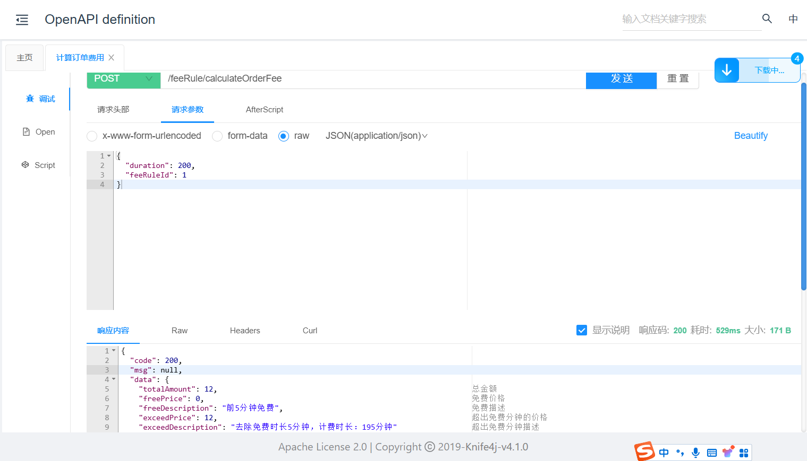

# 充电宝归还

[TOC]

## 1、费用计算接口

前面学习了规则引擎，当前应用规则引擎

### 1.1、充电宝计费规则

| 时间段收费                                         |
| :------------------------------------------------- |
| 前5分钟免费                                        |
| 5分钟后，每小时3元，24小时35元，不足1小时按1小时算 |
| 超过24小时99元                                     |
时间与费用可以动态调整

### 1.2、集成Drools

操作模块：`share-rule`

#### 1.2.1、pom.xml

引入依赖，版本：8.41.0.Final，父级模块已加入版本管理

```xml
<!-- drools lib -->
<dependency>
    <groupId>org.drools</groupId>
    <artifactId>drools-core</artifactId>
</dependency>
<dependency>
    <groupId>org.drools</groupId>
    <artifactId>drools-compiler</artifactId>
</dependency>
<dependency>
    <groupId>org.drools</groupId>
    <artifactId>drools-decisiontables</artifactId>
</dependency>
<dependency>
    <groupId>org.drools</groupId>
    <artifactId>drools-mvel</artifactId>
</dependency>
```

#### 1.2.2、DroolsConfig

Drools配置类

```java
package com.share.rules.config;

@Slf4j
@Configuration
public class DroolsConfig {
    // 制定规则文件的路径
    private static final String RULES_CUSTOMER_RULES_DRL = "rules/FeeRule.drl";

    @Bean
    public KieContainer kieContainer() {
        KieServices kieServices = KieServices.Factory.get();

        KieFileSystem kieFileSystem = kieServices.newKieFileSystem();
        kieFileSystem.write(ResourceFactory.newClassPathResource(RULES_CUSTOMER_RULES_DRL));
        KieBuilder kb = kieServices.newKieBuilder(kieFileSystem);
        kb.buildAll();

        KieModule kieModule = kb.getKieModule();
        KieContainer kieContainer = kieServices.newKieContainer(kieModule.getReleaseId());
        return kieContainer;
    }
}
```

#### 1.2.3、测试Drools环境

测试Drools环境，看看是否能够正常输出，如果正常输出，则Drools环境集成成功

##### 1.2.3.1、FeeRule.drl

创建规则文件resources/rules/FeeRule.drl

```java
package  com.share.rules


rule "rule_1"
    when
       eval(true)        
    then
        System.out.println("打印成功");
end
```

##### 1.2.3.2、编写测试类

```java
@SpringBootTest
class ServiceRulesApplicationTest {

    @Autowired
    private KieContainer kieContainer;

    @Test
    void test1() {
        // 开启会话
        KieSession kieSession = kieContainer.newKieSession();

        // 触发规则
        kieSession.fireAllRules();
        // 中止会话
        kieSession.dispose();
    }
}
```

执行测试，如果打印：“打印成功”，则测试成功

### 1.3、费用计算接口

#### 1.3.1、封装费用规则接口

##### 1.3.1.1、FeeRuleRequest

封装输入对象

```java
package com.share.rules.domain;

@Data
public class FeeRuleRequest {

    @Schema(description = "借用时长")
    private Integer durations;

    @Schema(description = "超出免费时长的小时数")
    private Integer exceedHours;
}
```

##### 1.3.1.2、FeeRuleResponse

封装输出对象

```java
package com.share.rules.domain;

@Data
public class FeeRuleResponse {

    @Schema(description = "总金额")
    private Double totalAmount;

    @Schema(description = "免费价格")
    private Double freePrice;

    @Schema(description = "免费描述")
    private String freeDescription;

    @Schema(description = "超出免费分钟的价格")
    private Double exceedPrice;

    @Schema(description = "超出免费分钟描述")
    private String exceedDescription;
}
```

这些属性都是规则引擎需要输出的属性

##### 3.4.1.3、费用规则文件

创建规则文件resources/rules/FeeRule.drl

```java
//package对应的不一定是真正的目录，可以任意写com.abc，同一个包下的drl文件可以相互访问
package  com.share.rules

import com.share.rules.domain.FeeRuleRequest;

global com.share.rules.domain.FeeRuleResponse feeRuleResponse;

rule "前5分钟免费"
    salience 10          //指定优先级，数值越大优先级越高，不指定的情况下由上到下执行
    no-loop true         //防止陷入死循环
    when
        /*规则条件，到工作内存中查找FeeRuleRequest对象
        里面出来的结果只能是ture或者false
        $rule是绑定变量名，可以任意命名，官方推荐$符号，定义了绑定变量名，可以在then部分操作fact对象*/
        $rule:FeeRuleRequest(durations >= 0)
    then
        feeRuleResponse.setFreeDescription("前5分钟免费");
        feeRuleResponse.setTotalAmount(0.0);
        feeRuleResponse.setFreePrice(0.0);
        feeRuleResponse.setExceedPrice(0.0);
        System.out.println("前5分钟免费");
end
rule "每1小时3元，24小时35"
    salience 10          //指定优先级，数值越大优先级越高，不指定的情况下由上到下执行
    no-loop true         //防止陷入死循环
    when
        /*规则条件，到工作内存中查找FeeRuleRequest对象
        里面出来的结果只能是ture或者false
        $rule是绑定变量名，可以任意命名，官方推荐$符号，定义了绑定变量名，可以在then部分操作fact对象*/
        $rule:FeeRuleRequest(durations > 5 && (durations - 5) <= 24*60)
    then
        int hour = ($rule.getDurations() - 5)/60;
        double exceedPrice = (hour + 1) * 3.0;
        if(exceedPrice > 35.0) {
            exceedPrice = 35.0;
        }
        feeRuleResponse.setFreeDescription("前5分钟免费");
        feeRuleResponse.setTotalAmount(exceedPrice);
        feeRuleResponse.setFreePrice(0.0);
        feeRuleResponse.setExceedPrice(exceedPrice);
        int minute = $rule.getDurations() - 5;
        feeRuleResponse.setExceedDescription("去除免费时长5分钟，计费时长："+ minute + "分钟");
        System.out.println("24小时内费用：" + exceedPrice + "元");
end

rule "超24小时99元"
    salience 10          //指定优先级，数值越大优先级越高，不指定的情况下由上到下执行
    no-loop true         //防止陷入死循环
    when
        /*规则条件，到工作内存中查找FeeRuleRequest对象
        里面出来的结果只能是ture或者false
        $rule是绑定变量名，可以任意命名，官方推荐$符号，定义了绑定变量名，可以在then部分操作fact对象*/
        $rule:FeeRuleRequest((durations - 5) > 24*60)
    then
        feeRuleResponse.setFreeDescription("前5分钟免费");
        feeRuleResponse.setTotalAmount(99.0);
        feeRuleResponse.setFreePrice(0.0);
        feeRuleResponse.setExceedPrice(99.0);
        int minute = $rule.getDurations() - 5;
        feeRuleResponse.setExceedDescription("去除免费时长5分钟，计费时长："+ minute + "分钟，超24小时");
        System.out.println("超24小时99元");
end
```


#### 1.3.2、封装微服务接口

##### 1.3.2.1、FeeRuleApiController

```java
package com.share.rules.api;

@Slf4j
@RestController
@RequestMapping("/feeRule")
@SuppressWarnings({"unchecked", "rawtypes"})
public class FeeRuleApiController {

   @Autowired
   private IFeeRuleService feeRuleService;

   @Operation(summary = "计算订单费用")
   @InnerAuth
   @PostMapping("/calculateOrderFee")
   public R<FeeRuleResponseVo> calculateOrderFee(@RequestBody FeeRuleRequestForm calculateOrderFeeForm) {
      return R.ok(feeRuleService.calculateOrderFee(calculateOrderFeeForm));
   }

}
```

##### 1.3.2.2、FeeRuleRequestForm

远程调用的传入参数

```java
package com.share.rules.api.domain;

@Data
public class FeeRuleRequestForm {


    @Schema(description = "费用规则id")
    private Long FeeRuleId;

    @Schema(description = "借用时长")
    private Integer duration;

}
```

##### 1.3.2.3、FeeRuleResponseVo

远程调用的返回值

```java
package com.share.rules.api.domain;

import io.swagger.v3.oas.annotations.media.Schema;
import lombok.Data;

import java.math.BigDecimal;

@Data
public class FeeRuleResponseVo {

    @Schema(description = "总金额")
    private BigDecimal totalAmount;

    @Schema(description = "免费价格")
    private BigDecimal freePrice;

    @Schema(description = "免费描述")
    private String freeDescription;

    @Schema(description = "超出免费分钟的价格")
    private BigDecimal exceedPrice;

    @Schema(description = "超出免费分钟描述")
    private String exceedDescription;
}
```

##### 1.3.2.4、IFeeRuleService

```java
FeeRuleResponseVo calculateOrderFee(FeeRuleRequestForm calculateOrderFeeForm);
```

##### 1.3.2.5、FeeRuleServiceImpl

```java
@Autowired
private KieContainer kieContainer;

@Override
public FeeRuleResponseVo calculateOrderFee(FeeRuleRequestForm feeRuleRequestForm) {
    //封装传入对象
    FeeRuleRequest feeRuleRequest = new FeeRuleRequest();
    feeRuleRequest.setDurations(feeRuleRequestForm.getDuration());
    log.info("传入参数：{}", JSON.toJSONString(feeRuleRequest));

    // 开启会话
    KieSession kieSession = kieContainer.newKieSession();

    //封装返回对象
    FeeRuleResponse feeRuleResponse = new FeeRuleResponse();
    kieSession.setGlobal("feeRuleResponse", feeRuleResponse);
    // 设置订单对象
    kieSession.insert(feeRuleRequest);
    // 触发规则
    kieSession.fireAllRules();
    // 中止会话
    kieSession.dispose();
    log.info("计算结果：{}", JSON.toJSONString(feeRuleResponse));

    //封装返回对象
    FeeRuleResponseVo feeRuleResponseVo = new FeeRuleResponseVo();
    BeanUtils.copyProperties(feeRuleResponse, feeRuleResponseVo);
    return feeRuleResponseVo;
}
```

##### 1.3.2.6、swg测试



#### 1.3.3、封装Feign接口

##### 1.3.3.1、RemoteFeeRuleService

```java
@PostMapping("/feeRule/calculateOrderFee")
public R<FeeRuleResponseVo> calculateOrderFee(@RequestBody FeeRuleRequestForm feeRuleRequestForm);
```

##### 1.3.3.2、RemoteFeeRuleFallbackFactory

```java
@Override
public R<FeeRuleResponseVo> calculateOrderFee(FeeRuleRequestForm calculateOrderFeeForm) {
    return R.fail("费用计算失败:" + throwable.getMessage());
}
```

#### 1.3.4、规则接口改造

我们把规则文件写到了项目resources目录下面，显然不利于运营人员调整规则，那么怎么办呢？我们可以把规则保存到数据库表中，需要调整规则时在后台页面更改了即可，同时让他随时生效。只要输入与输出参数不变，怎么调整都没有问题。

##### 1.3.4.1、DroolsHelper

定义一个Drools帮助类，接收规则字符串（规则文件的文本内容），返回KieSession即可

```java
package com.share.rules.config;

public class DroolsHelper {

    public static KieSession loadForRule(String drlStr) {
        KieServices kieServices = KieServices.Factory.get();

        KieFileSystem kieFileSystem = kieServices.newKieFileSystem();
        kieFileSystem.write("src/main/resources/rules/" + drlStr.hashCode() + ".drl", drlStr);

        // 将KieFileSystem加入到KieBuilder
        KieBuilder kieBuilder = kieServices.newKieBuilder(kieFileSystem);
        // 编译此时的builder中所有的规则
        kieBuilder.buildAll();
        if (kieBuilder.getResults().hasMessages(Message.Level.ERROR)) {
            throw new RuntimeException("Build Errors:\n" + kieBuilder.getResults().toString());
        }

        KieContainer kieContainer = kieServices.newKieContainer(kieServices.getRepository().getDefaultReleaseId());
        return kieContainer.newKieSession();
    }
}
```

##### 1.3.4.2、规则文件放入数据库表

将规则文件内容访问fee_rule表rule字段

##### 1.3.4.3、改造FeeRuleServiceImpl方法

```java
@Override
public FeeRuleResponseVo calculateOrderFee(FeeRuleRequestForm feeRuleRequestForm) {
    //封装传入对象
    FeeRuleRequest feeRuleRequest = new FeeRuleRequest();
    feeRuleRequest.setDurations(feeRuleRequestForm.getDuration());
    log.info("传入参数：{}", JSON.toJSONString(feeRuleRequest));

    //获取最新订单费用规则
    FeeRule feeRule = feeRuleMapper.selectById(feeRuleRequestForm.getFeeRuleId());
    KieSession kieSession = DroolsHelper.loadForRule(feeRule.getRule());

    //封装返回对象
    FeeRuleResponse feeRuleResponse = new FeeRuleResponse();
    kieSession.setGlobal("feeRuleResponse", feeRuleResponse);
    // 设置订单对象
    kieSession.insert(feeRuleRequest);
    // 触发规则
    kieSession.fireAllRules();
    // 中止会话
    kieSession.dispose();
    log.info("计算结果：{}", JSON.toJSONString(feeRuleResponse));

    //封装返回对象
    FeeRuleResponseVo feeRuleResponseVo = new FeeRuleResponseVo();
    feeRuleResponseVo.setTotalAmount(new BigDecimal(feeRuleResponse.getTotalAmount()));
    feeRuleResponseVo.setFreePrice(new BigDecimal(feeRuleResponse.getFreePrice()));
    feeRuleResponseVo.setExceedPrice(new BigDecimal(feeRuleResponse.getExceedPrice()));
    feeRuleResponseVo.setFreeDescription(feeRuleResponse.getFreeDescription());
    feeRuleResponseVo.setExceedDescription(feeRuleResponse.getExceedDescription());
    return feeRuleResponseVo;
}
```


## 2、充电宝归还

### 2.1、需求解析

充电宝归还就是把充电宝插入柜机卡槽，但是充电宝插入柜机卡槽有两种情况：

1、有充电中订单的情况，正常归还充电宝；

2、无充电中订单的情况，运营人员向空的卡槽插入充电宝。

这两种情况业务都需要考虑到

当充电宝插入柜机时，柜机就能识别充电宝编号等相关信息，然后发送Mqtt消息给服务器端，服务器端订阅Topic信息，然后处理相关业务逻辑

Mqtt框架前面已经搭建，执行处理在PowerBankConnectedHandler类处理相关业务代码即可

实现思路：不管有订单还是无订单，设备微服务无非就是加减柜机充电宝可用数量相关与卡槽绑定充电宝相关，这些业务都是一样的，唯一不一样的是订单处理，那么我们可以先处理完这样共同业务，然后发送mq信息到订单微服务，有改充电宝充电中的订单就出来，无就不出来即可

### 2.2、业务接口实现

#### 2.2.1、EndOrderVo

操作模块：`share-api-order`

公共实体，多个微服务使用

```java
package com.share.order.api.domain;

@Data
public class EndOrderVo {

    @Schema(description = "消息编号")
    private String messageNo;

    @Schema(description = "归还时间")
    private Date endTime;

    @Schema(description = "归还站点id")
    private Long endStationId;

    @Schema(description = "归还地点名称")
    private String endStationName;

    @Schema(description = "归还柜机编号")
    private String endCabinetNo;

    @Schema(description = "充电宝编号")
    private String powerBankNo;
}
```

#### 2.2.2、PowerBankConnectedHandler

完善PowerBankConnectedHandler类业务逻辑

```java
package com.share.device.emqx.handler.impl;

@Slf4j
@Component
@GuiguEmqx(topic = EmqxConstants.TOPIC_POWERBANK_CONNECTED)
public class PowerBankConnectedHandler implements MassageHandler {

    @Autowired
    private ICabinetService cabinetService;

    @Autowired
    private IPowerBankService powerBankService;

    @Autowired
    private ICabinetSlotService cabinetSlotService;

    @Autowired
    private IStationService stationService;

    @Autowired
    private RedisTemplate redisTemplate;

    @Autowired
    private RabbitService rabbitService;

    @Transactional(rollbackFor = Exception.class)
    @Override
    public void handleMessage(JSONObject message) {
        log.info("handleMessage: {}", message.toJSONString());
        //消息编号
        String messageNo = message.getString("mNo");
        //防止重复请求
        String key = "powerBank:connected:" + messageNo;
        boolean isExist = redisTemplate.opsForValue().setIfAbsent(key, messageNo, 1, TimeUnit.HOURS);
        if (!isExist) {
            log.info("重复请求: {}", message.toJSONString());
            return;
        }

        //柜机编号
        String cabinetNo = message.getString("cNo");
        //充电宝编号
        String powerBankNo = message.getString("pNo");
        //插槽编号
        String slotNo = message.getString("sNo");
        //当前电量
        BigDecimal electricity = message.getBigDecimal("ety");
        if (StringUtils.isEmpty(cabinetNo)
                || StringUtils.isEmpty(powerBankNo)
                || StringUtils.isEmpty(slotNo)
                || null == electricity) {
            log.info("参数为空: {}", message.toJSONString());
            return;
        }
        //获取柜机
        Cabinet cabinet = cabinetService.getBtCabinetNo(cabinetNo);
        // 获取充电宝
        PowerBank powerBank = powerBankService.getByPowerBankNo(powerBankNo);
        // 获取插槽
        CabinetSlot cabinetSlot = cabinetSlotService.getBtSlotNo(cabinet.getId(), slotNo);

        //更新充电宝电量与状态
        powerBank.setElectricity(electricity);
        //电量大于可用最低值
        // 状态（0:未投放 1：可用 2：已租用 3：充电中 4：故障）
        if (electricity.subtract(DeviceConstants.ELECTRICITY_MIN).doubleValue() > 0) {
            //可以借用
            powerBank.setStatus("1");
        } else {
            //充电中
            powerBank.setStatus("3");
        }
        powerBankService.updateById(powerBank);

        //更新插槽状态
        cabinetSlot.setPowerBankId(powerBank.getId());
        cabinetSlot.setStatus("1");
        cabinetSlot.setUpdateTime(new Date());
        cabinetSlotService.updateById(cabinetSlot);

        //更新柜机信息
        int freeSlots = cabinet.getFreeSlots() - 1;
        cabinet.setFreeSlots(freeSlots);
        int usedSlots = cabinet.getUsedSlots() + 1;
        cabinet.setUsedSlots(usedSlots);
        //可以借用
        if ("1".equals(powerBank.getStatus())) {
            int availableNum = cabinet.getAvailableNum() + 1;
            cabinet.setAvailableNum(availableNum);
        }
        cabinet.setUpdateTime(new Date());
        cabinetService.updateById(cabinet);

        // 获取站点
        Station station = stationService.getByCabinetId(cabinet.getId());
        // 构建结束订单对象
        EndOrderVo endOrderVo = new EndOrderVo();
        endOrderVo.setMessageNo(messageNo);
        endOrderVo.setEndTime(new Date());
        endOrderVo.setEndCabinetNo(cabinetNo);
        endOrderVo.setEndStationId(station.getId());
        endOrderVo.setEndStationName(station.getName());
        endOrderVo.setPowerBankNo(powerBankNo);
        log.info("构建结束订单对象: {}", JSONObject.toJSONString(endOrderVo));
        //发送信息
        rabbitService.sendMessage(MqConst.EXCHANGE_ORDER, MqConst.ROUTING_END_ORDER, JSONObject.toJSONString(endOrderVo));
    }
}
```

#### 2.2.3、OrderReceiver

```java
@SneakyThrows
@RabbitListener(bindings = @QueueBinding(
        exchange = @Exchange(value = MqConst.EXCHANGE_ORDER, durable = "true"),
        value = @Queue(value = MqConst.QUEUE_END_ORDER, durable = "true"),
        key = MqConst.ROUTING_END_ORDER
))
public void endOrder(String content, Message message, Channel channel) {
    log.info("[订单服务]归还充电宝消息：{}", content);
    EndOrderVo endOrderVo = JSONObject.parseObject(content, EndOrderVo.class);
    String messageNo = endOrderVo.getMessageNo();
    //防止重复请求
    String key = "order:endOrder:" + messageNo;
    boolean isExist = redisTemplate.opsForValue().setIfAbsent(key, messageNo, 1, TimeUnit.HOURS);
    if (!isExist) {
        log.info("重复请求: {}", content);
        return;
    }

    try {
        orderInfoService.endOrder(endOrderVo);

        //手动应答
        channel.basicAck(message.getMessageProperties().getDeliveryTag(), false);
    } catch (Exception e) {
        log.error("订单服务：订单归还失败，订单编号：{}", messageNo, e);
        redisTemplate.delete(key);
        // 消费异常，重新入队
        channel.basicNack(message.getMessageProperties().getDeliveryTag(), false, true);
    }
}
```

#### 2.2.4、IOrderInfoService

```java
void endOrder(EndOrderVo endOrderVo);
```

#### 2.2.5、OrderInfoServiceImpl

```java
@Transactional(rollbackFor = Exception.class)
@Override
public void endOrder(EndOrderVo endOrderVo) {
    // 获取充电中的订单，如果存在，则结束订单； 如果不存在，则返回（初始化插入，无订单）
    OrderInfo orderInfo = orderInfoMapper.selectOne(new LambdaQueryWrapper<OrderInfo>()
            .eq(OrderInfo::getPowerBankNo, endOrderVo.getPowerBankNo())
            .eq(OrderInfo::getStatus, "0") //订单状态：0:充电中
            .orderByDesc(OrderInfo::getCreateTime)
            .last("limit 1")
    );
    if (orderInfo == null) {
        return;
    }

    orderInfo.setEndTime(endOrderVo.getEndTime());
    orderInfo.setEndStationId(endOrderVo.getEndStationId());
    orderInfo.setEndStationName(endOrderVo.getEndStationName());
    orderInfo.setEndCabinetNo(endOrderVo.getEndCabinetNo());
    int duration = Minutes.minutesBetween(new DateTime(orderInfo.getStartTime()), new DateTime(orderInfo.getEndTime())).getMinutes();
    orderInfo.setDuration(duration);

    // 费用计算
    FeeRuleRequestForm feeRuleRequestForm = new FeeRuleRequestForm();
    feeRuleRequestForm.setDuration(duration);
    feeRuleRequestForm.setFeeRuleId(orderInfo.getFeeRuleId());
    R<FeeRuleResponseVo> feeRuleResponseVoResult = remoteFeeRuleService.calculateOrderFee(feeRuleRequestForm, SecurityConstants.INNER);
    if (R.FAIL == feeRuleResponseVoResult.getCode()) {
        throw new ServiceException(feeRuleResponseVoResult.getMsg());
    }
    FeeRuleResponseVo feeRuleResponseVo = feeRuleResponseVoResult.getData();

    // 设置订单金额
    orderInfo.setTotalAmount(feeRuleResponseVo.getTotalAmount());
    orderInfo.setDeductAmount(new BigDecimal(0));
    orderInfo.setRealAmount(feeRuleResponseVo.getTotalAmount());
    if(orderInfo.getRealAmount().subtract(new BigDecimal(0)).doubleValue() == 0) {
        orderInfo.setStatus("2");
    } else {
        orderInfo.setStatus("1");
    }
    orderInfoMapper.updateById(orderInfo);

    // 插入免费订单账单
    OrderBill freeOrderBill = new OrderBill();
    freeOrderBill.setOrderId(orderInfo.getId());
    freeOrderBill.setBillItem(feeRuleResponseVo.getFreeDescription());
    freeOrderBill.setBillAmount(new BigDecimal(0));
    orderBillMapper.insert(freeOrderBill);

    // 插入超出免费订单账单
    if (feeRuleResponseVo.getExceedPrice().doubleValue() > 0) {
        OrderBill exceedOrderBill = new OrderBill();
        exceedOrderBill.setOrderId(orderInfo.getId());
        exceedOrderBill.setBillItem(feeRuleResponseVo.getExceedDescription());
        exceedOrderBill.setBillAmount(feeRuleResponseVo.getExceedPrice());
        orderBillMapper.insert(exceedOrderBill);
    }
}
```

#### 2.2.6、pom.xml

```xml
<dependency>
    <groupId>joda-time</groupId>
    <artifactId>joda-time</artifactId>
    <version>2.10.1</version>
</dependency>
```

## 3、属性上报

柜机会定时上报卡槽中充电宝的电量等属性，当前系统只模拟上报电量信息

### 3.1、 PropertyPostHandler

```java
package com.share.device.emqx.handler.impl;

@Slf4j
@Component
@GuiguEmqx(topic = EmqxConstants.TOPIC_PROPERTY_POST)
public class PropertyPostHandler implements MassageHandler {

    @Autowired
    private ICabinetService cabinetService;

    @Autowired
    private IPowerBankService powerBankService;

    @Autowired
    private ICabinetSlotService cabinetSlotService;

    @Autowired
    private RedisTemplate redisTemplate;

    /**
     * 处理消息:
     * @param message
     */
    @Transactional(rollbackFor = Exception.class)
    @Override
    public void handleMessage(JSONObject message) {
        log.info("handleMessage: {}", message.toJSONString());
        //消息编号
        String messageNo = message.getString("mNo");
        //防止重复请求
        String key = "property:post:" + messageNo;
        boolean isExist = redisTemplate.opsForValue().setIfAbsent(key, messageNo, 1, TimeUnit.HOURS);
        if (!isExist) {
            log.info("重复请求: {}", message.toJSONString());
            return;
        }

        //柜机编号
        String cabinetNo = message.getString("cNo");
        //充电宝编号
        String powerBankNo = message.getString("pNo");
        //插槽编号
        String slotNo = message.getString("sNo");
        //当前电量
        BigDecimal electricity = message.getBigDecimal("ety");
        if (StringUtils.isEmpty(cabinetNo)
                || StringUtils.isEmpty(powerBankNo)
                || StringUtils.isEmpty(slotNo)
                || null == electricity) {
            log.info("参数为空: {}", message.toJSONString());
            return;
        }
        //获取柜机
        Cabinet cabinet = cabinetService.getBtCabinetNo(cabinetNo);
        // 获取充电宝
        PowerBank powerBank =powerBankService.getByPowerBankNo(powerBankNo);

        //更新充电宝状态
        // 状态（0:未投放 1：可用 2：已租用 3：充电中 4：故障）
        //更新充电宝电量与状态
        powerBank.setElectricity(electricity);
        //电量大于可用最低值
        // 状态（0:未投放 1：可用 2：已租用 3：充电中 4：故障）
        if(electricity.subtract(DeviceConstants.ELECTRICITY_MIN).doubleValue() > 0) {
            //可以借用
            powerBank.setStatus("1");
        } else {
            //充电中
            powerBank.setStatus("3");
        }
        powerBankService.updateById(powerBank);

        //更新柜机可用充电宝数量
        // 获取柜机插槽列表
        List<CabinetSlot> cabinetSlotList = cabinetSlotService.list(new LambdaQueryWrapper<CabinetSlot>()
                .eq(CabinetSlot::getStatus, "1")
                .eq(CabinetSlot::getCabinetId, cabinet.getId())
                .select(CabinetSlot::getPowerBankId)
        );
        // 获取可用充电宝id列表
        List<Long> powerBankIdList =cabinetSlotList.stream().map(CabinetSlot::getPowerBankId).collect(Collectors.toList());
        // 获取可用充电宝数量
        Long availableNum = powerBankService.count(new LambdaQueryWrapper<PowerBank>().in(PowerBank::getId, powerBankIdList).eq(PowerBank::getStatus, "1"));
        cabinet.setAvailableNum(availableNum.intValue());
        cabinet.setUpdateTime(new Date());
        cabinetService.updateById(cabinet);
    }
}
```