# 整合AI实现数据报表

[TOC]

## 1、AI概述

### 1.1 什么是AI

AI，即人工智能，是一门研究、开发用于模拟、延伸和扩展人的智能的理论、方法、技术及应用系统的技术科学。它涉及多个领域的知识和技术，包括计算机科学、数学、心理学、神经科学等，旨在让机器能够像人一样思考、学习和解决问题。


### 1.2 什么是DeepSeek

DeepSeek 是一款由深度求索所开发的 AI 人工智能大模型，其基于深度学习和多模态数据融合技术，采用先进的 Transformer 架构和跨模态协同算法，可实现对复杂文档和图像的自动化解析与结构化信息提取。

依托于最新推出的“深度思考”模式（R1），这款AI大模型在极低成本下实现了与国际顶尖模型ChatGPT-o1相媲美的性能表现，其中文理解与输出能力更是远超ChatGPT、Claude等顶尖模型。再加上极具竞争力的API定价和全面开源的策略，让这款AI大模型成功在国际上火爆出圈

如果说AI是一个广泛的概念，那么DeepSeek就是是AI领域中的一个具体产品。

**DeepSeek的特点**‌：

- ‌**成本**‌：DeepSeek致力于降低AI应用的成本。通过采用先进的技术和独特的模型架构，DeepSeek在保持高性能的同时，显著降低了推理和训练的成本。
- ‌**性能**‌：DeepSeek在性能上表现出色。它使用强化学习技术训练，推理过程中包含大量反思与验证，能够处理更加复杂的数据和任务。在一些benchmark测试中，其性能与OpenAI的模型相当，但推理成本远低于同类产品。
- ‌**功能**‌：DeepSeek擅长处理数学、编程和复杂逻辑推理等任务。它的推理能力源于深度思考特性，推理长度与准确率呈正相关。此外，DeepSeek还支持多模态信息处理，能够应对更加多样化的应用场景。
- ‌**应用领域**‌：DeepSeek在多个领域展现出巨大的应用潜力。无论是在医疗、教育、交通等传统领域，还是在智能制造、智慧城市等新兴领域，DeepSeek都有望发挥重要作用。

综上所述，AI是一个广泛的概念，涵盖了人工智能领域的所有技术和应用。而DeepSeek则是AI领域中的一个具体产品，它在成本、性能、功能和应用领域等方面都有着独特的特点和优势。两者之间的关系可以理解为：DeepSeek是AI领域中的一个具体实现和优秀代表。

**如何使用Java集成DeepSeek：**

DeepSeek 作为一款卓越的国产 AI 模型，越来越多的公司考虑在自己的应用中集成。对于 Java 应用来说，我们可以借助 Spring AI 集成 DeepSeek，非常简单方便！


### 1.3 SpringAI

Spring AI是Spring生态中应用于人工智能领域的应用框架，它的目标是将Spring 生态系统的设计原则（如可移植性、模块化设计）应用于AI领域，并在AI领域中推广使用POJO（Plain Old Java Objects）作为应用的构建模块。

#### 功能和特性

SpringAI支持多种主流大语言模型平台，包括OpenAI、Microsoft、Amazon、Google和Huggingface。它还支持阻塞与流式的文本对话、图像生成（当前仅限OpenAI的dall-e模型和SD）、嵌入模型、LLM生成的内容转为POJO、主流的向量数据库或平台（如Azure Vector Search、Chroma、Milvus等），并支持函数调用和自动装配‌

#### 使用场景和优势

SpringAI的核心优势在于其跨AI提供商的可移植API，支持聊天和嵌入模型，并提供同步和流API选项。它将AI模型输出映射到POJO，简化了与Java应用的集成。此外，SpringAI支持所有主要的矢量数据库提供程序，并提供了新颖的类似SQL的元数据过滤器API，进一步降低了开发复杂度‌

#### 最新动态和未来发展

SpringAI在2024年5月发布了1.0.0里程碑1版本，标志着版本已基本稳定，主要错误和问题已解决，API基本确定。未来，SpringAI将继续巩固其功能，并可能引入更多新的模型类型和功能‌


## 2、SpringAI集成DeepSeek

### 2.1、利用spring-ai-openai集成DeepSeek

#### 2.1.1、在 DeepSeek 开放平台创建API KEY

* 进入DeepSeek官网 https://www.deepseek.com/  点击右上角的 **API开放平台**

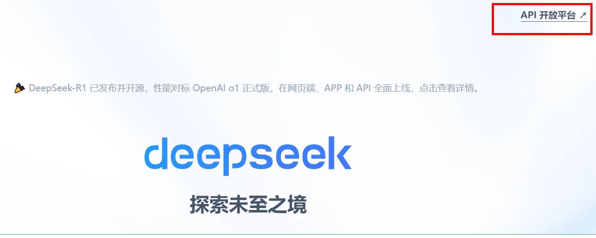

* 进入API开放平台，注册用户

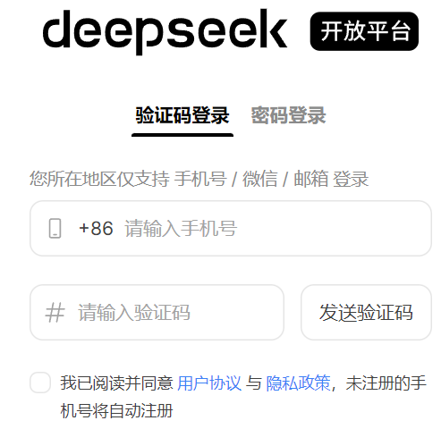

* 创建API key

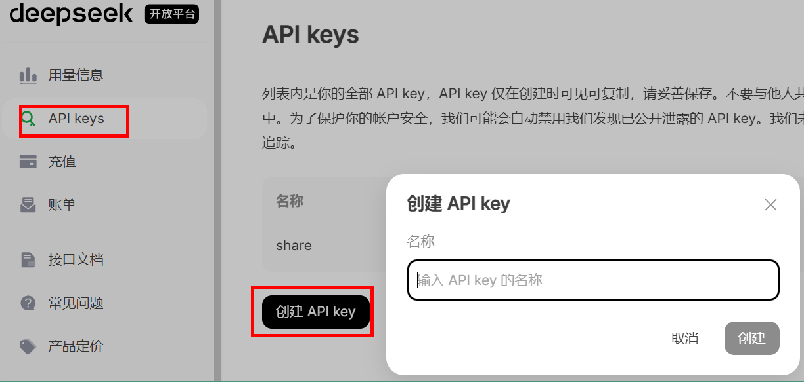

* 根据自己需要，自行充值

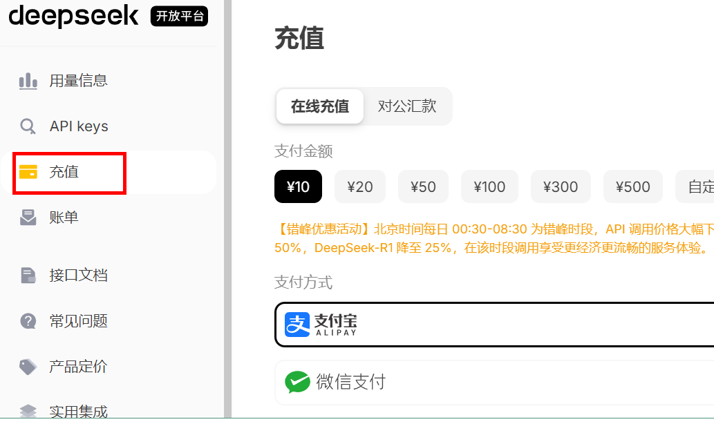

* Spring AI 的 openai starter 本质上是通过 RestTemplate 发请求

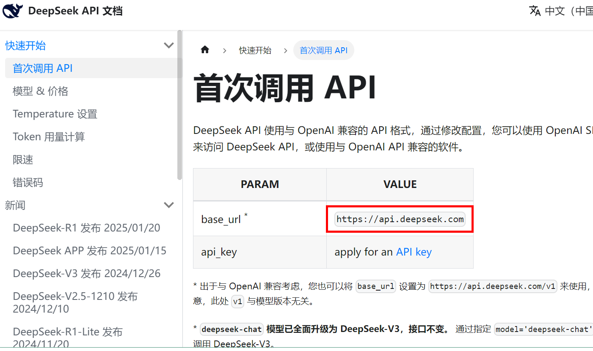

#### 2.2.2、创建SpringBoot工程，引入依赖

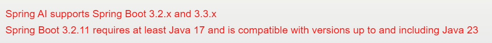

```xml
<?xml version="1.0" encoding="UTF-8"?>
<project xmlns="http://maven.apache.org/POM/4.0.0"
         xmlns:xsi="http://www.w3.org/2001/XMLSchema-instance"
         xsi:schemaLocation="http://maven.apache.org/POM/4.0.0 http://maven.apache.org/xsd/maven-4.0.0.xsd">
    <modelVersion>4.0.0</modelVersion>

    <parent>
        <groupId>org.springframework.boot</groupId>
        <artifactId>spring-boot-starter-parent</artifactId>
        <version>3.3.8</version>
        <relativePath/> <!-- lookup parent from repository -->
    </parent>

    <groupId>org.example</groupId>
    <artifactId>springai-deepseek</artifactId>
    <version>1.0-SNAPSHOT</version>

    <properties>
        <maven.compiler.source>17</maven.compiler.source>
        <maven.compiler.target>17</maven.compiler.target>
        <spring-ai.version>1.0.0-M5</spring-ai.version>
    </properties>

    <dependencies>
        <dependency>
            <groupId>org.springframework.boot</groupId>
            <artifactId>spring-boot-starter-web</artifactId>
        </dependency>
        
        <dependency>
            <groupId>org.springframework.ai</groupId>
            <artifactId>spring-ai-openai-spring-boot-starter</artifactId>
        </dependency>

        <dependency>
            <groupId>org.springframework.boot</groupId>
            <artifactId>spring-boot-starter-test</artifactId>
            <scope>test</scope>
        </dependency>
    </dependencies>
    <dependencyManagement>
        <dependencies>
            <dependency>
                <groupId>org.springframework.ai</groupId>
                <artifactId>spring-ai-bom</artifactId>
                <version>${spring-ai.version}</version>
                <type>pom</type>
                <scope>import</scope>
            </dependency>
        </dependencies>
    </dependencyManagement>

</project>
```

#### 2.2.3、创建配置文件

**application.properties**

```properties
server.port=8899
spring.application.name=spring-ai-deepseek-demo

spring.ai.openai.api-key=sk-136298bee728426280df86bd9****
spring.ai.openai.base-url=https://api.deepseek.com
spring.ai.openai.chat.options.model=deepseek-chat
spring.ai.openai.chat.options.temperature=0.7
```

* temperature参数用于控制生成文本的多样性。具体来说：

  ‌值越高‌，生成的文本越多样化，但也可能包含更多的随机性和不可预测的内容。
  ‌值越低‌，生成的文本越接近于确定性的结果，即生成的文本会更加一致和可预测。

  

#### 2.2.4、创建启动类

```java
@SpringBootApplication
public class SpringAiDemoApplication {

    public static void main(String[] args) {
        SpringApplication.run(SpringAiDemoApplication.class, args);
    }

}
```

#### 2.2.5、创建Controller

```java
@RestController
public class ChatDeepSeekController {

    @Autowired
    private OpenAiChatModel chatModel;

    @GetMapping("/ai/generate")
    public String generate(@RequestParam(value = "message", defaultValue = "hello")
                           String message) {
        String response = this.chatModel.call(message);
        System.out.println("response : "+response);
        return response;
    }
}
```

#### 2.2.6、测试

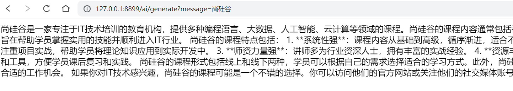


### 2.2、利用spring-ai-ollama访问本地化部署DeepSeek

#### 2.2.1、DeepSeek本地化部署

##### 0、硬件配置建议

* **GPU选择（根据模型大小灵活调整）：**
  入门配置：NVIDIA显卡（≥8GB显存） → 适合7B/8B模型。
  高性能配置：NVIDIA显卡（≥16GB显存） → 支持14B大模型。
  无独立显卡用户：可使用CPU模式运行（速度约为GPU的20%）。

* **内存要求**：≥16GB（推荐32GB，处理长文本时不易卡顿）
* **存储空间**：≥50GB可用空间（建议SSD硬盘，加快模型加载速度）

* **操作系统**：
  Windows 10/11（21H2及以上版本）。
  macOS Ventura 13.4+。
  Ubuntu 22.04 LTS/24.04 LTS


##### 1、从官方网站下载并安装 Ollama

https://ollama.com/  

Ollama 是一个用于本地化部署和管理大型语言模型（LLM）的工具。它支持多种开源模型（如 LLaMA、Alpaca 等），并提供了简单的 API 接口，方便开发者调用。Ollama可以让你在自己的电脑上运行各种强大的 AI 模型，就像运行普通软件一样简单。

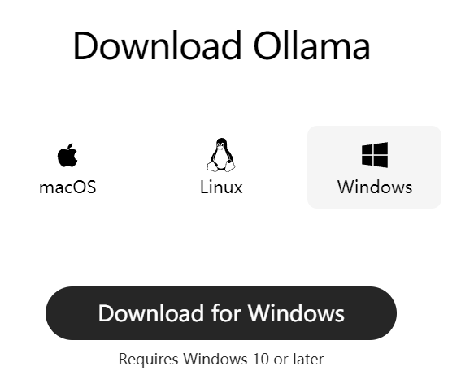

##### 2、修改模型下载路径

* 模型默认安装在C盘，可以修改安装路径

* 点击环境变量，选择下面新建一个系统环境变量 OLLAMA_MODELS ，然后指定想要安装模型的路径 ，比如   “D:\Deepseek”

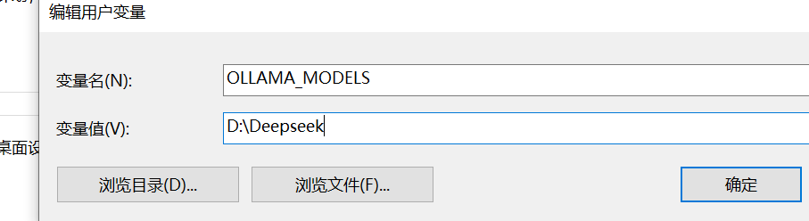

* 需要重启 Ollama生效


##### 3、通过 Ollama 拉取 DeepSeek 模型

选择适合自己的版本 https://ollama.com/library/deepseek-r1

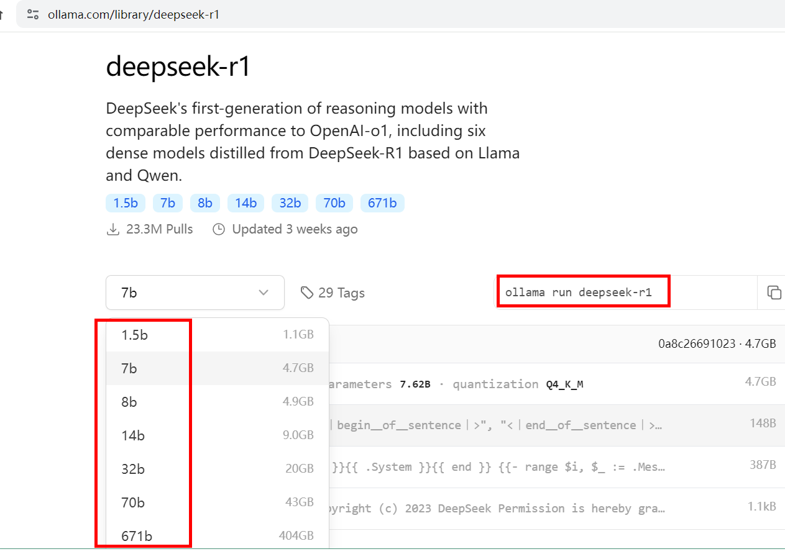

以windows为例，根据不同版本，执行不同的命令拉取模型

比如，下载1.5b，执行下面命令

```shell
ollama pull deepseek-r1:1.5b
```

##### 4、启动Ollama服务测试

启动 Ollama 服务，默认会监听 http://localhost:11434

```
ollama run deepseek-r1:1.5b
```

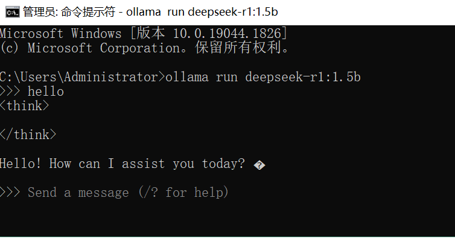

#### 2.2.2、创建SpringBoot工程，引入依赖

```xml
<?xml version="1.0" encoding="UTF-8"?>
<project xmlns="http://maven.apache.org/POM/4.0.0"
         xmlns:xsi="http://www.w3.org/2001/XMLSchema-instance"
         xsi:schemaLocation="http://maven.apache.org/POM/4.0.0 http://maven.apache.org/xsd/maven-4.0.0.xsd">
    <modelVersion>4.0.0</modelVersion>

    <parent>
        <groupId>org.springframework.boot</groupId>
        <artifactId>spring-boot-starter-parent</artifactId>
        <version>3.3.8</version>
        <relativePath/> <!-- lookup parent from repository -->
    </parent>

    <groupId>org.example</groupId>
    <artifactId>springai-deepseek</artifactId>
    <version>1.0-SNAPSHOT</version>

    <properties>
        <maven.compiler.source>17</maven.compiler.source>
        <maven.compiler.target>17</maven.compiler.target>
        <spring-ai.version>1.0.0-M5</spring-ai.version>
    </properties>

    <dependencies>
        <dependency>
            <groupId>org.springframework.boot</groupId>
            <artifactId>spring-boot-starter-web</artifactId>
        </dependency>

        <dependency>
            <groupId>org.springframework.boot</groupId>
            <artifactId>spring-boot-starter-test</artifactId>
            <scope>test</scope>
        </dependency>

        <dependency>
            <groupId>org.springframework.ai</groupId>
            <artifactId>spring-ai-ollama-spring-boot-starter</artifactId>
            <version>1.0.0-SNAPSHOT</version>
        </dependency>
    </dependencies>
    <dependencyManagement>
        <dependencies>
            <dependency>
                <groupId>org.springframework.ai</groupId>
                <artifactId>spring-ai-bom</artifactId>
                <version>${spring-ai.version}</version>
                <type>pom</type>
                <scope>import</scope>
            </dependency>
        </dependencies>
    </dependencyManagement>

    <!--下载spring-ai相关包需要用到的仓库地址-->
    <repositories>
        <repository>
            <id>spring-milestones</id>
            <name>Spring Milestones</name>
            <url>https://repo.spring.io/milestone</url>
            <snapshots>
                <enabled>false</enabled>
            </snapshots>
        </repository>
        <repository>
            <id>spring-snapshots</id>
            <name>Spring Snapshots</name>
            <url>https://repo.spring.io/snapshot</url>
            <releases>
                <enabled>false</enabled>
            </releases>
        </repository>
    </repositories>

</project>
```

#### 2.2.3、创建配置文件

**application.properties**

```properties
server.port=8899
spring.application.name=spring-ai-deepseek-demo

spring.ai.ollama.base-url=http://localhost:11434
spring.ai.ollama.chat.options.model=deepseek-r1:1.5b
spring.ai.ollama.chat.options.temperature=0.7
```

#### 2.2.4、创建启动类

```java
@SpringBootApplication
public class SpringAiDemoApplication {

    public static void main(String[] args) {
        SpringApplication.run(SpringAiDemoApplication.class, args);
    }

}
```

#### 2.2.5、创建Controller

```java
@RestController
public class ChatDeepSeekController {

    @Autowired
    private OllamaChatModel ollamaChatModel;

    @GetMapping("/ai/test")
    public String generate(@RequestParam(value = "message", defaultValue = "hello")
                           String message) {
        String response = this.ollamaChatModel.call(message);
        System.out.println("response : "+response);
        return response;
    }
}
```

#### 2.2.6、测试

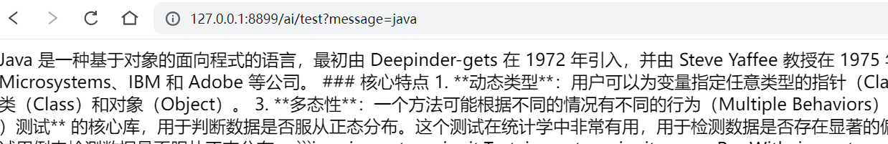


## 3、数据报表

### 3.1、原始方式实现数据报表

#### 3.1.1、需求概述

* 统计2024年每个月的注册人数，使用图表进行展现

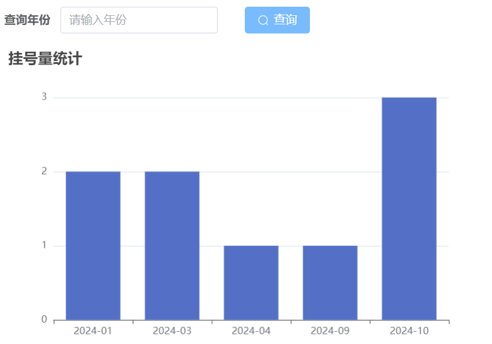


#### 3.1.2、图表工具-ECharts

##### ECharts概述

ECharts是一款基于JavaScript的数据可视化图表库，提供直观，生动，可交互，可个性化定制的数据可视化图表。ECharts最初由百度团队开源，并于2018年初捐赠给Apache基金会，成为ASF孵化级项目。
 ECharts 提供了常规的折线图、柱状图、散点图、饼图、K线图，用于统计的盒形图，用于地理数据可视化的地图、热力图、线图，用于关系数据可视化的关系图、treemap、旭日图，多维数据可视化的平行坐标，还有用于 BI 的漏斗图，仪表盘，并且支持图与图之间的混搭。

官网地址：https://echarts.apache.org/zh/index.html

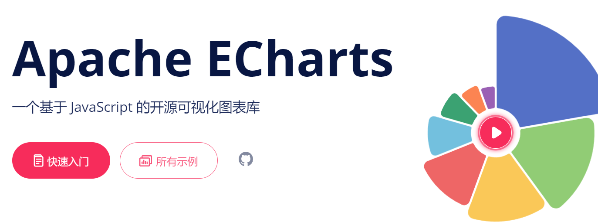

##### 入门案例

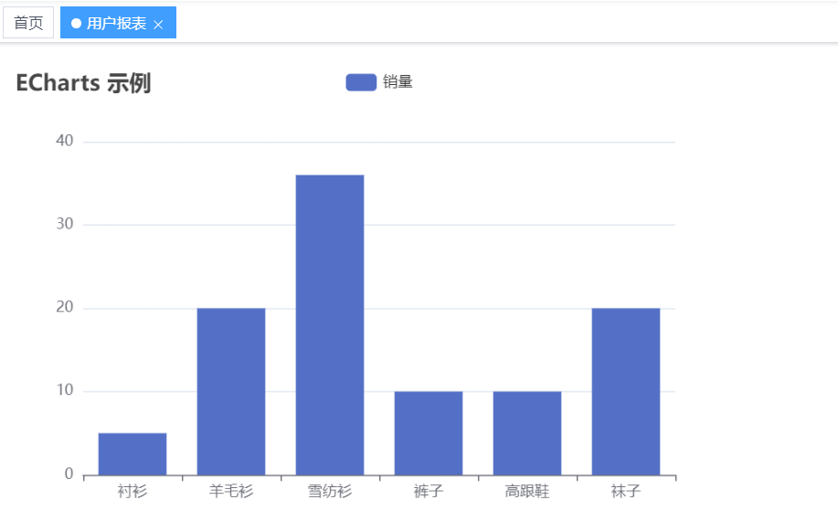

* 在vue项目中安装ECharts

```shell
npm install echarts --save
```

* 在Vue组件中使用ECharts

```vue
<template>
  <div ref="chart" style="width: 600px; height: 400px;"></div>
</template>
 
<script>
import * as echarts from 'echarts';
 
export default {
  name: 'Chart',
  mounted() {
    this.initChart();
  },
  methods: {
    initChart() {
      // 基于准备好的dom，初始化echarts实例
      const myChart = echarts.init(this.$refs.chart);
      // 指定图表的配置项和数据
      const option = {
        title: {
          text: 'ECharts 示例'
        },
        tooltip: {},
        legend: {
          data:['销量']
        },
        xAxis: {
          data: ["衬衫","羊毛衫","雪纺衫","裤子","高跟鞋","袜子"]
        },
        yAxis: {},
        series: [{
          name: '销量',
          type: 'bar',
          data: [5, 20, 36, 10, 10, 20]
        }]
      };
      // 使用刚指定的配置项和数据显示图表。
      myChart.setOption(option);
    }
  }
}
</script>
```


#### 3.1.3、share-user模块封装查询接口

* **操作share-user模块**

##### UserInfoApiController

```java
@GetMapping(value = "/getUserCount")
public R<Map<String, Object>> getUserCount() {
    Map<String, Object> map = userInfoService.getUserCount();
    return R.ok(map);
}
```

##### UserInfoService

```java
@Override
public Map<String, Object> getUserCount() {
    List<UserCountVo> list = baseMapper.selectUserCount();

    Map<String, Object> map = new HashMap<>();
    //日期列表
    List<String> dateList
            =list.stream().map(UserCountVo::getRegisterDate).collect(Collectors.toList());
    //统计列表
    List<Integer> countList
            =list.stream().map(UserCountVo::getCount).collect(Collectors.toList());
    map.put("dateList", dateList);
    map.put("countList", countList);
    return map;
}
```

##### UserInfoMapper

```java
List<UserCountVo> selectUserCount();
```

##### UserInfoMapper.xml

```xml
<?xml version="1.0" encoding="UTF-8" ?>
<!DOCTYPE mapper
PUBLIC "-//mybatis.org//DTD Mapper 3.0//EN"
"http://mybatis.org/dtd/mybatis-3-mapper.dtd">
<mapper namespace="com.share.user.mapper.UserInfoMapper">
    <select id="selectUserCount" resultType="com.share.user.domain.UserCountVo">
        SELECT
            DATE_FORMAT(create_time, '%Y-%m') AS registerDate,
            COUNT(id) AS `count`
        FROM
            user_info
        WHERE
            YEAR(create_time) = 2024
        GROUP BY
            DATE_FORMAT(create_time, '%Y-%m')
        ORDER BY
            registerDate
    </select>
</mapper>
```

##### **share-api-user模块创建实体类**

```java
@Data
public class UserCountVo {

   private String registerDate;

   private Integer count;
}
```

##### share-api-user模块远程调用接口定义

```java
@GetMapping(value = "/userInfo/getUserCount")
public R<Map<String, Object>> getUserCount();
```


#### 3.1.4、share-stastics模块远程调用

* **创建UserStasticsController**

```java
@Tag(name = "数据统计")
@RestController
@RequestMapping("/sta")
public class UserStasticsController extends BaseController {

    @Autowired
    private RemoteUserService userService;

    //统计2024年每月注册人数
    @GetMapping("/usercount")
    public AjaxResult userCount() {
        R<Map<String, Object>> result = userService.getUserCount();
        Map<String, Object> map = result.getData();
        return success(map);
    }

}
```


#### 3.1.5、前端整合

##### 创建页面路由（参考之前方式）

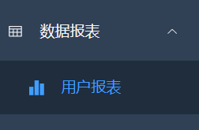

##### 创建js文件定义接口

api目录下创建sta/sta.js

```js
import request from '@/utils/request'

// 统计用户注册数据
export function getUserCount() {
  return request({
    url: '/sta/userCount',
    method: 'get'
  })
}
```

##### 根据路由创建vue组件

stastics/user/index.vue

```vue
<template>
  <div class="app-container">
    <el-form :model="queryParams" ref="queryRef" :inline="true" label-width="68px">
      <el-form-item label="查询年份" prop="orderNo">
        <el-input
            v-model="searchObj.selectYear"
            placeholder="请输入年份"
            clearable/>
      </el-form-item>
      <el-form-item>
        <el-button type="primary" icon="Search" @click="showChart">查询</el-button>
      </el-form-item>
    </el-form>
    <div ref="chart" style="width: 600px; height: 400px;"></div>
  </div>
</template>
<script>
import { getUserCount } from "@/api/sta/sta";
import * as echarts from 'echarts';
export default {
    data() {
        return {
            searchObj: {
                selectYear: ''
            },
            btnDisabled: false,
            chart: null,
            title: '',
            xData: [], // x轴数据
            yData: [] // y轴数据
        }
    },
    created() {
      this.showChart()
    },
    methods: {
        // 初始化图表数据
        showChart() {
          getUserCount().then(response => {
                this.yData = response.data.countList
                this.xData = response.data.dateList
                this.setChartData()
            })
        },
        setChartData() {
            // 基于准备好的dom，初始化echarts实例
            var myChart = echarts.init(this.$refs.chart)
            // 指定图表的配置项和数据
            var option = {
                title: {
                    text: this.title + '挂号量统计'
                },
                tooltip: {},
                legend: {
                    data: [this.title]
                },
                xAxis: {
                    data: this.xData
                },
                yAxis: {
                    minInterval: 1
                },
                series: [{
                    name: this.title,
                    type: 'bar',
                    data: this.yData
                }]
            }
            // 使用刚指定的配置项和数据显示图表。
            myChart.setOption(option)
        },
    }
}
</script>
```


### 3.2、SpringAI集成DeepSeek实现数据报表

#### 3.2.1、封装生成SQL语句接口

##### 创建ai工程

##### 引入依赖

```xml
<?xml version="1.0" encoding="UTF-8"?>
<project xmlns="http://maven.apache.org/POM/4.0.0"
         xmlns:xsi="http://www.w3.org/2001/XMLSchema-instance"
         xsi:schemaLocation="http://maven.apache.org/POM/4.0.0 http://maven.apache.org/xsd/maven-4.0.0.xsd">
    <modelVersion>4.0.0</modelVersion>

    <parent>
        <groupId>org.springframework.boot</groupId>
        <artifactId>spring-boot-starter-parent</artifactId>
        <version>3.3.8</version>
        <relativePath/> <!-- lookup parent from repository -->
    </parent>

    <groupId>org.example</groupId>
    <artifactId>springai-deepseek</artifactId>
    <version>1.0-SNAPSHOT</version>

    <properties>
        <maven.compiler.source>17</maven.compiler.source>
        <maven.compiler.target>17</maven.compiler.target>
        <spring-ai.version>1.0.0-M5</spring-ai.version>
    </properties>

    <dependencies>
        <dependency>
            <groupId>org.springframework.boot</groupId>
            <artifactId>spring-boot-starter-web</artifactId>
        </dependency>

        <dependency>
            <groupId>org.springframework.boot</groupId>
            <artifactId>spring-boot-starter-test</artifactId>
            <scope>test</scope>
        </dependency>

        <!--<dependency>
            <groupId>org.springframework.ai</groupId>
            <artifactId>spring-ai-ollama-spring-boot-starter</artifactId>
            <version>1.0.0-SNAPSHOT</version>
        </dependency>-->

        <dependency>
            <groupId>org.springframework.ai</groupId>
            <artifactId>spring-ai-openai-spring-boot-starter</artifactId>
        </dependency>
    </dependencies>
    <dependencyManagement>
        <dependencies>
            <dependency>
                <groupId>org.springframework.ai</groupId>
                <artifactId>spring-ai-bom</artifactId>
                <version>${spring-ai.version}</version>
                <type>pom</type>
                <scope>import</scope>
            </dependency>
        </dependencies>
    </dependencyManagement>

    <!--下载spring-ai相关包需要用到的仓库地址-->
    <repositories>
        <repository>
            <id>spring-milestones</id>
            <name>Spring Milestones</name>
            <url>https://repo.spring.io/milestone</url>
            <snapshots>
                <enabled>false</enabled>
            </snapshots>
        </repository>
        <repository>
            <id>spring-snapshots</id>
            <name>Spring Snapshots</name>
            <url>https://repo.spring.io/snapshot</url>
            <releases>
                <enabled>false</enabled>
            </releases>
        </repository>
    </repositories>

</project>
```

##### 创建配置文件

application.properties

```properties
server.port=8899
spring.application.name=spring-ai-deepseek-demo

spring.ai.openai.api-key=sk-136298b1e7284216210df86bd9404
spring.ai.openai.base-url=https://api.deepseek.com
spring.ai.openai.chat.options.model=deepseek-chat
spring.ai.openai.chat.options.temperature=0.7

#spring.ai.ollama.base-url=http://localhost:11434
#spring.ai.ollama.chat.options.model=deepseek-r1:1.5b
#spring.ai.ollama.chat.options.temperature=0.7
```

##### 创建启动类

```java
@SpringBootApplication
public class SpringAiDemoApplication {

    public static void main(String[] args) {
        SpringApplication.run(SpringAiDemoApplication.class, args);
    }

}
```

##### 创建Controller

```java
@RestController
public class ChatDeepSeekController {

    @Autowired
    private OpenAiChatModel chatModel;

    @GetMapping("/ai/generate")
    public String generate(@RequestParam(value = "message", defaultValue = "hello")
                           String message) {
        String data ="需求："+message+"\n" +
                "表结构：\n" +
                "`order_info`表：`order_no`,`total_amount`,`create_time`\n" +
                "字段create_time是订单创建时间，数据存储格式YYYY-MM-DD HH:MM:SS\n" +
                "补充：生成的sql语句不要中文注释\n" +
                "sql语句中：订单月份数据别名order_date，订单数量别名order_count";
        String response = this.chatModel.call(data);
        //获取sql语句
        String sql = parseString(response);
        return sql;
    }

    private String parseString(String str) {
        //String msg = "要查询2024年每月的订单数量，可以使用以下SQL语句：\n\n```sql\nSELECT \n    DATE_FORMAT(create_time, '%Y-%m') AS month, \n    COUNT(order_no) AS order_count\nFROM \n    order_info\nWHERE \n    YEAR(create_time) = 2024\nGROUP BY \n    DATE_FORMAT(create_time, '%Y-%m')\nORDER BY \n    month;\n```\n\n### 解释：\n1. **DATE_FORMAT(create_time, '%Y-%m')**: 将`create_time`字段格式化为`YYYY-MM`的形式，表示年和月。\n2. **COUNT(order_no)**: 统计每个月的订单数量。\n3. **WHERE YEAR(create_time) = 2024**: 过滤出2024年的订单。\n4. **GROUP BY DATE_FORMAT(create_time, '%Y-%m')**: 按年月分组，以便统计每月的订单数量。\n5. **ORDER BY month**: 按月份排序，确保结果按时间顺序排列。\n\n执行这条SQL语句后，你将得到2024年每个月的订单数量。";
        int index = str.indexOf("sql");
        int index1 = str.indexOf(";", index);

        String sql = str.substring(index+3, index1).replaceAll("\n", " ");
        return sql;
    }
}
```

```sql

```


#### 3.2.2、share-order模块封装远程调用接口

##### OrderInfoApiController

```java
    @PostMapping(value = "/getOrderCount")
    public R getOrderCount(@RequestBody OrderSqlVo orderSqlVo) {
        Map<String, Object> map = orderInfoService.getOrderCount(orderSqlVo.getSql());
        return R.ok(map);
    }
```

##### OrderInfoService

```java
    @Override
    public Map<String, Object> getOrderCount(String sql) {
        List<Map<String, Object>> list = baseMapper.getOrderCount(sql);

        Map dataMap = new HashMap<>();

        List<Object> monthList = new ArrayList<>();
        List<Object> orderCountList = new ArrayList<>();

        for (Map<String, Object> map : list) {
            monthList.add(map.get("order_date"));
            orderCountList.add(map.get("order_count"));
        }

        dataMap.put("dateList", monthList);
        dataMap.put("countList", orderCountList);

        return dataMap;
    }
```

##### OrderInfoMapper

```java
public interface OrderInfoMapper extends BaseMapper<OrderInfo> {

    List<Map<String, Object>> getOrderCount(String sql);
}
```

```xml
<?xml version="1.0" encoding="UTF-8" ?>
<!DOCTYPE mapper
PUBLIC "-//mybatis.org//DTD Mapper 3.0//EN"
"http://mybatis.org/dtd/mybatis-3-mapper.dtd">
<mapper namespace="com.share.order.mapper.OrderInfoMapper">
    <select id="getOrderCount" resultType="hashmap">
        ${sql}
    </select>
</mapper>
```

##### share-api-order模块定义

```java
    @PostMapping(value = "/orderInfo/getOrderCount")
    public R getOrderCount(@RequestBody OrderSqlVo orderSqlVo);
```


#### 3.2.3、share-stastics模块调用

##### 创建RestTemplate配置类

```java
@Configuration
public class RestTemplateConfig {

    @Bean
    public RestTemplate restTemplate() {
        return new RestTemplate();
    }
}
```

##### OrderStasticsController

```java
@Tag(name = "AI数据统计")
@RestController
@RequestMapping("/usersta")
public class OrderStasticsController extends BaseController {

    @Autowired
    private RestTemplate restTemplate;

    @Autowired
    private RemoteOrderInfoService orderInfoService;

    @GetMapping("/orderData")
    public AjaxResult generate(@RequestParam(value = "message", defaultValue = "hello")
                               String message) {
        //使用restTemplate调用ai接口获取生成的sql语句
        String sql =
                restTemplate.getForObject("http://localhost:8899/ai/generate?message="+message, String.class);
        //远程调用根据语句查询数据
        OrderSqlVo orderSqlVo = new OrderSqlVo();
        orderSqlVo.setSql(sql);
        R<Map<String, Object>> result = orderInfoService.getOrderCount(orderSqlVo);
        Map<String, Object> map = result.getData();
        return success(map);
    }

}
```


#### 3.2.4、前端整合

##### 定义接口

sta/sta.js

```js
// 统计订单数据
export function getOrderCount(message) {
    return request({
      url: '/sta/orderData?message='+message,
      method: 'get'
    })
  }
```

##### 页面编写代码

stastics/order/index.vue

```vue
<template>
  <div class="app-container">
    <el-form :model="queryParams" ref="queryRef" :inline="true" label-width="100px">
      <el-form-item label="查询" prop="orderNo">
        <el-input
            v-model="searchObj.select"
            placeholder="请输入订单报表需求"
            clearable/>
      </el-form-item>
      <el-form-item>
        <el-button type="primary" icon="Search" @click="showChart">查询</el-button>
      </el-form-item>
    </el-form>
    <div ref="chart" style="width: 600px; height: 400px;"></div>
  </div>
</template>
 
<script>
import * as echarts from 'echarts';
import { getOrderCount } from "@/api/sta/sta";

export default {
    data() {
        return {
            searchObj: {
                select: ''
            },
            btnDisabled: false,
            chart: null,
            title: '',
            xData: [], // x轴数据
            yData: [] // y轴数据
        }
    },
    methods: {
        // 初始化图表数据
        showChart() {
          getOrderCount(this.searchObj.select).then(response => {
                this.yData = response.data.countList
                this.xData = response.data.dateList
                this.setChartData()
            })
        },
        
        setChartData() {
            // 基于准备好的dom，初始化echarts实例
            var myChart = echarts.init(this.$refs.chart)
            // 指定图表的配置项和数据
            var option = {
                title: {
                    text: this.title + '订单统计'
                },
                tooltip: {},
                legend: {
                    data: [this.title]
                },
                xAxis: {
                    data: this.xData
                },
                yAxis: {
                    minInterval: 1
                },
                series: [{
                    name: this.title,
                    type: 'bar',
                    data: this.yData
                }]
            }
            // 使用刚指定的配置项和数据显示图表。
            myChart.setOption(option)
        },
    }
}
</script>
```

